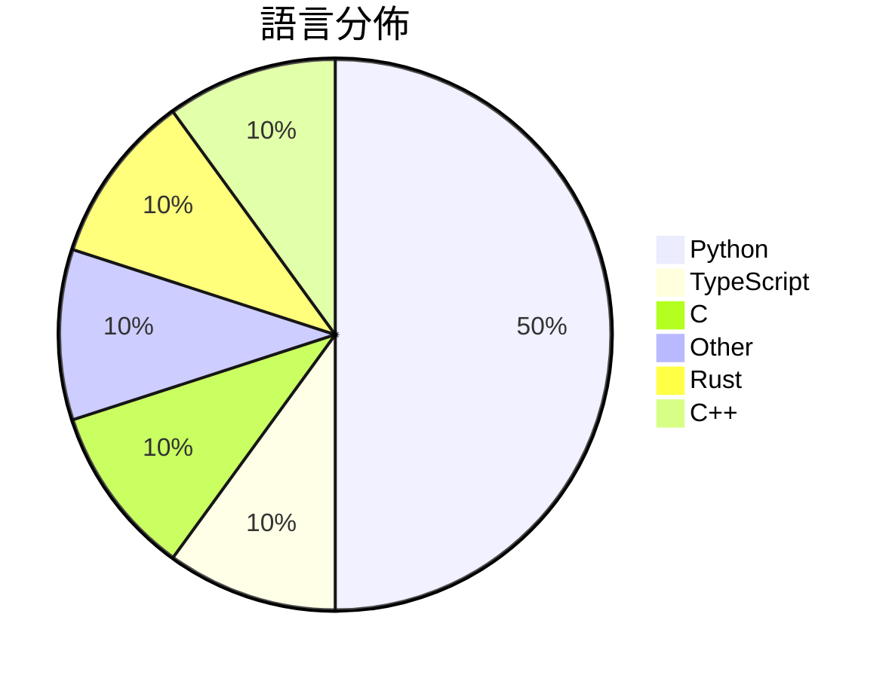

# GitHub Trending - 2026-03-10

> [!summary] 本日摘要
> 收錄 **10** 個新專案，合計 **7.0k** stars
> 語言分佈：Python (5) · TypeScript (1) · C (1) · Other (1) · Rust (1) · C++ (1)

> [!tip] 本週焦點
> **[[FreedomIntelligence--OpenClaw-Medical-Skills|FreedomIntelligence/OpenClaw-Medical-Skills]]** — 2 天內累積 885 stars（443 stars/天）
> 提供一個全面的開源醫療 AI 技能庫，讓研究人員能快速找到所需的醫學技能。

---

## 收錄列表

| # | 專案 | 分類 | Stars | 速度 | 語言 |
| :--: | --- | --- | ---: | ---: | --- |
| 1 | [[FreedomIntelligence--OpenClaw-Medical-Skills\|FreedomIntelligence/OpenClaw-Medical-Skills]] | 資料科學 | 885 | 443/天 | Python |
| 2 | [[op7418--Claude-to-IM-skill\|op7418/Claude-to-IM-skill]] | 開發工具 | 823 | 165/天 | TypeScript |
| 3 | [[Flowseal--tg-ws-proxy\|Flowseal/tg-ws-proxy]] | 基礎設施 | 768 | 128/天 | Python |
| 4 | [[tanishqkumar--ssd\|tanishqkumar/ssd]] | AI/ML | 748 | 125/天 | Python |
| 5 | [[imbue-bit--OpenClaw-PwnKit\|imbue-bit/OpenClaw-PwnKit]] | 安全 | 692 | 346/天 | Python |
| 6 | [[hicode002--qualcomm_gbl_exploit_poc\|hicode002/qualcomm_gbl_exploit_poc]] | 安全 | 675 | 113/天 | C |
| 7 | [[ParthJadhav--app-store-screenshots\|ParthJadhav/app-store-screenshots]] | 開發工具 | 653 | 218/天 | N/A |
| 8 | [[jshachm--pi-rs\|jshachm/pi-rs]] | 開發工具 | 616 | 103/天 | Rust |
| 9 | [[inspatio--worldfm\|inspatio/worldfm]] | 資料科學 | 553 | 79/天 | Python |
| 10 | [[vulhunt-re--vulhunt\|vulhunt-re/vulhunt]] | 安全 | 537 | 134/天 | C++ |

---

## 重點摘要

### 1. [[FreedomIntelligence--OpenClaw-Medical-Skills|FreedomIntelligence/OpenClaw-Medical-Skills]] `資料科學`

> 提供一個全面的開源醫療 AI 技能庫，讓研究人員能快速找到所需的醫學技能。

**885** stars · **443** stars/天 · Python

_這個專案的作者來自醫療和 AI 領域，能夠精準把握醫療研究的需求，並提供實用的解決方案。869個技能的廣泛性和開源特性吸引了許多研究者和開發者的關注。_

---

### 2. [[op7418--Claude-to-IM-skill|op7418/Claude-to-IM-skill]] `開發工具`

> 讓你在即時通訊平台上與 AI 編程代理互動，提升編程效率。

**823** stars · **165** stars/天 · TypeScript

_開發者對於即時通訊工具的需求日益增加，這個專案正好滿足了這一需求。作者的背景和對於即時通訊的深入理解使得這個工具更具吸引力。_

---

### 3. [[Flowseal--tg-ws-proxy|Flowseal/tg-ws-proxy]] `基礎設施`

> 透過本地 SOCKS5 代理伺服器加速 Telegram 的加載速度。

**768** stars · **128** stars/天 · Python

_Telegram 用戶對於加載速度的需求不斷增加，這個工具正好滿足了這一需求。作者的技術背景使得這個工具在性能上有了保障。_

---

### 4. [[tanishqkumar--ssd|tanishqkumar/ssd]] `AI/ML`

> 提供一個輕量級的推論引擎，支援快速的推測解碼。

**748** stars · **125** stars/天 · Python

_隨著 AI 應用的需求增加，對於高效推理的需求也隨之上升，這個工具正好切中要害。作者的技術背景和對於推理算法的深入研究使得這個工具更具吸引力。_

---

### 5. [[imbue-bit--OpenClaw-PwnKit|imbue-bit/OpenClaw-PwnKit]] `安全`

> 透過對 LLM 工具調用的對抗性攻擊，實現遠程代碼執行。

**692** stars · **346** stars/天 · Python

_隨著 LLM 的普及，對於其安全性問題的關注也在增加，這個工具正好切中這一需求。作者的背景使得這個專案在技術上具備深度和廣度。_

---

### 6. [[hicode002--qualcomm_gbl_exploit_poc|hicode002/qualcomm_gbl_exploit_poc]] `安全`

> 透過 GBL 漏洞解鎖 Qualcomm 的 bootloader。

**675** stars · **113** stars/天 · C

_作者在安全研究領域有豐富經驗，這個工具切中許多開發者對於解鎖 Qualcomm 設備的需求。近期的安全漏洞報導也讓這個工具受到關注。_

---

### 7. [[ParthJadhav--app-store-screenshots|ParthJadhav/app-store-screenshots]] `開發工具`

> 使用 AI 自動生成 iOS 應用的 App Store 截圖。

**653** stars · **218** stars/天 · N/A

_隨著 App Store 競爭加劇，開發者對於高質量截圖的需求上升，這個工具正好滿足了這一需求。作者的背景和對 AI 的應用也吸引了不少關注。_

---

### 8. [[jshachm--pi-rs|jshachm/pi-rs]] `開發工具`

> 提供一個輕量化的 Rust 編程助手，幫助開發者進行代碼編寫和管理。

**616** stars · **103** stars/天 · Rust

_Rust 語言的流行和對輕量化工具的需求使這個專案受到關注，尤其是在開發者社群中。作者的背景和對於編程助手的創新思維也吸引了不少使用者。_

---

### 9. [[inspatio--worldfm|inspatio/worldfm]] `資料科學`

> 生成多視角的即時影像，讓使用者能夠在不同視角下查看參考影像。

**553** stars · **79** stars/天 · Python

_隨著計算機視覺技術的進步，對於多視角影像生成的需求日益增加，這個工具正好切中這一需求。作者的研究背景和對於影像生成的專注也吸引了不少關注。_

---

### 10. [[vulhunt-re--vulhunt|vulhunt-re/vulhunt]] `安全`

> 提供一個漏洞檢測框架，幫助安全研究人員識別軟體中的漏洞。

**537** stars · **134** stars/天 · C++

_隨著網路安全威脅的增加，對於漏洞檢測工具的需求也在上升，這個工具正好滿足了這一需求。Binarly 的專業背景和技術實力也讓這個專案受到關注。_

---
