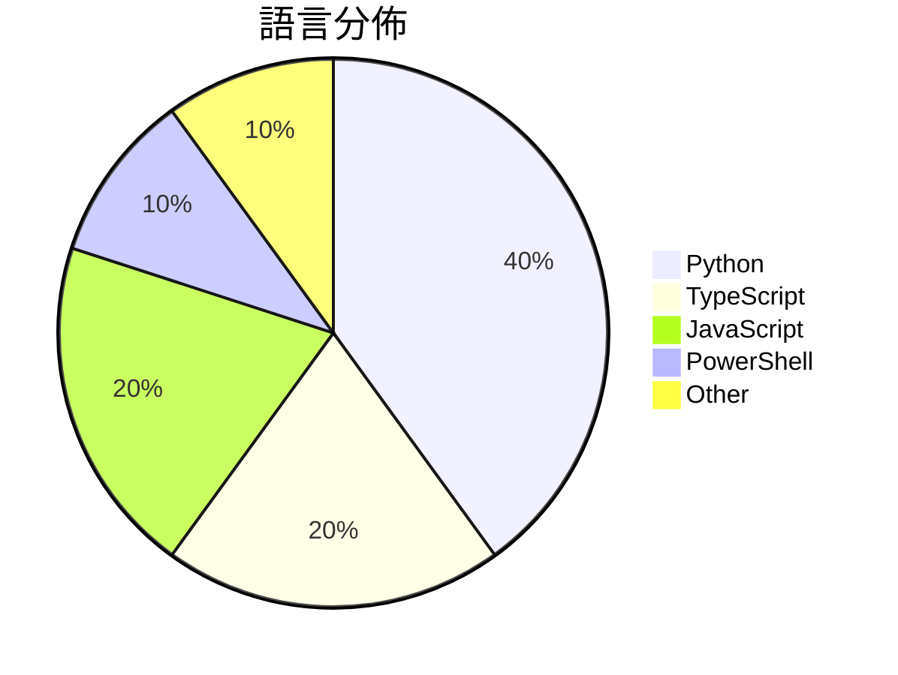

# GitHub Trending - 2026-03-10

> [!summary] 本日摘要
> 收錄 **10** 個新專案，合計 **3.0k** stars
> 語言分佈：Python (4) · TypeScript (2) · JavaScript (2) · PowerShell (1) · Other (1)

> [!tip] 本週焦點
> **[[HenryXiaoYang--wechat-access-unqclawed|HenryXiaoYang/wechat-access-unqclawed]]** — 1 天內累積 322 stars（322 stars/天）
> 透過微信掃碼登入，輕鬆獲取 token 並連接 AGP WebSocket 網關。

---

## 收錄列表

| # | 專案 | 分類 | Stars | 速度 | 語言 |
| :--: | --- | --- | ---: | ---: | --- |
| 1 | [[HenryXiaoYang--wechat-access-unqclawed\|HenryXiaoYang/wechat-access-unqclawed]] | 開發工具 | 322 | 322/天 | TypeScript |
| 2 | [[jackwener--bilibili-cli\|jackwener/bilibili-cli]] | CLI 工具 | 321 | 54/天 | Python |
| 3 | [[helenigtxu--TradingView-Claw\|helenigtxu/TradingView-Claw]] | 資料科學 | 318 | 80/天 | Python |
| 4 | [[holysheep123--holysheep-cli\|holysheep123/holysheep-cli]] | 開發工具 | 305 | 153/天 | JavaScript |
| 5 | [[gradenGnostic--LegacyLauncher\|gradenGnostic/LegacyLauncher]] | 其他 | 297 | 50/天 | JavaScript |
| 6 | [[dazzyddos--PrivHound\|dazzyddos/PrivHound]] | 安全 | 288 | 72/天 | PowerShell |
| 7 | [[photon-hq--qclaw-wechat-client\|photon-hq/qclaw-wechat-client]] | 開發工具 | 285 | 285/天 | TypeScript |
| 8 | [[uluckyXH--OpenMOSS\|uluckyXH/OpenMOSS]] | 基礎設施 | 284 | 142/天 | Python |
| 9 | [[runesleo--claude-code-workflow\|runesleo/claude-code-workflow]] | 開發工具 | 277 | 40/天 | N/A |
| 10 | [[juliye2025--evil-read-arxiv\|juliye2025/evil-read-arxiv]] | 資料科學 | 274 | 39/天 | Python |

---

## 重點摘要

### 1. [[HenryXiaoYang--wechat-access-unqclawed|HenryXiaoYang/wechat-access-unqclawed]] `開發工具`

> 透過微信掃碼登入，輕鬆獲取 token 並連接 AGP WebSocket 網關。

**322** stars · **322** stars/天 · TypeScript

_HenryXiaoYang 是一位活躍的開源貢獻者，這個專案解決了微信登入的需求，特別是在 AGP 環境中。_

---

### 2. [[jackwener--bilibili-cli|jackwener/bilibili-cli]] `CLI 工具`

> 透過終端輕鬆瀏覽 Bilibili 影片和用戶資訊。

**321** stars · **54** stars/天 · Python

_作者 jackwener 具備多個開源專案的背景，這個工具切中許多用戶對於快速獲取 Bilibili 資訊的需求。_

---

### 3. [[helenigtxu--TradingView-Claw|helenigtxu/TradingView-Claw]] `資料科學`

> 透過 TradingView 進行技術分析和交易執行。

**318** stars · **80** stars/天 · Python

_作者 helenigtxu 對於交易和技術分析有深入的理解，這個工具滿足了對於自動化交易的需求。_

---

### 4. [[holysheep123--holysheep-cli|holysheep123/holysheep-cli]] `開發工具`

> 一條命令配置所有 AI 編程工具，簡化設置流程。

**305** stars · **153** stars/天 · JavaScript

_作者 holysheep123 對於 AI 工具的需求有深刻理解，這個工具能夠有效地解決配置繁瑣的問題。_

---

### 5. [[gradenGnostic--LegacyLauncher|gradenGnostic/LegacyLauncher]] `其他`

> 為 Minecraft Legacy Console Edition 提供自訂啟動器。

**297** stars · **50** stars/天 · JavaScript

_作者 gradenGnostic 對 Minecraft 有深入的熱情，這個工具滿足了玩家對於自訂啟動器的需求。_

---

### 6. [[dazzyddos--PrivHound|dazzyddos/PrivHound]] `安全`

> 將 Windows 本地權限提升的攻擊路徑以圖形方式呈現，讓分析更直觀。

**288** stars · **72** stars/天 · PowerShell

_作者在資安領域有豐富經驗，專注於提升本地權限的可視化分析，切中安全分析的需求。_

---

### 7. [[photon-hq--qclaw-wechat-client|photon-hq/qclaw-wechat-client]] `開發工具`

> 提供 QClaw 的 WeChat 接入 API 的 TypeScript 客戶端，簡化開發流程。

**285** stars · **285** stars/天 · TypeScript

_開發者對於 WeChat 接入的需求持續增長，且 QClaw 提供的服務越來越受到關注。_

---

### 8. [[uluckyXH--OpenMOSS|uluckyXH/OpenMOSS]] `基礎設施`

> 一個自組織的多代理協作平台，讓 AI 自動管理任務。

**284** stars · **142** stars/天 · Python

_隨著 AI 技術的發展，自動化協作的需求日益增加，這個專案正好滿足了這一需求。_

---

### 9. [[runesleo--claude-code-workflow|runesleo/claude-code-workflow]] `開發工具`

> 提供一個經過實戰驗證的 Claude Code 工作流程模板，提升開發效率。

**277** stars · **40** stars/天 · N/A

_開發者對於提升 AI 助手的使用效率有強烈需求，這個專案提供了實用的解決方案。_

---

### 10. [[juliye2025--evil-read-arxiv|juliye2025/evil-read-arxiv]] `資料科學`

> 自動化研究論文的搜索、推薦和分析，提升閱讀效率。

**274** stars · **39** stars/天 · Python

_隨著學術研究的需求增加，自動化文獻管理的工具越來越受到重視。_

---
