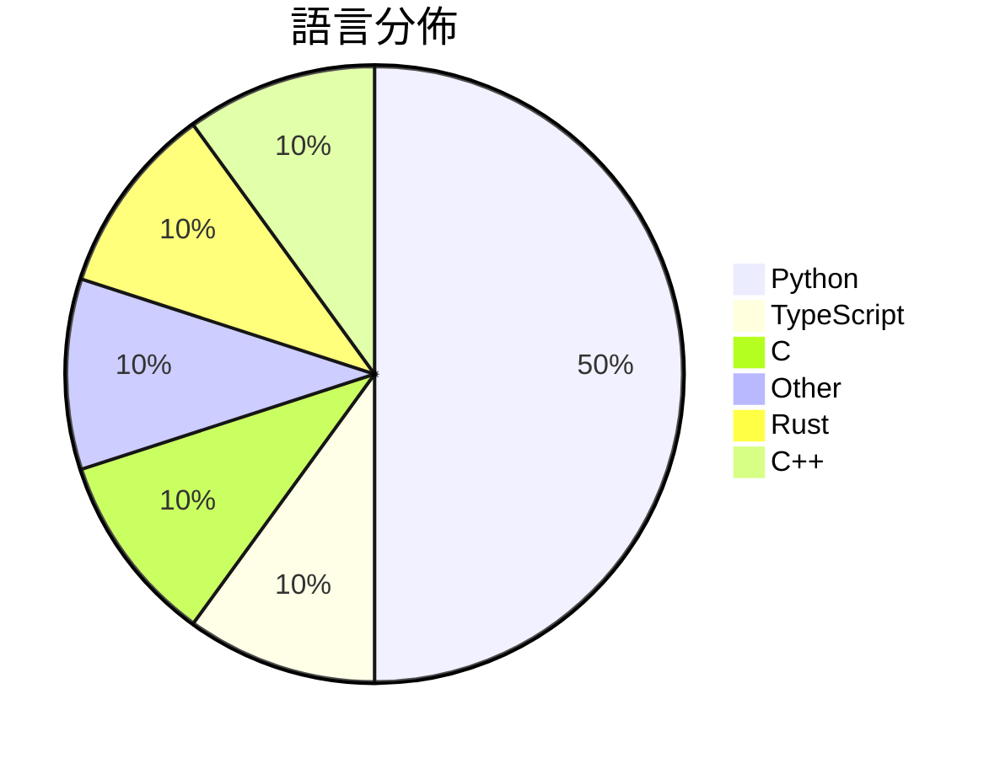

# GitHub Trending - 2026-03-10

> [!summary] 本日摘要
> 收錄 **10** 個新專案，合計 **6.9k** stars
> 語言分佈：Python (5) · TypeScript (1) · C (1) · Other (1) · Rust (1) · C++ (1)

> [!tip] 本週焦點
> **[[FreedomIntelligence--OpenClaw-Medical-Skills|FreedomIntelligence/OpenClaw-Medical-Skills]]** — 2 天內累積 879 stars（440 stars/天）
> OpenClaw的最大開源醫療AI技能庫。

---

## 收錄列表

| # | 專案 | 分類 | Stars | 速度 | 語言 |
| :--: | --- | --- | ---: | ---: | --- |
| 1 | [[FreedomIntelligence--OpenClaw-Medical-Skills\|FreedomIntelligence/OpenClaw-Medical-Skills]] | AI/ML | 879 | 440/天 | Python |
| 2 | [[op7418--Claude-to-IM-skill\|op7418/Claude-to-IM-skill]] | 開發工具 | 821 | 164/天 | TypeScript |
| 3 | [[Flowseal--tg-ws-proxy\|Flowseal/tg-ws-proxy]] | 其他 | 766 | 128/天 | Python |
| 4 | [[tanishqkumar--ssd\|tanishqkumar/ssd]] | AI/ML | 748 | 125/天 | Python |
| 5 | [[imbue-bit--OpenClaw-PwnKit\|imbue-bit/OpenClaw-PwnKit]] | 安全 | 691 | 346/天 | Python |
| 6 | [[hicode002--qualcomm_gbl_exploit_poc\|hicode002/qualcomm_gbl_exploit_poc]] | 安全 | 675 | 113/天 | C |
| 7 | [[ParthJadhav--app-store-screenshots\|ParthJadhav/app-store-screenshots]] | 開發工具 | 635 | 212/天 | N/A |
| 8 | [[jshachm--pi-rs\|jshachm/pi-rs]] | 開發工具 | 615 | 103/天 | Rust |
| 9 | [[inspatio--worldfm\|inspatio/worldfm]] | 其他 | 553 | 79/天 | Python |
| 10 | [[vulhunt-re--vulhunt\|vulhunt-re/vulhunt]] | 安全 | 536 | 134/天 | C++ |

---

## 重點摘要

### 1. [[FreedomIntelligence--OpenClaw-Medical-Skills|FreedomIntelligence/OpenClaw-Medical-Skills]] `AI/ML`

> OpenClaw的最大開源醫療AI技能庫。

**879** stars · **440** stars/天 · Python

_隨著AI在醫療領域的應用日益增多，這個專案吸引了大量關注，因為它提供了一個開放的平台來促進醫療技能的學習和分享。_

---

### 2. [[op7418--Claude-to-IM-skill|op7418/Claude-to-IM-skill]] `開發工具`

> 將Claude代碼/ Codex橋接到即時通訊平台。

**821** stars · **164** stars/天 · TypeScript

_隨著遠程工作和即時通訊的普及，開發者對於能夠隨時獲得編程支援的需求日益增加，這個專案因此受到關注。_

---

### 3. [[Flowseal--tg-ws-proxy|Flowseal/tg-ws-proxy]] `其他`

> 本地SOCKS5代理伺服器，用於部分繞過Telegram加載問題。

**766** stars · **128** stars/天 · Python

_隨著Telegram用戶數量的增加，許多人面臨加載速度慢的問題，這個專案因此受到廣泛關注。_

---

### 4. [[tanishqkumar--ssd|tanishqkumar/ssd]] `AI/ML`

> 支持推測性解碼的輕量推理引擎。

**748** stars · **125** stars/天 · Python

_隨著AI模型的複雜性增加，對於高效推理引擎的需求也隨之上升，這個專案因此受到關注。_

---

### 5. [[imbue-bit--OpenClaw-PwnKit|imbue-bit/OpenClaw-PwnKit]] `安全`

> 獲取幾乎任何OpenClaw主機的shell。

**691** stars · **346** stars/天 · Python

_隨著對AI安全性問題的關注增加，這個專案引發了廣泛的討論和研究興趣。_

---

### 6. [[hicode002--qualcomm_gbl_exploit_poc|hicode002/qualcomm_gbl_exploit_poc]] `安全`

> 透過 gbl 漏洞解鎖 Qualcomm 的啟動載入器。

**675** stars · **113** stars/天 · C

_隨著對於設備解鎖和自訂固件的需求增加，這個專案吸引了許多開發者的注意。_

---

### 7. [[ParthJadhav--app-store-screenshots|ParthJadhav/app-store-screenshots]] `開發工具`

> 使用 AI 生成應用商店截圖的工具。

**635** stars · **212** stars/天 · N/A

_隨著應用開發的普及，對於高品質截圖的需求日益增加，這個工具正好滿足了這一需求。_

---

### 8. [[jshachm--pi-rs|jshachm/pi-rs]] `開發工具`

> 一個基於 Rust 的輕量級 AI 編程助手。

**615** stars · **103** stars/天 · Rust

_隨著 Rust 語言的流行，這個專案吸引了許多希望利用 AI 提升編程效率的開發者。_

---

### 9. [[inspatio--worldfm|inspatio/worldfm]] `其他`

> 一個實時多視角擴散模型。

**553** stars · **79** stars/天 · Python

_隨著對於高品質圖像生成需求的增加，這個專案吸引了許多視覺藝術家和開發者的關注。_

---

### 10. [[vulhunt-re--vulhunt|vulhunt-re/vulhunt]] `安全`

> 一個由 Binarly 研究團隊開發的漏洞檢測框架。

**536** stars · **134** stars/天 · C++

_隨著網路安全問題日益嚴重，這個專案為安全研究人員提供了一個有效的工具來識別和修補漏洞，因此受到廣泛關注。_

---
