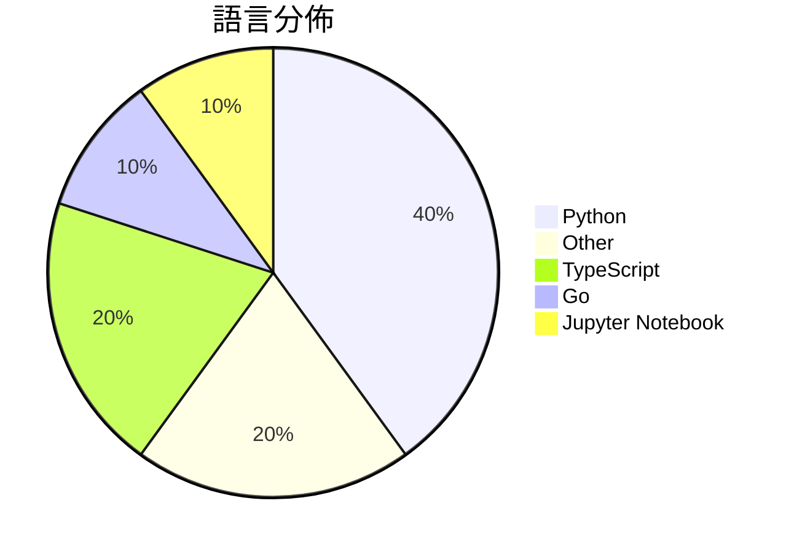

# GitHub Trending - 2026-03-10

> [!summary] 本日摘要
> 收錄 **10** 個新專案，合計 **36.3k** stars
> 語言分佈：Python (4) · Other (2) · TypeScript (2) · Go (1) · Jupyter Notebook (1)

> [!tip] 本週焦點
> **[[karpathy--autoresearch|karpathy/autoresearch]]** — 3 天內累積 21.2k stars（7.1k stars/天）
> 自動化的 AI 研究代理，專注於單 GPU 的 nanochat 訓練。

---

## 收錄列表

| # | 專案 | 分類 | Stars | 速度 | 語言 |
| :--: | --- | --- | ---: | ---: | --- |
| 1 | [[karpathy--autoresearch\|karpathy/autoresearch]] | AI/ML | 21.2k | 7.1k/天 | Python |
| 2 | [[elder-plinius--OBLITERATUS\|elder-plinius/OBLITERATUS]] | 開發工具 | 2.7k | 444/天 | Python |
| 3 | [[HKUDS--CLI-Anything\|HKUDS/CLI-Anything]] | CLI 工具 | 2.2k | 1.1k/天 | Python |
| 4 | [[twostraws--SwiftUI-Agent-Skill\|twostraws/SwiftUI-Agent-Skill]] | 開發工具 | 1.7k | 428/天 | N/A |
| 5 | [[karpathy--agenthub\|karpathy/agenthub]] | 其他 | 1.6k | 1.6k/天 | Go |
| 6 | [[duoan--TorchCode\|duoan/TorchCode]] | AI/ML | 1.5k | 251/天 | Jupyter Notebook |
| 7 | [[jackwener--twitter-cli\|jackwener/twitter-cli]] | CLI 工具 | 1.4k | 274/天 | Python |
| 8 | [[viperrcrypto--Siftly\|viperrcrypto/Siftly]] | 其他 | 1.4k | 226/天 | TypeScript |
| 9 | [[BigBodyCobain--Shadowbroker\|BigBodyCobain/Shadowbroker]] | 安全 | 1.3k | 264/天 | TypeScript |
| 10 | [[cyxzdev--Uncodixfy\|cyxzdev/Uncodixfy]] | 其他 | 1.3k | 329/天 | N/A |

---

## 重點摘要

### 1. [[karpathy--autoresearch|karpathy/autoresearch]] `AI/ML`

> 自動化的 AI 研究代理，專注於單 GPU 的 nanochat 訓練。

**21.2k** stars · **7.1k** stars/天 · Python

_隨著 AI 技術的快速發展，自動化研究成為熱門話題，許多開發者希望利用這種技術來加速創新。_

---

### 2. [[elder-plinius--OBLITERATUS|elder-plinius/OBLITERATUS]] `開發工具`

> 一鍵解放模型並提供聊天遊樂場的工具。

**2.7k** stars · **444** stars/天 · Python

_隨著 AI 技術的普及，越來越多的人希望能夠輕鬆使用和理解這些模型，OBLITERATUS 正好滿足了這一需求。_

---

### 3. [[HKUDS--CLI-Anything|HKUDS/CLI-Anything]] `CLI 工具`

> 讓所有軟體都能成為代理原生的工具。

**2.2k** stars · **1.1k** stars/天 · Python

_隨著 AI 代理技術的興起，開發者對於如何將現有軟體轉變為智能代理的需求日益增加。_

---

### 4. [[twostraws--SwiftUI-Agent-Skill|twostraws/SwiftUI-Agent-Skill]] `開發工具`

> 為 Claude Code、Codex 和其他 AI 工具提供的 SwiftUI 代理技能。

**1.7k** stars · **428** stars/天 · N/A

_隨著 SwiftUI 的普及，開發者對於如何高效使用這一框架的需求不斷增加，這使得相關工具和技能變得越來越受歡迎。_

---

### 5. [[karpathy--agenthub|karpathy/agenthub]] `其他`

> 專為 AI 代理設計的協作平台。

**1.6k** stars · **1.6k** stars/天 · Go

_隨著 AI 代理的興起，開發者對於如何有效地協作和管理 AI 代理的需求越來越高，AgentHub 正好滿足了這一需求。_

---

### 6. [[duoan--TorchCode|duoan/TorchCode]] `AI/ML`

> TorchCode 是一個針對 PyTorch 的練習平台，讓你從零開始實作各種深度學習技術。

**1.5k** stars · **251** stars/天 · Jupyter Notebook

_隨著機器學習的需求增加，許多人希望提升自己的技能以應對面試，TorchCode 剛好滿足了這個需求。_

---

### 7. [[jackwener--twitter-cli|jackwener/twitter-cli]] `CLI 工具`

> twitter-cli 是一個命令列介面的 Twitter/X 客戶端，讓你在終端機中查看時間線和書籤。

**1.4k** stars · **274** stars/天 · Python

_隨著社交媒體使用的普及，越來越多的人尋求更高效的方式來管理和查看他們的社交媒體內容。_

---

### 8. [[viperrcrypto--Siftly|viperrcrypto/Siftly]] `其他`

> Siftly 是一個本地化的 Twitter/X 書籤管理工具，具備 AI 分類和思維導圖視覺化功能。

**1.4k** stars · **226** stars/天 · TypeScript

_隨著社交媒體內容的激增，許多用戶需要更好的工具來管理和組織他們的書籤。_

---

### 9. [[BigBodyCobain--Shadowbroker|BigBodyCobain/Shadowbroker]] `安全`

> Shadowbroker 是一個開源的全球情報平台，整合多種開放資料來源。

**1.3k** stars · **264** stars/天 · TypeScript

_隨著全球安全和情報需求的上升，越來越多的人希望能夠即時獲取和分析相關數據。_

---

### 10. [[cyxzdev--Uncodixfy|cyxzdev/Uncodixfy]] `其他`

> Uncodixify 讓 GPT 創建不受限制的 UI 設計，克服常見的設計模式。

**1.3k** stars · **329** stars/天 · N/A

_隨著 AI 技術的進步，越來越多的人希望利用這些工具來提升他們的設計能力，並創造出更好的用戶體驗。_

---
