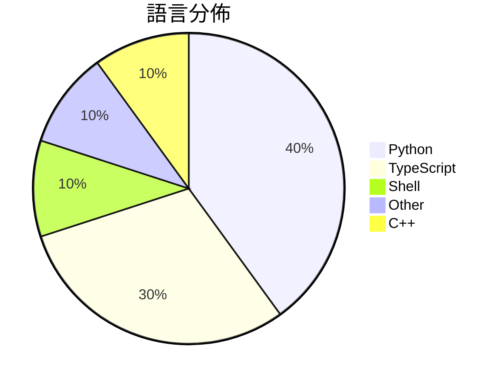

# GitHub Trending - 2026-03-10

> [!summary] 本日摘要
> 收錄 **10** 個新專案，合計 **3.6k** stars
> 語言分佈：Python (4) · TypeScript (3) · Shell (1) · Other (1) · C++ (1)

> [!tip] 本週焦點
> **[[OasAIStudio--symphony-ts|OasAIStudio/symphony-ts]]** — 4 天內累積 397 stars（99 stars/天）
> 將專案工作轉化為獨立的自動化執行環境，讓開發者能夠更有效率地管理任務。

---

## 收錄列表

| # | 專案 | 分類 | Stars | 速度 | 語言 |
| :--: | --- | --- | ---: | ---: | --- |
| 1 | [[OasAIStudio--symphony-ts\|OasAIStudio/symphony-ts]] | 開發工具 | 397 | 99/天 | TypeScript |
| 2 | [[Lightricks--LTX-Desktop\|Lightricks/LTX-Desktop]] | 其他 | 385 | 64/天 | TypeScript |
| 3 | [[kamranahmedse--claude-statusline\|kamranahmedse/claude-statusline]] | 開發工具 | 384 | 192/天 | Shell |
| 4 | [[binance--binance-skills-hub\|binance/binance-skills-hub]] | 其他 | 383 | 55/天 | N/A |
| 5 | [[Thearas--wechat-db-decrypt-macos\|Thearas/wechat-db-decrypt-macos]] | 其他 | 383 | 77/天 | Python |
| 6 | [[L42ARO--Mercury-Transforming-Drone\|L42ARO/Mercury-Transforming-Drone]] |  | 353 | 88/天 | Python |
| 7 | [[joeseesun--qiaomu-mondo-poster-design\|joeseesun/qiaomu-mondo-poster-design]] |  | 353 | 177/天 | Python |
| 8 | [[JohnRiceML--clawport-ui\|JohnRiceML/clawport-ui]] |  | 340 | 57/天 | TypeScript |
| 9 | [[sanbuphy--nanoAgent\|sanbuphy/nanoAgent]] |  | 340 | 49/天 | Python |
| 10 | [[Minecraft-Community-Edition--client\|Minecraft-Community-Edition/client]] |  | 331 | 110/天 | C++ |

---

## 重點摘要

### 1. [[OasAIStudio--symphony-ts|OasAIStudio/symphony-ts]] `開發工具`

> 將專案工作轉化為獨立的自動化執行環境，讓開發者能夠更有效率地管理任務。

**397** stars · **99** stars/天 · TypeScript

_開發者背景的貢獻者使其具備實用性，且針對開發流程的需求進行了優化。_

---

### 2. [[Lightricks--LTX-Desktop|Lightricks/LTX-Desktop]] `其他`

> 提供一個開源桌面應用，讓使用者能夠在本地生成視頻。

**385** stars · **64** stars/天 · TypeScript

_開源特性吸引了許多視頻創作者，且支持多種生成模式滿足不同需求。_

---

### 3. [[kamranahmedse--claude-statusline|kamranahmedse/claude-statusline]] `開發工具`

> 簡化 Claude Code 的狀態列配置，顯示限額和版本控制信息。

**384** stars · **192** stars/天 · Shell

_針對 Claude Code 的需求進行了優化，並提供簡單的安裝方式，吸引了相關開發者。_

---

### 4. [[binance--binance-skills-hub|binance/binance-skills-hub]] `其他`

> 建立一個開放的技能市場，讓 AI 代理能夠訪問加密貨幣。

**383** stars · **55** stars/天 · N/A

_Binance 的背景提供了信任基礎，且開放的技能市場吸引了許多開發者參與。_

---

### 5. [[Thearas--wechat-db-decrypt-macos|Thearas/wechat-db-decrypt-macos]] `其他`

> 解密微信數據庫，提取聊天記錄，方便用戶查詢。

**383** stars · **77** stars/天 · Python

_針對微信的需求提供了解決方案，並且其開源特性吸引了需要數據提取的用戶。_

---

### 6. [[L42ARO--Mercury-Transforming-Drone|L42ARO/Mercury-Transforming-Drone]]

**353** stars · **88** stars/天 · Python

---

### 7. [[joeseesun--qiaomu-mondo-poster-design|joeseesun/qiaomu-mondo-poster-design]]

**353** stars · **177** stars/天 · Python

---

### 8. [[JohnRiceML--clawport-ui|JohnRiceML/clawport-ui]]

**340** stars · **57** stars/天 · TypeScript

---

### 9. [[sanbuphy--nanoAgent|sanbuphy/nanoAgent]]

**340** stars · **49** stars/天 · Python

---

### 10. [[Minecraft-Community-Edition--client|Minecraft-Community-Edition/client]]

**331** stars · **110** stars/天 · C++

---
