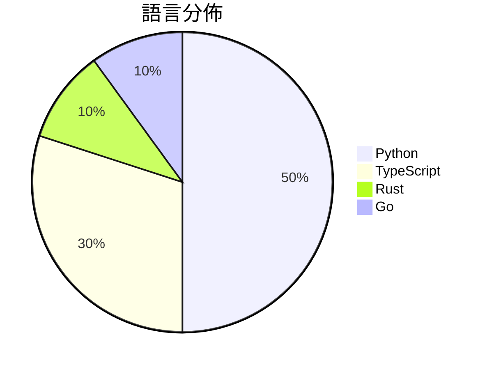

# GitHub Trending - 2026-03-10

> [!summary] 本日摘要
> 收錄 **10** 個新專案，合計 **4.8k** stars
> 語言分佈：Python (5) · TypeScript (3) · Rust (1) · Go (1)

> [!tip] 本週焦點
> **[[ahmadawais--chartli|ahmadawais/chartli]]** — 4 天內累積 532 stars（133 stars/天）
> 讓數字資料在終端機中以圖表形式呈現，讓數據視覺化變得簡單。

---

## 收錄列表

| # | 專案 | 分類 | Stars | 速度 | 語言 |
| :--: | --- | --- | ---: | ---: | --- |
| 1 | [[ahmadawais--chartli\|ahmadawais/chartli]] | CLI 工具 | 532 | 133/天 | TypeScript |
| 2 | [[tanweai--pua\|tanweai/pua]] | 其他 | 517 | 259/天 | TypeScript |
| 3 | [[TinyAGI--fractals\|TinyAGI/fractals]] | 基礎設施 | 511 | 128/天 | TypeScript |
| 4 | [[AlpinDale--parsync\|AlpinDale/parsync]] | 基礎設施 | 505 | 101/天 | Rust |
| 5 | [[xstongxue--best-skills\|xstongxue/best-skills]] | 其他 | 491 | 98/天 | Python |
| 6 | [[steipete--discrawl\|steipete/discrawl]] |  | 481 | 160/天 | Go |
| 7 | [[zornade--visura-api\|zornade/visura-api]] |  | 475 | 68/天 | Python |
| 8 | [[knowsuchagency--mcp2cli\|knowsuchagency/mcp2cli]] |  | 460 | 460/天 | Python |
| 9 | [[trevin-creator--autoresearch-mlx\|trevin-creator/autoresearch-mlx]] |  | 459 | 230/天 | Python |
| 10 | [[autoclaw-cc--xiaohongshu-skills\|autoclaw-cc/xiaohongshu-skills]] |  | 401 | 57/天 | Python |

---

## 重點摘要

### 1. [[ahmadawais--chartli|ahmadawais/chartli]] `CLI 工具`

> 讓數字資料在終端機中以圖表形式呈現，讓數據視覺化變得簡單。

**532** stars · **133** stars/天 · TypeScript

_作者是知名的開發者，對開發者社群有一定影響力，這個工具切中許多需要快速數據視覺化的需求，尤其是在命令行環境中。_

---

### 2. [[tanweai--pua|tanweai/pua]] `其他`

> 透過 PUA 技巧驅動 AI，讓其不輕言放棄。

**517** stars · **259** stars/天 · TypeScript

_這個工具的獨特性在於它結合了 PUA 概念與 AI 調試，滿足了開發者對於提高 AI 積極性的需求，尤其是在面對困難時。_

---

### 3. [[TinyAGI--fractals|TinyAGI/fractals]] `基礎設施`

> 自動將高階任務分解為可執行的子任務，並進行協同執行。

**511** stars · **128** stars/天 · TypeScript

_這個專案的創新在於其自動化任務分解的能力，滿足了開發者對於高效協作的需求，特別是在複雜項目中。_

---

### 4. [[AlpinDale--parsync|AlpinDale/parsync]] `基礎設施`

> 提供高效的 SSH 同步工具，支持斷點續傳和並行傳輸。

**505** stars · **101** stars/天 · Rust

_這個工具的高效性能和易用性吸引了許多需要文件同步的開發者，尤其是在大文件傳輸的需求上。_

---

### 5. [[xstongxue--best-skills|xstongxue/best-skills]] `其他`

> 提供高品質的技能集合，讓 AI 更加智能化。

**491** stars · **98** stars/天 · Python

_這個專案的創新在於其自動化技能選擇的能力，滿足了開發者對於提升 AI 效能的需求，特別是在多任務處理上。_

---

### 6. [[steipete--discrawl|steipete/discrawl]]

**481** stars · **160** stars/天 · Go

---

### 7. [[zornade--visura-api|zornade/visura-api]]

**475** stars · **68** stars/天 · Python

---

### 8. [[knowsuchagency--mcp2cli|knowsuchagency/mcp2cli]]

**460** stars · **460** stars/天 · Python

---

### 9. [[trevin-creator--autoresearch-mlx|trevin-creator/autoresearch-mlx]]

**459** stars · **230** stars/天 · Python

---

### 10. [[autoclaw-cc--xiaohongshu-skills|autoclaw-cc/xiaohongshu-skills]]

**401** stars · **57** stars/天 · Python

---
