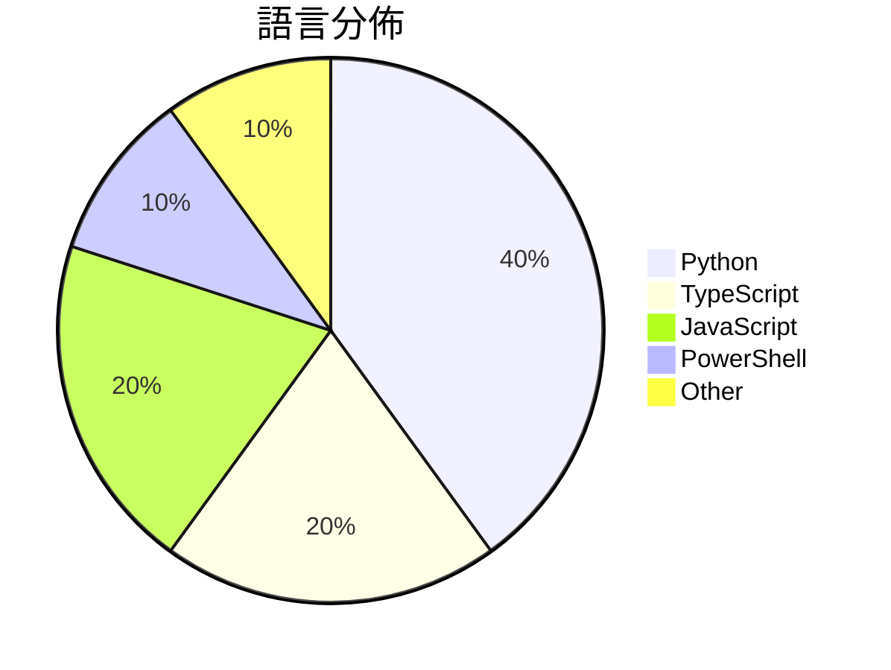

# GitHub Trending - 2026-03-10

> [!summary] 本日摘要
> 收錄 **10** 個新專案，合計 **3.0k** stars
> 語言分佈：Python (4) · TypeScript (2) · JavaScript (2) · PowerShell (1) · Other (1)

> [!tip] 本週焦點
> **[[HenryXiaoYang--wechat-access-unqclawed|HenryXiaoYang/wechat-access-unqclawed]]** — 1 天內累積 322 stars（322 stars/天）
> 透過微信掃碼登入並獲取 token，實現與 AGP WebSocket 的雙向通訊。

---

## 收錄列表

| # | 專案 | 分類 | Stars | 速度 | 語言 |
| :--: | --- | --- | ---: | ---: | --- |
| 1 | [[HenryXiaoYang--wechat-access-unqclawed\|HenryXiaoYang/wechat-access-unqclawed]] | 開發工具 | 322 | 322/天 | TypeScript |
| 2 | [[jackwener--bilibili-cli\|jackwener/bilibili-cli]] | CLI 工具 | 321 | 54/天 | Python |
| 3 | [[helenigtxu--TradingView-Claw\|helenigtxu/TradingView-Claw]] | 其他 | 317 | 79/天 | Python |
| 4 | [[holysheep123--holysheep-cli\|holysheep123/holysheep-cli]] | 開發工具 | 303 | 152/天 | JavaScript |
| 5 | [[gradenGnostic--LegacyLauncher\|gradenGnostic/LegacyLauncher]] | 其他 | 296 | 49/天 | JavaScript |
| 6 | [[dazzyddos--PrivHound\|dazzyddos/PrivHound]] | 安全 | 288 | 72/天 | PowerShell |
| 7 | [[uluckyXH--OpenMOSS\|uluckyXH/OpenMOSS]] | 開發工具 | 284 | 142/天 | Python |
| 8 | [[photon-hq--qclaw-wechat-client\|photon-hq/qclaw-wechat-client]] | 開發工具 | 282 | 282/天 | TypeScript |
| 9 | [[runesleo--claude-code-workflow\|runesleo/claude-code-workflow]] | 開發工具 | 277 | 40/天 | N/A |
| 10 | [[juliye2025--evil-read-arxiv\|juliye2025/evil-read-arxiv]] | 資料科學 | 274 | 39/天 | Python |

---

## 重點摘要

### 1. [[HenryXiaoYang--wechat-access-unqclawed|HenryXiaoYang/wechat-access-unqclawed]] `開發工具`

> 透過微信掃碼登入並獲取 token，實現與 AGP WebSocket 的雙向通訊。

**322** stars · **322** stars/天 · TypeScript

_作者在開源社群中有一定的影響力，並且這個工具滿足了開發者對於簡化微信登入流程的需求。近期對於即時通訊的需求增加，促使這個專案受到關注。_

---

### 2. [[jackwener--bilibili-cli|jackwener/bilibili-cli]] `CLI 工具`

> 讓使用者可以在終端中瀏覽 Bilibili 的視頻和用戶，無需打開瀏覽器。

**321** stars · **54** stars/天 · Python

_作者在開源社群中活躍，並且這個工具滿足了許多用戶希望在終端中快速訪問 Bilibili 的需求。隨著 CLI 工具的流行，這個專案吸引了不少關注。_

---

### 3. [[helenigtxu--TradingView-Claw|helenigtxu/TradingView-Claw]] `其他`

> 提供交易功能的 TradingView 技能，幫助用戶進行技術分析和交易決策。

**317** stars · **79** stars/天 · Python

_作者在金融科技領域有一定的背景，並且這個工具切中了交易者對於技術分析和自動交易的需求。近期市場波動加大，促使更多人尋求這類工具的幫助。_

---

### 4. [[holysheep123--holysheep-cli|holysheep123/holysheep-cli]] `開發工具`

> 一條命令配置所有 AI 編程工具，簡化開發者的設置流程。

**303** stars · **152** stars/天 · JavaScript

_作者在 AI 開發領域有豐富的經驗，並且這個工具解決了開發者在配置多個 AI 工具時的繁瑣問題。隨著 AI 工具的普及，這個專案迅速受到關注。_

---

### 5. [[gradenGnostic--LegacyLauncher|gradenGnostic/LegacyLauncher]] `其他`

> 為 Minecraft Legacy Console Edition 提供自定義啟動器，簡化遊戲啟動流程。

**296** stars · **49** stars/天 · JavaScript

_作者對 Minecraft 有深厚的熱情，並且這個工具滿足了玩家對於自定義啟動器的需求。隨著 Minecraft 社群的活躍，這個專案吸引了不少關注。_

---

### 6. [[dazzyddos--PrivHound|dazzyddos/PrivHound]] `安全`

> 將 Windows 本地權限提升的攻擊路徑以圖形化方式呈現，讓安全分析更直觀。

**288** stars · **72** stars/天 · PowerShell

_作者在安全領域有豐富的經驗，並且這個工具解決了業界對於本地權限提升分析的需求，特別是在攻擊路徑可視化方面的不足。近期的安全事件讓企業更加重視本地權限的管理，進而推動了這個專案的關注。_

---

### 7. [[uluckyXH--OpenMOSS|uluckyXH/OpenMOSS]] `開發工具`

> 讓多個 AI 代理人自動協作，無需人類干預即可完成任務。

**284** stars · **142** stars/天 · Python

_隨著 AI 技術的發展，市場對於自動化協作的需求日益增加，這個專案正好切合了這一需求。作者的背景和對於多代理系統的深入理解，使得這個專案在技術上具有優勢。_

---

### 8. [[photon-hq--qclaw-wechat-client|photon-hq/qclaw-wechat-client]] `開發工具`

> 提供一個 TypeScript 客戶端，讓開發者輕鬆接入 QClaw 的 WeChat API。

**282** stars · **282** stars/天 · TypeScript

_隨著 WeChat 在中國的廣泛使用，開發者對於接入 WeChat API 的需求日益增加。這個專案的反向工程背景讓它在技術上具備了獨特性，吸引了開發者的注意。_

---

### 9. [[runesleo--claude-code-workflow|runesleo/claude-code-workflow]] `開發工具`

> 提供一個經過實戰驗證的 Claude Code 工作流模板，幫助開發者更有效地管理上下文和任務。

**277** stars · **40** stars/天 · N/A

_隨著 Claude Code 的流行，開發者對於如何更好地利用其功能的需求增加，這個模板正好滿足了這一需求。作者的實戰經驗使得這個模板具備了實用性和可靠性。_

---

### 10. [[juliye2025--evil-read-arxiv|juliye2025/evil-read-arxiv]] `資料科學`

> 自動化研究論文的搜索和分析，讓讀者更快獲得有價值的資訊。

**274** stars · **39** stars/天 · Python

_隨著學術研究的增長，研究人員對於快速獲取和整理資料的需求越來越強烈，這個工具正好滿足了這一需求。作者的背景和對於研究流程的理解使得這個專案具備了實用性。_

---
