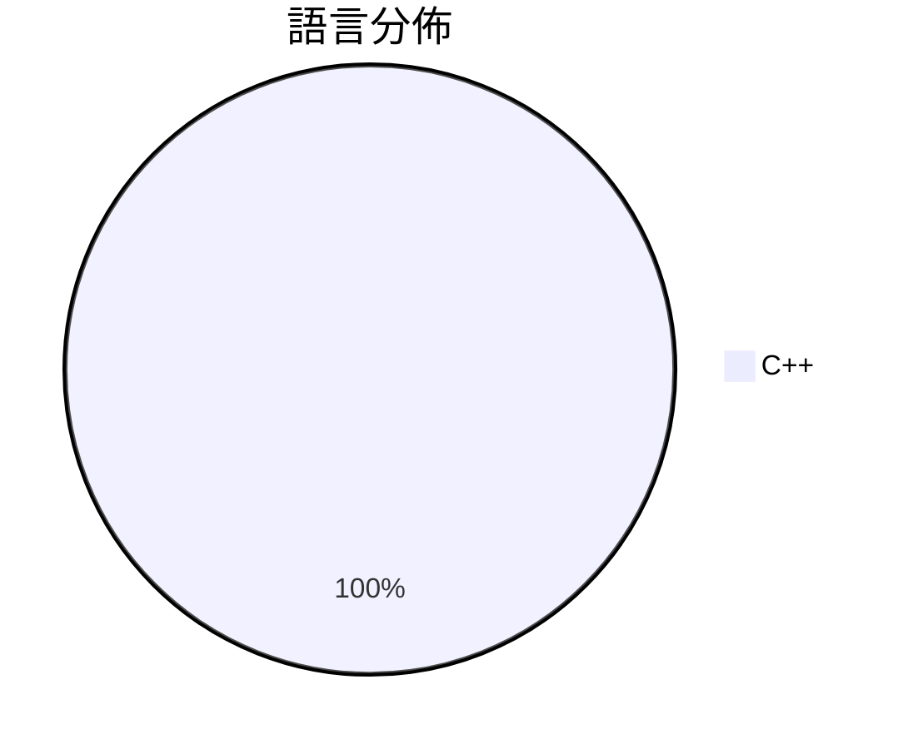

# GitHub Trending - 2026-03-10

> [!summary] 本日摘要
> 收錄 **1** 個新專案，合計 **294** stars
> 語言分佈：C++ (1)

> [!tip] 本週焦點
> **[[RunanywhereAI--RCLI|RunanywhereAI/RCLI]]** — 6 天內累積 294 stars（49 stars/天）
> 讓你在 Mac 上用語音控制操作，無需雲端服務。

---

## 收錄列表

| # | 專案 | 分類 | Stars | 速度 | 語言 |
| :--: | --- | --- | ---: | ---: | --- |
| 1 | [[RunanywhereAI--RCLI\|RunanywhereAI/RCLI]] | AI/ML | 294 | 49/天 | C++ |

---

## 重點摘要

### 1. [[RunanywhereAI--RCLI|RunanywhereAI/RCLI]] `AI/ML`

> 讓你在 Mac 上用語音控制操作，無需雲端服務。

**294** stars · **49** stars/天 · C++

_RCLI 的開發者來自 RunAnywhere, Inc.，專注於本地 AI 解決方案，切合了對隱私和性能的需求。隨著 Apple Silicon 的普及，越來越多的用戶尋求不依賴雲端的本地解決方案。這個專案在短時間內獲得了不少關注，因為它提供了一個強大的替代品，特別是在語音控制領域。_

---
