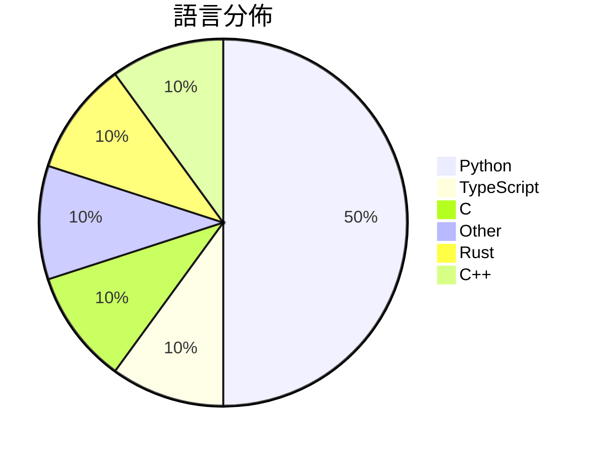

# GitHub Trending - 2026-03-10

> [!summary] 本日摘要
> 收錄 **10** 個新專案，合計 **6.9k** stars
> 語言分佈：Python (5) · TypeScript (1) · C (1) · Other (1) · Rust (1) · C++ (1)

> [!tip] 本週焦點
> **[[FreedomIntelligence--OpenClaw-Medical-Skills|FreedomIntelligence/OpenClaw-Medical-Skills]]** — 2 天內累積 882 stars（441 stars/天）
> The largest open-source medical AI skills library for OpenClaw🦞.

---

## 收錄列表

| # | 專案 | 分類 | Stars | 速度 | 語言 |
| :--: | --- | --- | ---: | ---: | --- |
| 1 | [[FreedomIntelligence--OpenClaw-Medical-Skills\|FreedomIntelligence/OpenClaw-Medical-Skills]] |  | 882 | 441/天 | Python |
| 2 | [[op7418--Claude-to-IM-skill\|op7418/Claude-to-IM-skill]] |  | 822 | 164/天 | TypeScript |
| 3 | [[Flowseal--tg-ws-proxy\|Flowseal/tg-ws-proxy]] |  | 767 | 128/天 | Python |
| 4 | [[tanishqkumar--ssd\|tanishqkumar/ssd]] |  | 748 | 125/天 | Python |
| 5 | [[imbue-bit--OpenClaw-PwnKit\|imbue-bit/OpenClaw-PwnKit]] |  | 692 | 346/天 | Python |
| 6 | [[hicode002--qualcomm_gbl_exploit_poc\|hicode002/qualcomm_gbl_exploit_poc]] |  | 675 | 113/天 | C |
| 7 | [[ParthJadhav--app-store-screenshots\|ParthJadhav/app-store-screenshots]] |  | 643 | 214/天 | N/A |
| 8 | [[jshachm--pi-rs\|jshachm/pi-rs]] |  | 615 | 103/天 | Rust |
| 9 | [[inspatio--worldfm\|inspatio/worldfm]] |  | 553 | 79/天 | Python |
| 10 | [[vulhunt-re--vulhunt\|vulhunt-re/vulhunt]] |  | 536 | 134/天 | C++ |

---

## 重點摘要

### 1. [[FreedomIntelligence--OpenClaw-Medical-Skills|FreedomIntelligence/OpenClaw-Medical-Skills]]

**882** stars · **441** stars/天 · Python

---

### 2. [[op7418--Claude-to-IM-skill|op7418/Claude-to-IM-skill]]

**822** stars · **164** stars/天 · TypeScript

---

### 3. [[Flowseal--tg-ws-proxy|Flowseal/tg-ws-proxy]]

**767** stars · **128** stars/天 · Python

---

### 4. [[tanishqkumar--ssd|tanishqkumar/ssd]]

**748** stars · **125** stars/天 · Python

---

### 5. [[imbue-bit--OpenClaw-PwnKit|imbue-bit/OpenClaw-PwnKit]]

**692** stars · **346** stars/天 · Python

---

### 6. [[hicode002--qualcomm_gbl_exploit_poc|hicode002/qualcomm_gbl_exploit_poc]]

**675** stars · **113** stars/天 · C

---

### 7. [[ParthJadhav--app-store-screenshots|ParthJadhav/app-store-screenshots]]

**643** stars · **214** stars/天 · N/A

---

### 8. [[jshachm--pi-rs|jshachm/pi-rs]]

**615** stars · **103** stars/天 · Rust

---

### 9. [[inspatio--worldfm|inspatio/worldfm]]

**553** stars · **79** stars/天 · Python

---

### 10. [[vulhunt-re--vulhunt|vulhunt-re/vulhunt]]

**536** stars · **134** stars/天 · C++

---
