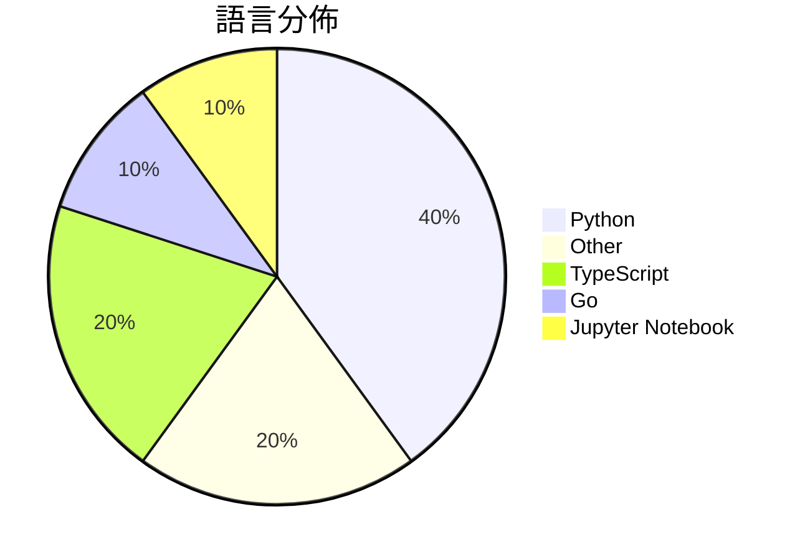

# GitHub Trending - 2026-03-10

> [!summary] 本日摘要
> 收錄 **10** 個新專案，合計 **36.3k** stars
> 語言分佈：Python (4) · Other (2) · TypeScript (2) · Go (1) · Jupyter Notebook (1)

> [!tip] 本週焦點
> **[[karpathy--autoresearch|karpathy/autoresearch]]** — 3 天內累積 21.3k stars（7.1k stars/天）
> AI agents running research on single-GPU nanochat training automatically

---

## 收錄列表

| # | 專案 | 分類 | Stars | 速度 | 語言 |
| :--: | --- | --- | ---: | ---: | --- |
| 1 | [[karpathy--autoresearch\|karpathy/autoresearch]] |  | 21.3k | 7.1k/天 | Python |
| 2 | [[elder-plinius--OBLITERATUS\|elder-plinius/OBLITERATUS]] |  | 2.7k | 444/天 | Python |
| 3 | [[HKUDS--CLI-Anything\|HKUDS/CLI-Anything]] |  | 2.2k | 1.1k/天 | Python |
| 4 | [[twostraws--SwiftUI-Agent-Skill\|twostraws/SwiftUI-Agent-Skill]] |  | 1.7k | 428/天 | N/A |
| 5 | [[karpathy--agenthub\|karpathy/agenthub]] |  | 1.6k | 1.6k/天 | Go |
| 6 | [[duoan--TorchCode\|duoan/TorchCode]] |  | 1.5k | 251/天 | Jupyter Notebook |
| 7 | [[jackwener--twitter-cli\|jackwener/twitter-cli]] |  | 1.4k | 274/天 | Python |
| 8 | [[viperrcrypto--Siftly\|viperrcrypto/Siftly]] |  | 1.4k | 226/天 | TypeScript |
| 9 | [[BigBodyCobain--Shadowbroker\|BigBodyCobain/Shadowbroker]] |  | 1.3k | 264/天 | TypeScript |
| 10 | [[cyxzdev--Uncodixfy\|cyxzdev/Uncodixfy]] |  | 1.3k | 330/天 | N/A |

---

## 重點摘要

### 1. [[karpathy--autoresearch|karpathy/autoresearch]]

**21.3k** stars · **7.1k** stars/天 · Python

---

### 2. [[elder-plinius--OBLITERATUS|elder-plinius/OBLITERATUS]]

**2.7k** stars · **444** stars/天 · Python

---

### 3. [[HKUDS--CLI-Anything|HKUDS/CLI-Anything]]

**2.2k** stars · **1.1k** stars/天 · Python

---

### 4. [[twostraws--SwiftUI-Agent-Skill|twostraws/SwiftUI-Agent-Skill]]

**1.7k** stars · **428** stars/天 · N/A

---

### 5. [[karpathy--agenthub|karpathy/agenthub]]

**1.6k** stars · **1.6k** stars/天 · Go

---

### 6. [[duoan--TorchCode|duoan/TorchCode]]

**1.5k** stars · **251** stars/天 · Jupyter Notebook

---

### 7. [[jackwener--twitter-cli|jackwener/twitter-cli]]

**1.4k** stars · **274** stars/天 · Python

---

### 8. [[viperrcrypto--Siftly|viperrcrypto/Siftly]]

**1.4k** stars · **226** stars/天 · TypeScript

---

### 9. [[BigBodyCobain--Shadowbroker|BigBodyCobain/Shadowbroker]]

**1.3k** stars · **264** stars/天 · TypeScript

---

### 10. [[cyxzdev--Uncodixfy|cyxzdev/Uncodixfy]]

**1.3k** stars · **330** stars/天 · N/A

---
