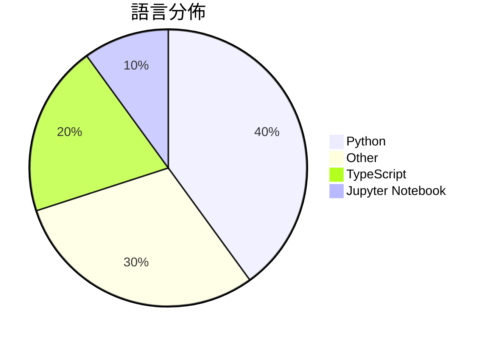

# GitHub Trending - 2026-03-11

> [!summary] 本日摘要
> 收錄 **10** 個新專案，合計 **35.8k** stars
> 語言分佈：Python (4) · Other (3) · TypeScript (2) · Jupyter Notebook (1)

> [!tip] 本週焦點
> **[[karpathy--autoresearch|karpathy/autoresearch]]** — 4 天內累積 22.7k stars（5.7k stars/天）
> 讓 AI 自動進行單 GPU nanochat 訓練實驗，你只需早上查看結果。

---

## 收錄列表

| # | 專案 | 分類 | Stars | 速度 | 語言 |
| :--: | --- | --- | ---: | ---: | --- |
| 1 | [[karpathy--autoresearch\|karpathy/autoresearch]] | AI/ML | 22.7k | 5.7k/天 | Python |
| 2 | [[HKUDS--CLI-Anything\|HKUDS/CLI-Anything]] | 開發工具 | 2.5k | 1.2k/天 | Python |
| 3 | [[twostraws--SwiftUI-Agent-Skill\|twostraws/SwiftUI-Agent-Skill]] | 開發工具 | 1.7k | 350/天 | N/A |
| 4 | [[duoan--TorchCode\|duoan/TorchCode]] | 資料科學 | 1.5k | 253/天 | Jupyter Notebook |
| 5 | [[jackwener--twitter-cli\|jackwener/twitter-cli]] | CLI 工具 | 1.4k | 284/天 | Python |
| 6 | [[BigBodyCobain--Shadowbroker\|BigBodyCobain/Shadowbroker]] |  | 1.4k | 280/天 | TypeScript |
| 7 | [[viperrcrypto--Siftly\|viperrcrypto/Siftly]] | 生產力 | 1.4k | 232/天 | TypeScript |
| 8 | [[cyxzdev--Uncodixfy\|cyxzdev/Uncodixfy]] |  | 1.4k | 338/天 | N/A |
| 9 | [[ParthJadhav--app-store-screenshots\|ParthJadhav/app-store-screenshots]] |  | 922 | 307/天 | N/A |
| 10 | [[FreedomIntelligence--OpenClaw-Medical-Skills\|FreedomIntelligence/OpenClaw-Medical-Skills]] |  | 914 | 457/天 | Python |

---

## 重點摘要

### 1. [[karpathy--autoresearch|karpathy/autoresearch]] `AI/ML`

> 讓 AI 自動進行單 GPU nanochat 訓練實驗，你只需早上查看結果。

**22.7k** stars · **5.7k** stars/天 · Python

_Karpathy 是知名的 AI 研究者，他的背景使得這個專案受到廣泛關注。這個專案切中當前對自動化 AI 研究的需求，尤其是在資源有限的情況下。隨著 AI 研究的快速發展，這種自動化的方式能夠提高研究效率，這也是為什麼現在會受到熱議。_

---

### 2. [[HKUDS--CLI-Anything|HKUDS/CLI-Anything]] `開發工具`

> 讓所有軟體都能成為 AI agent 可控制的工具，簡化自動化流程。

**2.5k** stars · **1.2k** stars/天 · Python

_這個專案的作者來自於 HKUDS 團隊，專注於 AI 和自動化領域，切中當前對 AI agent 控制軟體的需求。隨著 AI 技術的進步，越來越多的開發者希望能夠讓他們的軟體支持 agent 操控，這使得 CLI-Anything 在市場上獲得了關注。_

---

### 3. [[twostraws--SwiftUI-Agent-Skill|twostraws/SwiftUI-Agent-Skill]] `開發工具`

> 幫助開發者寫出更智能、簡單和現代的 SwiftUI 代碼，提供 API 使用、設計、效能和可及性指導。

**1.7k** stars · **350** stars/天 · N/A

_作者 Paul Hudson 是知名的 Swift 教學者，其專業背景使得這個技能能夠有效解決開發者在 SwiftUI 開發中的常見問題。隨著 SwiftUI 的普及，開發者對於提升代碼品質的需求日益增加，這使得該專案在社群中受到關注。_

---

### 4. [[duoan--TorchCode|duoan/TorchCode]] `資料科學`

> 提供 PyTorch 面試準備的練習平台，實現各種深度學習操作並即時自動評分。

**1.5k** stars · **253** stars/天 · Jupyter Notebook

_隨著機器學習面試的競爭加劇，對於能夠實作核心操作的需求日益增加。作者 duoan 的背景使得這個專案能夠針對面試需求設計出有效的練習平台，並且其即時反饋的特性吸引了許多使用者。_

---

### 5. [[jackwener--twitter-cli|jackwener/twitter-cli]] `CLI 工具`

> 讓你在終端機上無需 API 金鑰即可瀏覽 Twitter/X 的時間線、書籤和用戶資料。

**1.4k** stars · **284** stars/天 · Python

_這個專案的作者 jackwener 擁有多個成功的 CLI 工具，顯示出其在開發終端機應用方面的專業能力。隨著 Twitter API 的變化，許多用戶尋找更簡單的替代方案，這使得這個工具的需求上升。最近 Twitter 改變了其 API 政策，讓許多開發者轉向無需 API 金鑰的解決方案，進一步推動了這個專案的流行。_

---

### 6. [[BigBodyCobain--Shadowbroker|BigBodyCobain/Shadowbroker]]

**1.4k** stars · **280** stars/天 · TypeScript

---

### 7. [[viperrcrypto--Siftly|viperrcrypto/Siftly]] `生產力`

> 將 Twitter/X 書籤轉換為可搜尋的視覺知識庫，並進行 AI 分類。

**1.4k** stars · **232** stars/天 · TypeScript

_作者背景在於開源和生產力工具的開發，切中使用者對於數據隱私和本地化管理的需求。隨著社交媒體使用量的增加，對於書籤管理的需求也隨之上升，尤其是在 Twitter/X 這樣的平台上。這個專案的推出時機正好符合了這些需求。_

---

### 8. [[cyxzdev--Uncodixfy|cyxzdev/Uncodixfy]]

**1.4k** stars · **338** stars/天 · N/A

---

### 9. [[ParthJadhav--app-store-screenshots|ParthJadhav/app-store-screenshots]]

**922** stars · **307** stars/天 · N/A

---

### 10. [[FreedomIntelligence--OpenClaw-Medical-Skills|FreedomIntelligence/OpenClaw-Medical-Skills]]

**914** stars · **457** stars/天 · Python

---
