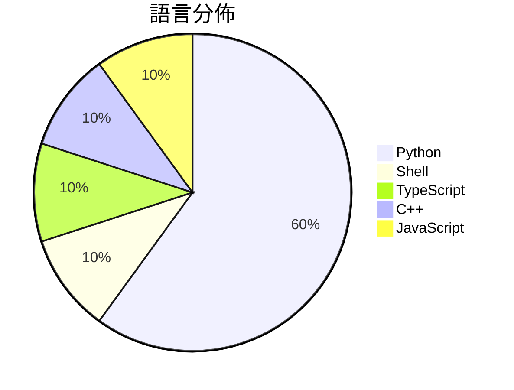

# GitHub Trending - 2026-03-11

> [!summary] 本日摘要
> 收錄 **10** 個新專案，合計 **3.6k** stars
> 語言分佈：Python (6) · Shell (1) · TypeScript (1) · C++ (1) · JavaScript (1)

> [!tip] 本週焦點
> **[[kamranahmedse--claude-statusline|kamranahmedse/claude-statusline]]** — 2 天內累積 399 stars（200 stars/天）
> 為 Claude Code CLI 提供一個簡潔的狀態列設置，顯示模型、上下文使用情況和速率限制等資訊。



---

## 收錄列表

| # | 專案 | 分類 | Stars | 速度 | 安裝 | 語言 | 用途 |
| :--: | --- | --- | ---: | ---: | --- | --- | --- |
| 1 | [[kamranahmedse--claude-statusline\|kamranahmedse/claude-statusline]] | CLI 工具 | 399 | 200/天 | `easy` | Shell | 為 Claude Code CLI 提供一個簡潔的狀態列設置，顯示模型、上下文使 |
| 2 | [[jackwener--xiaohongshu-cli\|jackwener/xiaohongshu-cli]] | CLI 工具 | 389 | 130/天 | `medium` | Python | 透過逆向工程的 API 來搜尋、閱讀及互動小紅書的 CLI 工具。 |
| 3 | [[Thearas--wechat-db-decrypt-macos\|Thearas/wechat-db-decrypt-macos]] | 開發工具 | 388 | 65/天 | `medium` | Python | 解密 macOS arm64 微信 4.1 数据库，提取聊天记录。 |
| 4 | [[joeseesun--qiaomu-mondo-poster-design\|joeseesun/qiaomu-mondo-poster-design]] | 開發工具 | 382 | 191/天 | `easy` | Python | 一句话生成大师级海报、书籍封面和专辑封面，AI自动选择最佳风格。 |
| 5 | [[HenryXiaoYang--wechat-access-unqclawed\|HenryXiaoYang/wechat-access-unqclawed]] | 開發工具 | 371 | 371/天 | `easy` | TypeScript | 提供微信扫码登录和双向通信的 OpenClaw 插件。 |
| 6 | [[L42ARO--Mercury-Transforming-Drone\|L42ARO/Mercury-Transforming-Drone]] | 其他 | 364 | 73/天 | `medium` | Python | 一款可變形的無人機，適合多種應用場景，具備多樣的感測器和貨艙空間。 |
| 7 | [[jackwener--bilibili-cli\|jackwener/bilibili-cli]] | CLI 工具 | 361 | 60/天 | `easy` | Python | 透過終端機瀏覽 Bilibili 的影片、用戶、搜尋和動態。 |
| 8 | [[Minecraft-Community-Edition--client\|Minecraft-Community-Edition/client]] | 其他 | 336 | 112/天 | `medium` | C++ | 提供一個開源的 Minecraft 客戶端，讓玩家能夠自訂和擴展遊戲體驗。 |
| 9 | [[helenigtxu--TradingView-Claw\|helenigtxu/TradingView-Claw]] | AI/ML | 332 | 83/天 | `easy` | Python | 提供交易功能的 TradingView 技能，讓用戶透過技術信號執行交易、追蹤持 |
| 10 | [[gradenGnostic--LegacyLauncher\|gradenGnostic/LegacyLauncher]] | 開發工具 | 318 | 53/天 | `medium` | JavaScript | 為 Minecraft Legacy Console Edition 提供自訂啟 |

---

## 重點摘要

### 1. [[kamranahmedse--claude-statusline|kamranahmedse/claude-statusline]] `CLI 工具`

> 為 Claude Code CLI 提供一個簡潔的狀態列設置，顯示模型、上下文使用情況和速率限制等資訊。

**399** stars · **200** stars/天 · Shell · `easy`

_建立 2 天就累積 399 stars（199.5/天），forks 16（4.0%），這顯示出良好的使用者興趣。作者 Kamran Ahmed 在開源社群中有一定的知名度，過去也有多個成功的專案。這個工具解決了使用 Claude Code 時狀態列顯示不清晰的問題，讓使用者能夠快速獲取重要的使用資訊。近期的推廣活動和社群討論可能也促進了這個專案的曝光。相對於其他工具，這個專案的設計簡單且易於上手，符合許多開發者的需求。_

---

### 2. [[jackwener--xiaohongshu-cli|jackwener/xiaohongshu-cli]] `CLI 工具`

> 透過逆向工程的 API 來搜尋、閱讀及互動小紅書的 CLI 工具。

**389** stars · **130** stars/天 · Python · `medium`

_建立 3 天內累積 389 stars（130/天），forks 32（8.2%），顯示出不錯的增長潛力。作者 jackwener 過去有開發多個 CLI 工具，這個專案解決了小紅書用戶在缺乏官方 API 的情況下，無法有效互動的痛點。近期的推廣或社群討論可能引發了關注，具體事件尚不明確。這個工具的高 forks/stars 比率顯示出用戶對其進行實際修改和使用的興趣。_

---

### 3. [[Thearas--wechat-db-decrypt-macos|Thearas/wechat-db-decrypt-macos]] `開發工具`

> 解密 macOS arm64 微信 4.1 数据库，提取聊天记录。

**388** stars · **65** stars/天 · Python · `medium`

_建立 6 天內累積 388 stars（64.7/天），forks 400（103.1%），這顯示出極高的使用興趣。這個專案的主要貢獻者包括 jackwener 和 jalen0x，他們在開源社群中有一定的影響力。解決了在 macOS 環境下無法輕易解密微信數據庫的痛點，之前的方案往往不支持最新版本或操作繁瑣。最近的推特討論和社群反饋也促進了這個專案的曝光。技術上，macOS arm64 的支持使得這個工具在特定硬體上運行得更加流暢，並且 forks/stars 比率超過 100%，顯示出許多使用者對此工具的實際修改需求。_

---

### 4. [[joeseesun--qiaomu-mondo-poster-design|joeseesun/qiaomu-mondo-poster-design]] `開發工具`

> 一句话生成大师级海报、书籍封面和专辑封面，AI自动选择最佳风格。

**382** stars · **191** stars/天 · Python · `easy`

_建立 2 天就累積 382 stars（191/天），forks 32（8.4%），這顯示出用戶對於簡化設計流程的需求。作者 joeseesun 之前在設計工具領域有一定的經驗，這個工具解決了許多非專業設計師在創建視覺內容時的困難。之前的解決方案往往需要用戶具備一定的設計知識，而這個工具則完全不需要。社交媒體的推廣和用戶的需求也促進了這個工具的快速增長。forks/stars 比率為 8.4%，顯示出許多用戶對這個工具進行了實際修改和使用。_

---

### 5. [[HenryXiaoYang--wechat-access-unqclawed|HenryXiaoYang/wechat-access-unqclawed]] `開發工具`

> 提供微信扫码登录和双向通信的 OpenClaw 插件。

**371** stars · **371** stars/天 · TypeScript · `easy`

_建立 1 天就累積 371 stars（371/天），forks 99（26.7%），這是極端爆發式增長。作者 HenryXiaoYang 之前有開發過 OpenClaw 的相關插件，這次專注於微信通道的整合，解決了微信機器人開發中登錄繁瑣的痛點。這個專案的推出正好填補了市場上對於微信機器人開發的需求，特別是在簡化登錄流程方面。社群的反饋和問題也顯示出使用者對於這個功能的迫切需求，進一步推動了專案的關注度。_

---

### 6. [[L42ARO--Mercury-Transforming-Drone|L42ARO/Mercury-Transforming-Drone]] `其他`

> 一款可變形的無人機，適合多種應用場景，具備多樣的感測器和貨艙空間。

**364** stars · **73** stars/天 · Python · `medium`

_在建立的 5 天內累積 364 stars（73/天），forks 45（12.4%），顯示出良好的初期接受度。這個專案的作者 L42ARO 及 Agonat0r 具備相關背景，並且提供了詳細的組裝和操作指南，解決了許多無人機愛好者在自製過程中的痛點。社群的活躍度和即時的支援機制也促進了其快速增長。_

---

### 7. [[jackwener--bilibili-cli|jackwener/bilibili-cli]] `CLI 工具`

> 透過終端機瀏覽 Bilibili 的影片、用戶、搜尋和動態。

**361** stars · **60** stars/天 · Python · `easy`

_建立 6 天內累積 361 stars（60/天），forks 33（9.1%），顯示出相對穩定的成長。作者 jackwener 之前已經開發過多個 CLI 工具，這次針對 Bilibili 的需求填補了終端機使用者在影片平台上的空白。之前的解決方案多依賴於瀏覽器操作，這使得自動化和批量處理變得困難。這個工具的出現正好解決了這個痛點，並且在社群中引起了關注。forks/stars 比率為 9.1%，顯示出不少使用者對此工具有實際的修改需求，反映出其在實際使用中的價值。_

---

### 8. [[Minecraft-Community-Edition--client|Minecraft-Community-Edition/client]] `其他`

> 提供一個開源的 Minecraft 客戶端，讓玩家能夠自訂和擴展遊戲體驗。

**336** stars · **112** stars/天 · C++ · `medium`

_建立 3 天就累積 336 stars（112/天），forks 40（11.9%），這顯示出社群對於開源 Minecraft 客戶端的興趣。專案的主要貢獻者來自於不同的背景，這可能促進了多樣化的功能開發。相較於傳統的 Minecraft 客戶端，這個專案提供了更大的自訂空間，吸引了喜歡修改遊戲的玩家。近期的推廣活動或社群討論可能也促進了其曝光率。forks/stars 比率接近 12%，顯示出不少用戶在實際修改和使用這個專案。_

---

### 9. [[helenigtxu--TradingView-Claw|helenigtxu/TradingView-Claw]] `AI/ML`

> 提供交易功能的 TradingView 技能，讓用戶透過技術信號執行交易、追蹤持倉並發現機會。

**332** stars · **83** stars/天 · Python · `easy`

_建立 4 天內累積 332 stars（83/天），forks 0，顯示出初期的興趣。作者 helenigtxu 似乎專注於開發 AI 交易工具，這個專案解決了自動化交易中對於技術信號分析的需求，之前的方案往往缺乏這樣的整合性。近期的推廣或社群討論可能也促進了這個專案的曝光。由於 forks/stars 比率為 0% 顯示出目前使用者仍在觀望階段。_

---

### 10. [[gradenGnostic--LegacyLauncher|gradenGnostic/LegacyLauncher]] `開發工具`

> 為 Minecraft Legacy Console Edition 提供自訂啟動器，支持多平台及自動更新功能。

**318** stars · **53** stars/天 · JavaScript · `medium`

_建立 6 天內累積 318 stars（53/天），forks 19（6.0%），顯示出不錯的增長潛力。這個專案的作者 gradenGnostic 及其團隊在 Minecraft 社群中有一定的影響力，並且提供了一個針對 Legacy Console Edition 的啟動器，這在現有的啟動器中並不多見。之前的解決方案往往缺乏良好的用戶界面或跨平台支持，LegacyLauncher 則填補了這一空白。社群中對於其功能的需求和反饋也促進了其快速發展。這個工具的出現正好迎合了玩家對於更好遊戲體驗的期待，並且在社群中引發了討論和關注。_

---

## 今日到期複習

> [!tip] 根據間隔複習排程，今天該回顧的專案

```dataview
TABLE
  stars_per_day AS "Stars/天",
  category AS "分類",
  engagement AS "參與度"
FROM "Repos"
WHERE next_review AND date(next_review) <= date("2026-03-11") AND status != "archived"
SORT priority DESC
```

## 待處理

```dataviewjs
const pending = dv.pages('"Repos"').where(p => p.status === "to-review").length;
const unrated = dv.pages('"Repos"').where(p => p.status !== "archived" && p.status !== "to-review" && (p.my_rating || 0) === 0).length;
const noVerdict = dv.pages('"Repos"').where(p => p.status !== "archived" && (p.my_rating || 0) > 0 && (!p.verdict || p.verdict === "")).length;
const items = [];
if (pending > 0) items.push(`**${pending}** 個待分流`);
if (unrated > 0) items.push(`**${unrated}** 個已讀但未評分`);
if (noVerdict > 0) items.push(`**${noVerdict}** 個已評分但無結論`);
if (items.length > 0) dv.paragraph(items.join(" / "));
else dv.paragraph("所有專案都已處理完畢！");
```
