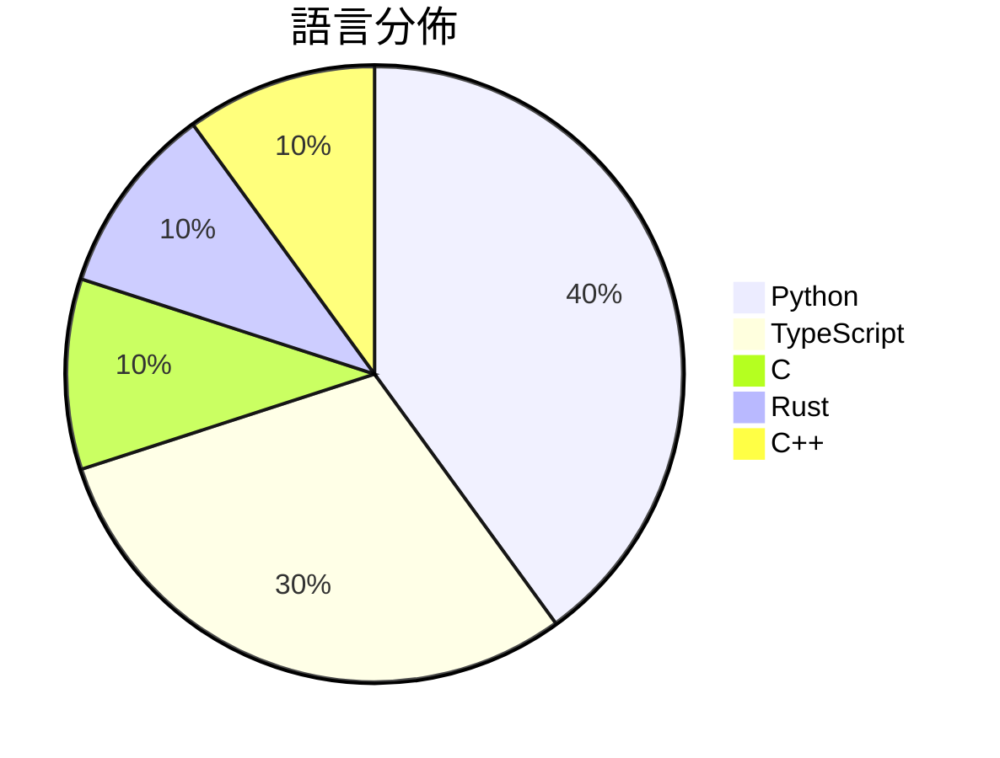

# GitHub Trending - 2026-03-11

> [!summary] 本日摘要
> 收錄 **10** 個新專案，合計 **6.5k** stars
> 語言分佈：Python (4) · TypeScript (3) · C (1) · Rust (1) · C++ (1)

> [!tip] 本週焦點
> **[[op7418--Claude-to-IM-skill|op7418/Claude-to-IM-skill]]** — 5 天內累積 833 stars（167 stars/天）
> 讓你可以在 Telegram、Discord、Feishu/Lark 等即時通訊平台上與 AI 編程代理聊天。

---

## 收錄列表

| # | 專案 | 分類 | Stars | 速度 | 語言 |
| :--: | --- | --- | ---: | ---: | --- |
| 1 | [[op7418--Claude-to-IM-skill\|op7418/Claude-to-IM-skill]] | 開發工具 | 833 | 167/天 | TypeScript |
| 2 | [[Flowseal--tg-ws-proxy\|Flowseal/tg-ws-proxy]] |  | 786 | 131/天 | Python |
| 3 | [[tanishqkumar--ssd\|tanishqkumar/ssd]] | AI/ML | 754 | 126/天 | Python |
| 4 | [[hicode002--qualcomm_gbl_exploit_poc\|hicode002/qualcomm_gbl_exploit_poc]] |  | 680 | 113/天 | C |
| 5 | [[imbue-bit--OpenClaw-PwnKit\|imbue-bit/OpenClaw-PwnKit]] | 安全 | 675 | 225/天 | Python |
| 6 | [[jshachm--pi-rs\|jshachm/pi-rs]] | 開發工具 | 592 | 99/天 | Rust |
| 7 | [[vulhunt-re--vulhunt\|vulhunt-re/vulhunt]] | 安全 | 550 | 110/天 | C++ |
| 8 | [[tanweai--pua\|tanweai/pua]] |  | 542 | 271/天 | TypeScript |
| 9 | [[ahmadawais--chartli\|ahmadawais/chartli]] | 開發工具 | 540 | 108/天 | TypeScript |
| 10 | [[knowsuchagency--mcp2cli\|knowsuchagency/mcp2cli]] | 開發工具 | 519 | 519/天 | Python |

---

## 重點摘要

### 1. [[op7418--Claude-to-IM-skill|op7418/Claude-to-IM-skill]] `開發工具`

> 讓你可以在 Telegram、Discord、Feishu/Lark 等即時通訊平台上與 AI 編程代理聊天。

**833** stars · **167** stars/天 · TypeScript

_該專案由 op7418 和 yoka1234 開發，前者在開源社區中有一定的知名度，並且曾經開發過 CodePilot。這個工具解決了即時通訊平台上與 AI 編程助手互動的需求，這在過去並沒有一個簡單的解決方案。近期的社群討論和推廣可能也促進了其受歡迎程度。隨著開發者對即時通訊工具的依賴增加，這個專案的實用性也隨之提升。_

---

### 2. [[Flowseal--tg-ws-proxy|Flowseal/tg-ws-proxy]]

**786** stars · **131** stars/天 · Python

---

### 3. [[tanishqkumar--ssd|tanishqkumar/ssd]] `AI/ML`

> 提供一個輕量級的推論引擎，支援並行的推測解碼，顯著提升大型語言模型的推論速度。

**754** stars · **126** stars/天 · Python

_作者 tanishqkumar 之前在 LLM 領域有多個貢獻，這個工具解決了大型模型推論速度慢的痛點，特別是在需要即時反應的應用中。最近的社群討論和推文也讓這個專案獲得了更多的曝光。技術生態的演變，尤其是對於高效能計算的需求增加，使得 SSD 的實用性大幅提升。_

---

### 4. [[hicode002--qualcomm_gbl_exploit_poc|hicode002/qualcomm_gbl_exploit_poc]]

**680** stars · **113** stars/天 · C

---

### 5. [[imbue-bit--OpenClaw-PwnKit|imbue-bit/OpenClaw-PwnKit]] `安全`

> 透過對 LLM 工具調用的對抗性攻擊，實現對幾乎任何 OpenClaw 主機的遠程代碼執行。

**675** stars · **225** stars/天 · Python

_這個專案的主要貢獻者 imbue-bit 以往參與過多個安全性相關的開源專案，這使得他們在這個領域內有一定的知名度。該工具解決了 LLM 在安全性上的一個重要痛點，即如何在不接觸模型內部的情況下進行有效的攻擊測試。最近的安全性討論和研究報告也促進了對這類工具的需求。隨著 LLM 應用的普及，對其安全性的關注也日益增加，這使得這個專案在當前時期顯得尤為重要。_

---

### 6. [[jshachm--pi-rs|jshachm/pi-rs]] `開發工具`

> 一款用 Rust 編寫的輕量化 AI 編程助手，支持多種 LLM 提供商。

**592** stars · **99** stars/天 · Rust

_這個專案的主要貢獻者 jshachm 在 Rust 社群中有一定的影響力，並且過去參與過多個開源專案。這個工具解決了開發者在使用 LLM 進行編程時的便捷性問題，提供了一個整合多種 LLM 的平台。最近的開源趨勢也促進了對 Rust 語言的興趣，這使得這個專案在當前時期受到關注。_

---

### 7. [[vulhunt-re--vulhunt|vulhunt-re/vulhunt]] `安全`

> 幫助安全研究人員快速識別軟體二進位檔和 UEFI 韌體中的漏洞。

**550** stars · **110** stars/天 · C++

_VulHunt 由 Binarly 的研究團隊開發，該團隊在漏洞研究方面有豐富的經驗。這個工具填補了市場上對於二進位檔和韌體漏洞檢測的需求，特別是在自動化和大規模管理方面。最近的安全事件和漏洞曝光使得這類工具的需求急劇上升，促使開發者關注此專案。_

---

### 8. [[tanweai--pua|tanweai/pua]]

**542** stars · **271** stars/天 · TypeScript

---

### 9. [[ahmadawais--chartli|ahmadawais/chartli]] `開發工具`

> 將純數字轉換為終端圖表，讓數據可視化變得簡單。

**540** stars · **108** stars/天 · TypeScript

_ahmadawais 是一位知名的開源貢獻者，曾經開發過多個受歡迎的工具。chartli 解決了終端用戶在數據可視化方面的痛點，特別是對於不想使用圖形界面的開發者。近期的推文和社群討論中，許多開發者對於其簡單的使用方式表示讚賞，這可能是其受歡迎的原因之一。隨著開發者對於 CLI 工具的需求增加，這個工具的實用性也愈加凸顯。_

---

### 10. [[knowsuchagency--mcp2cli|knowsuchagency/mcp2cli]] `開發工具`

> 將任何 MCP 伺服器或 OpenAPI 規範轉換為 CLI，無需代碼生成。

**519** stars · **519** stars/天 · Python

_knowsuchagency 是一個活躍的開源團隊，專注於開發高效的 CLI 工具。mcp2cli 解決了開發者在與 API 交互時的繁瑣流程，特別是對於需要即時調用的場景。近期的推文和社群討論中，許多開發者對於其簡單的使用方式表示讚賞，這可能是其受歡迎的原因之一。隨著對於 API 交互的需求增加，這個工具的實用性愈加凸顯。_

---
