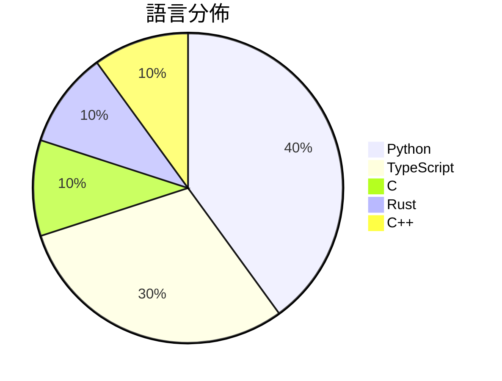

# GitHub Trending - 2026-03-11

> [!summary] 本日摘要
> 收錄 **10** 個新專案，合計 **6.5k** stars
> 語言分佈：Python (4) · TypeScript (3) · C (1) · Rust (1) · C++ (1)

> [!tip] 本週焦點
> **[[op7418--Claude-to-IM-skill|op7418/Claude-to-IM-skill]]** — 5 天內累積 836 stars（167 stars/天）
> 讓你在 Telegram、Discord、Feishu/Lark 等即時通訊平台上與 AI 編程代理互動。

---

## 收錄列表

| # | 專案 | 分類 | Stars | 速度 | 語言 |
| :--: | --- | --- | ---: | ---: | --- |
| 1 | [[op7418--Claude-to-IM-skill\|op7418/Claude-to-IM-skill]] | 開發工具 | 836 | 167/天 | TypeScript |
| 2 | [[Flowseal--tg-ws-proxy\|Flowseal/tg-ws-proxy]] | 開發工具 | 787 | 131/天 | Python |
| 3 | [[tanishqkumar--ssd\|tanishqkumar/ssd]] | AI/ML | 753 | 126/天 | Python |
| 4 | [[hicode002--qualcomm_gbl_exploit_poc\|hicode002/qualcomm_gbl_exploit_poc]] | 安全 | 680 | 113/天 | C |
| 5 | [[imbue-bit--OpenClaw-PwnKit\|imbue-bit/OpenClaw-PwnKit]] | 安全 | 676 | 225/天 | Python |
| 6 | [[jshachm--pi-rs\|jshachm/pi-rs]] | 開發工具 | 592 | 99/天 | Rust |
| 7 | [[tanweai--pua\|tanweai/pua]] | 開發工具 | 556 | 278/天 | TypeScript |
| 8 | [[vulhunt-re--vulhunt\|vulhunt-re/vulhunt]] | 安全 | 551 | 110/天 | C++ |
| 9 | [[ahmadawais--chartli\|ahmadawais/chartli]] | 開發工具 | 540 | 108/天 | TypeScript |
| 10 | [[knowsuchagency--mcp2cli\|knowsuchagency/mcp2cli]] | 開發工具 | 522 | 522/天 | Python |

---

## 重點摘要

### 1. [[op7418--Claude-to-IM-skill|op7418/Claude-to-IM-skill]] `開發工具`

> 讓你在 Telegram、Discord、Feishu/Lark 等即時通訊平台上與 AI 編程代理互動。

**836** stars · **167** stars/天 · TypeScript

_這個專案的主要貢獻者 op7418 過去有其他知名專案，顯示出其在開源社群中的活躍度。它解決了即時通訊平台與 AI 編程工具之間的橋接問題，讓開發者能夠在熟悉的環境中進行編程。最近的社群討論和需求增加，促使這個工具的受歡迎程度上升。_

---

### 2. [[Flowseal--tg-ws-proxy|Flowseal/tg-ws-proxy]] `開發工具`

> 透過 SOCKS5 代理加速 Telegram 的加載和下載速度。

**787** stars · **131** stars/天 · Python

_Flowseal 是一位活躍的開發者，過去參與過多個開源專案。這個工具解決了 Telegram 用戶在某些地區遇到的加載緩慢問題，特別是在網路不穩定的情況下。最近在社群論壇上有關於 Telegram 加速的討論，使得這個專案受到了更多的關注。由於 Telegram 的使用者基數龐大，這個工具在特定環境下的需求也隨之增加。_

---

### 3. [[tanishqkumar--ssd|tanishqkumar/ssd]] `AI/ML`

> 提供一個輕量級的推理引擎，支援快速的推測解碼演算法。

**753** stars · **126** stars/天 · Python

_作者 Tanishq Kumar 之前參與過多個知名的 LLM 專案，這次推出的 SSD 解決了傳統推測解碼在速度和效率上的痛點。近期的學術會議和討論也讓這個專案受到關注，尤其是其在 ICLR 2026 的發表。隨著大型模型需求的增加，SSD 的並行處理能力使其在當前技術生態中顯得尤為重要。_

---

### 4. [[hicode002--qualcomm_gbl_exploit_poc|hicode002/qualcomm_gbl_exploit_poc]] `安全`

> 透過 GBL 漏洞解鎖 Qualcomm 的 bootloader。

**680** stars · **113** stars/天 · C

_作者 hicode002 在開源社群中有一定的知名度，過去曾貢獻於多個安全相關的專案。這個工具解決了 Qualcomm 設備解鎖的痛點，特別是針對那些需要進行深度修改的開發者。最近在某些技術論壇上引起討論，可能是因為它提供了一個相對簡單的解鎖方法。隨著對開源硬體的需求增加，這個工具的實用性也隨之提升。_

---

### 5. [[imbue-bit--OpenClaw-PwnKit|imbue-bit/OpenClaw-PwnKit]] `安全`

> 透過對 LLM 工具調用的對抗性攻擊，實現對 OpenClaw 主機的遠程代碼執行。

**676** stars · **225** stars/天 · Python

_這個專案的主要貢獻者 imbue-bit 之前在安全研究領域有豐富的經驗，並且該專案針對 LLM 的安全漏洞提供了一個前所未有的解決方案。它揭示了在對抗性攻擊方面的潛在風險，特別是對於封閉源代碼的 LLM 模型。最近的安全事件和對 LLM 安全性的關注使得這個工具的需求急劇上升，特別是在安全測試和研究領域。_

---

### 6. [[jshachm--pi-rs|jshachm/pi-rs]] `開發工具`

> 提供一個輕量化的 Rust 版本 AI 編程助手，支持多種 LLM 提供商和工具系統。

**592** stars · **99** stars/天 · Rust

_作者 jshachm 之前參與了 pi-mono 的開發，這是一個知名的 AI 編程助手，這使得他在這個領域有一定的知名度。這個工具解決了開發者在使用多種 LLM 時的整合問題，提供了一個統一的界面。近期的 GitHub 活躍度增加可能來自於對 Rust 語言的興趣上升，許多開發者希望在性能和安全性上獲得提升。_

---

### 7. [[tanweai--pua|tanweai/pua]] `開發工具`

> 讓 AI 積極解決問題，避免放棄和借口。

**556** stars · **278** stars/天 · TypeScript

_作者 tanweai 是探微安全實驗室的成員，該團隊在 AI 和安全領域有一定的知名度。這個工具解決了 AI 在面對困難時常見的放棄和借口問題，提供了一種新的調試思路。近期在技術社群中有關 AI 效率的討論增多，讓這個專案受到更多關注。_

---

### 8. [[vulhunt-re--vulhunt|vulhunt-re/vulhunt]] `安全`

> 幫助安全研究人員在軟體二進位檔和 UEFI 韌體中識別漏洞的框架。

**551** stars · **110** stars/天 · C++

_VulHunt 由 Binarly 的研究團隊開發，該團隊在漏洞研究領域有豐富的經驗。這個工具解決了在二進位檔和韌體中識別漏洞的痛點，特別是在大型系統中。最近的社群討論和 GitHub 上的活躍度也促進了它的關注度。隨著對安全性需求的增加，這個工具的實用性和需求也隨之上升。_

---

### 9. [[ahmadawais--chartli|ahmadawais/chartli]] `開發工具`

> 將純數字轉換為終端圖表，讓數據視覺化變得簡單明瞭。

**540** stars · **108** stars/天 · TypeScript

_作者 Ahmad Awais 以其在開源社群中的活躍而聞名，曾開發多個受歡迎的工具。這個工具解決了在終端中快速生成圖表的需求，特別是在數據分析和報告時。最近的社交媒體推廣和開發者社群的討論也讓這個工具獲得了更多的關注。隨著 CLI 工具的流行，這個專案的實用性和簡單性使其在當前市場中脫穎而出。_

---

### 10. [[knowsuchagency--mcp2cli|knowsuchagency/mcp2cli]] `開發工具`

> 讓任何 MCP 伺服器或 OpenAPI 規格即時轉換為 CLI，無需代碼生成。

**522** stars · **522** stars/天 · Python

_這個專案的作者 knowsuchagency 在開源社群中有一定的知名度，之前也有其他成功的專案。mcp2cli 解決了開發者在使用 API 時需要手動編寫 CLI 的痛點，提供了一個即時生成的解決方案。最近在社交媒體上有不少開發者分享了使用這個工具的經驗，增加了它的曝光率。技術生態的變化使得對於即時生成 CLI 的需求增加，特別是在快速迭代的開發環境中。_

---
