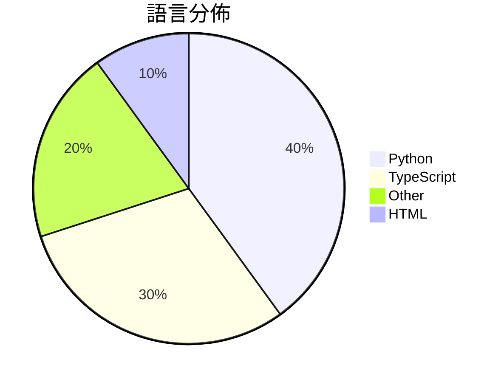

# GitHub Trending - 2026-03-13

> [!summary] 本日摘要
> 收錄 **10** 個新專案，合計 **52.8k** stars
> 語言分佈：Python (4) · TypeScript (3) · Other (2) · HTML (1)

> [!tip] 本週焦點
> **[[karpathy--autoresearch|karpathy/autoresearch]]** — 6 天內累積 28.9k stars（4.8k stars/天）
> 讓 AI 自動進行單 GPU nanochat 訓練的研究。



---

## 收錄列表

| # | 專案 | 分類 | Stars | 速度 | 安裝 | 語言 | 用途 |
| :--: | --- | --- | ---: | ---: | --- | --- | --- |
| 1 | [[karpathy--autoresearch\|karpathy/autoresearch]] | AI/ML | 28.9k | 4.8k/天 | `easy` | Python | 讓 AI 自動進行單 GPU nanochat 訓練的研究。 |
| 2 | [[HKUDS--CLI-Anything\|HKUDS/CLI-Anything]] | CLI 工具 | 8.9k | 2.2k/天 | `easy` | Python | 將所有軟體轉變為代理原生的命令列介面，讓 AI 代理能夠直接控制各種應用程式。 |
| 3 | [[tanweai--pua\|tanweai/pua]] | 開發工具 | 5.2k | 1.3k/天 | `medium` | HTML | 利用 PUA 論述強化 AI 的調試能力，讓 AI 在面對問題時不輕言放棄。 |
| 4 | [[garrytan--gstack\|garrytan/gstack]] | 開發工具 | 2.7k | 2.7k/天 | `easy` | TypeScript | 將 Claude Code 轉變為一個可隨時召喚的專業團隊，提供六種意見明確的工 |
| 5 | [[ParthJadhav--app-store-screenshots\|ParthJadhav/app-store-screenshots]] | 開發工具 | 2.2k | 438/天 | `easy` | N/A | 自動生成 iOS 應用的 App Store 截圖，省去手動設計的麻煩。 |
| 6 | [[cyxzdev--Uncodixfy\|cyxzdev/Uncodixfy]] | 開發工具 | 1.5k | 244/天 | `easy` | N/A | 幫助 GPT 生成更符合常規的 UI 設計，避免常見的設計缺陷。 |
| 7 | [[FreedomIntelligence--OpenClaw-Medical-Skills\|FreedomIntelligence/OpenClaw-Medical-Skills]] | AI/ML | 1.1k | 269/天 | `medium` | Python | 提供一個開源的醫療 AI 技能庫，讓 OpenClaw 變成強大的醫學研究助手。 |
| 8 | [[jackwener--xiaohongshu-cli\|jackwener/xiaohongshu-cli]] | CLI 工具 | 786 | 197/天 | `easy` | Python | 透過反向工程 API 來搜尋、閱讀和互動小紅書的 CLI 工具。 |
| 9 | [[gsd-build--gsd-2\|gsd-build/gsd-2]] | 開發工具 | 779 | 779/天 | `easy` | TypeScript | 讓代理能長時間自主運作而不失去全局視野的強大元提示、上下文工程和規格驅動開發系統 |
| 10 | [[larksuite--openclaw-lark\|larksuite/openclaw-lark]] | 開發工具 | 746 | 249/天 | `easy` | TypeScript | 讓 OpenClaw 與飛書無縫整合，實現消息、文檔、日曆等功能的自動化操作。 |

---

## 重點摘要

### 1. [[karpathy--autoresearch|karpathy/autoresearch]] `AI/ML`

> 讓 AI 自動進行單 GPU nanochat 訓練的研究。

**28.9k** stars · **4.8k** stars/天 · Python · `easy`

_建立 6 天內累積 28887 stars（4815/天），forks 3816（13.2%），顯示出強烈的社群興趣。作者 karpathy 是知名的 AI 研究者，過去的工作在社群中有很高的聲譽。這個專案解決了傳統研究需要大量人力和時間的痛點，讓 AI 自動進行實驗，從而提高研究效率。近期的推文和討論也引發了更多關注，尤其是對於如何讓 AI 代理進行自主研究的探討。這種自動化的研究方式在技術生態中是相對新穎的，特別是在單 GPU 的環境下進行高效能訓練。forks/stars 比率達到 13.2%，顯示出許多人對此專案的實際修改和使用。_

---

### 2. [[HKUDS--CLI-Anything|HKUDS/CLI-Anything]] `CLI 工具`

> 將所有軟體轉變為代理原生的命令列介面，讓 AI 代理能夠直接控制各種應用程式。

**8.9k** stars · **2.2k** stars/天 · Python · `easy`

_建立 4 天就累積 8931 stars（2233/天），forks 775（8.7%），顯示出強勁的增長潛力。主要貢獻者來自於活躍的開源社群，這些開發者在 AI 和自動化領域有豐富的經驗。CLI-Anything 解決了 AI 代理無法有效使用專業軟體的痛點，提供了一個簡單的命令來將任何應用程式轉換為代理原生工具，這在過去是難以實現的。社群的活躍度和開發者的參與度顯示出這個專案的潛力。_

---

### 3. [[tanweai--pua|tanweai/pua]] `開發工具`

> 利用 PUA 論述強化 AI 的調試能力，讓 AI 在面對問題時不輕言放棄。

**5.2k** stars · **1.3k** stars/天 · HTML · `medium`

_建立 4 天已累積 5233 stars（1308/天），forks 214（4.1%），顯示出強烈的社群興趣。作者 tanweai 和其他貢獻者在 AI 和調試領域有豐富的經驗，這個專案解決了 AI 在調試過程中常見的懶惰行為，提供了一個有效的解決方案。近期的社群討論和熱門問題也顯示出對於這個插件的關注，尤其是它如何影響 AI 的行為模式。這個專案的成功也反映了企業文化對於 AI 行為的影響，並且在技術生態中引入了新的思考方式。_

---

### 4. [[garrytan--gstack|garrytan/gstack]] `開發工具`

> 將 Claude Code 轉變為一個可隨時召喚的專業團隊，提供六種意見明確的工作流程技能。

**2.7k** stars · **2.7k** stars/天 · TypeScript · `easy`

_建立 1 天就累積 2724 stars（2724/天），forks 337（12.4%），這顯示出強烈的需求和興趣。作者 Garry Tan 在 AI 和工程管理方面有豐富的經驗，這使得他能夠針對開發者的痛點提供解決方案。gstack 解決了在使用 Claude Code 時，缺乏專業化工作流程的問題，這在過去的工具中並不常見。社群的反應也表明，這個工具的實用性和創新性受到廣泛認可。gstack 的出現恰逢 AI 工具日益普及的時期，這使得它的需求進一步上升。_

---

### 5. [[ParthJadhav--app-store-screenshots|ParthJadhav/app-store-screenshots]] `開發工具`

> 自動生成 iOS 應用的 App Store 截圖，省去手動設計的麻煩。

**2.2k** stars · **438** stars/天 · N/A · `easy`

_建立 5 天內累積 2190 stars（438/天），forks 146（6.7%），顯示出強烈的市場需求。作者 ParthJadhav 過去在 AI 和自動化領域有豐富經驗，這個專案解決了開發者在截圖設計上耗時的痛點，之前的解決方案往往需要手動設計，效率低下。隨著 AI 技術的進步，這種自動化的解決方案變得可行。高達 6.7% 的 forks/stars 比率表明許多開發者對此工具進行了實際修改和使用，顯示出其實用性和潛在的擴展性。_

---

### 6. [[cyxzdev--Uncodixfy|cyxzdev/Uncodixfy]] `開發工具`

> 幫助 GPT 生成更符合常規的 UI 設計，避免常見的設計缺陷。

**1.5k** stars · **244** stars/天 · N/A · `easy`

_建立 6 天就累積 1461 stars（244/天），forks 112（7.7%），顯示出不錯的增長潛力。這個專案的作者 cyxzdev 及其團隊在 AI 和設計領域有一定的經驗，解決了 GPT 在 UI 設計上常見的重複性問題。之前，開發者在使用 GPT 生成 UI 時，常常會遇到設計不佳的情況，這使得設計過程變得繁瑣且低效。這個專案的出現正好填補了這一空缺，提供了一種簡單的解決方案。社群的反應也非常積極，顯示出對這個工具的需求。forks/stars 比率為 7.7%，顯示出有相當一部分使用者在實際修改和使用這個工具。_

---

### 7. [[FreedomIntelligence--OpenClaw-Medical-Skills|FreedomIntelligence/OpenClaw-Medical-Skills]] `AI/ML`

> 提供一個開源的醫療 AI 技能庫，讓 OpenClaw 變成強大的醫學研究助手。

**1.1k** stars · **269** stars/天 · Python · `medium`

_建立 4 天內累積 1077 stars（269/天），forks 127（11.8%），顯示出強勁的增長潛力。這個專案由 WangRongsheng 和其他貢獻者主導，他們在開源社群中有著良好的聲譽。它解決了醫療 AI 能力不足的痛點，之前的工具往往無法提供專業的醫學查詢和數據分析。隨著醫療數據的增長和 AI 技術的進步，這個專案的需求越來越明顯。forks/stars 比率 11.8% 顯示出許多使用者對於這個專案的實際修改和使用，表明它不僅僅是觀望，而是有實際應用的潛力。_

---

### 8. [[jackwener--xiaohongshu-cli|jackwener/xiaohongshu-cli]] `CLI 工具`

> 透過反向工程 API 來搜尋、閱讀和互動小紅書的 CLI 工具。

**786** stars · **197** stars/天 · Python · `easy`

_建立 4 天就累積 786 stars（197/天），forks 77（9.8%），這顯示出強勁的增長潛力。作者 jackwener 之前已經開發了多個 CLI 工具，這使得他在這個領域有豐富的經驗。這個專案解決了小紅書用戶在使用官方應用時的限制，特別是在自動化和數據提取方面。近期的推廣活動和社群討論也為這個專案帶來了更多的曝光。隨著用戶對社交媒體數據分析需求的上升，這個工具的實用性愈發凸顯。_

---

### 9. [[gsd-build--gsd-2|gsd-build/gsd-2]] `開發工具`

> 讓代理能長時間自主運作而不失去全局視野的強大元提示、上下文工程和規格驅動開發系統。

**779** stars · **779** stars/天 · TypeScript · `easy`

_建立 1 天就累積 779 stars（779/天），forks 65（8.3%），這顯示出其在開發者社群中的快速增長。作者 glittercowboy 是一位活躍的開發者，之前的 GSD 框架已經獲得了良好的反響，這次的版本則解決了原有的上下文控制和自動化不足的問題。這個工具的出現正好滿足了開發者對更高效能的需求，特別是在長期項目中。社群的反應也顯示出對於其功能的期待，尤其是在 GitHub 上的討論和需求反饋。這些因素共同推動了其快速的成長。_

---

### 10. [[larksuite--openclaw-lark|larksuite/openclaw-lark]] `開發工具`

> 讓 OpenClaw 與飛書無縫整合，實現消息、文檔、日曆等功能的自動化操作。

**746** stars · **249** stars/天 · TypeScript · `easy`

_建立 3 天內累積 746 stars（249/天），forks 50（6.7%），這顯示出強勁的增長潛力。開發者 PerfectPan 和團隊過去在開源社區有良好的聲譽，這個插件解決了飛書用戶在自動化操作上的需求，之前的解決方案往往功能不全或整合不佳。社群對於這個插件的需求也在增長，尤其是在遠端工作和團隊協作日益增加的背景下。forks/stars 比率在中等範圍，顯示出有相當比例的用戶在進行實際修改和使用。_

---

## 今日到期複習

> [!tip] 根據間隔複習排程，今天該回顧的專案

```dataview
TABLE
  stars_per_day AS "Stars/天",
  category AS "分類",
  engagement AS "參與度"
FROM "Repos"
WHERE next_review AND date(next_review) <= date("2026-03-13") AND status != "archived"
SORT priority DESC
```

## 待處理

```dataviewjs
const pending = dv.pages('"Repos"').where(p => p.status === "to-review").length;
const unrated = dv.pages('"Repos"').where(p => p.status !== "archived" && p.status !== "to-review" && (p.my_rating || 0) === 0).length;
const noVerdict = dv.pages('"Repos"').where(p => p.status !== "archived" && (p.my_rating || 0) > 0 && (!p.verdict || p.verdict === "")).length;
const items = [];
if (pending > 0) items.push(`**${pending}** 個待分流`);
if (unrated > 0) items.push(`**${unrated}** 個已讀但未評分`);
if (noVerdict > 0) items.push(`**${noVerdict}** 個已評分但無結論`);
if (items.length > 0) dv.paragraph(items.join(" / "));
else dv.paragraph("所有專案都已處理完畢！");
```
