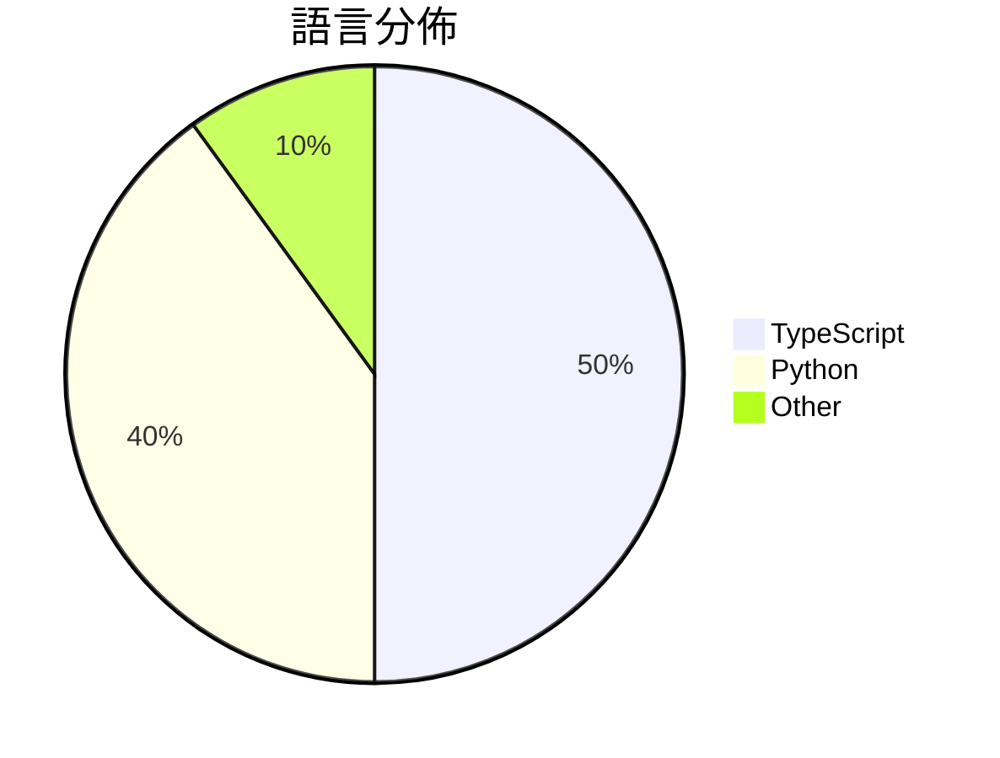

# GitHub Trending - 2026-03-14

> [!summary] 本日摘要
> 收錄 **10** 個新專案，合計 **33.1k** stars
> 語言分佈：TypeScript (5) · Python (4) · Other (1)

> [!tip] 本週焦點
> **[[HKUDS--CLI-Anything|HKUDS/CLI-Anything]]** — 5 天內累積 11.7k stars（2.3k stars/天）
> 將所有軟體轉變為代理原生的命令行工具，讓 AI 代理能夠無縫操作。



---

## 收錄列表

| # | 專案 | 分類 | Stars | 速度 | 安裝 | 語言 | 用途 |
| :--: | --- | --- | ---: | ---: | --- | --- | --- |
| 1 | [[HKUDS--CLI-Anything\|HKUDS/CLI-Anything]] | 開發工具 | 11.7k | 2.3k/天 | `easy` | Python | 將所有軟體轉變為代理原生的命令行工具，讓 AI 代理能夠無縫操作。 |
| 2 | [[tanweai--pua\|tanweai/pua]] | 開發工具 | 6.6k | 1.3k/天 | `medium` | TypeScript | 透過企業PUA修辭強化AI的主動性和解決問題的能力。 |
| 3 | [[garrytan--gstack\|garrytan/gstack]] | 開發工具 | 6.2k | 3.1k/天 | `easy` | TypeScript | 將 Claude Code 轉變為一個可隨時召喚的專家團隊，提供多種工作流程技能 |
| 4 | [[ParthJadhav--app-store-screenshots\|ParthJadhav/app-store-screenshots]] | 開發工具 | 2.4k | 403/天 | `easy` | N/A | 自動生成 iOS 應用的 App Store 截圖，提升行銷效果。 |
| 5 | [[davebcn87--pi-autoresearch\|davebcn87/pi-autoresearch]] | 開發工具 | 1.2k | 584/天 | `medium` | TypeScript | 自動化實驗循環，讓你測試、記錄和優化各種指標。 |
| 6 | [[FreedomIntelligence--OpenClaw-Medical-Skills\|FreedomIntelligence/OpenClaw-Medical-Skills]] | AI/ML | 1.1k | 225/天 | `easy` | Python | 提供最全面的開源醫療 AI 技能庫，讓 AI 助手具備專業醫療知識。 |
| 7 | [[TianyiDataScience--openclaw-control-center\|TianyiDataScience/openclaw-control-center]] | 開發工具 | 994 | 497/天 | `medium` | TypeScript | 提供 OpenClaw 的安全優先、本地控制中心，集中管理系統狀態和任務。 |
| 8 | [[gsd-build--gsd-2\|gsd-build/gsd-2]] | 開發工具 | 990 | 495/天 | `easy` | TypeScript | 讓代理能夠長時間自主工作而不失去大局觀的強大元提示、上下文工程和規格驅動開發系統 |
| 9 | [[aiming-lab--MetaClaw\|aiming-lab/MetaClaw]] | AI/ML | 980 | 245/天 | `easy` | Python | 讓你的 AI 代理透過對話學習和進化，無需 GPU。 |
| 10 | [[jackwener--xiaohongshu-cli\|jackwener/xiaohongshu-cli]] | CLI 工具 | 921 | 184/天 | `easy` | Python | 透過反向工程的 API，讓使用者能夠在小紅書上搜尋、閱讀和互動。 |

---

## 重點摘要

### 1. [[HKUDS--CLI-Anything|HKUDS/CLI-Anything]] `開發工具`

> 將所有軟體轉變為代理原生的命令行工具，讓 AI 代理能夠無縫操作。

**11.7k** stars · **2.3k** stars/天 · Python · `easy`

_建立 5 天內累積 11721 stars（2344/天），forks 999（8.5%），顯示出強烈的社群興趣。作者 yuh-yang 和其他貢獻者在 AI 和 CLI 工具方面有豐富的經驗，這使得專案能夠快速吸引開發者的注意。CLI-Anything 解決了 AI 代理無法有效使用專業軟體的痛點，之前的解決方案往往依賴於脆弱的 UI 自動化或有限的 API，這些方案在實際應用中經常失敗。隨著 AI 技術的進步，對於能夠直接控制應用程式的需求日益增加，這使得 CLI-Anything 的出現恰逢其時。forks/stars 比率為 8.5%，顯示出許多開發者正在實際修改和使用這個工具。_

---

### 2. [[tanweai--pua|tanweai/pua]] `開發工具`

> 透過企業PUA修辭強化AI的主動性和解決問題的能力。

**6.6k** stars · **1.3k** stars/天 · TypeScript · `medium`

_建立 5 天就累積 6620 stars（1324/天），forks 288（4.4%），這顯示出強烈的市場需求。作者xsser和其他貢獻者在AI和開源社群中有一定的影響力，這個專案解決了AI在面對挑戰時缺乏主動性的問題，這在過去的AI工具中並未得到有效解決。社群對此專案的熱烈反應和討論，顯示出其潛在的應用價值和未來的發展潛力。_

---

### 3. [[garrytan--gstack|garrytan/gstack]] `開發工具`

> 將 Claude Code 轉變為一個可隨時召喚的專家團隊，提供多種工作流程技能。

**6.2k** stars · **3.1k** stars/天 · TypeScript · `easy`

_建立 2 天就累積 6191 stars（3096/天），forks 733（11.8%），這顯示出強烈的興趣和需求。作者 Garry Tan 是一位知名的創業者，過去在多個成功的項目中擔任重要角色，這使得他的工具受到廣泛關注。gstack 解決了開發者在使用 Claude Code 時面臨的多任務處理困難，讓開發者能夠更高效地進行工作。社群的反應也顯示出對於這種整合式工具的需求，尤其是在快速迭代的開發環境中。這樣的增長也可能受到社交媒體的推廣和開發者社群的討論影響。_

---

### 4. [[ParthJadhav--app-store-screenshots|ParthJadhav/app-store-screenshots]] `開發工具`

> 自動生成 iOS 應用的 App Store 截圖，提升行銷效果。

**2.4k** stars · **403** stars/天 · N/A · `easy`

_建立 6 天就累積 2419 stars（403/天），forks 156（6.4%），顯示出強勁的增長勢頭。這個專案由 ParthJadhav 主導，他在 AI 和自動化領域有豐富的經驗。它解決了開發者在截圖設計上的痛點，傳統方法往往耗時且難以達到最佳行銷效果。這個工具的出現，讓開發者能夠快速生成符合 Apple 規範的高質量截圖，並且在社群中引起了廣泛的關注和討論。_

---

### 5. [[davebcn87--pi-autoresearch|davebcn87/pi-autoresearch]] `開發工具`

> 自動化實驗循環，讓你測試、記錄和優化各種指標。

**1.2k** stars · **584** stars/天 · TypeScript · `medium`

_建立 2 天就累積 1167 stars（584/天），forks 56（4.8%），這顯示出強勁的增長潛力。作者 davebcn87 和 tobi 在開源社群中有一定的影響力，並且這個專案解決了許多開發者在實驗和優化過程中面臨的痛點，特別是在持續集成和自動化測試方面。這個工具的設計靈感來自於 `karpathy/autoresearch`，但進一步擴展了功能，讓使用者能夠更靈活地定義和執行實驗。社群的反饋和需求也驅動了這個專案的快速發展，未來可能會有更多功能和改進。_

---

### 6. [[FreedomIntelligence--OpenClaw-Medical-Skills|FreedomIntelligence/OpenClaw-Medical-Skills]] `AI/ML`

> 提供最全面的開源醫療 AI 技能庫，讓 AI 助手具備專業醫療知識。

**1.1k** stars · **225** stars/天 · Python · `easy`

_建立 5 天內累積 1125 stars（225/天），forks 138（12.3%），顯示出強烈的社群關注。主要貢獻者 WangRongsheng 和其他開發者在醫療 AI 領域有豐富的經驗，這個專案解決了醫療 AI 技能不足的痛點，讓開發者能夠快速擴展 AI 助手的功能。近期的推廣活動和社群討論也進一步提升了專案的能見度，吸引了大量開發者參與。這個工具的出現正好符合當前對於醫療數據分析和智能助手需求的增長。_

---

### 7. [[TianyiDataScience--openclaw-control-center|TianyiDataScience/openclaw-control-center]] `開發工具`

> 提供 OpenClaw 的安全優先、本地控制中心，集中管理系統狀態和任務。

**994** stars · **497** stars/天 · TypeScript · `medium`

_建立 2 天就累積 994 stars（497/天），forks 148（14.9%），這顯示出強烈的興趣和實際使用情況。作者 TianyiDataScience 以開發開源工具著稱，這個專案填補了 OpenClaw 使用者在本地控制和安全管理方面的需求。此專案的推出正好符合了對於安全性和易用性的需求，特別是在當前對於數據安全日益重視的環境中。forks/stars 比率為 14.9%，顯示出使用者對於自定義和擴展的需求。_

---

### 8. [[gsd-build--gsd-2|gsd-build/gsd-2]] `開發工具`

> 讓代理能夠長時間自主工作而不失去大局觀的強大元提示、上下文工程和規格驅動開發系統。

**990** stars · **495** stars/天 · TypeScript · `easy`

_建立 2 天就累積 990 stars（495/天），forks 81（8.2%），顯示出強勁的增長潛力。作者 glittercowboy 之前在開源社群中活躍，曾經開發過多個與 LLM 相關的工具。GSD 2 解決了之前版本中缺乏上下文控制和自動化的痛點，讓開發者能夠更有效率地管理長期的開發任務。社群中對於其 CI/CD 改進的討論也顯示出用戶對於這個工具的期待。這樣的設計使得 GSD 2 在當前的開發生態中具備了更高的可用性和實用性。_

---

### 9. [[aiming-lab--MetaClaw|aiming-lab/MetaClaw]] `AI/ML`

> 讓你的 AI 代理透過對話學習和進化，無需 GPU。

**980** stars · **245** stars/天 · Python · `easy`

_建立 4 天就累積 980 stars（245/天），forks 136（13.9%），這顯示出強烈的社群興趣。作者 huaxiuyao 和團隊在 AI 代理和強化學習領域有豐富的經驗，這使得 MetaClaw 能夠解決過去需要大量資源的 AI 代理訓練問題。之前的解決方案往往需要高效能的硬體支持，而 MetaClaw 則能在無需 GPU 的情況下運行，這對於小型開發團隊尤其重要。社群的回饋和使用案例也促進了它的快速成長，顯示出這個工具在實際應用中的潛力。_

---

### 10. [[jackwener--xiaohongshu-cli|jackwener/xiaohongshu-cli]] `CLI 工具`

> 透過反向工程的 API，讓使用者能夠在小紅書上搜尋、閱讀和互動。

**921** stars · **184** stars/天 · Python · `easy`

_建立 5 天內累積 921 stars（184/天），forks 89（9.7%），這顯示出穩定的增長潛力。作者 jackwener 之前有開發過多個 CLI 工具，這次針對小紅書的需求提供了一個便捷的解決方案。之前用戶可能需要手動操作或使用不完整的 API，這個工具填補了這一空白。社群對於小紅書的需求持續增加，尤其是在數據分析和自動化操作方面。forks/stars 比率接近 10%，顯示出有不少用戶在實際修改和使用這個工具。_

---

## 今日到期複習

> [!tip] 根據間隔複習排程，今天該回顧的專案

```dataview
TABLE
  stars_per_day AS "Stars/天",
  category AS "分類",
  engagement AS "參與度"
FROM "Repos"
WHERE next_review AND date(next_review) <= date("2026-03-14") AND status != "archived"
SORT priority DESC
```

## 待處理

```dataviewjs
const pending = dv.pages('"Repos"').where(p => p.status === "to-review").length;
const unrated = dv.pages('"Repos"').where(p => p.status !== "archived" && p.status !== "to-review" && (p.my_rating || 0) === 0).length;
const noVerdict = dv.pages('"Repos"').where(p => p.status !== "archived" && (p.my_rating || 0) > 0 && (!p.verdict || p.verdict === "")).length;
const items = [];
if (pending > 0) items.push(`**${pending}** 個待分流`);
if (unrated > 0) items.push(`**${unrated}** 個已讀但未評分`);
if (noVerdict > 0) items.push(`**${noVerdict}** 個已評分但無結論`);
if (items.length > 0) dv.paragraph(items.join(" / "));
else dv.paragraph("所有專案都已處理完畢！");
```
