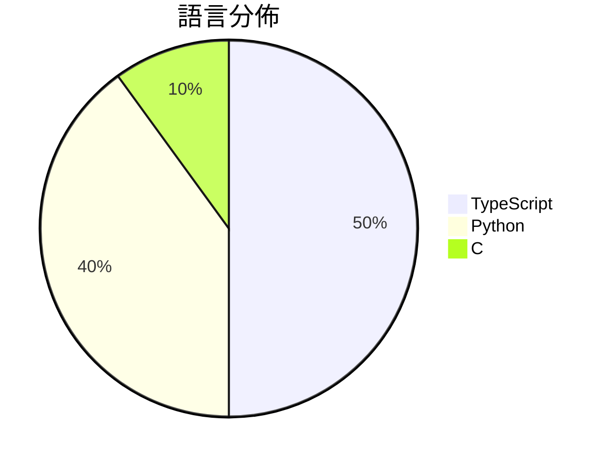

# GitHub Trending - 2026-03-15

> [!summary] 本日摘要
> 收錄 **10** 個新專案，合計 **40.7k** stars
> 語言分佈：TypeScript (5) · Python (4) · C (1)

> [!tip] 本週焦點
> **[[HKUDS--CLI-Anything|HKUDS/CLI-Anything]]** — 6 天內累積 13.8k stars（2.3k stars/天）
> 將所有軟體轉變為可由 AI 代理控制的 CLI 工具。



---

## 收錄列表

| # | 專案 | 分類 | Stars | 速度 | 安裝 | 語言 | 用途 |
| :--: | --- | --- | ---: | ---: | --- | --- | --- |
| 1 | [[HKUDS--CLI-Anything\|HKUDS/CLI-Anything]] | 開發工具 | 13.8k | 2.3k/天 | `easy` | Python | 將所有軟體轉變為可由 AI 代理控制的 CLI 工具。 |
| 2 | [[garrytan--gstack\|garrytan/gstack]] | 開發工具 | 10.6k | 3.5k/天 | `easy` | TypeScript | 將 Claude Code 轉變為一個可隨時召喚的專業團隊，提供多種工作流程技能 |
| 3 | [[tanweai--pua\|tanweai/pua]] | 開發工具 | 7.1k | 1.2k/天 | `medium` | TypeScript | 讓 AI 在面對挑戰時不輕言放棄，強化其主動性與解決問題的能力。 |
| 4 | [[NawfalMotii79--PLFM_RADAR\|NawfalMotii79/PLFM_RADAR]] | 基礎設施 | 1.7k | 284/天 | `medium` | C | 提供開源、低成本的 10.5 GHz 脈衝線性頻率調變相控陣雷達系統。 |
| 5 | [[davebcn87--pi-autoresearch\|davebcn87/pi-autoresearch]] | 開發工具 | 1.6k | 533/天 | `easy` | TypeScript | 自動化實驗循環擴展，幫助開發者持續優化專案。 |
| 6 | [[TianyiDataScience--openclaw-control-center\|TianyiDataScience/openclaw-control-center]] | 開發工具 | 1.4k | 473/天 | `medium` | TypeScript | 將 OpenClaw 轉變為可視化的本地控制中心，讓使用者能夠信任並控制系統。 |
| 7 | [[FreedomIntelligence--OpenClaw-Medical-Skills\|FreedomIntelligence/OpenClaw-Medical-Skills]] | AI/ML | 1.2k | 194/天 | `medium` | Python | 提供869種開源醫療AI技能，讓OpenClaw變成強大的醫學研究助手。 |
| 8 | [[gsd-build--gsd-2\|gsd-build/gsd-2]] | 開發工具 | 1.2k | 385/天 | `easy` | TypeScript | 讓代理能夠長時間自主工作而不失去全局視野的強大元提示、上下文工程和規格驅動開發系 |
| 9 | [[aiming-lab--MetaClaw\|aiming-lab/MetaClaw]] | AI/ML | 1.1k | 228/天 | `easy` | Python | 讓你的代理人透過對話學習並不斷進化。 |
| 10 | [[jackwener--xiaohongshu-cli\|jackwener/xiaohongshu-cli]] | CLI 工具 | 1.1k | 180/天 | `medium` | Python | 提供小紅書 CLI 工具，讓用戶能夠透過反向工程的 API 搜尋、閱讀及互動。 |

---

## 重點摘要

### 1. [[HKUDS--CLI-Anything|HKUDS/CLI-Anything]] `開發工具`

> 將所有軟體轉變為可由 AI 代理控制的 CLI 工具。

**13.8k** stars · **2.3k** stars/天 · Python · `easy`

_建立 6 天內累積 13789 stars（2298/天），forks 1157（8.4%），顯示出強勁的增長潛力。主要貢獻者包括 yuh-yang 和 panxiaojun233，他們在開源社群中有一定影響力。這個專案解決了 AI 代理與現有軟體之間的交互問題，之前的解決方案往往需要手動編寫 API 調用，效率低下。最近的推文和社群討論也引發了對這個工具的關注，特別是在 AI 代理日益普及的背景下。高達 8.4% 的 forks/stars 比率顯示出許多開發者對這個工具的實際修改和使用需求。_

---

### 2. [[garrytan--gstack|garrytan/gstack]] `開發工具`

> 將 Claude Code 轉變為一個可隨時召喚的專業團隊，提供多種工作流程技能。

**10.6k** stars · **3.5k** stars/天 · TypeScript · `easy`

_建立 3 天內累積 10586 stars（3529/天），forks 1257（11.9%），顯示出強勁的增長潛力。作者 Garry Tan 以其在 AI 和開發工具領域的經驗，針對開發者的痛點提供了高效的解決方案。gstack 專注於將 Claude Code 轉變為多功能的開發助手，這在現有工具中尚屬罕見。社群的反應顯示出對於這種整合性工具的需求，尤其是在快速開發和迭代的環境中。這種需求的上升，可能與遠端工作和敏捷開發的趨勢有關。_

---

### 3. [[tanweai--pua|tanweai/pua]] `開發工具`

> 讓 AI 在面對挑戰時不輕言放棄，強化其主動性與解決問題的能力。

**7.1k** stars · **1.2k** stars/天 · TypeScript · `medium`

_建立 6 天就累積 7051 stars（1175/天），forks 317（4.5%），這顯示出強勁的增長勢頭。作者 tanweai 及其團隊在 AI 和企業文化領域有豐富的經驗，這使得他們能夠針對 AI 的主動性問題提出有效的解決方案。PUA 解決了 AI 在面對挑戰時常見的懶惰模式，這在過去的工具中並未得到充分重視。近期的推廣活動和社群討論也促進了其曝光率，尤其是在 Telegram 和 Discord 上的活躍討論。這個工具的設計理念符合當前 AI 發展的需求，並且能夠在多種平台上運行，這使其具備了廣泛的適用性。_

---

### 4. [[NawfalMotii79--PLFM_RADAR|NawfalMotii79/PLFM_RADAR]] `基礎設施`

> 提供開源、低成本的 10.5 GHz 脈衝線性頻率調變相控陣雷達系統。

**1.7k** stars · **284** stars/天 · C · `medium`

_建立 6 天內累積 1703 stars（284/天），forks 387（22.7%），顯示出強烈的社群興趣。這個專案由 NawfalMotii79 發起，目的是解決高成本雷達技術的可及性問題，讓更多開發者和研究者能夠進行雷達技術的探索。社群中對於開源硬體的需求日益增加，這使得 AERIS-10 成為一個受歡迎的選擇。最近的推文和討論也進一步提升了其曝光率。forks/stars 比率為 22.7%，顯示出許多人在實際修改和使用這個專案。_

---

### 5. [[davebcn87--pi-autoresearch|davebcn87/pi-autoresearch]] `開發工具`

> 自動化實驗循環擴展，幫助開發者持續優化專案。

**1.6k** stars · **533** stars/天 · TypeScript · `easy`

_建立 3 天內累積 1599 stars（533/天），forks 78（4.9%），這顯示出強勁的增長潛力。這個專案的作者 davebcn87 和 tobi 在開源社群中有一定的影響力，並且他們的過去作品也涉及自動化和優化領域。這個工具解決了開發者在進行性能測試時的繁瑣流程，之前的解決方案往往需要手動記錄和分析，效率低下。此專案的推出引起了開發者的廣泛關注，尤其是在社群論壇和社交媒體上有不少討論。隨著開發者對自動化和持續集成的需求增加，這個工具的可行性和實用性也因此提升。forks/stars 比率為 4.9%，顯示出有相對較高的實際使用和修改需求。_

---

### 6. [[TianyiDataScience--openclaw-control-center|TianyiDataScience/openclaw-control-center]] `開發工具`

> 將 OpenClaw 轉變為可視化的本地控制中心，讓使用者能夠信任並控制系統。

**1.4k** stars · **473** stars/天 · TypeScript · `medium`

_建立 3 天內累積 1420 stars（473/天），forks 191（13.5%），顯示出強勁的增長潛力。作者 MoYiC6 和 JonasGao 具備相關背景，之前可能參與過其他開源專案，這使得他們能夠針對 OpenClaw 的需求提供解決方案。這個專案解決了用戶對於 OpenClaw 的可視化和控制需求，之前的解決方案往往缺乏用戶友好的界面和安全性。社群的反饋也促進了專案的快速迭代，特別是針對性能問題的修正。這些因素共同推動了專案的快速成長。_

---

### 7. [[FreedomIntelligence--OpenClaw-Medical-Skills|FreedomIntelligence/OpenClaw-Medical-Skills]] `AI/ML`

> 提供869種開源醫療AI技能，讓OpenClaw變成強大的醫學研究助手。

**1.2k** stars · **194** stars/天 · Python · `medium`

_建立 6 天內累積 1165 stars（194/天），forks 145（12.4%），顯示出強勁的增長潛力。這個專案由 WangRongsheng 和其他幾位貢獻者共同開發，旨在解決醫療 AI 技能不足的問題，提供一個集中且可擴展的技能庫。隨著醫療 AI 的需求上升，這個工具正好填補了市場上的空白，特別是在需要專業醫學知識的場景下。社群的活躍度和開放的問題回應率（75%）也顯示出其健康的發展狀態。_

---

### 8. [[gsd-build--gsd-2|gsd-build/gsd-2]] `開發工具`

> 讓代理能夠長時間自主工作而不失去全局視野的強大元提示、上下文工程和規格驅動開發系統。

**1.2k** stars · **385** stars/天 · TypeScript · `easy`

_建立 3 天就累積 1155 stars（385/天），forks 94（8.1%），顯示出強勁的增長勢頭。這個專案由 glittercowboy 和其他幾位貢獻者共同開發，他們在開源社群中有著良好的聲譽。GSD 2 解決了開發者在使用 LLM 進行自動化時面臨的上下文管理和自動化控制的痛點，提供了一個更為穩定和高效的解決方案。隨著 AI 和自動化需求的增加，這樣的工具正好填補了市場的空白。社群的活躍度和開發者的回應速度也顯示出這個專案的潛力。_

---

### 9. [[aiming-lab--MetaClaw|aiming-lab/MetaClaw]] `AI/ML`

> 讓你的代理人透過對話學習並不斷進化。

**1.1k** stars · **228** stars/天 · Python · `easy`

_建立 5 天內累積 1139 stars（228/天），forks 145（12.7%），顯示出強勁的增長潛力。這個專案由 huaxiuyao 等多位貢獻者開發，解決了傳統 AI 代理在實時學習方面的不足，之前的方案往往需要大量的離線訓練，無法即時適應用戶需求。近期的推廣和社群反饋也促進了其曝光度，並且技術生態的進步使得這種即時學習的架構變得可行。高達 12.7% 的 forks/stars 比率顯示出許多開發者對這個專案的實際修改和使用，表明其社群活躍度。_

---

### 10. [[jackwener--xiaohongshu-cli|jackwener/xiaohongshu-cli]] `CLI 工具`

> 提供小紅書 CLI 工具，讓用戶能夠透過反向工程的 API 搜尋、閱讀及互動。

**1.1k** stars · **180** stars/天 · Python · `medium`

_建立 6 天內累積 1080 stars（180/天），forks 102（9.4%），顯示出相對活躍的使用者基礎。作者 jackwener 之前開發過多個 CLI 工具，這次專案針對小紅書的需求，提供了一個方便的命令列介面，解決了許多用戶在使用官方應用時的限制。近期的社群討論和需求也促進了這個專案的曝光。這個工具的出現正好填補了用戶對於小紅書 API 的需求，並且提供了反偵測的功能，讓用戶能夠更安全地進行操作。_

---

## 今日到期複習

> [!tip] 根據間隔複習排程，今天該回顧的專案

```dataview
TABLE
  stars_per_day AS "Stars/天",
  category AS "分類",
  engagement AS "參與度"
FROM "Repos"
WHERE next_review AND date(next_review) <= date("2026-03-15") AND status != "archived"
SORT priority DESC
```

## 待處理

```dataviewjs
const pending = dv.pages('"Repos"').where(p => p.status === "to-review").length;
const unrated = dv.pages('"Repos"').where(p => p.status !== "archived" && p.status !== "to-review" && (p.my_rating || 0) === 0).length;
const noVerdict = dv.pages('"Repos"').where(p => p.status !== "archived" && (p.my_rating || 0) > 0 && (!p.verdict || p.verdict === "")).length;
const items = [];
if (pending > 0) items.push(`**${pending}** 個待分流`);
if (unrated > 0) items.push(`**${unrated}** 個已讀但未評分`);
if (noVerdict > 0) items.push(`**${noVerdict}** 個已評分但無結論`);
if (items.length > 0) dv.paragraph(items.join(" / "));
else dv.paragraph("所有專案都已處理完畢！");
```
