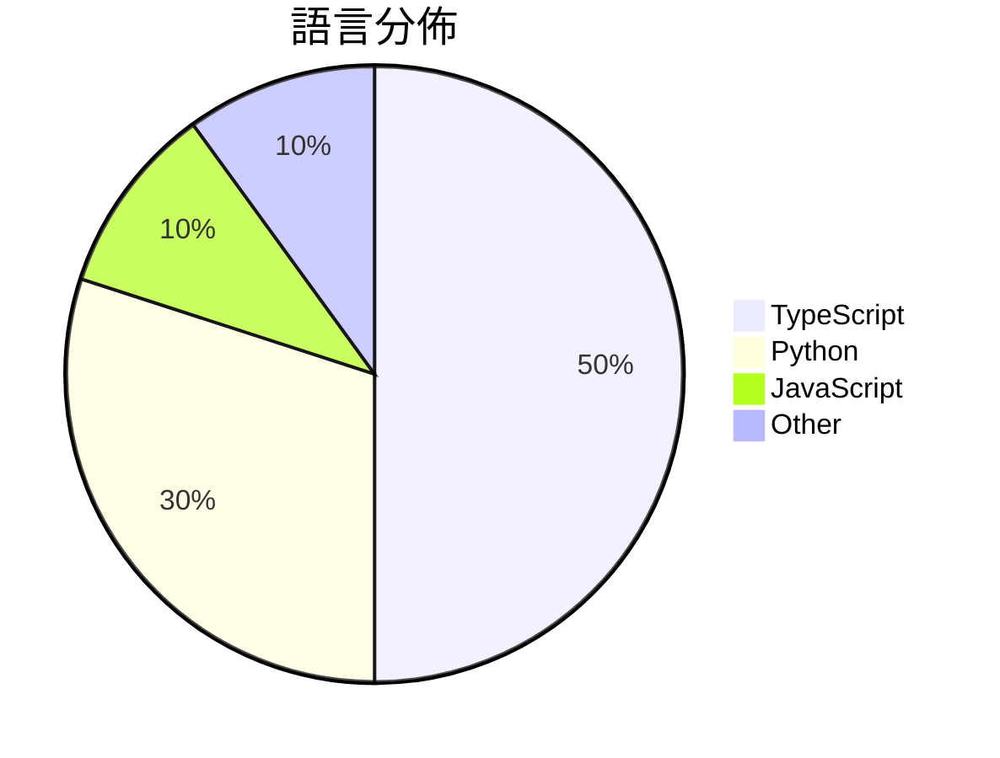

# GitHub Trending - 2026-03-16

> [!summary] 本日摘要
> 收錄 **10** 個新專案，合計 **26.2k** stars
> 語言分佈：TypeScript (5) · Python (3) · JavaScript (1) · Other (1)

> [!tip] 本週焦點
> **[[garrytan--gstack|garrytan/gstack]]** — 4 天內累積 14.0k stars（3.5k stars/天）
> 將 Claude Code 轉變為一個可隨時召喚的專業團隊，提供多種工作流程技能。



---

## 收錄列表

| # | 專案 | 分類 | Stars | 速度 | 安裝 | 語言 | 用途 |
| :--: | --- | --- | ---: | ---: | --- | --- | --- |
| 1 | [[garrytan--gstack\|garrytan/gstack]] | 開發工具 | 14.0k | 3.5k/天 | `medium` | TypeScript | 將 Claude Code 轉變為一個可隨時召喚的專業團隊，提供多種工作流程技能 |
| 2 | [[davebcn87--pi-autoresearch\|davebcn87/pi-autoresearch]] | 開發工具 | 1.9k | 463/天 | `easy` | TypeScript | 自動化實驗循環，幫助開發者持續優化程式碼性能。 |
| 3 | [[TianyiDataScience--openclaw-control-center\|TianyiDataScience/openclaw-control-center]] | 開發工具 | 1.7k | 430/天 | `medium` | TypeScript | 將 OpenClaw 轉變為可視化的本地控制中心，讓用戶能夠信任並控制系統。 |
| 4 | [[pasky--chrome-cdp-skill\|pasky/chrome-cdp-skill]] | 開發工具 | 1.5k | 501/天 | `easy` | JavaScript | 讓你的 AI 代理能夠直接訪問現有的 Chrome 瀏覽器會話，無需重啟或重新登 |
| 5 | [[gsd-build--gsd-2\|gsd-build/gsd-2]] | 開發工具 | 1.4k | 341/天 | `easy` | TypeScript | 讓代理人能夠長時間自主運作而不失去全局視野的強大系統。 |
| 6 | [[aiming-lab--MetaClaw\|aiming-lab/MetaClaw]] | AI/ML | 1.3k | 221/天 | `easy` | Python | 讓你的 AI 代理透過對話學習和演化，無需 GPU。 |
| 7 | [[wanshuiyin--Auto-claude-code-research-in-sleep\|wanshuiyin/Auto-claude-code-research-in-sleep]] | AI/ML | 1.3k | 259/天 | `medium` | Python | 讓 Claude Code 在你睡覺時自動進行研究，早上醒來就能看到評分、識別的 |
| 8 | [[knowsuchagency--mcp2cli\|knowsuchagency/mcp2cli]] | CLI 工具 | 1.1k | 188/天 | `easy` | Python | 將任何 MCP、OpenAPI 或 GraphQL 伺服器轉換為 CLI，無需代 |
| 9 | [[larksuite--openclaw-lark\|larksuite/openclaw-lark]] | 開發工具 | 1.0k | 167/天 | `easy` | TypeScript | 提供飛書與 OpenClaw 的無縫整合，讓使用者能直接操作消息、文檔、日曆等。 |
| 10 | [[novatic14--MANPADS-System-Launcher-and-Rocket\|novatic14/MANPADS-System-Launcher-and-Rocket]] | 其他 | 969 | 242/天 | `medium` | N/A | 提供一個低成本的火箭發射器和導引火箭系統的原型設計。 |

---

## 重點摘要

### 1. [[garrytan--gstack|garrytan/gstack]] `開發工具`

> 將 Claude Code 轉變為一個可隨時召喚的專業團隊，提供多種工作流程技能。

**14.0k** stars · **3.5k** stars/天 · TypeScript · `medium`

_建立 4 天內累積 14039 stars（3510/天），forks 1606（11.4%），顯示出極高的使用者興趣。作者 Garry Tan 是知名的創業者，過去在 AI 和開發工具方面有豐富的經驗。gstack 解決了將 AI 助手轉變為具體工作流程的痛點，這在過去的工具中並不常見，許多開發者面臨的問題是如何有效利用 AI 助手進行實際的開發工作。最近的推特討論和社群反饋也促進了這個工具的曝光。技術上，gstack 利用 Playwright 進行瀏覽器自動化，這在當前的開發生態中是非常受歡迎的選擇，並且其 forks/stars 比率顯示出有相當一部分使用者在實際修改和使用這個工具。_

---

### 2. [[davebcn87--pi-autoresearch|davebcn87/pi-autoresearch]] `開發工具`

> 自動化實驗循環，幫助開發者持續優化程式碼性能。

**1.9k** stars · **463** stars/天 · TypeScript · `easy`

_建立 4 天內累積 1851 stars（463/天），forks 93（5.0%），顯示出穩定的增長趨勢。作者 davebcn87 和 tobi 之前在開源社群中有過多個成功的專案，這使得他們的作品受到信任。這個專案解決了開發者在優化過程中常遇到的上下文丟失問題，提供了一個自動化的解決方案。社群的積極反饋和活躍的討論也促進了這個專案的快速成長。技術上，這個工具的出現正好符合了對於自動化和持續集成的需求，讓開發者能夠更專注於創造價值而非重複性工作。forks/stars 比率為 5.0%，顯示出有相當比例的使用者在實際修改和使用這個工具。_

---

### 3. [[TianyiDataScience--openclaw-control-center|TianyiDataScience/openclaw-control-center]] `開發工具`

> 將 OpenClaw 轉變為可視化的本地控制中心，讓用戶能夠信任並控制系統。

**1.7k** stars · **430** stars/天 · TypeScript · `medium`

_建立 4 天就累積 1721 stars（430/天），forks 239（13.9%），這顯示出強烈的社群興趣。作者 TianyiDataScience 是一個活躍的開源團隊，專注於開發與 OpenClaw 相關的工具。這個專案解決了使用 OpenClaw 時的可視化和控制問題，之前用戶只能依賴命令行或原始 API，這樣的方式不夠直觀且容易出錯。最近的推廣活動和社群討論也提高了這個專案的曝光率。技術上，這個工具的出現得益於 TypeScript 和 Node.js 的普及，使得開發者能夠快速構建可擴展的應用。forks/stars 比率為 13.9%，顯示出有相當一部分用戶在積極修改和使用這個工具。_

---

### 4. [[pasky--chrome-cdp-skill|pasky/chrome-cdp-skill]] `開發工具`

> 讓你的 AI 代理能夠直接訪問現有的 Chrome 瀏覽器會話，無需重啟或重新登入。

**1.5k** stars · **501** stars/天 · JavaScript · `easy`

_建立 3 天內累積 1502 stars（501/天），forks 85（5.7%），這顯示出相當高的興趣和初步的採用率。作者 Pasky 之前在開源社群中有過多個貢獻，這次專案解決了傳統瀏覽器自動化工具在多標籤管理上的痛點，特別是需要即時訪問當前頁面狀態的需求。這個工具的出現正好滿足了開發者對於更靈活的瀏覽器自動化的需求，並且在社群中引發了討論。由於其獨特的設計，能夠避免傳統工具的許多限制，這使得它在技術生態中具備了良好的可行性。forks/stars 比率顯示出使用者對於修改和實際應用的興趣，這是健康的社群指標。_

---

### 5. [[gsd-build--gsd-2|gsd-build/gsd-2]] `開發工具`

> 讓代理人能夠長時間自主運作而不失去全局視野的強大系統。

**1.4k** stars · **341** stars/天 · TypeScript · `easy`

_建立 4 天內累積 1364 stars（341/天），forks 116（8.5%），顯示出強烈的社群興趣。作者團隊由多位活躍的開源貢獻者組成，過去在其他專案中有良好的表現。GSD 2 解決了開發者在長時間運行任務中缺乏上下文控制和自動化的痛點，這在傳統的開發流程中常常導致效率低下。最近的推廣活動和社群討論也引起了更多開發者的關注，進一步推動了其流行。高達 8.5% 的 forks/stars 比率顯示出許多人在實際修改和使用這個工具。_

---

### 6. [[aiming-lab--MetaClaw|aiming-lab/MetaClaw]] `AI/ML`

> 讓你的 AI 代理透過對話學習和演化，無需 GPU。

**1.3k** stars · **221** stars/天 · Python · `easy`

_建立 6 天內累積 1323 stars（221/天），forks 172（13.0%），顯示出強勁的增長潛力。這個專案由 huaxiuyao 和其他幾位貢獻者共同開發，解決了 AI 代理在實時學習方面的不足，讓用戶能夠在日常對話中不斷提升代理的能力。這種即時學習的能力在傳統的 AI 訓練中是難以實現的，並且隨著 LLM 技術的成熟，這種需求愈加迫切。社群的活躍度和開發者的回應速度都表現良好，顯示出這個專案有潛力成為一個重要的工具。_

---

### 7. [[wanshuiyin--Auto-claude-code-research-in-sleep|wanshuiyin/Auto-claude-code-research-in-sleep]] `AI/ML`

> 讓 Claude Code 在你睡覺時自動進行研究，早上醒來就能看到評分、識別的弱點、運行的實驗和重寫的論文。

**1.3k** stars · **259** stars/天 · Python · `medium`

_建立 5 天內累積 1296 stars（259/天），forks 120（9.3%），這顯示出強烈的社群興趣。作者 wanshuiyin 及其團隊在 AI 研究和自動化領域有豐富經驗，這個專案解決了傳統研究流程中效率低下和盲點問題。特別是交叉模型評審的概念，讓研究者能夠更全面地評估自己的工作，這在過去是難以實現的。社群中對於自動化研究的需求日益增加，ARIS 正好滿足了這一需求，並且在相關討論中獲得了關注。_

---

### 8. [[knowsuchagency--mcp2cli|knowsuchagency/mcp2cli]] `CLI 工具`

> 將任何 MCP、OpenAPI 或 GraphQL 伺服器轉換為 CLI，無需代碼生成。

**1.1k** stars · **188** stars/天 · Python · `easy`

_建立 6 天內累積 1127 stars（188/天），forks 67（5.9%），顯示出強勁的增長潛力。作者 Stephan Fitzpatrick 之前在開源社群中活躍，這個工具解決了開發者在使用 API 時的繁瑣流程，特別是對於需要快速生成 CLI 的場景。近期的推廣和社群的討論也可能促進了它的曝光率。高 forks/stars 比率顯示出許多人在實際使用和修改這個工具，表明其實用性和需求。_

---

### 9. [[larksuite--openclaw-lark|larksuite/openclaw-lark]] `開發工具`

> 提供飛書與 OpenClaw 的無縫整合，讓使用者能直接操作消息、文檔、日曆等。

**1.0k** stars · **167** stars/天 · TypeScript · `easy`

_建立 6 天就累積 1004 stars（167/天），forks 78（7.8%），顯示出良好的社群反應。這個專案由飛書官方團隊開發，解決了飛書用戶在使用 OpenClaw 時的整合需求，之前的解決方案往往無法提供這樣的深度整合。雖然目前社群活躍度不算高，但隨著使用者需求的增加，這個專案的潛力不容小覷。_

---

### 10. [[novatic14--MANPADS-System-Launcher-and-Rocket|novatic14/MANPADS-System-Launcher-and-Rocket]] `其他`

> 提供一個低成本的火箭發射器和導引火箭系統的原型設計。

**969** stars · **242** stars/天 · N/A · `medium`

_建立4天內累積969 stars（242/天），forks 225（23.2%），顯示出強烈的興趣和參與度。這位作者novatic14在開源硬體領域有一定的經驗，這個專案解決了低成本火箭發射系統的需求，之前的方案往往成本高且不易取得。隨著開源硬體的興起，這個專案提供了一個實用的解決方案，吸引了許多對火箭技術感興趣的開發者和愛好者。forks/stars的比率高達23.2%，顯示出許多使用者正在積極修改和使用這個專案。_

---

## 今日到期複習

> [!tip] 根據間隔複習排程，今天該回顧的專案

```dataview
TABLE
  stars_per_day AS "Stars/天",
  category AS "分類",
  engagement AS "參與度"
FROM "Repos"
WHERE next_review AND date(next_review) <= date("2026-03-16") AND status != "archived"
SORT priority DESC
```

## 待處理

```dataviewjs
const pending = dv.pages('"Repos"').where(p => p.status === "to-review").length;
const unrated = dv.pages('"Repos"').where(p => p.status !== "archived" && p.status !== "to-review" && (p.my_rating || 0) === 0).length;
const noVerdict = dv.pages('"Repos"').where(p => p.status !== "archived" && (p.my_rating || 0) > 0 && (!p.verdict || p.verdict === "")).length;
const items = [];
if (pending > 0) items.push(`**${pending}** 個待分流`);
if (unrated > 0) items.push(`**${unrated}** 個已讀但未評分`);
if (noVerdict > 0) items.push(`**${noVerdict}** 個已評分但無結論`);
if (items.length > 0) dv.paragraph(items.join(" / "));
else dv.paragraph("所有專案都已處理完畢！");
```
