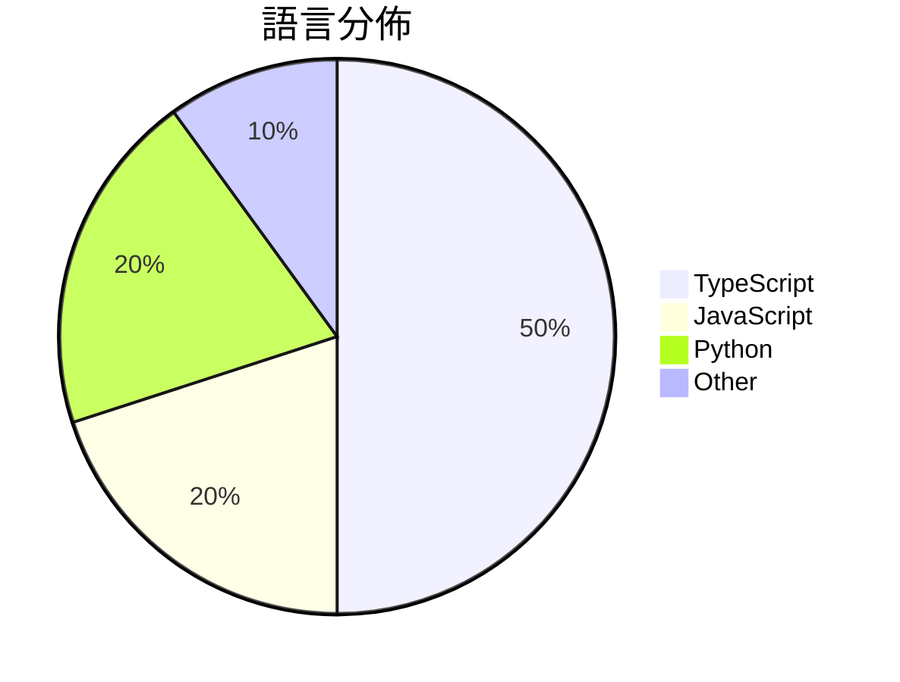

# GitHub Trending - 2026-03-17

> [!summary] 本日摘要
> 收錄 **10** 個新專案，合計 **33.0k** stars
> 語言分佈：TypeScript (5) · JavaScript (2) · Python (2) · Other (1)

> [!tip] 本週焦點
> **[[garrytan--gstack|garrytan/gstack]]** — 5 天內累積 17.3k stars（3.5k stars/天）
> 將 Claude Code 轉變為一個可隨時召喚的專家團隊，提供十種專業工作流程技能。



---

## 收錄列表

| # | 專案 | 分類 | Stars | 速度 | 安裝 | 語言 | 用途 |
| :--: | --- | --- | ---: | ---: | --- | --- | --- |
| 1 | [[garrytan--gstack\|garrytan/gstack]] | 開發工具 | 17.3k | 3.5k/天 | `medium` | TypeScript | 將 Claude Code 轉變為一個可隨時召喚的專家團隊，提供十種專業工作流程 |
| 2 | [[THU-MAIC--OpenMAIC\|THU-MAIC/OpenMAIC]] | 教育 | 2.0k | 398/天 | `medium` | TypeScript | 提供沉浸式多代理互動學習體驗，只需一鍵即可開始。 |
| 3 | [[davebcn87--pi-autoresearch\|davebcn87/pi-autoresearch]] | 開發工具 | 2.0k | 397/天 | `easy` | TypeScript | 自動化實驗循環，幫助開發者持續優化性能指標。 |
| 4 | [[TianyiDataScience--openclaw-control-center\|TianyiDataScience/openclaw-control-center]] | 開發工具 | 1.9k | 378/天 | `medium` | TypeScript | 將 OpenClaw 轉變為可見、可信任且可控制的本地控制中心。 |
| 5 | [[calesthio--Crucix\|calesthio/Crucix]] | 其他 | 1.9k | 944/天 | `medium` | JavaScript | 提供個人化的情報代理，從多個資料來源監控世界變化並即時通知你。 |
| 6 | [[pasky--chrome-cdp-skill\|pasky/chrome-cdp-skill]] | 開發工具 | 1.9k | 469/天 | `easy` | JavaScript | 讓你的 AI 代理人直接訪問當前的 Chrome 瀏覽會話，無需重啟或重新登入。 |
| 7 | [[wanshuiyin--Auto-claude-code-research-in-sleep\|wanshuiyin/Auto-claude-code-research-in-sleep]] | AI/ML | 1.7k | 280/天 | `medium` | Python | 讓 Claude Code 在你睡覺時自動進行研究，早上醒來就能看到評分、識別的 |
| 8 | [[gsd-build--gsd-2\|gsd-build/gsd-2]] | 開發工具 | 1.5k | 309/天 | `easy` | TypeScript | 讓代理能夠長時間自主工作而不失去全局視野的強大元提示、上下文工程和規範驅動開發系 |
| 9 | [[aiming-lab--AutoResearchClaw\|aiming-lab/AutoResearchClaw]] |  | 1.4k | 1.4k/天 |  | Python | Fully autonomous research from idea to p |
| 10 | [[novatic14--MANPADS-System-Launcher-and-Rocket\|novatic14/MANPADS-System-Launcher-and-Rocket]] | 其他 | 1.4k | 278/天 | `medium` | N/A | 提供一個低成本的火箭發射器和導引火箭系統的原型設計。 |

---

## 重點摘要

### 1. [[garrytan--gstack|garrytan/gstack]] `開發工具`

> 將 Claude Code 轉變為一個可隨時召喚的專家團隊，提供十種專業工作流程技能。

**17.3k** stars · **3.5k** stars/天 · TypeScript · `medium`

_建立 5 天內累積 17282 stars（3456/天），forks 1932（11.2%），顯示出強烈的社群興趣。Garry Tan 是知名的創業者，過去的經驗讓他能夠針對開發者的需求設計出這樣的工具。這個專案解決了開發過程中多任務處理的痛點，特別是在需要快速迭代和測試的環境中，這在過去的工具中並不常見。社群的討論和反饋，特別是針對安全性和維護性問題，進一步引發了對這個工具的關注。_

---

### 2. [[THU-MAIC--OpenMAIC|THU-MAIC/OpenMAIC]] `教育`

> 提供沉浸式多代理互動學習體驗，只需一鍵即可開始。

**2.0k** stars · **398** stars/天 · TypeScript · `medium`

_建立 5 天內累積 1990 stars（398/天），forks 259（13.0%），顯示出強勁的增長潛力。這個專案由清華大學的團隊開發，旨在解決傳統線上學習平台缺乏互動性和即時性問題。之前的解決方案多依賴靜態內容，無法提供即時的互動和反饋。隨著 AI 技術的進步，這種即時生成和互動的學習方式變得可行。forks/stars 比率為 13.0%，顯示出有不少使用者在實際修改和使用這個專案。_

---

### 3. [[davebcn87--pi-autoresearch|davebcn87/pi-autoresearch]] `開發工具`

> 自動化實驗循環，幫助開發者持續優化性能指標。

**2.0k** stars · **397** stars/天 · TypeScript · `easy`

_建立 5 天內累積 1986 stars（397/天），forks 98（4.9%），這顯示出強勁的增長潛力。作者 davebcn87 和其他貢獻者在開源社群中有一定的影響力，這個專案解決了開發者在性能優化過程中的繁瑣問題，提供了一個自動化的解決方案。這種自動化的實驗循環在現今快速迭代的開發環境中非常重要，特別是對於需要頻繁測試和優化的專案。社群的反饋和需求也促進了這個專案的快速成長。_

---

### 4. [[TianyiDataScience--openclaw-control-center|TianyiDataScience/openclaw-control-center]] `開發工具`

> 將 OpenClaw 轉變為可見、可信任且可控制的本地控制中心。

**1.9k** stars · **378** stars/天 · TypeScript · `medium`

_建立 5 天內累積 1892 stars（378/天），forks 262（13.8%），這顯示出強勁的增長潛力。這個專案的主要貢獻者是 TianyiDataScience 團隊，過去在開發開源工具方面有豐富經驗。它解決了 OpenClaw 用戶在監控和控制方面的痛點，特別是對非技術用戶的友好設計，這在現有工具中並不常見。社群的反饋和活躍的討論也促進了這個專案的快速發展。_

---

### 5. [[calesthio--Crucix|calesthio/Crucix]] `其他`

> 提供個人化的情報代理，從多個資料來源監控世界變化並即時通知你。

**1.9k** stars · **944** stars/天 · JavaScript · `medium`

_建立 2 天內累積 1888 stars（944/天），forks 234（12.4%），顯示出強烈的市場需求。作者 calesthio 及其團隊在開源社群中有一定的影響力，解決了用戶在多個數據來源中獲取即時情報的痛點。這個工具的出現正好符合了對於即時數據分析和情報收集的需求，尤其是在當前信息爆炸的時代。高達 12.4% 的 forks/stars 比率顯示出許多人正在實際修改和使用這個工具，而不是僅僅觀望。_

---

### 6. [[pasky--chrome-cdp-skill|pasky/chrome-cdp-skill]] `開發工具`

> 讓你的 AI 代理人直接訪問當前的 Chrome 瀏覽會話，無需重啟或重新登入。

**1.9k** stars · **469** stars/天 · JavaScript · `easy`

_建立 4 天內累積 1874 stars（469/天），forks 101（5.4%），顯示出穩定的增長潛力。作者 Pasky 是一位活躍的開發者，專注於開源工具的開發，這個專案解決了傳統自動化工具無法直接訪問現有瀏覽器會話的痛點，讓用戶能夠更靈活地進行網頁自動化。近期的推廣和社群討論可能也促進了這個專案的曝光率。這個工具的出現是因為現有的自動化工具在處理多標籤頁時的效率低下，這使得它在技術生態中具有獨特的價值。forks/stars 比率顯示出有一定比例的用戶在實際修改和使用這個工具，這表明它的實用性和需求。_

---

### 7. [[wanshuiyin--Auto-claude-code-research-in-sleep|wanshuiyin/Auto-claude-code-research-in-sleep]] `AI/ML`

> 讓 Claude Code 在你睡覺時自動進行研究，早上醒來就能看到評分、識別的弱點、執行的實驗和重寫的論文。

**1.7k** stars · **280** stars/天 · Python · `medium`

_建立 6 天就累積 1680 stars（280/天），forks 157（9.3%），顯示出強勁的增長潛力。作者 wanshuiyin 和團隊致力於解決自動化研究中的協作問題，之前的方案往往依賴單一模型，導致自我評審的盲點。這個專案的出現填補了這一空白，並且在社群中引起了關注。技術上，Codex MCP 的使用使得這個工具能夠靈活地與不同模型進行協作，這在過去是難以實現的。forks/stars 比率的高達 9.3% 顯示出許多開發者對這個工具的實際修改和使用，反映了其實用性和潛力。_

---

### 8. [[gsd-build--gsd-2|gsd-build/gsd-2]] `開發工具`

> 讓代理能夠長時間自主工作而不失去全局視野的強大元提示、上下文工程和規範驅動開發系統。

**1.5k** stars · **309** stars/天 · TypeScript · `easy`

_建立 5 天內累積 1545 stars（309/天），forks 132（8.5%），顯示出強勁的增長潛力。主要貢獻者包括 glittercowboy 和 jeremymcs，他們在開源社群中有著良好的聲譽。這個工具解決了過去版本中缺乏上下文控制和自動化的痛點，讓開發者能夠在不干預的情況下完成整個開發流程。社群對於自動化和上下文管理的需求日益增加，這使得 GSD 2 的出現恰逢其時。更重要的是，這個工具的設計讓開發者能夠專注於高層次的規劃，而不是繁瑣的細節，這在當前快速變化的開發環境中尤為重要。_

---

### 9. [[aiming-lab--AutoResearchClaw|aiming-lab/AutoResearchClaw]]

**1.4k** stars · **1.4k** stars/天 · Python

---

### 10. [[novatic14--MANPADS-System-Launcher-and-Rocket|novatic14/MANPADS-System-Launcher-and-Rocket]] `其他`

> 提供一個低成本的火箭發射器和導引火箭系統的原型設計。

**1.4k** stars · **278** stars/天 · N/A · `medium`

_建立 5 天就累積 1392 stars（278/天），forks 358（25.7%），這顯示出強烈的社群興趣。作者 novatic14 之前可能有其他相關專案，這次專案解決了低成本火箭發射系統的需求，這在教育和業餘火箭愛好者中是個未被充分開發的市場。社群對於開源硬體的興趣也促進了這個專案的快速成長。這個專案的設計和實作方式吸引了許多對火箭技術感興趣的開發者和愛好者，並且提供了完整的文檔和資源鏈接，讓使用者能夠輕鬆上手。_

---

## 今日到期複習

> [!tip] 根據間隔複習排程，今天該回顧的專案

```dataview
TABLE
  stars_per_day AS "Stars/天",
  category AS "分類",
  engagement AS "參與度"
FROM "Repos"
WHERE next_review AND date(next_review) <= date("2026-03-17") AND status != "archived"
SORT priority DESC
```

## 待處理

```dataviewjs
const pending = dv.pages('"Repos"').where(p => p.status === "to-review").length;
const unrated = dv.pages('"Repos"').where(p => p.status !== "archived" && p.status !== "to-review" && (p.my_rating || 0) === 0).length;
const noVerdict = dv.pages('"Repos"').where(p => p.status !== "archived" && (p.my_rating || 0) > 0 && (!p.verdict || p.verdict === "")).length;
const items = [];
if (pending > 0) items.push(`**${pending}** 個待分流`);
if (unrated > 0) items.push(`**${unrated}** 個已讀但未評分`);
if (noVerdict > 0) items.push(`**${noVerdict}** 個已評分但無結論`);
if (items.length > 0) dv.paragraph(items.join(" / "));
else dv.paragraph("所有專案都已處理完畢！");
```
