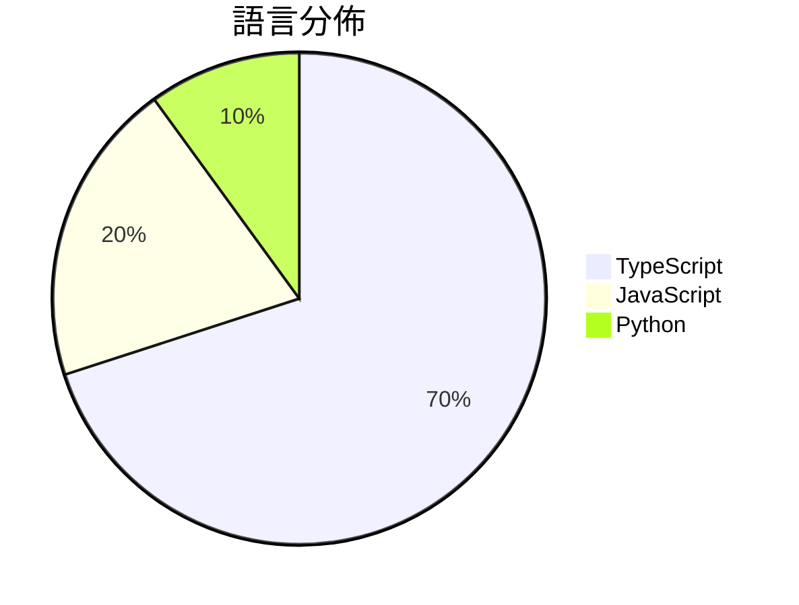

# GitHub Trending - 2026-03-18

> [!summary] 本日摘要
> 收錄 **10** 個新專案，合計 **47.2k** stars
> 語言分佈：TypeScript (7) · JavaScript (2) · Python (1)

> [!tip] 本週焦點
> **[[garrytan--gstack|garrytan/gstack]]** — 6 天內累積 20.7k stars（3.5k stars/天）
> 提供一套完整的 AI 工具，讓開發者能像 CEO 一樣管理整個工程流程。



---

## 收錄列表

| # | 專案 | 分類 | Stars | 速度 | 安裝 | 語言 | 用途 |
| :--: | --- | --- | ---: | ---: | --- | --- | --- |
| 1 | [[garrytan--gstack\|garrytan/gstack]] | 開發工具 | 20.7k | 3.5k/天 | `easy` | TypeScript | 提供一套完整的 AI 工具，讓開發者能像 CEO 一樣管理整個工程流程。 |
| 2 | [[THU-MAIC--OpenMAIC\|THU-MAIC/OpenMAIC]] | 教育 | 4.7k | 776/天 | `medium` | TypeScript | 提供一個沉浸式的多代理學習體驗，只需一鍵即可開始。 |
| 3 | [[NVIDIA--NemoClaw\|NVIDIA/NemoClaw]] | 開發工具 | 4.3k | 2.1k/天 | `easy` | TypeScript | 提供安全的 OpenClaw 安裝插件，讓使用者能在 NVIDIA 環境中運行  |
| 4 | [[aiming-lab--AutoResearchClaw\|aiming-lab/AutoResearchClaw]] |  | 4.2k | 2.1k/天 |  | Python | Fully autonomous & self-evolving researc |
| 5 | [[calesthio--Crucix\|calesthio/Crucix]] | 開發工具 | 3.1k | 1.0k/天 | `medium` | JavaScript | 將多個開放數據來源整合到一個個人智能代理中，實時監控變化並通知用戶。 |
| 6 | [[webadderall--Recordly\|webadderall/Recordly]] | 開發工具 | 2.4k | 470/天 | `medium` | TypeScript | 提供自動縮放、游標動畫等功能的免費開源螢幕錄影工具，替代 Screen Stud |
| 7 | [[davebcn87--pi-autoresearch\|davebcn87/pi-autoresearch]] | 開發工具 | 2.1k | 347/天 | `easy` | TypeScript | 自動化實驗循環，幫助開發者持續優化性能指標。 |
| 8 | [[pasky--chrome-cdp-skill\|pasky/chrome-cdp-skill]] | 開發工具 | 2.1k | 412/天 | `easy` | JavaScript | 讓 AI 代理存取你的即時 Chrome 瀏覽會話，無需重新登入或啟動新的瀏覽器 |
| 9 | [[TianyiDataScience--openclaw-control-center\|TianyiDataScience/openclaw-control-center]] | 開發工具 | 2.0k | 338/天 | `medium` | TypeScript | 將 OpenClaw 轉變為一個可見、可信任和可控制的本地控制中心。 |
| 10 | [[gsd-build--gsd-2\|gsd-build/gsd-2]] | 開發工具 | 1.8k | 292/天 | `easy` | TypeScript | 一個強大的元提示、上下文工程和規格驅動開發系統，讓代理能長時間自主工作而不失去全 |

---

## 重點摘要

### 1. [[garrytan--gstack|garrytan/gstack]] `開發工具`

> 提供一套完整的 AI 工具，讓開發者能像 CEO 一樣管理整個工程流程。

**20.7k** stars · **3.5k** stars/天 · TypeScript · `easy`

_建立 6 天就累積 20749 stars（3458/天），forks 2357（11.4%），這顯示出強大的增長潛力。Garry Tan 作為 Y Combinator 的 CEO，擁有豐富的創業經驗，這使得他的工具集能夠針對創業者的需求進行設計。gstack 解決了傳統開發流程中的繁瑣問題，讓開發者能夠在短時間內實現高效的代碼生產。近期的推廣和社群討論也引發了更多人的關注，特別是在 AI 工具日益普及的背景下。forks/stars 比率為 11.4%，顯示出許多開發者在積極修改和使用這個工具。_

---

### 2. [[THU-MAIC--OpenMAIC|THU-MAIC/OpenMAIC]] `教育`

> 提供一個沉浸式的多代理學習體驗，只需一鍵即可開始。

**4.7k** stars · **776** stars/天 · TypeScript · `medium`

_建立 6 天內累積 4657 stars（776/天），forks 604（13.0%），顯示出強勁的增長潛力。主要貢獻者來自清華大學，這個團隊在教育技術領域有豐富的經驗。OpenMAIC 解決了傳統教學工具難以提供互動和即時反饋的痛點，特別是在多代理學習的場景中。社群對於即時生成課程的需求促進了這個專案的快速發展。技術上，隨著 AI 和教育科技的進步，這個工具的可行性大幅提升。高達 13% 的 forks/stars 比率顯示出使用者對這個專案的實際修改和應用興趣。_

---

### 3. [[NVIDIA--NemoClaw|NVIDIA/NemoClaw]] `開發工具`

> 提供安全的 OpenClaw 安裝插件，讓使用者能在 NVIDIA 環境中運行 OpenClaw 助手。

**4.3k** stars · **2.1k** stars/天 · TypeScript · `easy`

_建立 2 天內累積 4282 stars（2141/天），forks 507（11.8%），顯示出強烈的社群興趣。NVIDIA 作為知名的 AI 硬體和軟體供應商，這個專案吸引了許多開發者的注意。NemoClaw 解決了在 NVIDIA 硬體上安全運行 OpenClaw 的需求，之前的解決方案往往缺乏安全性或易用性。社群的反饋和早期實驗的需求推動了這個專案的快速增長。NemoClaw 的設計使得在 NVIDIA 環境中運行 AI 助手變得更加簡單和安全，這在當前的技術生態中是非常重要的。forks/stars 比率為 11.8%，顯示出許多人在積極修改和使用這個工具。_

---

### 4. [[aiming-lab--AutoResearchClaw|aiming-lab/AutoResearchClaw]]

**4.2k** stars · **2.1k** stars/天 · Python

---

### 5. [[calesthio--Crucix|calesthio/Crucix]] `開發工具`

> 將多個開放數據來源整合到一個個人智能代理中，實時監控變化並通知用戶。

**3.1k** stars · **1.0k** stars/天 · JavaScript · `medium`

_建立 3 天內累積 3081 stars（1027/天），forks 386（12.5%），顯示出強勁的增長潛力。開發者 calesthio 及其團隊專注於開放數據的整合，解決了許多用戶在獲取和分析即時信息時的痛點，特別是在無法依賴傳統商業平台的情況下。該專案的成功可能與其在社群中的活躍討論和即時反饋有關，尤其是針對新功能的需求（如 Ollama Provider 支援）。此外，隨著開放數據的需求上升，Crucix 提供了一個無需雲端的解決方案，這在當前的技術生態中顯得尤為重要。_

---

### 6. [[webadderall--Recordly|webadderall/Recordly]] `開發工具`

> 提供自動縮放、游標動畫等功能的免費開源螢幕錄影工具，替代 Screen Studio。

**2.4k** stars · **470** stars/天 · TypeScript · `medium`

_建立 5 天內累積 2350 stars（470/天），forks 120（5.1%），顯示出穩定的增長趨勢。作者 Siddharth Vaddem 之前參與過 OpenScreen 專案，這次的 Recordly 提供了對於螢幕錄影工具的創新解決方案，特別是自動縮放和游標動畫等功能，這些在市場上是相對少見的。近期的推特討論和社群反饋也促進了其知名度的提升。隨著遠端工作和線上教學的普及，對於易於使用的錄影工具需求日益增長，Recordly 恰好滿足了這一需求。forks/stars 比率為 5.1%，顯示出對於這個工具的實際修改和使用需求。_

---

### 7. [[davebcn87--pi-autoresearch|davebcn87/pi-autoresearch]] `開發工具`

> 自動化實驗循環，幫助開發者持續優化性能指標。

**2.1k** stars · **347** stars/天 · TypeScript · `easy`

_建立 6 天內累積 2084 stars（347/天），forks 101（4.8%），顯示出相對穩定的興趣增長。專案的作者 davebcn87 及其團隊在開源社群中有一定的影響力，並且這個工具解決了開發者在性能優化過程中缺乏自動化支持的痛點。之前，開發者通常需要手動執行和記錄實驗，這樣不僅耗時，也容易出錯。這個工具的出現正好填補了這一空白，並且受到社群的積極反響。隨著開發者對性能優化的需求增加，這個工具的實用性和必要性也隨之提升。_

---

### 8. [[pasky--chrome-cdp-skill|pasky/chrome-cdp-skill]] `開發工具`

> 讓 AI 代理存取你的即時 Chrome 瀏覽會話，無需重新登入或啟動新的瀏覽器實例。

**2.1k** stars · **412** stars/天 · JavaScript · `easy`

_建立 5 天就累積 2062 stars（412/天），forks 107（5.2%），顯示出穩定的增長潛力。作者 pasky 以開源工具聞名，過去的專案也獲得了良好的反響。這個工具解決了傳統瀏覽器自動化工具的痛點，特別是需要頻繁重新登入和處理多個標籤的問題。最近的推廣活動和社群討論也可能促進了它的曝光率。由於 forks/stars 比率為 5.2%，顯示出有相當數量的使用者在實際修改和使用這個工具。_

---

### 9. [[TianyiDataScience--openclaw-control-center|TianyiDataScience/openclaw-control-center]] `開發工具`

> 將 OpenClaw 轉變為一個可見、可信任和可控制的本地控制中心。

**2.0k** stars · **338** stars/天 · TypeScript · `medium`

_建立 6 天內累積 2025 stars（338/天），forks 282（13.9%），這顯示出相對高的關注度。作者團隊由多位貢獻者組成，具備開發經驗，且專注於提升 OpenClaw 的可觀察性和操作性。這個工具解決了 OpenClaw 使用者在監控和管理上缺乏透明度的痛點，之前用戶只能依賴後端數據，無法直觀了解系統狀態。近期的推廣和社群討論可能進一步提升了其知名度。技術上，這個工具的設計使得它能夠在本地環境中安全運行，這在當前的開發生態中是非常重要的。forks/stars 比率為 13.9%，顯示出有相當比例的用戶在進行實際修改和使用。_

---

### 10. [[gsd-build--gsd-2|gsd-build/gsd-2]] `開發工具`

> 一個強大的元提示、上下文工程和規格驅動開發系統，讓代理能長時間自主工作而不失去全局視野。

**1.8k** stars · **292** stars/天 · TypeScript · `easy`

_建立 6 天內累積 1752 stars（292/天），forks 146（8.3%），顯示出強勁的增長潛力。這個專案的主要貢獻者來自於 GSD 的原始開發團隊，他們在開源社區中已有一定的知名度。GSD 2 解決了開發者在使用 LLM 進行自動化時面臨的上下文管理和自動化控制問題，這在以往的工具中並未得到充分解決。這一點吸引了大量開發者的注意，尤其是在自動化和高效開發的需求日益增加的背景下。社群的活躍度也反映在熱門問題上，例如對文檔網站的需求，顯示出使用者對於更好使用體驗的渴望。_

---

## 今日到期複習

> [!tip] 根據間隔複習排程，今天該回顧的專案

```dataview
TABLE
  stars_per_day AS "Stars/天",
  category AS "分類",
  engagement AS "參與度"
FROM "Repos"
WHERE next_review AND date(next_review) <= date("2026-03-18") AND status != "archived"
SORT priority DESC
```

## 待處理

```dataviewjs
const pending = dv.pages('"Repos"').where(p => p.status === "to-review").length;
const unrated = dv.pages('"Repos"').where(p => p.status !== "archived" && p.status !== "to-review" && (p.my_rating || 0) === 0).length;
const noVerdict = dv.pages('"Repos"').where(p => p.status !== "archived" && (p.my_rating || 0) > 0 && (!p.verdict || p.verdict === "")).length;
const items = [];
if (pending > 0) items.push(`**${pending}** 個待分流`);
if (unrated > 0) items.push(`**${unrated}** 個已讀但未評分`);
if (noVerdict > 0) items.push(`**${noVerdict}** 個已評分但無結論`);
if (items.length > 0) dv.paragraph(items.join(" / "));
else dv.paragraph("所有專案都已處理完畢！");
```
