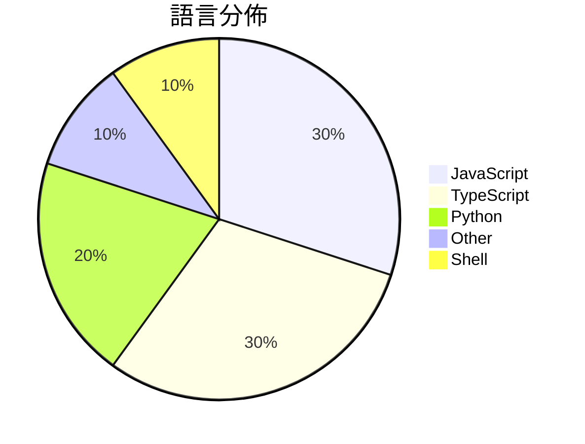

# GitHub Trending - 2026-03-19

> [!summary] 本日摘要
> 收錄 **10** 個新專案，合計 **31.9k** stars
> 語言分佈：JavaScript (3) · TypeScript (3) · Python (2) · Other (1) · Shell (1)

> [!tip] 本週焦點
> **[[NVIDIA--NemoClaw|NVIDIA/NemoClaw]]** — 3 天內累積 8.5k stars（2.8k stars/天）
> 提供安全的 OpenClaw 安裝方式，讓使用者能夠在 NVIDIA 的環境中運行自主代理。



---

## 收錄列表

| # | 專案 | 分類 | Stars | 速度 | 安裝 | 語言 | 用途 |
| :--: | --- | --- | ---: | ---: | --- | --- | --- |
| 1 | [[NVIDIA--NemoClaw\|NVIDIA/NemoClaw]] | 開發工具 | 8.5k | 2.8k/天 | `easy` | JavaScript | 提供安全的 OpenClaw 安裝方式，讓使用者能夠在 NVIDIA 的環境中運 |
| 2 | [[aiming-lab--AutoResearchClaw\|aiming-lab/AutoResearchClaw]] |  | 6.2k | 2.1k/天 |  | Python | Fully autonomous & self-evolving researc |
| 3 | [[calesthio--Crucix\|calesthio/Crucix]] | 開發工具 | 4.5k | 1.1k/天 | `easy` | JavaScript | 一個個人智能代理，從多個數據源監控世界，並在變化時通知你。 |
| 4 | [[webadderall--Recordly\|webadderall/Recordly]] | 開發工具 | 2.5k | 419/天 | `medium` | TypeScript | 提供自動縮放、游標動畫等功能的免費開源螢幕錄影替代方案。 |
| 5 | [[pasky--chrome-cdp-skill\|pasky/chrome-cdp-skill]] | 開發工具 | 2.2k | 368/天 | `easy` | JavaScript | 讓 AI 代理存取你的即時 Chrome 瀏覽會話，無需重新登入或啟動新瀏覽器實 |
| 6 | [[jackwener--opencli\|jackwener/opencli]] | CLI 工具 | 1.9k | 465/天 | `easy` | TypeScript | 將任何網站轉換為命令行介面，實現無縫的瀏覽器自動化和動態網頁數據提取。 |
| 7 | [[MoonshotAI--Attention-Residuals\|MoonshotAI/Attention-Residuals]] | AI/ML | 1.8k | 604/天 | `medium` | N/A | 提供一種新的殘差連接方法，改善 Transformer 模型的性能。 |
| 8 | [[Narcooo--inkos\|Narcooo/inkos]] | 開發工具 | 1.7k | 275/天 | `easy` | TypeScript | 讓 AI 自動寫小說，並透過人類審核確保品質。 |
| 9 | [[uditgoenka--autoresearch\|uditgoenka/autoresearch]] | 開發工具 | 1.4k | 277/天 | `easy` | Shell | 讓 Claude 自動化目標導向的迭代過程，實現持續改進。 |
| 10 | [[skernelx--tavily-key-generator\|skernelx/tavily-key-generator]] | 開發工具 | 1.3k | 327/天 | `medium` | Python | 自動化註冊 Tavily 和 Firecrawl 的 API 金鑰，並提供金鑰驗 |

---

## 重點摘要

### 1. [[NVIDIA--NemoClaw|NVIDIA/NemoClaw]] `開發工具`

> 提供安全的 OpenClaw 安裝方式，讓使用者能夠在 NVIDIA 的環境中運行自主代理。

**8.5k** stars · **2.8k** stars/天 · JavaScript · `easy`

_建立 3 天內累積 8457 stars（2819/天），forks 877（10.4%），顯示出強烈的社群興趣。這個專案由 NVIDIA 團隊開發，解決了在安全環境中運行 OpenClaw 的需求，特別是在自主代理的應用場景中。隨著對安全性和效率的需求增加，這個工具的出現正好填補了市場的空白。社群的反饋和需求驅動了這個專案的快速成長，尤其是在 GitHub 上的討論和 issue 反映了使用者的實際痛點。_

---

### 2. [[aiming-lab--AutoResearchClaw|aiming-lab/AutoResearchClaw]]

**6.2k** stars · **2.1k** stars/天 · Python

---

### 3. [[calesthio--Crucix|calesthio/Crucix]] `開發工具`

> 一個個人智能代理，從多個數據源監控世界，並在變化時通知你。

**4.5k** stars · **1.1k** stars/天 · JavaScript · `easy`

_建立 4 天內累積 4496 stars（1124/天），forks 618（13.7%），顯示出強烈的用戶興趣。開發者 calesthio 及其團隊專注於開源情報，解決了信息分散的問題，讓用戶能夠在一個平台上獲得多種數據。這個工具的推出正好滿足了對於即時信息的需求，尤其是在當前快速變化的世界中。社群的活躍度也顯示出用戶對於功能的期待，尤其是對於 LLM 提供者的支持需求。_

---

### 4. [[webadderall--Recordly|webadderall/Recordly]] `開發工具`

> 提供自動縮放、游標動畫等功能的免費開源螢幕錄影替代方案。

**2.5k** stars · **419** stars/天 · TypeScript · `medium`

_建立 6 天就累積 2511 stars（419/天），forks 135（5.4%），顯示出強勁的增長潛力。作者 Siddharth Vaddem 過去參與了 OpenScreen 專案，這為 Recordly 提供了堅實的基礎。Recordly 解決了市場上螢幕錄影工具缺乏自動化和動畫效果的痛點，特別是針對教學和產品演示的需求。近期的推廣和社群的支持也促進了其快速增長。技術上，Recordly 利用 Electron 和 PixiJS 的組合，實現了高效的錄製和編輯流程，這在現有工具中並不常見。_

---

### 5. [[pasky--chrome-cdp-skill|pasky/chrome-cdp-skill]] `開發工具`

> 讓 AI 代理存取你的即時 Chrome 瀏覽會話，無需重新登入或啟動新瀏覽器實例。

**2.2k** stars · **368** stars/天 · JavaScript · `easy`

_建立 6 天內累積 2207 stars（368/天），forks 119（5.4%），顯示出穩定的增長潛力。作者 Pasky 之前有多個開源專案經驗，這次專案解決了傳統瀏覽器自動化工具需要重新登入和啟動新實例的痛點。這個工具的出現正好滿足了開發者對於即時互動的需求，並且在社群中引起了討論。技術上，隨著 Chrome 的遠端除錯功能的普及，這個工具的可行性大幅提升。forks/stars 比率在 5.4% 屬於中等，顯示出有一定的使用者在進行實際修改。_

---

### 6. [[jackwener--opencli|jackwener/opencli]] `CLI 工具`

> 將任何網站轉換為命令行介面，實現無縫的瀏覽器自動化和動態網頁數據提取。

**1.9k** stars · **465** stars/天 · TypeScript · `easy`

_建立 4 天內累積 1858 stars（465/天），forks 172（9.3%），顯示出強勁的增長潛力。作者 jackwener 之前開發過多個 CLI 工具，這次的 OpenCLI 解決了用戶在多個網站上使用不同 CLI 工具的痛點，提供了一個統一的解決方案。近期的推文和社群討論也引發了關注，特別是對於自動化和數據提取的需求日益增加。這個工具的高 forks/stars 比率顯示出許多開發者正在積極修改和使用它，反映出其實用性和潛力。_

---

### 7. [[MoonshotAI--Attention-Residuals|MoonshotAI/Attention-Residuals]] `AI/ML`

> 提供一種新的殘差連接方法，改善 Transformer 模型的性能。

**1.8k** stars · **604** stars/天 · N/A · `medium`

_建立 3 天內累積 1811 stars（604/天），forks 84（4.6%），這顯示出強勁的增長潛力。該專案由經驗豐富的貢獻者團隊開發，解決了傳統殘差連接在深度學習中的一個重要問題，並且在多個基準測試中表現出色。這引起了社群的廣泛關注，特別是在 AI 和深度學習領域。最近的討論和需求（如在 Hugging Face 上釋出模型）也顯示出使用者對該技術的興趣和需求。_

---

### 8. [[Narcooo--inkos|Narcooo/inkos]] `開發工具`

> 讓 AI 自動寫小說，並透過人類審核確保品質。

**1.7k** stars · **275** stars/天 · TypeScript · `easy`

_建立 6 天內累積 1652 stars（275/天），forks 335（20.3%），顯示出強烈的社群參與。這個專案由 Narcooo 開發，他在 AI 和寫作工具方面有豐富的經驗。InkOS 解決了傳統小說創作過程中的多重挑戰，特別是在質量控制和創作效率方面，這在以往的工具中並不常見。近期的推廣和社群討論也促進了它的曝光度，特別是在 AI 寫作的熱潮中。這個工具的設計使得它能夠靈活應對不同的寫作需求和風格，並且能夠在多個平台上運行，進一步擴大了其適用範圍。_

---

### 9. [[uditgoenka--autoresearch|uditgoenka/autoresearch]] `開發工具`

> 讓 Claude 自動化目標導向的迭代過程，實現持續改進。

**1.4k** stars · **277** stars/天 · Shell · `easy`

_建立 5 天內累積 1386 stars（277/天），forks 108（7.8%），顯示出強烈的社群關注。作者 Udit Goenka 過去在 AI 領域的經驗和創新能力使得這個專案具備了良好的基礎。這個工具解決了傳統迭代過程中人力資源浪費的問題，通過自動化的方式讓使用者能夠專注於更高層次的策略思考。社群中對於自動化和效率提升的需求也為這個專案的流行提供了動力。_

---

### 10. [[skernelx--tavily-key-generator|skernelx/tavily-key-generator]] `開發工具`

> 自動化註冊 Tavily 和 Firecrawl 的 API 金鑰，並提供金鑰驗證和代理池管理功能。

**1.3k** stars · **327** stars/天 · Python · `medium`

_建立 4 天就累積 1307 stars（327/天），forks 815（62.4%），顯示出強烈的社群參與。作者 skernelx 在這個領域有豐富的經驗，之前也開發過多個相關工具，這使得這個專案能夠快速吸引關注。它解決了在註冊 API 金鑰時的繁瑣流程，特別是在需要大量金鑰的情況下，這在過去的解決方案中往往需要手動操作。近期的社群討論和需求推動了這個工具的快速成長，顯示出對於自動化金鑰管理的需求正在上升。forks/stars 比率高達 62.4%，顯示出許多開發者對此工具進行了實際修改和使用。_

---

## 今日到期複習

> [!tip] 根據間隔複習排程，今天該回顧的專案

```dataview
TABLE
  stars_per_day AS "Stars/天",
  category AS "分類",
  engagement AS "參與度"
FROM "Repos"
WHERE next_review AND date(next_review) <= date("2026-03-19") AND status != "archived"
SORT priority DESC
```

## 待處理

```dataviewjs
const pending = dv.pages('"Repos"').where(p => p.status === "to-review").length;
const unrated = dv.pages('"Repos"').where(p => p.status !== "archived" && p.status !== "to-review" && (p.my_rating || 0) === 0).length;
const noVerdict = dv.pages('"Repos"').where(p => p.status !== "archived" && (p.my_rating || 0) > 0 && (!p.verdict || p.verdict === "")).length;
const items = [];
if (pending > 0) items.push(`**${pending}** 個待分流`);
if (unrated > 0) items.push(`**${unrated}** 個已讀但未評分`);
if (noVerdict > 0) items.push(`**${noVerdict}** 個已評分但無結論`);
if (items.length > 0) dv.paragraph(items.join(" / "));
else dv.paragraph("所有專案都已處理完畢！");
```
