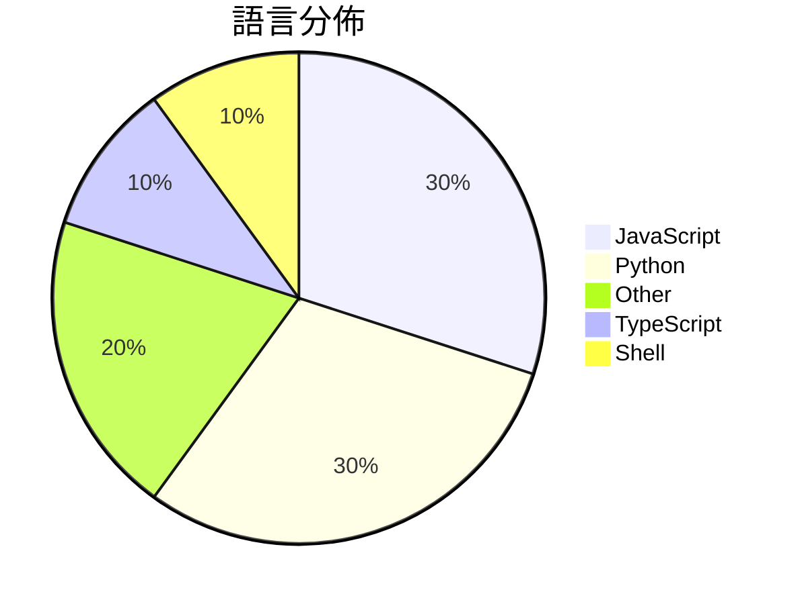

# GitHub Trending - 2026-03-20

> [!summary] 本日摘要
> 收錄 **10** 個新專案，合計 **37.4k** stars
> 語言分佈：JavaScript (3) · Python (3) · Other (2) · TypeScript (1) · Shell (1)

> [!tip] 本週焦點
> **[[NVIDIA--NemoClaw|NVIDIA/NemoClaw]]** — 4 天內累積 12.6k stars（3.2k stars/天）
> 簡化安全安裝 OpenClaw 的 NVIDIA 插件。



---

## 收錄列表

| # | 專案 | 分類 | Stars | 速度 | 安裝 | 語言 | 用途 |
| :--: | --- | --- | ---: | ---: | --- | --- | --- |
| 1 | [[NVIDIA--NemoClaw\|NVIDIA/NemoClaw]] | 基礎設施 | 12.6k | 3.2k/天 | `easy` | JavaScript | 簡化安全安裝 OpenClaw 的 NVIDIA 插件。 |
| 2 | [[aiming-lab--AutoResearchClaw\|aiming-lab/AutoResearchClaw]] | 其他 | 6.8k | 1.7k/天 | `medium` | Python | 從研究想法自動生成學術論文的全自動化研究工具。 |
| 3 | [[calesthio--Crucix\|calesthio/Crucix]] | AI/ML | 5.2k | 1.0k/天 | `easy` | JavaScript | 將多個開放數據源整合，實時監控世界動態並主動通知你變化。 |
| 4 | [[jackwener--opencli\|jackwener/opencli]] | CLI 工具 | 2.5k | 491/天 | `easy` | TypeScript | 將任何網站或 Electron 應用程式轉換為命令列介面，實現無縫的瀏覽器自動化 |
| 5 | [[pasky--chrome-cdp-skill\|pasky/chrome-cdp-skill]] | 開發工具 | 2.3k | 328/天 | `easy` | JavaScript | 讓你的 AI 代理訪問當前的 Chrome 瀏覽器會話，無需重新登入或啟動新的瀏 |
| 6 | [[MoonshotAI--Attention-Residuals\|MoonshotAI/Attention-Residuals]] |  | 2.0k | 503/天 |  | N/A |  |
| 7 | [[HKUDS--ClawTeam\|HKUDS/ClawTeam]] | 開發工具 | 1.7k | 844/天 | `easy` | Python | 讓 AI 代理自動組成團隊，協同完成複雜任務，實現全自動化。 |
| 8 | [[VoltAgent--awesome-codex-subagents\|VoltAgent/awesome-codex-subagents]] | 開發工具 | 1.5k | 755/天 | `easy` | N/A | 提供 130 多個專門的 Codex 子代理，涵蓋各種開發用例。 |
| 9 | [[uditgoenka--autoresearch\|uditgoenka/autoresearch]] | 開發工具 | 1.5k | 251/天 | `easy` | Shell | 讓 Claude 自動進行目標導向的迭代，實現持續改進。 |
| 10 | [[skernelx--tavily-key-generator\|skernelx/tavily-key-generator]] | 開發工具 | 1.3k | 266/天 | `easy` | Python | 自動化註冊 Tavily 和 Firecrawl 的 API 金鑰，並提供金鑰驗 |

---

## 重點摘要

### 1. [[NVIDIA--NemoClaw|NVIDIA/NemoClaw]] `基礎設施`

> 簡化安全安裝 OpenClaw 的 NVIDIA 插件。

**12.6k** stars · **3.2k** stars/天 · JavaScript · `easy`

_建立 4 天內累積 12647 stars（3162/天），forks 1208（9.6%），顯示出強烈的興趣。這個專案由 NVIDIA 開發，解決了在安全環境中運行 AI 助手的需求，特別是在 OpenClaw 這類開源模型的背景下。社群對於安全性和簡化安裝的需求促進了這個工具的受歡迎程度。技術上，NemoClaw 的設計使得它能夠在多種平台上運行，這也是其受歡迎的原因之一。_

---

### 2. [[aiming-lab--AutoResearchClaw|aiming-lab/AutoResearchClaw]] `其他`

> 從研究想法自動生成學術論文的全自動化研究工具。

**6.8k** stars · **1.7k** stars/天 · Python · `medium`

_建立 4 天就累積 6782 stars（1696/天），forks 698（10.3%），顯示出強勁的增長潛力。這個專案由一群活躍的開發者維護，解決了學術界對於自動化研究流程的需求，特別是在文獻檢索和實驗設計方面。之前的解決方案往往需要大量的手動干預，這使得研究效率低下。隨著 AI 技術的進步，這種全自動化的研究工具變得越來越可行，並且有助於提升學術研究的產出。社群的活躍度高，開放的測試邀請也促進了用戶的參與和反饋。_

---

### 3. [[calesthio--Crucix|calesthio/Crucix]] `AI/ML`

> 將多個開放數據源整合，實時監控世界動態並主動通知你變化。

**5.2k** stars · **1.0k** stars/天 · JavaScript · `easy`

_建立 5 天內累積 5178 stars（1036/天），forks 738（14.3%），顯示出強勁的增長潛力。作者 calesthio 及其團隊專注於開放數據和 OSINT 領域，這個工具解決了用戶在多個數據源中查找信息的繁瑣過程，提供了一個集中化的解決方案。近期的社群討論和需求（如 #30 和 #7）也顯示出用戶對於功能擴展的強烈興趣，這進一步推動了專案的關注度。這個工具的設計理念符合當前對於數據隱私和本地運算的需求，讓用戶能夠在不依賴雲端的情況下獲取信息。_

---

### 4. [[jackwener--opencli|jackwener/opencli]] `CLI 工具`

> 將任何網站或 Electron 應用程式轉換為命令列介面，實現無縫的瀏覽器自動化和動態網頁數據提取。

**2.5k** stars · **491** stars/天 · TypeScript · `easy`

_建立 5 天內累積 2453 stars（491/天），forks 221（9.0%），顯示出強勁的增長潛力。這個專案的作者 jackwener 過去在 CLI 工具方面有豐富的經驗，解決了傳統 CLI 工具在自動化和數據提取上的局限性，特別是針對多個網站的支持。社群中對於功能擴展的需求也促進了該專案的快速發展，尤其是對於人性化互動模式的需求。技術上，這個工具的設計利用了 Chrome 的會話重用，降低了使用門檻，讓使用者能夠快速上手。_

---

### 5. [[pasky--chrome-cdp-skill|pasky/chrome-cdp-skill]] `開發工具`

> 讓你的 AI 代理訪問當前的 Chrome 瀏覽器會話，無需重新登入或啟動新的瀏覽器實例。

**2.3k** stars · **328** stars/天 · JavaScript · `easy`

_建立 7 天內累積 2299 stars（328/天），forks 126（5.5%），顯示出穩定的增長。作者 Pasky 以開發多個開源工具而聞名，這個專案解決了傳統瀏覽器自動化工具的痛點，讓 AI 代理能夠直接訪問當前的瀏覽器會話，而不需要重新登入或啟動新的實例。這一點在社群中引起了廣泛的關注，特別是在需要快速測試和迭代的開發環境中。這個工具的設計簡單易用，並且支持多種瀏覽器，這使得它在不同的開發環境中都能夠快速上手。_

---

### 6. [[MoonshotAI--Attention-Residuals|MoonshotAI/Attention-Residuals]]

**2.0k** stars · **503** stars/天 · N/A

---

### 7. [[HKUDS--ClawTeam|HKUDS/ClawTeam]] `開發工具`

> 讓 AI 代理自動組成團隊，協同完成複雜任務，實現全自動化。

**1.7k** stars · **844** stars/天 · Python · `easy`

_建立 2 天就累積 1687 stars（844/天），forks 207（12.3%），顯示出強烈的社群關注。作者 HKUDS 團隊在 AI 和自動化領域有豐富的經驗，之前的項目如 OpenClaw 和 nanobot 都受到了廣泛使用。ClawTeam 解決了現有 AI 代理在協作上的痛點，讓多個代理能夠自動協同工作，這在複雜任務中是非常必要的。此專案的推出引發了社群的熱烈討論，尤其是在 AI 自動化的背景下，這使得 ClawTeam 的需求急劇上升。高達 12.3% 的 forks/stars 比率顯示出許多開發者對這個工具進行實際修改和使用，反映了其實用性和潛力。_

---

### 8. [[VoltAgent--awesome-codex-subagents|VoltAgent/awesome-codex-subagents]] `開發工具`

> 提供 130 多個專門的 Codex 子代理，涵蓋各種開發用例。

**1.5k** stars · **755** stars/天 · N/A · `easy`

_建立 2 天就累積 1509 stars（755/天），forks 126（8.3%），這顯示出強勁的增長勢頭。作者 necatiozmen 之前有其他相關專案，這使得他在這個領域有一定的影響力。這個專案解決了開發者在使用 Codex 時，缺乏專門化助手的痛點，讓開發者能夠更有效地進行特定任務。社群的反饋和需求推動了這個專案的快速成長，尤其是在開發者尋求更高效工具的背景下。forks/stars 比率為 8.3%，顯示出許多人在實際修改和使用這個專案。_

---

### 9. [[uditgoenka--autoresearch|uditgoenka/autoresearch]] `開發工具`

> 讓 Claude 自動進行目標導向的迭代，實現持續改進。

**1.5k** stars · **251** stars/天 · Shell · `easy`

_建立 6 天就累積 1504 stars（251/天），forks 113（7.5%），顯示出穩定的增長趨勢。作者 Udit Goenka 擁有豐富的 AI 產品經驗，之前的專案也涉及自動化和效率提升，這使得他對於如何解決開發者的痛點有深刻的理解。這個工具解決了在多變的開發環境中，如何有效進行持續改進的問題，特別是針對需要快速迭代的場景。社群的反應也顯示出對於這種自動化解決方案的需求，並且目前的開發活動頻繁，顯示出活躍的維護和更新。forks/stars 比率為 7.5%，代表有相當一部分使用者在實際修改和使用這個工具。_

---

### 10. [[skernelx--tavily-key-generator|skernelx/tavily-key-generator]] `開發工具`

> 自動化註冊 Tavily 和 Firecrawl 的 API 金鑰，並提供金鑰驗證及代理池功能。

**1.3k** stars · **266** stars/天 · Python · `easy`

_建立 5 天內累積 1331 stars（266/天），forks 820（61.6%），顯示出強烈的社群參與度。作者 skernelx 之前在自動化和代理服務方面有多個專案，這使得他能夠針對特定需求提供解決方案。這個工具解決了在多服務平台上註冊金鑰的繁瑣過程，之前的解決方案往往需要手動操作，效率低下。最近的推廣活動和社群討論也可能促進了這個專案的曝光。高比例的 forks 表明許多開發者在積極修改和使用這個工具，顯示出其實用性和靈活性。_

---

## 今日到期複習

> [!tip] 根據間隔複習排程，今天該回顧的專案

```dataview
TABLE
  stars_per_day AS "Stars/天",
  category AS "分類",
  engagement AS "參與度"
FROM "Repos"
WHERE next_review AND date(next_review) <= date("2026-03-20") AND status != "archived"
SORT priority DESC
```

## 待處理

```dataviewjs
const pending = dv.pages('"Repos"').where(p => p.status === "to-review").length;
const unrated = dv.pages('"Repos"').where(p => p.status !== "archived" && p.status !== "to-review" && (p.my_rating || 0) === 0).length;
const noVerdict = dv.pages('"Repos"').where(p => p.status !== "archived" && (p.my_rating || 0) > 0 && (!p.verdict || p.verdict === "")).length;
const items = [];
if (pending > 0) items.push(`**${pending}** 個待分流`);
if (unrated > 0) items.push(`**${unrated}** 個已讀但未評分`);
if (noVerdict > 0) items.push(`**${noVerdict}** 個已評分但無結論`);
if (items.length > 0) dv.paragraph(items.join(" / "));
else dv.paragraph("所有專案都已處理完畢！");
```
