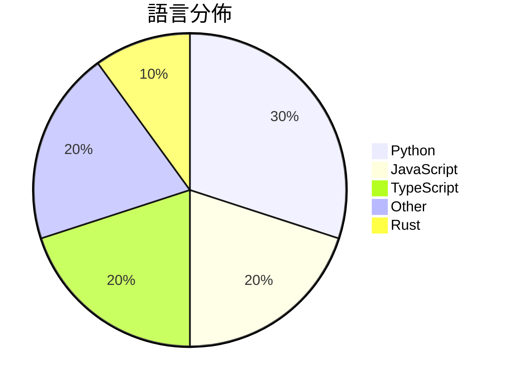

# GitHub Trending - 2026-03-21

> [!summary] 本日摘要
> 收錄 **10** 個新專案，合計 **40.6k** stars
> 語言分佈：Python (3) · JavaScript (2) · TypeScript (2) · Other (2) · Rust (1)

> [!tip] 本週焦點
> **[[NVIDIA--NemoClaw|NVIDIA/NemoClaw]]** — 5 天內累積 14.3k stars（2.9k stars/天）
> 在 NVIDIA OpenShell 中安全運行 OpenClaw，並進行管理推理。



---

## 收錄列表

| # | 專案 | 分類 | Stars | 速度 | 安裝 | 語言 | 用途 |
| :--: | --- | --- | ---: | ---: | --- | --- | --- |
| 1 | [[NVIDIA--NemoClaw\|NVIDIA/NemoClaw]] | AI/ML | 14.3k | 2.9k/天 | `medium` | JavaScript | 在 NVIDIA OpenShell 中安全運行 OpenClaw，並進行管理推 |
| 2 | [[aiming-lab--AutoResearchClaw\|aiming-lab/AutoResearchClaw]] |  | 7.1k | 1.4k/天 |  | Python | Fully autonomous & self-evolving researc |
| 3 | [[calesthio--Crucix\|calesthio/Crucix]] | AI/ML | 5.7k | 957/天 | `medium` | JavaScript | 提供個人化的智能代理，監控多個數據來源並在變更時通知你。 |
| 4 | [[jackwener--opencli\|jackwener/opencli]] | CLI 工具 | 3.1k | 517/天 | `easy` | TypeScript | 將任何網站或工具轉換為 CLI，讓 AI 代理無縫發現和執行工具。 |
| 5 | [[MoonshotAI--Attention-Residuals\|MoonshotAI/Attention-Residuals]] | AI/ML | 2.2k | 449/天 | `medium` | N/A | 提供一種改進的殘差連接，讓 Transformer 模型能夠選擇性地聚合早期層的 |
| 6 | [[HKUDS--ClawTeam\|HKUDS/ClawTeam]] | 開發工具 | 2.1k | 697/天 | `easy` | Python | 讓 AI 代理自動協作，實現全自動化任務管理。 |
| 7 | [[VoltAgent--awesome-codex-subagents\|VoltAgent/awesome-codex-subagents]] | 開發工具 | 1.8k | 614/天 | `medium` | N/A | 提供超過 130 種專門的 Codex 子代理，涵蓋各種開發用例。 |
| 8 | [[zerobootdev--zeroboot\|zerobootdev/zeroboot]] |  | 1.4k | 283/天 |  | Rust | Sub-millisecond VM sandboxes for AI agen |
| 9 | [[Lum1104--Understand-Anything\|Lum1104/Understand-Anything]] | 開發工具 | 1.4k | 278/天 | `easy` | TypeScript | 將任何代碼庫轉換為可互動的知識圖譜，讓你能夠探索、搜索和提問。 |
| 10 | [[skernelx--tavily-key-generator\|skernelx/tavily-key-generator]] | 開發工具 | 1.3k | 223/天 | `medium` | Python | 自動化註冊 Tavily 和 Firecrawl 的 API 金鑰，並進行金鑰驗 |

---

## 重點摘要

### 1. [[NVIDIA--NemoClaw|NVIDIA/NemoClaw]] `AI/ML`

> 在 NVIDIA OpenShell 中安全運行 OpenClaw，並進行管理推理。

**14.3k** stars · **2.9k** stars/天 · JavaScript · `medium`

_建立 5 天內累積 14333 stars（2867/天），forks 1380（9.6%），這顯示出強烈的興趣和需求。作者團隊來自 NVIDIA，擁有豐富的 AI 和雲端技術背景。NemoClaw 解決了在開發和運行 AI 助手時的安全性問題，特別是在多用戶環境中。這個工具的推出正值對安全和隱私日益重視的時期，並且在社群中引發了廣泛的討論和反饋。高 forks/stars 比率顯示許多人正在積極修改和使用這個工具，而不是僅僅觀望。_

---

### 2. [[aiming-lab--AutoResearchClaw|aiming-lab/AutoResearchClaw]]

**7.1k** stars · **1.4k** stars/天 · Python

---

### 3. [[calesthio--Crucix|calesthio/Crucix]] `AI/ML`

> 提供個人化的智能代理，監控多個數據來源並在變更時通知你。

**5.7k** stars · **957** stars/天 · JavaScript · `medium`

_建立 6 天內累積 5741 stars（957/天），forks 852（14.8%），顯示出強勁的增長趨勢。這個專案的作者 calesthio 之前有過其他開源項目的經驗，這使得他能夠有效地解決信息過載的問題，將分散的開源情報整合到一個平台上。這種整合在過去往往需要多個工具和手動操作，Crucix 則通過自動化和即時更新來提升效率。社群的反應也很積極，特別是在 Telegram 和 Discord 的即時警報功能上，這使得使用者能夠隨時掌握最新動態。_

---

### 4. [[jackwener--opencli|jackwener/opencli]] `CLI 工具`

> 將任何網站或工具轉換為 CLI，讓 AI 代理無縫發現和執行工具。

**3.1k** stars · **517** stars/天 · TypeScript · `easy`

_建立 6 天就累積 3102 stars（517/天），forks 277（8.9%），這顯示出相對較高的活躍度。作者 jackwener 在開源社群中已有多個相關專案，這使得他在這個領域有一定的影響力。OpenCLI 解決了將多個 CLI 工具統一到一個介面中的痛點，之前的解決方案往往需要手動配置和管理多個工具，效率低下。這個專案的推出正好滿足了對於簡化工具使用的需求，並且在社交媒體上獲得了一定的關注，進一步推動了其流行。forks/stars 比率為 8.9%，顯示出有相當一部分用戶在進行實際的修改和使用。_

---

### 5. [[MoonshotAI--Attention-Residuals|MoonshotAI/Attention-Residuals]] `AI/ML`

> 提供一種改進的殘差連接，讓 Transformer 模型能夠選擇性地聚合早期層的表示。

**2.2k** stars · **449** stars/天 · N/A · `medium`

_建立 5 天內累積 2247 stars（449/天），forks 98（4.4%），顯示出強勁的增長潛力。這個專案由一組活躍的貢獻者維護，主要針對 Transformer 模型的殘差連接進行改進，解決了以往方法在層數增加時的性能衰退問題。社群對於實現程式碼的需求高漲，顯示出對這個技術的興趣和需求。這個工具的出現正好填補了現有模型在深度學習中的一個重要空白，特別是在處理大型模型時的記憶體效率問題。_

---

### 6. [[HKUDS--ClawTeam|HKUDS/ClawTeam]] `開發工具`

> 讓 AI 代理自動協作，實現全自動化任務管理。

**2.1k** stars · **697** stars/天 · Python · `easy`

_建立 3 天內累積 2091 stars（697/天），forks 260（12.4%），顯示出強勁的增長潛力。作者 HKUDS 團隊擁有多位活躍的貢獻者，且專案針對現有 AI 代理的協作問題提供了創新的解決方案，過去的解決方案往往需要繁瑣的手動協調。這個專案的出現恰好填補了這一空白，並且在社群中引起了廣泛的討論和興趣。特別是其支持多種 CLI 代理的特性，使得它在多樣化的開發環境中具備了良好的適應性。_

---

### 7. [[VoltAgent--awesome-codex-subagents|VoltAgent/awesome-codex-subagents]] `開發工具`

> 提供超過 130 種專門的 Codex 子代理，涵蓋各種開發用例。

**1.8k** stars · **614** stars/天 · N/A · `medium`

_建立 3 天內累積 1841 stars（614/天），forks 150（8.1%），顯示出強勁的增長潛力。主要貢獻者 necatiozmen 和 haoxianhan 在開源社群中有一定的影響力，這個專案解決了開發者在特定任務上缺乏專業化工具的痛點。之前開發者多依賴通用的 AI 工具，但這些工具往往無法針對特定的開發需求提供深度支持。隨著 Codex 的普及，對於專門化子代理的需求也隨之上升，這使得這個專案的出現恰逢其時。forks/stars 比率 8.1% 表示有相當比例的使用者對此專案進行了實際修改，顯示出其在實際應用中的潛力。_

---

### 8. [[zerobootdev--zeroboot|zerobootdev/zeroboot]]

**1.4k** stars · **283** stars/天 · Rust

---

### 9. [[Lum1104--Understand-Anything|Lum1104/Understand-Anything]] `開發工具`

> 將任何代碼庫轉換為可互動的知識圖譜，讓你能夠探索、搜索和提問。

**1.4k** stars · **278** stars/天 · TypeScript · `easy`

_建立 5 天內累積 1388 stars（278/天），forks 121（8.7%），顯示出相對穩定的增長。作者 Lum1104 及其團隊在開源社區中活躍，過去有多個成功的項目。這個工具解決了代碼理解的痛點，特別是在大型項目中，傳統的文檔往往過時且難以維護。社群對於這個工具的反饋熱烈，尤其是對於其互動式儀表板的設計。技術上，結合 LLM 和靜態分析的方式讓這個工具在代碼探索上具有獨特的優勢，尤其是對於新手開發者來說。forks/stars 比率為 8.7%，顯示出許多使用者對於這個工具的實際修改和使用，反映出其實用性。_

---

### 10. [[skernelx--tavily-key-generator|skernelx/tavily-key-generator]] `開發工具`

> 自動化註冊 Tavily 和 Firecrawl 的 API 金鑰，並進行金鑰驗證及代理池管理。

**1.3k** stars · **223** stars/天 · Python · `medium`

_建立 6 天內累積 1340 stars（223/天），forks 823（61.4%），顯示出強烈的社群興趣。作者 skernelx 之前有多個相關專案，這次專案解決了註冊和驗證 API 金鑰的痛點，特別是在多服務環境下的自動化需求。社群對於自動化註冊的需求日益增加，這使得此工具的出現恰逢其時。高比例的 forks 表示許多人正在實際修改和使用這個工具，顯示出其實用性和需求。_

---

## 今日到期複習

> [!tip] 根據間隔複習排程，今天該回顧的專案

```dataview
TABLE
  stars_per_day AS "Stars/天",
  category AS "分類",
  engagement AS "參與度"
FROM "Repos"
WHERE next_review AND date(next_review) <= date("2026-03-21") AND status != "archived"
SORT priority DESC
```

## 待處理

```dataviewjs
const pending = dv.pages('"Repos"').where(p => p.status === "to-review").length;
const unrated = dv.pages('"Repos"').where(p => p.status !== "archived" && p.status !== "to-review" && (p.my_rating || 0) === 0).length;
const noVerdict = dv.pages('"Repos"').where(p => p.status !== "archived" && (p.my_rating || 0) > 0 && (!p.verdict || p.verdict === "")).length;
const items = [];
if (pending > 0) items.push(`**${pending}** 個待分流`);
if (unrated > 0) items.push(`**${unrated}** 個已讀但未評分`);
if (noVerdict > 0) items.push(`**${noVerdict}** 個已評分但無結論`);
if (items.length > 0) dv.paragraph(items.join(" / "));
else dv.paragraph("所有專案都已處理完畢！");
```
