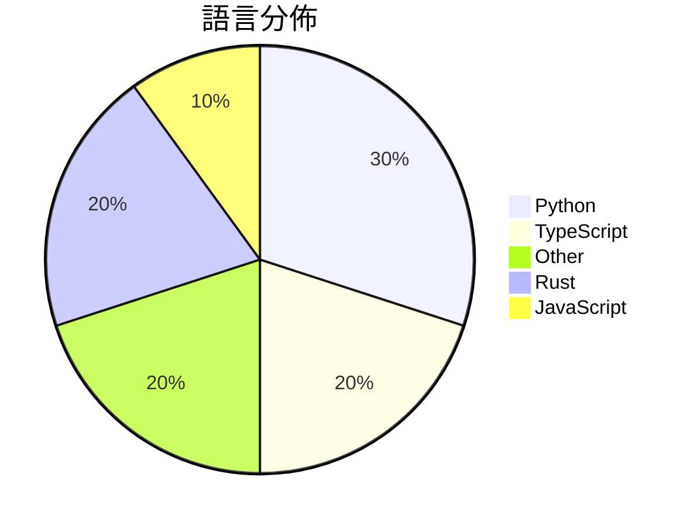

# GitHub Trending - 2026-03-22

> [!summary] 本日摘要
> 收錄 **10** 個新專案，合計 **37.0k** stars
> 語言分佈：Python (3) · TypeScript (2) · Other (2) · Rust (2) · JavaScript (1)

> [!tip] 本週焦點
> **[[NVIDIA--NemoClaw|NVIDIA/NemoClaw]]** — 6 天內累積 14.9k stars（2.5k stars/天）
> 在 NVIDIA OpenShell 中更安全地運行 OpenClaw，實現管理推理。



---

## 收錄列表

| # | 專案 | 分類 | Stars | 速度 | 安裝 | 語言 | 用途 |
| :--: | --- | --- | ---: | ---: | --- | --- | --- |
| 1 | [[NVIDIA--NemoClaw\|NVIDIA/NemoClaw]] | AI/ML | 14.9k | 2.5k/天 | `easy` | JavaScript | 在 NVIDIA OpenShell 中更安全地運行 OpenClaw，實現管理 |
| 2 | [[aiming-lab--AutoResearchClaw\|aiming-lab/AutoResearchClaw]] | AI/ML | 7.4k | 1.2k/天 | `medium` | Python | 讓研究從想法到論文全自動進行，無需人為干預。 |
| 3 | [[Lum1104--Understand-Anything\|Lum1104/Understand-Anything]] | 開發工具 | 2.6k | 433/天 | `easy` | TypeScript | 將任何代碼庫轉換為可互動的知識圖譜，讓你可以探索、搜尋並提問。 |
| 4 | [[HKUDS--ClawTeam\|HKUDS/ClawTeam]] | 開發工具 | 2.5k | 620/天 | `easy` | Python | 讓 AI 代理自動協作，實現全自動化任務管理。 |
| 5 | [[MoonshotAI--Attention-Residuals\|MoonshotAI/Attention-Residuals]] | AI/ML | 2.4k | 403/天 | `medium` | N/A | 提供一種新的殘差連接方法，改善 Transformer 模型的性能和穩定性。 |
| 6 | [[VoltAgent--awesome-codex-subagents\|VoltAgent/awesome-codex-subagents]] | 開發工具 | 2.0k | 495/天 | `medium` | N/A | 提供超過 130 種專業的 Codex 子代理，涵蓋各種開發用例。 |
| 7 | [[zerobootdev--zeroboot\|zerobootdev/zeroboot]] | 基礎設施 | 1.7k | 281/天 | `medium` | Rust | 提供亞毫秒級的虛擬機沙盒，專為 AI 代理設計，透過寫時複製技術實現。 |
| 8 | [[cnlimiter--codex-manager\|cnlimiter/codex-manager]] | 開發工具 | 1.3k | 224/天 | `medium` | Python | 管理 OpenAI 帳號的 Web UI 系統，支持多種郵箱服務和批量註冊。 |
| 9 | [[Infatoshi--OpenSquirrel\|Infatoshi/OpenSquirrel]] | 開發工具 | 1.2k | 206/天 | `medium` | Rust | 為多個 AI 編碼代理提供原生的 Rust/GPUI 控制平面，讓你能夠並行運行 |
| 10 | [[lcoutodemos--clui-cc\|lcoutodemos/clui-cc]] | 開發工具 | 968 | 161/天 | `medium` | TypeScript | 為 Claude Code 提供的命令行用戶界面，讓使用者能夠以視覺化方式操作。 |

---

## 重點摘要

### 1. [[NVIDIA--NemoClaw|NVIDIA/NemoClaw]] `AI/ML`

> 在 NVIDIA OpenShell 中更安全地運行 OpenClaw，實現管理推理。

**14.9k** stars · **2.5k** stars/天 · JavaScript · `easy`

_建立 6 天就累積 14882 stars（2480/天），forks 1483（10.0%），顯示出極高的關注度。作者團隊來自 NVIDIA，過去在 AI 和容器化技術上有豐富經驗。NemoClaw 解決了在不安全環境中運行 AI 代理的痛點，之前的方案往往缺乏足夠的安全措施。社群的反饋和討論也促進了這個專案的快速發展。技術生態的變化，如容器化技術的普及，使得這個工具的可行性大大提高。forks/stars 比率為 10% 表示許多人正在實際修改和使用這個工具，而不是僅僅觀望。_

---

### 2. [[aiming-lab--AutoResearchClaw|aiming-lab/AutoResearchClaw]] `AI/ML`

> 讓研究從想法到論文全自動進行，無需人為干預。

**7.4k** stars · **1.2k** stars/天 · Python · `medium`

_建立 6 天就累積 7381 stars（1230/天），forks 774（10.5%），顯示出強烈的社群興趣。這個專案由一群活躍的開發者維護，解決了傳統研究流程中人力成本高、效率低的痛點。之前的工具多數需要大量手動干預，而 AutoResearchClaw 則能自動化整個過程，讓研究者專注於創新而非繁瑣的文書工作。社群的活躍度也反映在其高效的問題解決率（92%），顯示出開發者對用戶反饋的重視。_

---

### 3. [[Lum1104--Understand-Anything|Lum1104/Understand-Anything]] `開發工具`

> 將任何代碼庫轉換為可互動的知識圖譜，讓你可以探索、搜尋並提問。

**2.6k** stars · **433** stars/天 · TypeScript · `easy`

_建立 6 天內累積 2600 stars（433/天），forks 249（9.6%），這顯示出相當高的使用者興趣。作者 Lum1104 及其團隊在開源社群中活躍，過去有多個成功的專案。這個工具解決了代碼理解的痛點，特別是在大型代碼庫中，傳統文檔往往過時且不完整。社群中對於代碼理解工具的需求日益增加，特別是在快速變化的開發環境中。技術上，這個工具的多代理架構和即時查詢功能使其在同類工具中脫穎而出，並且其支持多平台的特性也吸引了廣泛的使用者群體。forks/stars 比率為 9.6%，顯示出許多開發者在實際修改或使用這個工具。_

---

### 4. [[HKUDS--ClawTeam|HKUDS/ClawTeam]] `開發工具`

> 讓 AI 代理自動協作，實現全自動化任務管理。

**2.5k** stars · **620** stars/天 · Python · `easy`

_建立 4 天就累積 2479 stars（620/天），forks 311（12.5%），顯示出強烈的興趣。這個專案的主要貢獻者有多位活躍的開發者，且其功能解決了當前 AI 代理在複雜任務中協作不佳的問題，讓用戶能夠更輕鬆地管理多個代理。近期的推廣和展示可能也促進了其曝光率，吸引了開發者的注意。這個工具的設計理念是讓 AI 代理能夠自我組織並協作，這在當前的 AI 生態中是相對新穎的，尤其是在自動化和高效能計算的需求日益增加的背景下。_

---

### 5. [[MoonshotAI--Attention-Residuals|MoonshotAI/Attention-Residuals]] `AI/ML`

> 提供一種新的殘差連接方法，改善 Transformer 模型的性能和穩定性。

**2.4k** stars · **403** stars/天 · N/A · `medium`

_建立 6 天就累積 2419 stars（403/天），forks 107（4.4%），顯示出不錯的關注度。主要貢獻者包括 yzhangcs 和 Nathancgy，他們在深度學習領域有豐富的經驗。這個專案解決了傳統殘差連接在深度模型中導致的性能下降問題，提供了更靈活的聚合方式。近期的討論和需求顯示出社群對於這種新方法的興趣，特別是在實現代碼和應用場景方面。技術上，這個方法的可行性得益於深度學習框架的進步，特別是 PyTorch 的靈活性使得這種新型的注意力機制能夠被有效實現。_

---

### 6. [[VoltAgent--awesome-codex-subagents|VoltAgent/awesome-codex-subagents]] `開發工具`

> 提供超過 130 種專業的 Codex 子代理，涵蓋各種開發用例。

**2.0k** stars · **495** stars/天 · N/A · `medium`

_建立 4 天就累積 1981 stars（495/天），forks 162（8.2%），這顯示出相對穩定的增長。作者 necatiozmen 和 haoxianhan 之前在 AI 代理和開發工具方面有豐富的經驗，這使得他們能夠針對開發者的需求設計出這樣的工具。這個專案解決了開發者在面對多樣化任務時，缺乏專業化助手的痛點，之前的解決方案往往無法針對特定任務提供足夠的支持。隨著 AI 技術的進步，這種專業化的子代理設計變得越來越可行。forks/stars 比率為 8.2%，顯示出不少用戶在實際修改和使用這個工具，這是一個良好的社群參與信號。_

---

### 7. [[zerobootdev--zeroboot|zerobootdev/zeroboot]] `基礎設施`

> 提供亞毫秒級的虛擬機沙盒，專為 AI 代理設計，透過寫時複製技術實現。

**1.7k** stars · **281** stars/天 · Rust · `medium`

_建立 6 天內累積 1684 stars（281/天），forks 76（4.5%），這顯示出穩定的增長潛力。作者 adammiribyan 在虛擬化和 AI 領域有豐富經驗，這個專案解決了傳統虛擬化工具啟動延遲過高的痛點，讓開發者能夠快速運行 AI 代碼。近期的推廣和社群討論也可能促進了其關注度。隨著 AI 應用需求的增加，對於快速且高效的虛擬化解決方案的需求也在上升，這使得 Zeroboot 的出現正好契合市場需求。_

---

### 8. [[cnlimiter--codex-manager|cnlimiter/codex-manager]] `開發工具`

> 管理 OpenAI 帳號的 Web UI 系統，支持多種郵箱服務和批量註冊。

**1.3k** stars · **224** stars/天 · Python · `medium`

_建立 6 天就累積 1346 stars（224/天），forks 574（42.6%），這顯示出強烈的社群參與。作者 cnlimiter 和其他貢獻者在開源社區有一定的影響力，之前可能有過相關的開發經驗。這個工具解決了批量註冊 OpenAI 帳號的痛點，之前用戶通常需要手動註冊，效率低下。最近的推廣活動和社群討論可能也促進了其快速增長。高 forks/stars 比率顯示出許多人在實際修改和使用這個工具，反映出其實用性和需求。_

---

### 9. [[Infatoshi--OpenSquirrel|Infatoshi/OpenSquirrel]] `開發工具`

> 為多個 AI 編碼代理提供原生的 Rust/GPUI 控制平面，讓你能夠並行運行多個代理。

**1.2k** stars · **206** stars/天 · Rust · `medium`

_建立 6 天內累積 1235 stars（206/天），forks 74（6.0%），這顯示出相對穩定的關注度。作者 Infatoshi 在開源社群中有一定的影響力，並且這個專案解決了多代理管理的痛點，特別是在需要同時運行多個 AI 編碼代理的情境下。之前的解決方案往往無法有效管理多個代理的狀態和輸出，OpenSquirrel 的設計正好填補了這一空白。社群的反饋也顯示出對於其功能的需求，尤其是持久會話和自動代理委派的特性。這些功能在當前的 AI 開發環境中是非常重要的，特別是在處理複雜任務時。_

---

### 10. [[lcoutodemos--clui-cc|lcoutodemos/clui-cc]] `開發工具`

> 為 Claude Code 提供的命令行用戶界面，讓使用者能夠以視覺化方式操作。

**968** stars · **161** stars/天 · TypeScript · `medium`

_建立 6 天就累積 968 stars（161/天），forks 129（13.3%），顯示出不錯的增長潛力。作者 lcoutodemos 是一位活躍的開發者，專注於提升 Claude Code 的使用體驗。這個工具解決了使用 CLI 時缺乏可視化操作的痛點，讓開發者能夠更有效地管理會話和工具調用。社群對於這個工具的反應熱烈，特別是對於其多標籤和權限審核的功能。技術上，Clui CC 利用 Electron 和 React 框架，這使得它能夠在 macOS 上提供流暢的使用體驗。_

---

## 今日到期複習

> [!tip] 根據間隔複習排程，今天該回顧的專案

```dataview
TABLE
  stars_per_day AS "Stars/天",
  category AS "分類",
  engagement AS "參與度"
FROM "Repos"
WHERE next_review AND date(next_review) <= date("2026-03-22") AND status != "archived"
SORT priority DESC
```

## 待處理

```dataviewjs
const pending = dv.pages('"Repos"').where(p => p.status === "to-review").length;
const unrated = dv.pages('"Repos"').where(p => p.status !== "archived" && p.status !== "to-review" && (p.my_rating || 0) === 0).length;
const noVerdict = dv.pages('"Repos"').where(p => p.status !== "archived" && (p.my_rating || 0) > 0 && (!p.verdict || p.verdict === "")).length;
const items = [];
if (pending > 0) items.push(`**${pending}** 個待分流`);
if (unrated > 0) items.push(`**${unrated}** 個已讀但未評分`);
if (noVerdict > 0) items.push(`**${noVerdict}** 個已評分但無結論`);
if (items.length > 0) dv.paragraph(items.join(" / "));
else dv.paragraph("所有專案都已處理完畢！");
```
