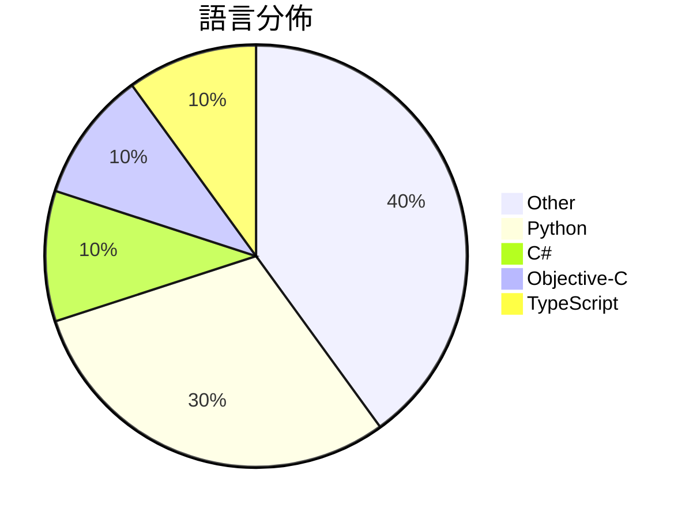

# GitHub Trending - 2026-03-23

> [!summary] 本日摘要
> 收錄 **10** 個新專案，合計 **13.6k** stars
> 語言分佈：Other (4) · Python (3) · C# (1) · Objective-C (1) · TypeScript (1)

> [!tip] 本週焦點
> **[[HKUDS--ClawTeam|HKUDS/ClawTeam]]** — 5 天內累積 2.9k stars（570 stars/天）
> 讓 AI 代理自動協作，實現全自動化任務執行。



---

## 收錄列表

| # | 專案 | 分類 | Stars | 速度 | 安裝 | 語言 | 用途 |
| :--: | --- | --- | ---: | ---: | --- | --- | --- |
| 1 | [[HKUDS--ClawTeam\|HKUDS/ClawTeam]] | 開發工具 | 2.9k | 570/天 | `easy` | Python | 讓 AI 代理自動協作，實現全自動化任務執行。 |
| 2 | [[VoltAgent--awesome-codex-subagents\|VoltAgent/awesome-codex-subagents]] | 開發工具 | 2.1k | 414/天 | `easy` | N/A | 提供超過 130 種專業的 Codex 子代理，涵蓋各種開發用例。 |
| 3 | [[MiniMax-AI--skills\|MiniMax-AI/skills]] | 開發工具 | 1.8k | 368/天 | `medium` | C# | 為 AI 編碼代理提供開發技能，實現高品質的前端、全棧、Android、iOS  |
| 4 | [[danveloper--flash-moe\|danveloper/flash-moe]] | AI/ML | 1.2k | 305/天 | `medium` | Objective-C | 在小型筆記型電腦上運行 397 億參數的模型。 |
| 5 | [[math-inc--OpenGauss\|math-inc/OpenGauss]] | 開發工具 | 1.0k | 340/天 | `medium` | Python | 提供多代理前端的 Lean 工作流協調器，簡化數學證明和形式化過程。 |
| 6 | [[lcoutodemos--clui-cc\|lcoutodemos/clui-cc]] | 開發工具 | 1.0k | 144/天 | `medium` | TypeScript | 為 Claude Code 提供命令行用戶界面的輕量級透明桌面覆蓋層。 |
| 7 | [[lxf746--any-auto-register\|lxf746/any-auto-register]] | 開發工具 | 982 | 246/天 | `medium` | Python | 提供多平台帳號自動註冊與管理的系統，支持插件擴展與多種郵箱服務。 |
| 8 | [[dontbesilent2025--dbskill\|dontbesilent2025/dbskill]] | 開發工具 | 909 | 455/天 | `easy` | N/A | 提供商业诊断工具，帮助用户提炼和应用商业知识。 |
| 9 | [[mattprusak--autoresearch-genealogy\|mattprusak/autoresearch-genealogy]] | 其他 | 878 | 220/天 | `easy` | N/A | 提供結構化提示、資料庫模板和檔案指南，以協助 AI 進行家譜研究。 |
| 10 | [[truongduy2611--app-store-preflight-skills\|truongduy2611/app-store-preflight-skills]] | 開發工具 | 838 | 279/天 | `easy` | N/A | 在提交前掃描 iOS/macOS 專案，檢查可能導致 App Store 拒絕的 |

---

## 重點摘要

### 1. [[HKUDS--ClawTeam|HKUDS/ClawTeam]] `開發工具`

> 讓 AI 代理自動協作，實現全自動化任務執行。

**2.9k** stars · **570** stars/天 · Python · `easy`

_建立 5 天就累積 2851 stars（570/天），forks 366（12.8%），顯示出強勁的增長潛力。主要貢獻者包括多位活躍的開發者，這表明該專案有穩定的支持基礎。ClawTeam 解決了傳統 AI 代理在複雜任務中協調不善的問題，之前的方案往往需要手動介入，效率低下。這個專案的出現正好填補了這一空白，並且其簡單的安裝和使用方式吸引了許多開發者的注意。社群的活躍度也反映在開放的 Issues 和快速的回應上，這有助於未來的發展。_

---

### 2. [[VoltAgent--awesome-codex-subagents|VoltAgent/awesome-codex-subagents]] `開發工具`

> 提供超過 130 種專業的 Codex 子代理，涵蓋各種開發用例。

**2.1k** stars · **414** stars/天 · N/A · `easy`

_建立 5 天內累積 2071 stars（414/天），forks 175（8.5%），顯示出良好的成長潛力。主要貢獻者 necatiozmen 和 haoxianhan 具備相關背景，專案解決了開發者在特定任務中缺乏專業化助手的痛點，之前的解決方案往往是通用型的 AI 助手，無法針對特定需求進行優化。社群的活躍度高，且目前沒有開放的問題，顯示出良好的維護狀態。_

---

### 3. [[MiniMax-AI--skills|MiniMax-AI/skills]] `開發工具`

> 為 AI 編碼代理提供開發技能，實現高品質的前端、全棧、Android、iOS 和著色器開發指導。

**1.8k** stars · **368** stars/天 · C# · `medium`

_建立 5 天內累積 1841 stars（368/天），forks 109（5.9%），顯示出穩定的增長。主要貢獻者 AkairoDev 和 viktorxhzj 在開源社群中有一定的背景，這為專案的可信度加分。這個專案解決了 AI 編碼代理在開發過程中缺乏結構化指導的痛點，之前的解決方案通常缺乏整合性和深度。近期的推廣活動和社群反饋也促進了其曝光率。技術生態的變化，如 AI 和自動化工具的普及，使得這種技能套件的需求上升。forks/stars 比率顯示出使用者對這個專案的積極參與，這意味著許多人在實際修改和使用這個工具。_

---

### 4. [[danveloper--flash-moe|danveloper/flash-moe]] `AI/ML`

> 在小型筆記型電腦上運行 397 億參數的模型。

**1.2k** stars · **305** stars/天 · Objective-C · `medium`

_建立 4 天就累積 1220 stars（305/天），forks 115（9.4%），這顯示出其快速增長的潛力。作者 danveloper 以其在 AI 和計算效率方面的專業知識而聞名，這個專案解決了在小型設備上運行大型模型的痛點，之前的解決方案往往需要高性能伺服器。最近的推文和討論進一步提升了其曝光率，特別是在 Apple 硬體用戶中。技術上，Apple 硬體的優化使得這個工具的可行性大幅提高，特別是在 SSD 和 GPU 的協同工作上。forks/stars 比率為 9.4%，顯示出有相當比例的用戶在積極修改和使用這個專案。_

---

### 5. [[math-inc--OpenGauss|math-inc/OpenGauss]] `開發工具`

> 提供多代理前端的 Lean 工作流協調器，簡化數學證明和形式化過程。

**1.0k** stars · **340** stars/天 · Python · `medium`

_建立 3 天內累積 1021 stars（340/天），forks 84（8.2%），顯示出強烈的社群興趣。作者 Math, Inc. 在數學和計算領域有豐富經驗，之前的工具如 `lean4-skills` 也受到廣泛使用。這個專案解決了數學證明過程中的繁瑣配置問題，讓使用者能專注於數學本身。近期的推廣活動和社群討論也提升了其能見度，吸引了許多對數學證明感興趣的開發者。高於 5% 的 forks/stars 比率顯示出許多開發者在實際修改和使用這個工具。_

---

### 6. [[lcoutodemos--clui-cc|lcoutodemos/clui-cc]] `開發工具`

> 為 Claude Code 提供命令行用戶界面的輕量級透明桌面覆蓋層。

**1.0k** stars · **144** stars/天 · TypeScript · `medium`

_建立 7 天內累積 1009 stars（144/天），forks 134（13.3%），顯示出強勁的增長潛力。作者 lcoutodemos 之前在開源社群活躍，這個專案解決了用戶在使用 Claude Code CLI 時缺乏直觀界面的痛點，讓操作變得更為簡單。近期的推廣活動和社群討論可能也促進了其曝光率。這個工具的設計理念符合當前對於本地運行和數據隱私的需求，吸引了許多開發者的注意。forks/stars 比率為 13.3%，顯示出許多人在積極修改和使用這個專案。_

---

### 7. [[lxf746--any-auto-register|lxf746/any-auto-register]] `開發工具`

> 提供多平台帳號自動註冊與管理的系統，支持插件擴展與多種郵箱服務。

**982** stars · **246** stars/天 · Python · `medium`

_建立 4 天內累積 982 stars（246/天），forks 492（50.1%），顯示出強烈的社群關注。作者在 GitHub 上有其他開源專案，這表明他在這個領域有一定的經驗。這個工具解決了多平台帳號註冊的繁瑣過程，之前的工具多數無法支持多郵箱服務或插件擴展，使用者往往需要手動處理驗證碼，效率低下。最近的推廣活動和社群討論也可能促進了這個專案的曝光率。高達 50.1% 的 forks/stars 比率顯示出不少用戶在實際修改或擴展這個工具，這是社群活躍的指標。_

---

### 8. [[dontbesilent2025--dbskill|dontbesilent2025/dbskill]] `開發工具`

> 提供商业诊断工具，帮助用户提炼和应用商业知识。

**909** stars · **455** stars/天 · N/A · `easy`

_建立 2 天就累積 909 stars（454.5/天），forks 165（18.2%），這顯示出相對高的社群參與度。作者 dontbesilent 以其在商業診斷領域的專業知識而聞名，這個工具填補了市場上對於靈活商業分析工具的需求。特別是針對小型團隊和個人開發者，這個工具的開放性和模組化設計使其成為一個理想選擇。社群對於如何在不同環境下使用 dbskill 的需求也促進了討論和改進。這些因素共同推動了其快速增長。_

---

### 9. [[mattprusak--autoresearch-genealogy|mattprusak/autoresearch-genealogy]] `其他`

> 提供結構化提示、資料庫模板和檔案指南，以協助 AI 進行家譜研究。

**878** stars · **220** stars/天 · N/A · `easy`

_建立 4 天內累積 878 stars（220/天），forks 73（8.3%），顯示出不錯的增長潛力。作者 mattprusak 之前的專案有關於自動化研究，這次專案解決了家譜研究中資料驗證的痛點，提供了一個結構化的框架來進行自動化研究。社群中對於家譜研究的需求持續增長，尤其是結合 AI 的方法能夠提升效率，這使得這個專案在短時間內獲得了關注。_

---

### 10. [[truongduy2611--app-store-preflight-skills|truongduy2611/app-store-preflight-skills]] `開發工具`

> 在提交前掃描 iOS/macOS 專案，檢查可能導致 App Store 拒絕的問題。

**838** stars · **279** stars/天 · N/A · `easy`

_建立 3 天內累積 838 stars（279/天），forks 44（5.3%），顯示出穩定的增長潛力。這個專案由 truongduy2611 和 rudrankriyam 共同開發，兩位開發者在 App Store 相關工具上有豐富的經驗。它解決了開發者在提交應用時常見的拒絕問題，過去開發者只能依賴手動檢查，效率低且容易疏漏。最近的推廣活動和社群討論也促進了這個專案的曝光。這個工具的出現正好迎合了開發者對於提升提交成功率的需求，特別是在 App Store 的審核標準越來越嚴格的背景下。_

---

## 今日到期複習

> [!tip] 根據間隔複習排程，今天該回顧的專案

```dataview
TABLE
  stars_per_day AS "Stars/天",
  category AS "分類",
  engagement AS "參與度"
FROM "Repos"
WHERE next_review AND date(next_review) <= date("2026-03-23") AND status != "archived"
SORT priority DESC
```

## 待處理

```dataviewjs
const pending = dv.pages('"Repos"').where(p => p.status === "to-review").length;
const unrated = dv.pages('"Repos"').where(p => p.status !== "archived" && p.status !== "to-review" && (p.my_rating || 0) === 0).length;
const noVerdict = dv.pages('"Repos"').where(p => p.status !== "archived" && (p.my_rating || 0) > 0 && (!p.verdict || p.verdict === "")).length;
const items = [];
if (pending > 0) items.push(`**${pending}** 個待分流`);
if (unrated > 0) items.push(`**${unrated}** 個已讀但未評分`);
if (noVerdict > 0) items.push(`**${noVerdict}** 個已評分但無結論`);
if (items.length > 0) dv.paragraph(items.join(" / "));
else dv.paragraph("所有專案都已處理完畢！");
```
