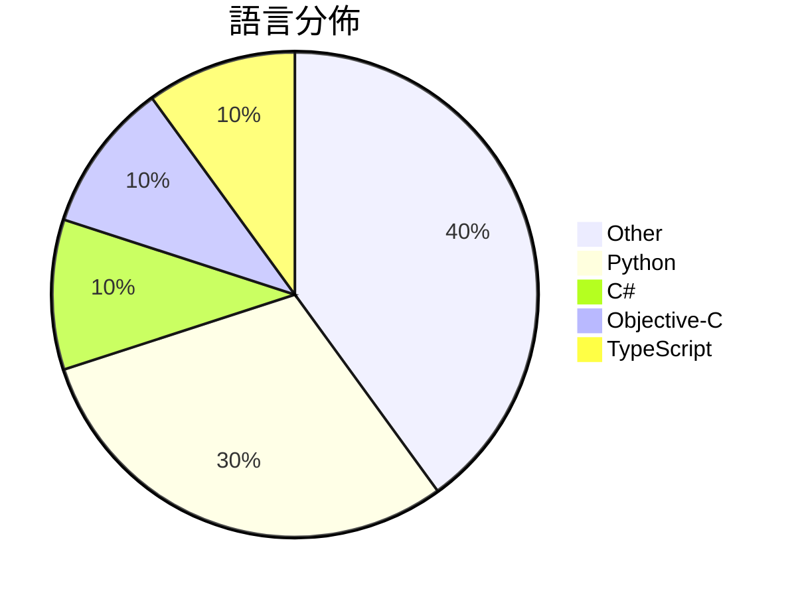

# GitHub Trending - 2026-03-24

> [!summary] 本日摘要
> 收錄 **10** 個新專案，合計 **16.5k** stars
> 語言分佈：Other (4) · Python (3) · C# (1) · Objective-C (1) · TypeScript (1)

> [!tip] 本週焦點
> **[[MiniMax-AI--skills|MiniMax-AI/skills]]** — 6 天內累積 3.3k stars（554 stars/天）
> 提供 AI 編碼代理的開發技能，讓開發者能夠獲得結構化的生產級指導。



---

## 收錄列表

| # | 專案 | 分類 | Stars | 速度 | 安裝 | 語言 | 用途 |
| :--: | --- | --- | ---: | ---: | --- | --- | --- |
| 1 | [[MiniMax-AI--skills\|MiniMax-AI/skills]] | 開發工具 | 3.3k | 554/天 | `easy` | C# | 提供 AI 編碼代理的開發技能，讓開發者能夠獲得結構化的生產級指導。 |
| 2 | [[HKUDS--ClawTeam\|HKUDS/ClawTeam]] | 開發工具 | 3.2k | 529/天 | `easy` | Python | 讓 AI 代理自動協作，實現全自動化任務管理。 |
| 3 | [[VoltAgent--awesome-codex-subagents\|VoltAgent/awesome-codex-subagents]] | AI/ML | 2.3k | 379/天 | `medium` | N/A | 提供超過 130 種專業的 Codex 子代理，涵蓋各種開發用例。 |
| 4 | [[danveloper--flash-moe\|danveloper/flash-moe]] |  | 1.7k | 334/天 |  | Objective-C | Running a big model on a small laptop |
| 5 | [[dontbesilent2025--dbskill\|dontbesilent2025/dbskill]] | 開發工具 | 1.3k | 418/天 | `easy` | N/A | 提供商业诊断工具，帮助用户提炼和优化商业模式与内容创作。 |
| 6 | [[math-inc--OpenGauss\|math-inc/OpenGauss]] | 開發工具 | 1.1k | 266/天 | `medium` | Python | 提供多代理前端的 Lean 工作流協調器，簡化數學證明和形式化過程。 |
| 7 | [[lxf746--any-auto-register\|lxf746/any-auto-register]] | 開發工具 | 1.0k | 206/天 | `medium` | Python | 多平台帳號自動註冊與管理系統，支持插件擴展與多種郵箱服務。 |
| 8 | [[louislva--claude-peers-mcp\|louislva/claude-peers-mcp]] | 開發工具 | 948 | 474/天 | `medium` | TypeScript | 讓所有的 Claude 代碼實例可以即時互相通訊。 |
| 9 | [[mattprusak--autoresearch-genealogy\|mattprusak/autoresearch-genealogy]] | 其他 | 905 | 181/天 | `easy` | N/A | 提供結構化提示、資料庫模板和檔案指南，協助進行 AI 輔助的家譜研究。 |
| 10 | [[truongduy2611--app-store-preflight-skills\|truongduy2611/app-store-preflight-skills]] | 開發工具 | 897 | 224/天 | `easy` | N/A | 在提交前檢查 iOS/macOS 專案的 App Store 拒絕模式，幫助開發 |

---

## 重點摘要

### 1. [[MiniMax-AI--skills|MiniMax-AI/skills]] `開發工具`

> 提供 AI 編碼代理的開發技能，讓開發者能夠獲得結構化的生產級指導。

**3.3k** stars · **554** stars/天 · C# · `easy`

_建立 6 天內累積 3324 stars（554/天），forks 199（6.0%），顯示出強勁的增長潛力。這個專案的主要貢獻者 AkairoDev 和 viktorxhzj 在開源社群中有良好的聲譽，並且他們的過去作品也獲得了廣泛的認可。MiniMax Skills 解決了開發者在使用 AI 工具時缺乏結構化指導的痛點，之前的方案往往無法提供如此多樣化的技能支持。這個專案的推出引起了社群的關注，尤其是在開發者論壇和社交媒體上有不少討論。技術上，這個工具的設計使得它能夠快速適應不同的開發環境，這在當前快速變化的技術生態中是非常重要的。forks/stars 比率為 6.0%，顯示出許多開發者在實際修改和使用這個工具，這意味著它不僅僅是觀望，而是有實際的應用需求。_

---

### 2. [[HKUDS--ClawTeam|HKUDS/ClawTeam]] `開發工具`

> 讓 AI 代理自動協作，實現全自動化任務管理。

**3.2k** stars · **529** stars/天 · Python · `easy`

_建立 6 天就累積 3171 stars（529/天），forks 432（13.6%），顯示出強烈的興趣和需求。作者 HKUDS 團隊過去在 AI 和多代理系統方面有豐富經驗，這使得 ClawTeam 能夠解決目前 AI 代理孤立運作的痛點，讓多個代理能夠協同工作。近期的推廣活動和社群討論也為其增添了曝光度。這個工具的出現正好填補了市場上對於高效協作工具的需求，特別是在 AI 研究和開發領域。_

---

### 3. [[VoltAgent--awesome-codex-subagents|VoltAgent/awesome-codex-subagents]] `AI/ML`

> 提供超過 130 種專業的 Codex 子代理，涵蓋各種開發用例。

**2.3k** stars · **379** stars/天 · N/A · `medium`

_建立 6 天內累積 2275 stars（379/天），forks 185（8.1%），這顯示出強勁的增長潛力。這個專案的主要貢獻者有 necatiozmen 和 haoxianhan，他們在 AI 和開發工具領域有豐富的經驗。專案解決了開發者在使用 Codex 時缺乏專業化支持的痛點，之前開發者只能依賴通用的 AI 模型，效率和準確性都不高。這個專案的出現讓開發者能夠針對特定任務使用專業的子代理，顯著提高了工作效率。社群的活躍度和問題解決率也顯示出這個專案的健康狀態，讓人期待未來的發展。_

---

### 4. [[danveloper--flash-moe|danveloper/flash-moe]]

**1.7k** stars · **334** stars/天 · Objective-C

---

### 5. [[dontbesilent2025--dbskill|dontbesilent2025/dbskill]] `開發工具`

> 提供商业诊断工具，帮助用户提炼和优化商业模式与内容创作。

**1.3k** stars · **418** stars/天 · N/A · `easy`

_建立 3 天內累積 1255 stars（418/天），forks 213（17.0%），顯示出強勁的增長潛力。作者 dontbesilent 在商業診斷領域有豐富經驗，這個工具解決了傳統商業分析工具缺乏靈活性和開放性的痛點。此專案的推出正值對於 AI 驅動商業決策的需求上升，並且在社群中引起了廣泛討論，特別是在推特和小紅書上。forks/stars 比率為 17.0%，顯示出許多使用者在積極修改和使用此工具。_

---

### 6. [[math-inc--OpenGauss|math-inc/OpenGauss]] `開發工具`

> 提供多代理前端的 Lean 工作流協調器，簡化數學證明和形式化過程。

**1.1k** stars · **266** stars/天 · Python · `medium`

_建立 4 天就累積 1062 stars（265.5/天），forks 89（8.4%），顯示出相對較高的使用興趣。這個專案由 Math, Inc. 開發，專注於數學工作流的自動化，解決了傳統數學證明過程中手動操作繁瑣的問題。隨著數學和形式化驗證需求的增加，這個工具的出現正好填補了市場的空白。社群的活躍度和高效的問題解決率（98%）也顯示出其受歡迎程度。_

---

### 7. [[lxf746--any-auto-register|lxf746/any-auto-register]] `開發工具`

> 多平台帳號自動註冊與管理系統，支持插件擴展與多種郵箱服務。

**1.0k** stars · **206** stars/天 · Python · `medium`

_建立 5 天就累積 1030 stars（206/天），forks 510（49.5%），這顯示出用戶對於這個工具的高度興趣。作者似乎是針對多平台註冊的需求進行了深入的思考，解決了許多用戶在註冊過程中遇到的痛點，例如驗證碼接收和代理管理。這個工具的出現正好填補了市場上對於自動註冊工具的需求，特別是在需要快速註冊多個帳號的情況下。社群中對於這個工具的討論也顯示出用戶在實際使用中遇到的問題，進一步促進了其發展。這樣的增長速度和社群互動表明，這個專案有潛力成為類似工具中的佼佼者。_

---

### 8. [[louislva--claude-peers-mcp|louislva/claude-peers-mcp]] `開發工具`

> 讓所有的 Claude 代碼實例可以即時互相通訊。

**948** stars · **474** stars/天 · TypeScript · `medium`

_建立 2 天就累積 948 stars（474/天），forks 86（9.1%），這顯示出相當高的使用興趣。作者 louislva 是一位活躍的開發者，專注於 Claude 相關的工具開發。這個專案解決了多個 Claude 實例間通訊的痛點，之前的方案往往需要手動配置或無法實現即時通訊。近期的推廣和社群討論也可能促進了這個專案的曝光。技術上，這個工具利用了 MCP 協議，這在 Claude 生態系統中是相對新穎的，並且其高效的即時通訊能力吸引了開發者的注意。forks/stars 比率為 9.1%，顯示出有不少開發者在實際修改和使用這個工具。_

---

### 9. [[mattprusak--autoresearch-genealogy|mattprusak/autoresearch-genealogy]] `其他`

> 提供結構化提示、資料庫模板和檔案指南，協助進行 AI 輔助的家譜研究。

**905** stars · **181** stars/天 · N/A · `easy`

_建立 5 天就累積 905 stars（181/天），forks 76（8.4%），顯示出強勁的增長潛力。這個專案的作者 mattprusak 以其在家譜研究上的經驗，提供了一個解決傳統家譜研究中效率低下的痛點，特別是如何在資料來源不一致的情況下進行準確的研究。該專案的設計靈感來自於 Andrej Karpathy 的自動研究概念，這使得它在技術上具有創新性。社群的反應也顯示出對於如何利用 AI 進行人文領域研究的興趣，這可能是推動其快速增長的原因之一。_

---

### 10. [[truongduy2611--app-store-preflight-skills|truongduy2611/app-store-preflight-skills]] `開發工具`

> 在提交前檢查 iOS/macOS 專案的 App Store 拒絕模式，幫助開發者避免常見錯誤。

**897** stars · **224** stars/天 · N/A · `easy`

_建立 4 天就累積 897 stars（224/天），forks 50（5.6%），這顯示出開發者對於避免 App Store 拒絕的需求。這個專案的作者 truongduy2611 和 rudrankriyam 在開源社群中有一定的影響力，且他們的過去貢獻也顯示出對於開發者工具的深入理解。這個工具解決了開發者在提交應用時面臨的常見問題，特別是針對 Apple 的審核標準，這在過去並沒有一個專門的解決方案。隨著越來越多的開發者尋求提高應用上架成功率，這個工具的需求自然上升。forks/stars 比率在 5% 左右，顯示出使用者對於這個工具的實際修改和應用的興趣。_

---

## 今日到期複習

> [!tip] 根據間隔複習排程，今天該回顧的專案

```dataview
TABLE
  stars_per_day AS "Stars/天",
  category AS "分類",
  engagement AS "參與度"
FROM "Repos"
WHERE next_review AND date(next_review) <= date("2026-03-24") AND status != "archived"
SORT priority DESC
```

## 待處理

```dataviewjs
const pending = dv.pages('"Repos"').where(p => p.status === "to-review").length;
const unrated = dv.pages('"Repos"').where(p => p.status !== "archived" && p.status !== "to-review" && (p.my_rating || 0) === 0).length;
const noVerdict = dv.pages('"Repos"').where(p => p.status !== "archived" && (p.my_rating || 0) > 0 && (!p.verdict || p.verdict === "")).length;
const items = [];
if (pending > 0) items.push(`**${pending}** 個待分流`);
if (unrated > 0) items.push(`**${unrated}** 個已讀但未評分`);
if (noVerdict > 0) items.push(`**${noVerdict}** 個已評分但無結論`);
if (items.length > 0) dv.paragraph(items.join(" / "));
else dv.paragraph("所有專案都已處理完畢！");
```
