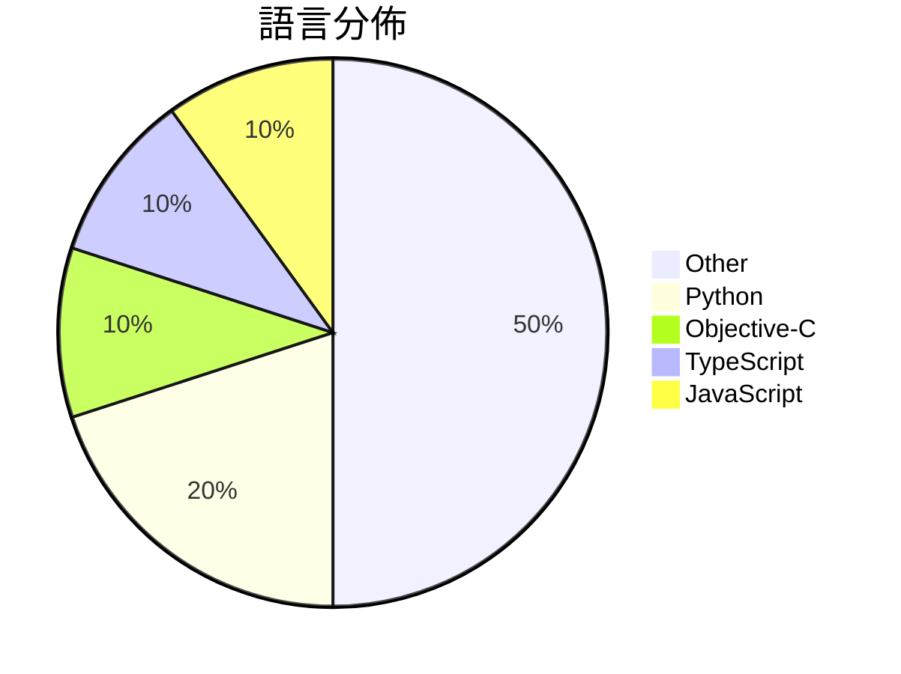

# GitHub Trending - 2026-03-25

> [!summary] 本日摘要
> 收錄 **10** 個新專案，合計 **11.6k** stars
> 語言分佈：Other (5) · Python (2) · Objective-C (1) · TypeScript (1) · JavaScript (1)

> [!tip] 本週焦點
> **[[danveloper--flash-moe|danveloper/flash-moe]]** — 6 天內累積 1.9k stars（311 stars/天）
> 在小型筆記型電腦上運行一個 397 億參數的模型。



---

## 收錄列表

| # | 專案 | 分類 | Stars | 速度 | 安裝 | 語言 | 用途 |
| :--: | --- | --- | ---: | ---: | --- | --- | --- |
| 1 | [[danveloper--flash-moe\|danveloper/flash-moe]] | AI/ML | 1.9k | 311/天 | `medium` | Objective-C | 在小型筆記型電腦上運行一個 397 億參數的模型。 |
| 2 | [[dontbesilent2025--dbskill\|dontbesilent2025/dbskill]] | 開發工具 | 1.4k | 355/天 | `easy` | N/A | 提供商业诊断能力的工具箱，整合多种技能以优化决策过程。 |
| 3 | [[louislva--claude-peers-mcp\|louislva/claude-peers-mcp]] | 開發工具 | 1.1k | 373/天 | `easy` | TypeScript | 讓你的 Claude 代碼實例之間可以即時通訊。 |
| 4 | [[zarazhangrui--codebase-to-course\|zarazhangrui/codebase-to-course]] | 開發工具 | 1.1k | 547/天 | `easy` | N/A | 將任何代碼庫轉換為美觀的互動式單頁 HTML 課程，讓非技術背景的使用者也能理解 |
| 5 | [[math-inc--OpenGauss\|math-inc/OpenGauss]] | 開發工具 | 1.1k | 215/天 | `medium` | Python | 提供一個多代理前端的 Lean 工作流協調器，簡化數學證明和形式化過程。 |
| 6 | [[slavingia--skills\|slavingia/skills]] | 開發工具 | 1.1k | 1.1k/天 | `easy` | N/A | 提供基於《極簡主義創業者》的 Claude Code 技能，幫助創業者有效驗證和 |
| 7 | [[lxf746--any-auto-register\|lxf746/any-auto-register]] | 開發工具 | 1.1k | 179/天 | `medium` | Python | 提供多平台帳號自動註冊與管理，並支援插件擴展。 |
| 8 | [[eze-is--web-access\|eze-is/web-access]] |  | 1.0k | 168/天 |  | JavaScript | 给 Claude Code 装上完整联网能力的 skill：三层通道调度 + 浏 |
| 9 | [[truongduy2611--app-store-preflight-skills\|truongduy2611/app-store-preflight-skills]] | 開發工具 | 923 | 185/天 | `easy` | N/A | 在提交前檢查 iOS/macOS 專案的 App Store 拒絕模式，避免常見 |
| 10 | [[mattprusak--autoresearch-genealogy\|mattprusak/autoresearch-genealogy]] | 其他 | 915 | 153/天 | `easy` | N/A | 提供結構化提示、資料庫模板和檔案指南，以協助 AI 進行家譜研究。 |

---

## 重點摘要

### 1. [[danveloper--flash-moe|danveloper/flash-moe]] `AI/ML`

> 在小型筆記型電腦上運行一個 397 億參數的模型。

**1.9k** stars · **311** stars/天 · Objective-C · `medium`

_建立 6 天內累積 1864 stars（311/天），forks 175（9.4%），顯示出強烈的社群興趣。作者 danveloper 過去在 AI 和性能優化方面有豐富的經驗，這個專案解決了在小型設備上運行大型模型的痛點，之前的方案往往需要高性能伺服器或大量內存。這個專案的成功可能受到社群的廣泛討論和分享影響，特別是在 AI 開發者圈中。forks/stars 比率 9.4% 表示有相當比例的用戶在實際修改和使用此專案，顯示出其實用性和潛在的擴展性。_

---

### 2. [[dontbesilent2025--dbskill|dontbesilent2025/dbskill]] `開發工具`

> 提供商业诊断能力的工具箱，整合多种技能以优化决策过程。

**1.4k** stars · **355** stars/天 · N/A · `easy`

_建立 4 天內累積 1421 stars（355/天），forks 235（16.5%），顯示出強勁的增長潛力。作者 dontbesilent 在商業診斷領域有豐富經驗，這個工具解決了傳統商業分析方法的繁瑣和不靈活問題，以更高效的方式提供實用的診斷能力。近期的社交媒體討論和推廣活動也促進了其知名度的提升。技術上，這個工具的設計充分利用了推文中的知識，這在以往的工具中並不常見，讓其在市場上具備了獨特性。forks/stars 比率達到 16.5%，顯示出許多用戶對其進行了實際修改和使用，這是良好的社群互動指標。_

---

### 3. [[louislva--claude-peers-mcp|louislva/claude-peers-mcp]] `開發工具`

> 讓你的 Claude 代碼實例之間可以即時通訊。

**1.1k** stars · **373** stars/天 · TypeScript · `easy`

_建立 3 天內累積 1119 stars（373/天），forks 103（9.2%），顯示出強烈的社群興趣。作者 louislva 之前在開源社群中活躍，這個專案解決了多實例 Claude 代碼之間通訊的痛點，之前的解決方案往往需要額外的配置和不夠即時。近期的推廣和社群討論可能促進了這個專案的曝光。高 forks/stars 比率顯示出使用者對這個工具的實際修改和應用需求。_

---

### 4. [[zarazhangrui--codebase-to-course|zarazhangrui/codebase-to-course]] `開發工具`

> 將任何代碼庫轉換為美觀的互動式單頁 HTML 課程，讓非技術背景的使用者也能理解代碼運作。

**1.1k** stars · **547** stars/天 · N/A · `easy`

_建立 2 天就累積 1094 stars（547/天），forks 98（9.0%），這顯示出強烈的使用者興趣。作者 Zara 在 AI 編碼工具領域有一定的經驗，這個專案解決了非技術人員在理解代碼時的痛點，讓他們能夠以更直觀的方式學習。此專案的推出可能受到社群對於簡化編碼學習的需求影響。Stars 和 forks 的比例顯示出使用者不僅在觀望，還有實際的使用和修改需求。_

---

### 5. [[math-inc--OpenGauss|math-inc/OpenGauss]] `開發工具`

> 提供一個多代理前端的 Lean 工作流協調器，簡化數學證明和形式化過程。

**1.1k** stars · **215** stars/天 · Python · `medium`

_建立 5 天內累積 1076 stars（215/天），forks 90（8.4%），顯示出強烈的社群興趣。這個專案由 Math, Inc. 開發，團隊成員在數學和計算領域有豐富的經驗。它解決了數學證明過程中工作流管理的痛點，之前的工具往往無法有效整合多個工作流。專案的快速增長可能與其簡化的安裝流程和強大的 CLI 功能有關，這使得使用者能夠快速上手並開始使用。社群的活躍度和開發者的回應速度也顯示出這個工具的潛力和未來的發展方向。_

---

### 6. [[slavingia--skills|slavingia/skills]] `開發工具`

> 提供基於《極簡主義創業者》的 Claude Code 技能，幫助創業者有效驗證和推進商業想法。

**1.1k** stars · **1.1k** stars/天 · N/A · `easy`

_建立 1 天就累積 1076 stars（1076/天），forks 78（7.2%），這是相對活躍的增長。作者 Sahil Lavingia 是《極簡主義創業者》的作者，這本書在創業圈內有一定影響力，提供了實用的創業框架。這個專案解決了創業者在早期階段缺乏指導的痛點，讓他們能夠快速獲得實用的技能和建議。社群對這個專案的反應熱烈，顯示出對於創業支持工具的需求。此工具的設計基於實用性，讓使用者能夠在實際操作中獲得即時的反饋和支持。_

---

### 7. [[lxf746--any-auto-register|lxf746/any-auto-register]] `開發工具`

> 提供多平台帳號自動註冊與管理，並支援插件擴展。

**1.1k** stars · **179** stars/天 · Python · `medium`

_建立 6 天就累積 1075 stars（179/天），forks 528（49.1%），顯示出強烈的社群參與。作者是一位活躍的開發者，過去有多個開源專案，這次專案解決了多平台帳號註冊的痛點，特別是對於需要快速註冊的開發者來說，之前的解決方案往往缺乏靈活性和擴展性。近期的社群討論和需求反饋也促進了這個專案的成長。技術生態的變化，如對於自動化和插件化的需求增加，也使得這個工具的出現恰逢其時。高達 49.1% 的 forks/stars 比率顯示出許多人在實際修改和使用這個工具。_

---

### 8. [[eze-is--web-access|eze-is/web-access]]

**1.0k** stars · **168** stars/天 · JavaScript

---

### 9. [[truongduy2611--app-store-preflight-skills|truongduy2611/app-store-preflight-skills]] `開發工具`

> 在提交前檢查 iOS/macOS 專案的 App Store 拒絕模式，避免常見錯誤。

**923** stars · **185** stars/天 · N/A · `easy`

_建立 5 天累積 923 stars（185/天），forks 50（5.4%），顯示出穩定的增長潛力。作者 truongduy2611 和 rudrankriyam 在開發者社群中有一定的影響力，這個專案解決了開發者在提交應用時常遇到的拒絕問題，之前開發者通常只能依賴手動檢查或不完整的工具。最近的推文和討論也引起了對這個工具的關注，顯示出開發者對於提高提交成功率的需求。這個工具的出現正好填補了這一空白，並且其設計基於 Apple 的審核指南，讓開發者能夠更有信心地提交應用。_

---

### 10. [[mattprusak--autoresearch-genealogy|mattprusak/autoresearch-genealogy]] `其他`

> 提供結構化提示、資料庫模板和檔案指南，以協助 AI 進行家譜研究。

**915** stars · **153** stars/天 · N/A · `easy`

_建立 6 天就累積 915 stars（153/天），forks 78（8.5%），顯示出穩定的增長潛力。這位作者 mattprusak 在家譜研究領域有一定的經驗，並且這個專案解決了許多家譜研究者在資料整理和驗證上的痛點，尤其是對於如何自動化這一過程的具體示範。近期的推廣活動和社群討論也可能促進了這個專案的曝光率。技術上，這個工具的設計使其能夠與多種 AI 工具兼容，這在目前的技術生態中是非常重要的，因為越來越多的研究者希望利用 AI 來提升工作效率。forks/stars 比率為 8.5%，顯示出不少人對這個專案的實際應用感興趣。_

---

## 今日到期複習

> [!tip] 根據間隔複習排程，今天該回顧的專案

```dataview
TABLE
  stars_per_day AS "Stars/天",
  category AS "分類",
  engagement AS "參與度"
FROM "Repos"
WHERE next_review AND date(next_review) <= date("2026-03-25") AND status != "archived"
SORT priority DESC
```

## 待處理

```dataviewjs
const pending = dv.pages('"Repos"').where(p => p.status === "to-review").length;
const unrated = dv.pages('"Repos"').where(p => p.status !== "archived" && p.status !== "to-review" && (p.my_rating || 0) === 0).length;
const noVerdict = dv.pages('"Repos"').where(p => p.status !== "archived" && (p.my_rating || 0) > 0 && (!p.verdict || p.verdict === "")).length;
const items = [];
if (pending > 0) items.push(`**${pending}** 個待分流`);
if (unrated > 0) items.push(`**${unrated}** 個已讀但未評分`);
if (noVerdict > 0) items.push(`**${noVerdict}** 個已評分但無結論`);
if (items.length > 0) dv.paragraph(items.join(" / "));
else dv.paragraph("所有專案都已處理完畢！");
```
