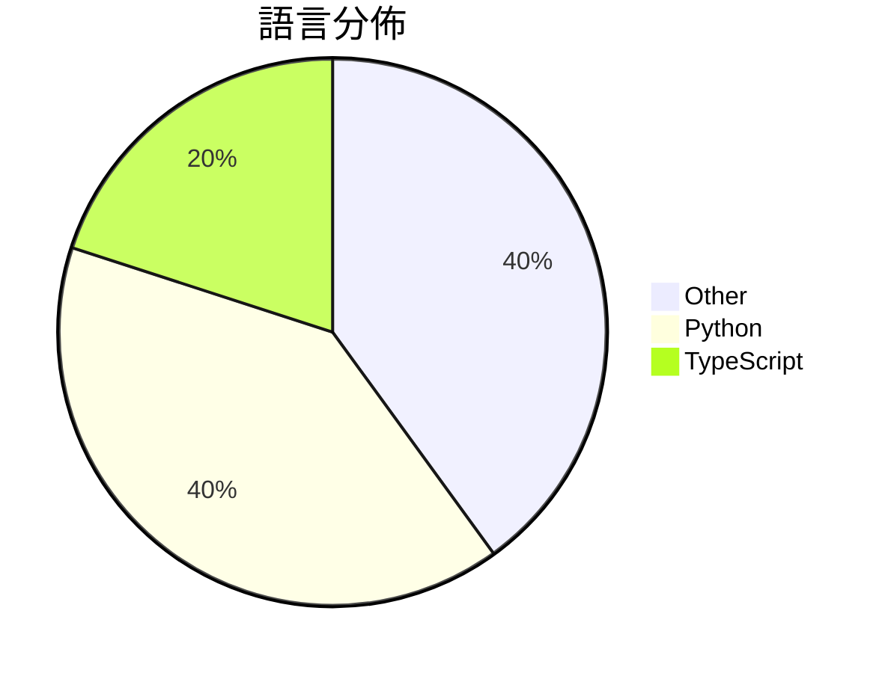

# GitHub Trending - 2026-03-26

> [!summary] 本日摘要
> 收錄 **10** 個新專案，合計 **12.4k** stars
> 語言分佈：Other (4) · Python (4) · TypeScript (2)

> [!tip] 本週焦點
> **[[slavingia--skills|slavingia/skills]]** — 2 天內累積 2.5k stars（1.2k stars/天）
> 提供一系列基於《極簡創業者》的 Claude Code 技能，幫助創業者有效驗證和實現商業想法。



---

## 收錄列表

| # | 專案 | 分類 | Stars | 速度 | 安裝 | 語言 | 用途 |
| :--: | --- | --- | ---: | ---: | --- | --- | --- |
| 1 | [[slavingia--skills\|slavingia/skills]] | 開發工具 | 2.5k | 1.2k/天 | `easy` | N/A | 提供一系列基於《極簡創業者》的 Claude Code 技能，幫助創業者有效驗證 |
| 2 | [[dontbesilent2025--dbskill\|dontbesilent2025/dbskill]] | 開發工具 | 1.5k | 308/天 | `easy` | N/A | 提供商业诊断工具，帮助用户从推文中提炼知识并生成实用技能。 |
| 3 | [[zarazhangrui--codebase-to-course\|zarazhangrui/codebase-to-course]] | 開發工具 | 1.5k | 504/天 | `easy` | N/A | 將任何代碼庫轉換為美觀的互動式單頁 HTML 課程，讓非技術性使用者也能理解代碼 |
| 4 | [[louislva--claude-peers-mcp\|louislva/claude-peers-mcp]] | 開發工具 | 1.2k | 300/天 | `medium` | TypeScript | 讓所有的 Claude Code 實例可以即時互相通訊。 |
| 5 | [[math-inc--OpenGauss\|math-inc/OpenGauss]] | 開發工具 | 1.1k | 181/天 | `medium` | Python | 提供一個多代理前端的 Lean 工作流協調器，簡化數學證明和形式化過程。 |
| 6 | [[truongduy2611--app-store-preflight-skills\|truongduy2611/app-store-preflight-skills]] | 開發工具 | 944 | 157/天 | `easy` | N/A | 在提交前掃描 iOS/macOS 專案，檢查可能導致 App Store 拒絕的 |
| 7 | [[dou-jiang--codex-console\|dou-jiang/codex-console]] | 開發工具 | 933 | 233/天 | `medium` | Python | 提供一个集成化控制台，支持任务管理、批量处理和数据导出，简化 OpenAI 注册 |
| 8 | [[facebookresearch--HyperAgents\|facebookresearch/HyperAgents]] | AI/ML | 912 | 152/天 | `medium` | Python | 自我參照的自我改進代理，可以優化任何可計算的任務。 |
| 9 | [[wong2--weixin-agent-sdk\|wong2/weixin-agent-sdk]] | 開發工具 | 892 | 297/天 | `easy` | TypeScript | 讓微信接入任意 AI Agent，簡化多種智能體的整合。 |
| 10 | [[HKUDS--OpenSpace\|HKUDS/OpenSpace]] | AI/ML | 883 | 883/天 | `medium` | Python | 讓 AI 代理自動進化，提升效能與降低成本。 |

---

## 重點摘要

### 1. [[slavingia--skills|slavingia/skills]] `開發工具`

> 提供一系列基於《極簡創業者》的 Claude Code 技能，幫助創業者有效驗證和實現商業想法。

**2.5k** stars · **1.2k** stars/天 · N/A · `easy`

_建立 2 天就累積 2498 stars（1249/天），forks 139（5.6%），這顯示出強勁的增長潛力。專案的主要貢獻者 slavingia 是一位對創業有深入理解的開發者，過去的經驗使其能夠針對創業者的痛點提供解決方案。這個專案填補了創業者在初期階段缺乏系統性指導的空白，讓使用者能夠更有效地驗證和實現商業想法。社群的反應熱烈，可能是因為創業者對於這種簡單易用的工具需求迫切。這種增長也可能受到社交媒體和創業社群的推廣影響，讓更多人注意到這個專案。_

---

### 2. [[dontbesilent2025--dbskill|dontbesilent2025/dbskill]] `開發工具`

> 提供商业诊断工具，帮助用户从推文中提炼知识并生成实用技能。

**1.5k** stars · **308** stars/天 · N/A · `easy`

_建立 5 天內累積 1542 stars（308/天），forks 248（16.1%），顯示出強勁的增長潛力。作者 dontbesilent 以其在商業診斷領域的專業知識，填補了市場上對於高效商業技能提取工具的需求。這個工具解決了過去依賴繁瑣手動分析推文的痛點，提供了一個自動化且結構化的解決方案。社群的反饋和問題討論也顯示出用戶對於功能的期待和需求，進一步推動了其流行。_

---

### 3. [[zarazhangrui--codebase-to-course|zarazhangrui/codebase-to-course]] `開發工具`

> 將任何代碼庫轉換為美觀的互動式單頁 HTML 課程，讓非技術性使用者也能理解代碼運作。

**1.5k** stars · **504** stars/天 · N/A · `easy`

_建立 3 天內累積 1511 stars（504/天），forks 139（9.2%），顯示出強烈的用戶興趣。這位作者 zarazhangrui 之前在 AI 編碼工具方面有過相關經驗，這次專案解決了非技術性使用者在理解代碼運作時的痛點，提供了一個視覺化且互動的學習方式。這個工具的推出正好契合了當前對於簡化編程學習的需求，並且其設計理念吸引了許多希望提升編碼能力的使用者。forks/stars 比率為 9.2%，顯示出許多人對於這個專案的實際修改和使用，這是相對較高的比例。_

---

### 4. [[louislva--claude-peers-mcp|louislva/claude-peers-mcp]] `開發工具`

> 讓所有的 Claude Code 實例可以即時互相通訊。

**1.2k** stars · **300** stars/天 · TypeScript · `medium`

_建立 4 天就累積 1201 stars（300/天），forks 113（9.4%），這顯示出相對較高的使用興趣。作者 louislva 之前有開發過其他相關工具，這次專案解決了 Claude Code 實例之間缺乏即時通訊的痛點。這個問題在多實例開發中非常常見，之前的解決方案往往需要複雜的配置或無法即時反應。最近的推文和社群討論也引起了對這個工具的注意，顯示出其在開發者中的需求。高達 9.4% 的 forks/stars 比率顯示出許多人在實際修改和使用這個工具，而不是僅僅觀望。_

---

### 5. [[math-inc--OpenGauss|math-inc/OpenGauss]] `開發工具`

> 提供一個多代理前端的 Lean 工作流協調器，簡化數學證明和形式化過程。

**1.1k** stars · **181** stars/天 · Python · `medium`

_建立 6 天就累積 1088 stars（181/天），forks 92（8.5%），顯示出良好的社群反應。這個專案由 Math, Inc. 開發，專注於數學證明的工作流協調，填補了現有工具在用戶友好性和功能整合上的空白。作者的背景和過去的貢獻使得這個專案具備一定的信譽。社群的活躍度和開放的問題反饋機制也顯示出該專案的發展潛力。_

---

### 6. [[truongduy2611--app-store-preflight-skills|truongduy2611/app-store-preflight-skills]] `開發工具`

> 在提交前掃描 iOS/macOS 專案，檢查可能導致 App Store 拒絕的問題。

**944** stars · **157** stars/天 · N/A · `easy`

_建立 6 天內累積 944 stars（157/天），forks 53（5.6%），顯示出穩定的增長。作者 truongduy2611 和 rudrankriyam 之前在開發相關工具上有經驗，這個專案解決了開發者在提交應用時常見的拒絕問題，之前的解決方案往往需要手動檢查，效率低下。近期的推廣活動和社群討論也可能促進了這個工具的曝光。技術上，這個工具的出現是因為 App Store 的審核準則不斷變化，開發者需要一個自動化的解決方案來應對這些變化。forks/stars 比率顯示出有一定數量的開發者在實際使用和修改這個工具，反映出它的實用性。_

---

### 7. [[dou-jiang--codex-console|dou-jiang/codex-console]] `開發工具`

> 提供一个集成化控制台，支持任务管理、批量处理和数据导出，简化 OpenAI 注册流程。

**933** stars · **233** stars/天 · Python · `medium`

_建立 4 天就累積 933 stars（233/天），forks 582（62.4%），顯示出強烈的社群參與度。這個專案的作者 dou-jiang 之前在 cnlimiter/codex-manager 上有過成功的經驗，這使得他能夠針對 OpenAI 的註冊流程進行有效的修復和增強。這個工具解決了用戶在註冊過程中遇到的多個痛點，特別是郵件接收問題，這在之前的方案中並未得到妥善處理。社群的反饋和需求促進了這個專案的快速發展，並且在技術生態中，對於簡化 OpenAI 註冊流程的需求日益增長。_

---

### 8. [[facebookresearch--HyperAgents|facebookresearch/HyperAgents]] `AI/ML`

> 自我參照的自我改進代理，可以優化任何可計算的任務。

**912** stars · **152** stars/天 · Python · `medium`

_建立 6 天內累積 912 stars（152/天），forks 135（14.8%），顯示出強勁的增長潛力。這個專案由 Facebook Research 團隊開發，該團隊在 AI 和機器學習領域有著豐富的經驗。HyperAgents 解決了傳統算法在面對動態環境時的不足，提供了一種新的自我改進方法。近期的社群討論和學術引用也提升了其曝光率。技術上，隨著計算能力的提升，這種自我優化的代理系統變得越來越可行，這使得 HyperAgents 成為一個具潛力的工具。forks/stars 比率為 14.8%，顯示出有相當比例的用戶在積極修改和使用這個專案。_

---

### 9. [[wong2--weixin-agent-sdk|wong2/weixin-agent-sdk]] `開發工具`

> 讓微信接入任意 AI Agent，簡化多種智能體的整合。

**892** stars · **297** stars/天 · TypeScript · `easy`

_建立 3 天內累積 892 stars（297/天），forks 96（10.8%），顯示出不錯的社群關注度。作者 wong2 和 WendaoLee 具備豐富的開發經驗，這個專案解決了微信接入 AI Agent 的痛點，之前的方案往往需要繁瑣的配置和代碼編寫。近期的推廣活動和社群討論也促進了這個專案的曝光，特別是在 AI 和即時通訊結合的熱潮中。高達 10.8% 的 forks/stars 比率顯示出許多開發者對此專案有實際的修改和使用需求。_

---

### 10. [[HKUDS--OpenSpace|HKUDS/OpenSpace]] `AI/ML`

> 讓 AI 代理自動進化，提升效能與降低成本。

**883** stars · **883** stars/天 · Python · `medium`

_建立 1 天就累積 883 stars（883/天），forks 92（10.4%），這顯示出強勁的初期吸引力。作者 HKUDS 團隊在 AI 和自動化領域有豐富的經驗，這個專案解決了現有 AI 代理在自我學習和進化方面的不足，之前的方案往往需要手動調整和優化。近期的推廣活動和社群討論可能也促進了這個專案的曝光。技術上，AI 代理的自我進化能力在當前市場中尚屬新穎，這使得 OpenSpace 在技術生態中具備了獨特的價值。forks/stars 比率為 10.4%，這意味著相對於觀望者，有相當比例的用戶在嘗試修改和使用這個專案。_

---

## 今日到期複習

> [!tip] 根據間隔複習排程，今天該回顧的專案

```dataview
TABLE
  stars_per_day AS "Stars/天",
  category AS "分類",
  engagement AS "參與度"
FROM "Repos"
WHERE next_review AND date(next_review) <= date("2026-03-26") AND status != "archived"
SORT priority DESC
```

## 待處理

```dataviewjs
const pending = dv.pages('"Repos"').where(p => p.status === "to-review").length;
const unrated = dv.pages('"Repos"').where(p => p.status !== "archived" && p.status !== "to-review" && (p.my_rating || 0) === 0).length;
const noVerdict = dv.pages('"Repos"').where(p => p.status !== "archived" && (p.my_rating || 0) > 0 && (!p.verdict || p.verdict === "")).length;
const items = [];
if (pending > 0) items.push(`**${pending}** 個待分流`);
if (unrated > 0) items.push(`**${unrated}** 個已讀但未評分`);
if (noVerdict > 0) items.push(`**${noVerdict}** 個已評分但無結論`);
if (items.length > 0) dv.paragraph(items.join(" / "));
else dv.paragraph("所有專案都已處理完畢！");
```
