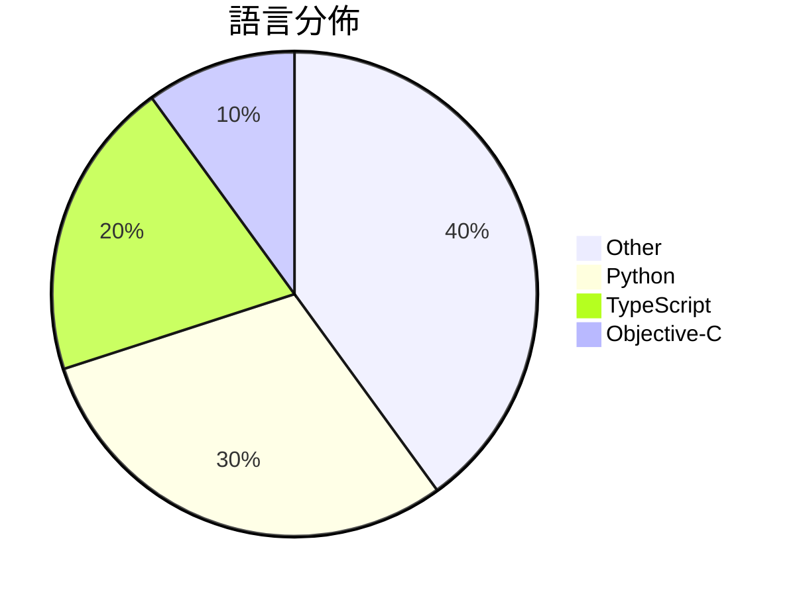

# GitHub Trending - 2026-03-27

> [!summary] 本日摘要
> 收錄 **10** 個新專案，合計 **14.4k** stars
> 語言分佈：Other (4) · Python (3) · TypeScript (2) · Objective-C (1)

> [!tip] 本週焦點
> **[[slavingia--skills|slavingia/skills]]** — 3 天內累積 3.6k stars（1.2k stars/天）
> 提供基於《The Minimalist Entrepreneur》的 Claude Code 技能，幫助創業者從零開始建立業務。



---

## 收錄列表

| # | 專案 | 分類 | Stars | 速度 | 安裝 | 語言 | 用途 |
| :--: | --- | --- | ---: | ---: | --- | --- | --- |
| 1 | [[slavingia--skills\|slavingia/skills]] | 其他 | 3.6k | 1.2k/天 | `easy` | N/A | 提供基於《The Minimalist Entrepreneur》的 Claud |
| 2 | [[zarazhangrui--codebase-to-course\|zarazhangrui/codebase-to-course]] | 開發工具 | 1.8k | 438/天 | `easy` | N/A | 將任何代碼庫轉換為美觀且互動的單頁 HTML 課程，幫助非技術背景的使用者理解代 |
| 3 | [[dontbesilent2025--dbskill\|dontbesilent2025/dbskill]] | 其他 | 1.7k | 275/天 | `easy` | N/A | 提供商业诊断能力的工具箱，帮助用户优化决策和内容创作。 |
| 4 | [[HKUDS--OpenSpace\|HKUDS/OpenSpace]] | AI/ML | 1.3k | 642/天 | `medium` | Python | 讓你的 AI 代理更聰明、低成本、自我進化。 |
| 5 | [[louislva--claude-peers-mcp\|louislva/claude-peers-mcp]] | 開發工具 | 1.3k | 252/天 | `medium` | TypeScript | 讓所有的 Claude 代碼實例能夠隨時互相通訊。 |
| 6 | [[dou-jiang--codex-console\|dou-jiang/codex-console]] | 開發工具 | 1.0k | 209/天 | `medium` | Python | 提供集成化控制台，支持任务管理、批量处理和数据导出，优化 OpenAI 注册流程 |
| 7 | [[alvinunreal--awesome-opensource-ai\|alvinunreal/awesome-opensource-ai]] | 其他 | 1.0k | 512/天 | `easy` | N/A | 整理出最佳的真正開源 AI 專案、模型、工具和基礎設施。 |
| 8 | [[GAIR-NLP--daVinci-MagiHuman\|GAIR-NLP/daVinci-MagiHuman]] | AI/ML | 934 | 234/天 | `medium` | Python | 提供快速生成音視頻的單流架構模型，專注於人性化表現。 |
| 9 | [[wong2--weixin-agent-sdk\|wong2/weixin-agent-sdk]] | 開發工具 | 919 | 230/天 | `easy` | TypeScript | 讓任何 AI 後端接入微信，輕鬆實現智能對話機器人。 |
| 10 | [[opa334--darksword-kexploit\|opa334/darksword-kexploit]] | 安全 | 891 | 297/天 | `easy` | Objective-C | 重新實現的 iOS <=26.0.1 DarkSword 核心漏洞利用工具。 |

---

## 重點摘要

### 1. [[slavingia--skills|slavingia/skills]] `其他`

> 提供基於《The Minimalist Entrepreneur》的 Claude Code 技能，幫助創業者從零開始建立業務。

**3.6k** stars · **1.2k** stars/天 · N/A · `easy`

_建立 3 天就累積 3636 stars（1212/天），forks 240（6.6%），這顯示出強勁的增長潛力。這個專案由 Sahil Lavingia 的理念啟發，針對創業者的實際需求提供具體技能，填補了市場上對於初創企業指導的空白。隨著創業文化的興起，這種針對性強的工具越來越受到重視。作者的背景和書籍的影響力也讓這個專案在短時間內獲得了大量關注，社群的活躍度和使用者的反饋也進一步推動了它的流行。_

---

### 2. [[zarazhangrui--codebase-to-course|zarazhangrui/codebase-to-course]] `開發工具`

> 將任何代碼庫轉換為美觀且互動的單頁 HTML 課程，幫助非技術背景的使用者理解代碼運作。

**1.8k** stars · **438** stars/天 · N/A · `easy`

_建立 4 天就累積 1750 stars（438/天），forks 155（8.9%），顯示出強勁的增長潛力。作者 zarazhangrui 之前的作品可能在社群中有一定影響力，這個專案解決了非技術使用者在理解代碼時的痛點，提供了一個直觀且互動的學習方式。這種方式能夠讓使用者在實際操作中獲得知識，而不是僅僅依賴理論。社群的反應也顯示出對這種新型學習工具的需求，尤其是在 AI 編程工具日益普及的背景下。forks/stars 比率為 8.9%，顯示出許多人對這個工具的實際使用和修改感興趣。_

---

### 3. [[dontbesilent2025--dbskill|dontbesilent2025/dbskill]] `其他`

> 提供商业诊断能力的工具箱，帮助用户优化决策和内容创作。

**1.7k** stars · **275** stars/天 · N/A · `easy`

_建立 6 天就累積 1652 stars（275/天），forks 258（15.6%），顯示出強勁的增長潛力。作者 dontbesilent 在商業診斷領域有豐富經驗，這個工具解決了商業決策過程中的知識碎片化問題，之前的解決方案往往缺乏系統性和可操作性。近期的推廣活動和社群討論也為其增添了曝光度。這個工具的設計使得用戶能夠快速獲取和應用商業知識，適應當前快速變化的市場需求。forks/stars 比率為 15.6%，顯示出不少用戶在積極修改和使用這個工具。_

---

### 4. [[HKUDS--OpenSpace|HKUDS/OpenSpace]] `AI/ML`

> 讓你的 AI 代理更聰明、低成本、自我進化。

**1.3k** stars · **642** stars/天 · Python · `medium`

_建立 2 天就累積 1284 stars（642/天），forks 138（10.7%），顯示出強勁的增長潛力。這個專案的主要貢獻者有豐富的開源經驗，過去參與了多個相關項目。OpenSpace 解決了 AI 代理在自我進化和技能管理上的痛點，之前的方案往往缺乏靈活性和效率。最近的推廣活動和社群互動也促進了其曝光率，尤其是在專業領域的應用上。技術生態的變化，如對自我進化技術的需求增加，使得這個工具的可行性大幅提升。forks/stars 比率為 10.7%，顯示出有相當比例的使用者在實際修改和使用這個專案。_

---

### 5. [[louislva--claude-peers-mcp|louislva/claude-peers-mcp]] `開發工具`

> 讓所有的 Claude 代碼實例能夠隨時互相通訊。

**1.3k** stars · **252** stars/天 · TypeScript · `medium`

_建立 5 天就累積 1259 stars（252/天），forks 121（9.6%），顯示出強勁的增長潛力。作者 louislva 在開源社群中活躍，過去有多個相關專案經驗。這個專案解決了 Claude 環境下實例間通訊的痛點，之前的解決方案往往依賴於較為繁瑣的配置或無法即時通訊。最近的推特討論也引起了開發者的注意，讓這個工具迅速受到關注。隨著開發者對於即時通訊需求的增加，這個工具的出現正好滿足了這一需求。forks/stars 比率為 9.6%，顯示出許多人對此專案進行實際修改和使用。_

---

### 6. [[dou-jiang--codex-console|dou-jiang/codex-console]] `開發工具`

> 提供集成化控制台，支持任务管理、批量处理和数据导出，优化 OpenAI 注册流程。

**1.0k** stars · **209** stars/天 · Python · `medium`

_建立 5 天內累積 1045 stars（209/天），forks 631（60.4%），顯示出強烈的社群參與。作者 dou-jiang 之前在開源社群中活躍，這個專案解決了 OpenAI 註冊過程中的不穩定性問題，特別是對於需要批量註冊的用戶。社群對於這個工具的需求明顯，特別是在最近的 OpenAI 政策變動後，許多用戶需要穩定的解決方案。_

---

### 7. [[alvinunreal--awesome-opensource-ai|alvinunreal/awesome-opensource-ai]] `其他`

> 整理出最佳的真正開源 AI 專案、模型、工具和基礎設施。

**1.0k** stars · **512** stars/天 · N/A · `easy`

_建立 2 天就累積 1024 stars（512/天），forks 74（7.2%），這顯示出強烈的社群需求。作者 alvinunreal 及其團隊在開源社群中有一定的影響力，過去也參與過多個開源專案。這個清單解決了開源 AI 資源分散的問題，讓開發者能夠集中找到所需的工具和模型。近期的推廣活動和社群討論也可能促進了這個專案的曝光度。開源 AI 生態的快速發展使得這個清單的存在變得尤為重要，幫助開發者快速找到合適的資源。forks/stars 比率為 7.2%，顯示出使用者對於這個清單的實際修改和使用意圖。_

---

### 8. [[GAIR-NLP--daVinci-MagiHuman|GAIR-NLP/daVinci-MagiHuman]] `AI/ML`

> 提供快速生成音視頻的單流架構模型，專注於人性化表現。

**934** stars · **234** stars/天 · Python · `medium`

_建立 4 天內累積 934 stars（234/天），forks 68（7.3%），顯示出相對活躍的社群參與。這個專案的主要貢獻者來自 SII-GAIR 和 Sand.ai，這些團隊在音視頻生成領域有著豐富的經驗。它解決了以往音視頻生成模型在速度和質量上的平衡問題，提供了一個高效的單流架構，讓生成過程變得更簡單。這一點在當前對於即時內容生成需求上尤為重要，尤其是在社交媒體和娛樂行業。社群的活躍度和開源特性也吸引了不少開發者的關注，促進了其快速增長。_

---

### 9. [[wong2--weixin-agent-sdk|wong2/weixin-agent-sdk]] `開發工具`

> 讓任何 AI 後端接入微信，輕鬆實現智能對話機器人。

**919** stars · **230** stars/天 · TypeScript · `easy`

_建立 4 天就累積 919 stars（230/天），forks 98（10.7%），顯示出強烈的社群興趣。作者 wong2 和 WendaoLee 具備開源項目的經驗，這個專案解決了微信接入 AI 的痛點，之前的方案往往需要繁瑣的設置和配置。近期的社群討論和需求反饋也促進了這個專案的快速成長，特別是對於多智能體接入的需求。這些因素共同推動了它的流行。_

---

### 10. [[opa334--darksword-kexploit|opa334/darksword-kexploit]] `安全`

> 重新實現的 iOS <=26.0.1 DarkSword 核心漏洞利用工具。

**891** stars · **297** stars/天 · Objective-C · `easy`

_建立 3 天內累積 891 stars（297/天），forks 321（36.0%），顯示出強烈的社群興趣。作者 opa334 是知名的安全研究者，過去在 iOS 漏洞利用領域有多項貢獻。這個專案解決了 iOS 核心漏洞利用的需求，特別是在 iOS 15.0 到 26.0.1 之間的版本，之前的工具往往需要較高的技術門檻或不夠穩定。最近的討論和社群反饋也促進了這個專案的曝光度，特別是在 Twitter 和 HN 上的討論。由於 iOS 安全性日益受到重視，這個工具的出現填補了市場上的空白。forks/stars 比率為 36.0%，顯示出許多開發者對這個工具有實際的修改和使用需求。_

---

## 今日到期複習

> [!tip] 根據間隔複習排程，今天該回顧的專案

```dataview
TABLE
  stars_per_day AS "Stars/天",
  category AS "分類",
  engagement AS "參與度"
FROM "Repos"
WHERE next_review AND date(next_review) <= date("2026-03-27") AND status != "archived"
SORT priority DESC
```

## 待處理

```dataviewjs
const pending = dv.pages('"Repos"').where(p => p.status === "to-review").length;
const unrated = dv.pages('"Repos"').where(p => p.status !== "archived" && p.status !== "to-review" && (p.my_rating || 0) === 0).length;
const noVerdict = dv.pages('"Repos"').where(p => p.status !== "archived" && (p.my_rating || 0) > 0 && (!p.verdict || p.verdict === "")).length;
const items = [];
if (pending > 0) items.push(`**${pending}** 個待分流`);
if (unrated > 0) items.push(`**${unrated}** 個已讀但未評分`);
if (noVerdict > 0) items.push(`**${noVerdict}** 個已評分但無結論`);
if (items.length > 0) dv.paragraph(items.join(" / "));
else dv.paragraph("所有專案都已處理完畢！");
```
