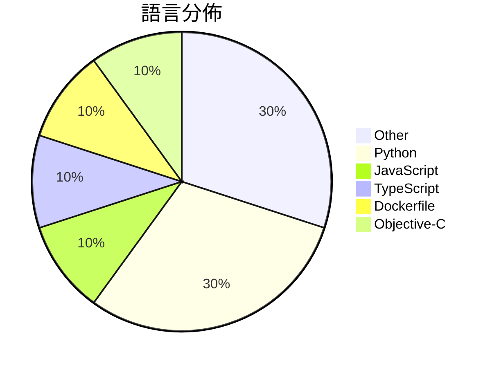

# GitHub Trending - 2026-03-28

> [!summary] 本日摘要
> 收錄 **10** 個新專案，合計 **16.2k** stars
> 語言分佈：Other (3) · Python (3) · JavaScript (1) · TypeScript (1) · Dockerfile (1) · Objective-C (1)

> [!tip] 本週焦點
> **[[slavingia--skills|slavingia/skills]]** — 4 天內累積 4.5k stars（1.1k stars/天）
> 提供基於《The Minimalist Entrepreneur》的 Claude Code 技能，幫助創業者從零開始建立業務。



---

## 收錄列表

| # | 專案 | 分類 | Stars | 速度 | 安裝 | 語言 | 用途 |
| :--: | --- | --- | ---: | ---: | --- | --- | --- |
| 1 | [[slavingia--skills\|slavingia/skills]] | 開發工具 | 4.5k | 1.1k/天 | `easy` | N/A | 提供基於《The Minimalist Entrepreneur》的 Claud |
| 2 | [[zarazhangrui--codebase-to-course\|zarazhangrui/codebase-to-course]] | 其他 | 2.1k | 414/天 | `easy` | N/A | 將任何代碼庫轉換為美觀的互動式單頁 HTML 課程，幫助非技術性使用者理解代碼運 |
| 3 | [[HKUDS--OpenSpace\|HKUDS/OpenSpace]] | AI/ML | 1.5k | 491/天 | `medium` | Python | 讓你的 AI 代理更智能、低成本且自我進化。 |
| 4 | [[alvinunreal--awesome-opensource-ai\|alvinunreal/awesome-opensource-ai]] | 其他 | 1.5k | 487/天 | `easy` | N/A | 提供最佳的真正開源 AI 專案、模型、工具和基礎設施的精選列表。 |
| 5 | [[magnum6actual--flipoff\|magnum6actual/flipoff]] | 其他 | 1.3k | 1.3k/天 | `easy` | JavaScript | 將任何電視轉變為復古的翻板顯示器，無需昂貴的硬體設備。 |
| 6 | [[louislva--claude-peers-mcp\|louislva/claude-peers-mcp]] | 開發工具 | 1.3k | 216/天 | `easy` | TypeScript | 讓多個 Claude Code 實例之間可以即時通訊，提升協作效率。 |
| 7 | [[dou-jiang--codex-console\|dou-jiang/codex-console]] | 開發工具 | 1.1k | 191/天 | `medium` | Python | 提供集成化控制台，支持任务管理、批量处理、数据导出等功能，优化 OpenAI 注 |
| 8 | [[GAIR-NLP--daVinci-MagiHuman\|GAIR-NLP/daVinci-MagiHuman]] | AI/ML | 1.0k | 203/天 | `medium` | Python | 提供快速生成音視頻的單流架構基礎模型。 |
| 9 | [[CoderLuii--HolyClaude\|CoderLuii/HolyClaude]] | 開發工具 | 969 | 162/天 | `easy` | Dockerfile | 提供一個完整的 AI 開發工作站，整合 Claude Code、網頁介面及多種開 |
| 10 | [[opa334--darksword-kexploit\|opa334/darksword-kexploit]] | 安全 | 956 | 239/天 | `medium` | Objective-C | 針對 iOS <=26.0.1 的 DarkSword 核心漏洞進行 Objec |

---

## 重點摘要

### 1. [[slavingia--skills|slavingia/skills]] `開發工具`

> 提供基於《The Minimalist Entrepreneur》的 Claude Code 技能，幫助創業者從零開始建立業務。

**4.5k** stars · **1.1k** stars/天 · N/A · `easy`

_建立 4 天內累積 4473 stars（1118/天），forks 303（6.8%），顯示出強烈的社群興趣。作者 Sahil Lavingia 是《The Minimalist Entrepreneur》的作者，這本書在創業圈內受到廣泛關注，解決了許多創業者在初期階段的痛點。這個專案的推出正好填補了市場上對於實用創業技能的需求，並且在社交媒體上引發了討論。高 forks/stars 比率顯示出許多人對這個專案進行了實際的修改和使用，反映出其實用性和靈活性。_

---

### 2. [[zarazhangrui--codebase-to-course|zarazhangrui/codebase-to-course]] `其他`

> 將任何代碼庫轉換為美觀的互動式單頁 HTML 課程，幫助非技術性使用者理解代碼運作。

**2.1k** stars · **414** stars/天 · N/A · `easy`

_建立 5 天內累積 2069 stars（414/天），forks 189（9.1%），顯示出強烈的興趣和需求。作者 zarazhangrui 之前的作品可能已建立了一定的信譽，這個工具解決了非技術性使用者在學習代碼時的痛點，提供了一種更直觀的學習方式。近期的推廣活動（如被 Awesome Claude Code 特別推薦）也可能促進了其曝光率。這個工具的設計理念符合當前對於互動式學習的需求，並且在技術生態中填補了針對「Vibe Coders」的空白。forks/stars 比率為 9.1%，顯示出不少人對其進行實際修改和使用。_

---

### 3. [[HKUDS--OpenSpace|HKUDS/OpenSpace]] `AI/ML`

> 讓你的 AI 代理更智能、低成本且自我進化。

**1.5k** stars · **491** stars/天 · Python · `medium`

_建立 3 天內已累積 1473 stars（491/天），forks 166（11.3%），顯示出強烈的社群興趣。這個專案的主要貢獻者來自 HKUDS 團隊，專注於 AI 和自我進化技術，解決了傳統 AI 代理在適應性和成本效益上的痛點。之前的解決方案往往無法有效利用過去的學習，導致重複的資源浪費。這個專案的推出正好填補了這一空白，並且在社群中引起了廣泛的討論和實驗。forks/stars 比率為 11.3%，顯示出許多人對這個專案的實際修改和使用有興趣。_

---

### 4. [[alvinunreal--awesome-opensource-ai|alvinunreal/awesome-opensource-ai]] `其他`

> 提供最佳的真正開源 AI 專案、模型、工具和基礎設施的精選列表。

**1.5k** stars · **487** stars/天 · N/A · `easy`

_建立 3 天就累積 1460 stars（487/天），forks 109（7.5%），顯示出強勁的增長潛力。這個專案由多位貢獻者共同維護，確保了內容的多樣性和質量。它解決了開發者在尋找開源 AI 資源時的痛點，因為過去的資源往往分散且難以篩選。沒有類似的綜合性列表能夠提供如此多樣的選擇和詳細的描述，這使得該專案在社群中迅速受到關注。社群的活躍度和開放的貢獻機制也促進了其快速成長。這個專案的成功反映了開源 AI 資源需求的上升，以及開發者對於高品質資源的渴望。_

---

### 5. [[magnum6actual--flipoff|magnum6actual/flipoff]] `其他`

> 將任何電視轉變為復古的翻板顯示器，無需昂貴的硬體設備。

**1.3k** stars · **1.3k** stars/天 · JavaScript · `easy`

_建立 1 天就累積 1337 stars（1337/天），forks 184（13.8%），這顯示出強烈的興趣和需求。作者的背景不明，但這個專案解決了高價翻板顯示器的痛點，提供了一個免費的替代方案。沒有明顯的觸發事件，但其獨特的功能和免費的特性吸引了許多使用者。技術上，這個工具的可行性來自於現代瀏覽器對 HTML/CSS/JS 的良好支援。forks/stars 比率為 13.8%，這表示有相當一部分使用者在進行實際修改，顯示出對這個專案的實際應用需求。_

---

### 6. [[louislva--claude-peers-mcp|louislva/claude-peers-mcp]] `開發工具`

> 讓多個 Claude Code 實例之間可以即時通訊，提升協作效率。

**1.3k** stars · **216** stars/天 · TypeScript · `easy`

_建立 6 天內累積 1296 stars（216/天），forks 128（9.9%），顯示出快速的增長潛力。作者 louislva 專注於 Claude 生態系統，這個工具解決了多實例間通訊的痛點，之前的方案往往缺乏即時性和簡易性。雖然沒有明顯的觸發事件，但這個工具的實用性和簡單性吸引了不少開發者的注意。這個工具的 forks/stars 比率接近 10%，顯示出使用者對其進行實際修改和擴展的興趣。_

---

### 7. [[dou-jiang--codex-console|dou-jiang/codex-console]] `開發工具`

> 提供集成化控制台，支持任务管理、批量处理、数据导出等功能，优化 OpenAI 注册流程。

**1.1k** stars · **191** stars/天 · Python · `medium`

_建立 6 天就累積 1146 stars（191/天），forks 664（57.9%），這顯示出強烈的社群需求。作者 dou-jiang 及其團隊在開源社群中有一定的影響力，之前的 cnlimiter/codex-manager 也有良好的基礎。這個專案解決了 OpenAI 註冊過程中的多個痛點，特別是對於需要大量註冊的用戶來說，這個工具的出現填補了市場的空白。社群的活躍度和對問題的快速反應也促進了其快速增長。_

---

### 8. [[GAIR-NLP--daVinci-MagiHuman|GAIR-NLP/daVinci-MagiHuman]] `AI/ML`

> 提供快速生成音視頻的單流架構基礎模型。

**1.0k** stars · **203** stars/天 · Python · `medium`

_建立 5 天內累積 1014 stars（203/天），forks 78（7.7%），顯示出穩定的增長趨勢。作者 SII-GAIR 和 Sand.ai 具備相關技術背景，解決了音視頻生成中多流模型的複雜性問題，之前的方案如 Ovi 和 LTX 在性能上存在瓶頸。社群的活躍度和熱門問題顯示出用戶對於模型的實際應用和擴展性有高度關注。這個工具的出現正好滿足了對於高效能音視頻生成的需求，尤其是在多語言環境下的應用。_

---

### 9. [[CoderLuii--HolyClaude|CoderLuii/HolyClaude]] `開發工具`

> 提供一個完整的 AI 開發工作站，整合 Claude Code、網頁介面及多種開發工具，讓開發者快速上手。

**969** stars · **162** stars/天 · Dockerfile · `easy`

_建立 6 天內累積 969 stars（162/天），forks 100（10.3%），顯示出強勁的增長潛力。作者 CoderLuii 之前有開發其他開源工具，這次針對開發者在使用 Claude Code 時的繁瑣流程提出了解決方案。HolyClaude 的出現解決了許多開發者在環境配置上的痛點，特別是對於需要快速上手的使用者。社群的反饋和需求也促進了這個專案的成長，尤其是對於 Docker 和 AI 開發工具的需求日益增加。_

---

### 10. [[opa334--darksword-kexploit|opa334/darksword-kexploit]] `安全`

> 針對 iOS <=26.0.1 的 DarkSword 核心漏洞進行 Objective-C 重實作。

**956** stars · **239** stars/天 · Objective-C · `medium`

_建立 4 天內累積 956 stars（239/天），forks 348（36.4%），顯示出強烈的社群關注。作者 opa334 以其在 iOS 安全領域的經驗而聞名，這個專案解決了許多開發者在測試 iOS 漏洞時面臨的困難。之前的解決方案往往需要複雜的配置或缺乏針對性，這使得 DarkSword 的簡化實作成為一個受歡迎的選擇。社群的反應熱烈，尤其是對於如何使用這個工具的問題，顯示出需求的迫切性。這個專案的成功也反映了 iOS 安全研究領域的持續興趣和活躍度。_

---

## 今日到期複習

> [!tip] 根據間隔複習排程，今天該回顧的專案

```dataview
TABLE
  stars_per_day AS "Stars/天",
  category AS "分類",
  engagement AS "參與度"
FROM "Repos"
WHERE next_review AND date(next_review) <= date("2026-03-28") AND status != "archived"
SORT priority DESC
```

## 待處理

```dataviewjs
const pending = dv.pages('"Repos"').where(p => p.status === "to-review").length;
const unrated = dv.pages('"Repos"').where(p => p.status !== "archived" && p.status !== "to-review" && (p.my_rating || 0) === 0).length;
const noVerdict = dv.pages('"Repos"').where(p => p.status !== "archived" && (p.my_rating || 0) > 0 && (!p.verdict || p.verdict === "")).length;
const items = [];
if (pending > 0) items.push(`**${pending}** 個待分流`);
if (unrated > 0) items.push(`**${unrated}** 個已讀但未評分`);
if (noVerdict > 0) items.push(`**${noVerdict}** 個已評分但無結論`);
if (items.length > 0) dv.paragraph(items.join(" / "));
else dv.paragraph("所有專案都已處理完畢！");
```
