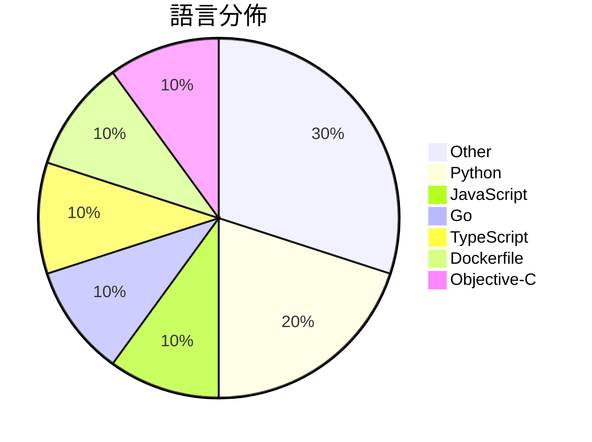

# GitHub Trending - 2026-03-29

> [!summary] 本日摘要
> 收錄 **10** 個新專案，合計 **19.5k** stars
> 語言分佈：Other (3) · Python (2) · JavaScript (1) · Go (1) · TypeScript (1) · Dockerfile (1) · Objective-C (1)

> [!tip] 本週焦點
> **[[slavingia--skills|slavingia/skills]]** — 5 天內累積 5.0k stars（997 stars/天）
> 提供基於《極簡主義企業家》的 Claude Code 技能，幫助創業者從想法到實踐。



---

## 收錄列表

| # | 專案 | 分類 | Stars | 速度 | 安裝 | 語言 | 用途 |
| :--: | --- | --- | ---: | ---: | --- | --- | --- |
| 1 | [[slavingia--skills\|slavingia/skills]] | 開發工具 | 5.0k | 997/天 | `easy` | N/A | 提供基於《極簡主義企業家》的 Claude Code 技能，幫助創業者從想法到實 |
| 2 | [[zarazhangrui--codebase-to-course\|zarazhangrui/codebase-to-course]] | 其他 | 2.3k | 383/天 | `easy` | N/A | 將任何代碼庫轉換為美觀的互動式單頁 HTML 課程，幫助非技術背景的使用者理解代 |
| 3 | [[magnum6actual--flipoff\|magnum6actual/flipoff]] | 其他 | 2.1k | 1.0k/天 | `easy` | JavaScript | 將任何電視轉換為復古的翻轉顯示器，無需昂貴的硬體。 |
| 4 | [[HKUDS--OpenSpace\|HKUDS/OpenSpace]] | AI/ML | 1.9k | 487/天 | `medium` | Python | 讓你的 AI 代理更聰明、低成本、自我進化的工具。 |
| 5 | [[alvinunreal--awesome-opensource-ai\|alvinunreal/awesome-opensource-ai]] | 其他 | 1.7k | 437/天 | `easy` | N/A | 整理出最優質的開源 AI 專案、模型、工具和基礎設施。 |
| 6 | [[larksuite--cli\|larksuite/cli]] | CLI 工具 | 1.7k | 570/天 | `easy` | Go | 提供 Lark/Feishu 的命令行工具，讓用戶和 AI 代理輕鬆操作各種業務 |
| 7 | [[elder-plinius--G0DM0D3\|elder-plinius/G0DM0D3]] | AI/ML | 1.5k | 503/天 | `easy` | TypeScript | 提供開放源碼的多模型聊天介面，專為駭客和哲學家設計，強調隱私與自由。 |
| 8 | [[CoderLuii--HolyClaude\|CoderLuii/HolyClaude]] | 開發工具 | 1.2k | 170/天 | `easy` | Dockerfile | 提供一個完整的 AI 編程工作站，整合 Claude Code、網頁介面及多種  |
| 9 | [[GAIR-NLP--daVinci-MagiHuman\|GAIR-NLP/daVinci-MagiHuman]] | AI/ML | 1.1k | 180/天 | `medium` | Python | 提供一個快速的音視頻生成基礎模型，專注於人類表現的自然性和同步性。 |
| 10 | [[opa334--darksword-kexploit\|opa334/darksword-kexploit]] | 安全 | 991 | 198/天 | `medium` | Objective-C | 實現 iOS <=26.0.1 的 DarkSword 核心漏洞利用，讓舊設備能 |

---

## 重點摘要

### 1. [[slavingia--skills|slavingia/skills]] `開發工具`

> 提供基於《極簡主義企業家》的 Claude Code 技能，幫助創業者從想法到實踐。

**5.0k** stars · **997** stars/天 · N/A · `easy`

_建立 5 天內累積 4987 stars（997/天），forks 345（6.9%），這顯示出強烈的興趣和需求。專案的主要貢獻者 slavingia 及其團隊在創業和產品開發領域有豐富的經驗，這使得他們能夠針對創業者的痛點提供切實可行的解決方案。這個工具填補了創業者在初期階段缺乏指導的空白，特別是在驗證商業想法和建立客戶基礎方面。社群的反饋和需求推動了這個專案的快速成長，並且在社交媒體上也引發了討論，進一步提升了其知名度。_

---

### 2. [[zarazhangrui--codebase-to-course|zarazhangrui/codebase-to-course]] `其他`

> 將任何代碼庫轉換為美觀的互動式單頁 HTML 課程，幫助非技術背景的使用者理解代碼運作。

**2.3k** stars · **383** stars/天 · N/A · `easy`

_建立 6 天內累積 2297 stars（383/天），forks 205（8.9%），顯示出強勁的增長潛力。作者 Zara 是 Claude Code 的開發者，專注於為非技術使用者提供學習工具。這個專案解決了傳統學習方式的痛點，讓使用者能夠在實際操作中學習，而不是僅僅依賴理論。社群的反饋和需求驅動了這個工具的發展，特別是在 AI 編碼工具日益流行的背景下。forks/stars 比率為 8.9%，顯示出有相當比例的使用者在實際修改和使用這個工具。_

---

### 3. [[magnum6actual--flipoff|magnum6actual/flipoff]] `其他`

> 將任何電視轉換為復古的翻轉顯示器，無需昂貴的硬體。

**2.1k** stars · **1.0k** stars/天 · JavaScript · `easy`

_建立 2 天內累積 2068 stars（1034/天），forks 252（12.2%），顯示出強烈的興趣和潛在的使用者基礎。這個專案的作者是 magnum6actual，過去未有明顯的相關專案。FlipOff 解決了高價位翻轉顯示器的痛點，讓任何人都能以低成本享受類似的視覺效果。最近的推廣活動或社交媒體討論可能促進了其快速增長。由於其簡單的安裝和使用方式，這使得 FlipOff 在開源社群中獲得了良好的反響。forks/stars 比率為 12.2%，顯示出許多用戶對於修改和擴展此專案的興趣。_

---

### 4. [[HKUDS--OpenSpace|HKUDS/OpenSpace]] `AI/ML`

> 讓你的 AI 代理更聰明、低成本、自我進化的工具。

**1.9k** stars · **487** stars/天 · Python · `medium`

_建立 4 天內累積 1947 stars（487/天），forks 216（11.1%），顯示出強勁的增長潛力。開發者 HKUDS 團隊在 AI 代理領域已有多項貢獻，這個專案解決了現有 AI 工具無法自我進化的痛點，讓使用者能夠透過技能演化來提升代理的效能。近期的安全問題引起了社群的關注，進一步促進了討論和改進。技術上，OpenSpace 利用最新的 LLM 技術和演算法，讓這個工具在市場上具有競爭力。_

---

### 5. [[alvinunreal--awesome-opensource-ai|alvinunreal/awesome-opensource-ai]] `其他`

> 整理出最優質的開源 AI 專案、模型、工具和基礎設施。

**1.7k** stars · **437** stars/天 · N/A · `easy`

_建立 4 天內累積 1746 stars（437/天），forks 134（7.7%），顯示出強烈的興趣和需求。作者 alvinunreal 和其他貢獻者在開源社群中有一定的影響力，這個列表填補了開源 AI 資源整合的空白，讓開發者能夠更方便地找到合適的工具。隨著開源 AI 的興起，這樣的資源列表變得越來越重要，特別是在快速變化的技術環境中。社群的反饋和需求促進了這個專案的快速成長，並且它的內容不斷更新以反映最新的技術趨勢。_

---

### 6. [[larksuite--cli|larksuite/cli]] `CLI 工具`

> 提供 Lark/Feishu 的命令行工具，讓用戶和 AI 代理輕鬆操作各種業務功能。

**1.7k** stars · **570** stars/天 · Go · `easy`

_建立 3 天內累積 1710 stars（570/天），forks 79（4.6%），顯示出穩定的增長潛力。這個專案由 Lark 官方團隊開發，解決了用戶在使用 Lark API 時的繁瑣操作問題，之前的解決方案多依賴於手動調用 API，效率低下。社群的反饋和需求推動了這個工具的快速發展，特別是對於 AI 代理的支持，使得它在現有工具中脫穎而出。這個工具的出現正好契合了企業對於自動化和高效協作的需求，並且其開源性質降低了使用門檻。_

---

### 7. [[elder-plinius--G0DM0D3|elder-plinius/G0DM0D3]] `AI/ML`

> 提供開放源碼的多模型聊天介面，專為駭客和哲學家設計，強調隱私與自由。

**1.5k** stars · **503** stars/天 · TypeScript · `easy`

_建立 3 天就累積 1509 stars（503/天），forks 294（19.5%），顯示出強烈的社群興趣。作者 elder-plinius 以開源社群為背景，專注於創造自由的 AI 互動體驗，這解決了許多用戶對於隱私和數據控制的擔憂。這個專案的推出正好符合當前對於開放性和隱私保護的需求，並且在社交媒體上引發了討論，進一步推動了其流行。高達 19.5% 的 forks/stars 比率顯示出許多人在積極修改和使用這個工具，而不是僅僅觀望。_

---

### 8. [[CoderLuii--HolyClaude|CoderLuii/HolyClaude]] `開發工具`

> 提供一個完整的 AI 編程工作站，整合 Claude Code、網頁介面及多種 AI CLI 工具。

**1.2k** stars · **170** stars/天 · Dockerfile · `easy`

_建立 7 天內累積 1187 stars（170/天），forks 122（10.3%），顯示出穩定的增長趨勢。這個專案由 CoderLuii 和 Sunwood-ai-labs 共同開發，解決了開發者在搭建 AI 編程環境時的繁瑣流程。過去，開發者需要手動安裝和配置各種工具，這不僅耗時，還容易出錯。HolyClaude 的出現讓這一切變得簡單，特別是在 Docker 生態系統日益成熟的背景下，這種容器化的解決方案越來越受到青睞。forks/stars 比率為 10.3%，顯示出有相當比例的用戶在實際修改和使用這個工具。_

---

### 9. [[GAIR-NLP--daVinci-MagiHuman|GAIR-NLP/daVinci-MagiHuman]] `AI/ML`

> 提供一個快速的音視頻生成基礎模型，專注於人類表現的自然性和同步性。

**1.1k** stars · **180** stars/天 · Python · `medium`

_建立 6 天內累積 1078 stars（180/天），forks 84（7.8%），顯示出穩定的增長趨勢。這個專案的主要貢獻者來自 SII-GAIR 和 Sand.ai，過去在音視頻生成領域有豐富經驗。它解決了傳統多模態模型在生成速度和質量上的痛點，特別是對於需要高效生成的應用場景。社群的活躍度和開放源碼的特性也吸引了許多開發者的關注。這個工具的出現正好符合當前對於高效能生成模型的需求，尤其是在音視頻內容創作上。_

---

### 10. [[opa334--darksword-kexploit|opa334/darksword-kexploit]] `安全`

> 實現 iOS <=26.0.1 的 DarkSword 核心漏洞利用，讓舊設備能夠獲得更高的權限。

**991** stars · **198** stars/天 · Objective-C · `medium`

_建立 5 天就累積 991 stars（198/天），forks 370（37.3%），顯示出強烈的社群興趣。作者 opa334 以其在越獄社群中的知名度而受到關注，過去也有其他成功的越獄工具。這個專案解決了 iOS 15-26.0.1 版本的核心漏洞利用需求，之前的工具往往無法針對這些版本進行有效的越獄。近期的推特討論和社群反饋也促進了這個專案的曝光。由於 iOS 系統的封閉性，這類工具的需求一直存在，且 forks/stars 比率高，顯示出許多人對此工具的實際修改和使用。這表明社群對於這個工具的實用性和潛在價值的認可。_

---

## 今日到期複習

> [!tip] 根據間隔複習排程，今天該回顧的專案

```dataview
TABLE
  stars_per_day AS "Stars/天",
  category AS "分類",
  engagement AS "參與度"
FROM "Repos"
WHERE next_review AND date(next_review) <= date("2026-03-29") AND status != "archived"
SORT priority DESC
```

## 待處理

```dataviewjs
const pending = dv.pages('"Repos"').where(p => p.status === "to-review").length;
const unrated = dv.pages('"Repos"').where(p => p.status !== "archived" && p.status !== "to-review" && (p.my_rating || 0) === 0).length;
const noVerdict = dv.pages('"Repos"').where(p => p.status !== "archived" && (p.my_rating || 0) > 0 && (!p.verdict || p.verdict === "")).length;
const items = [];
if (pending > 0) items.push(`**${pending}** 個待分流`);
if (unrated > 0) items.push(`**${unrated}** 個已讀但未評分`);
if (noVerdict > 0) items.push(`**${noVerdict}** 個已評分但無結論`);
if (items.length > 0) dv.paragraph(items.join(" / "));
else dv.paragraph("所有專案都已處理完畢！");
```
