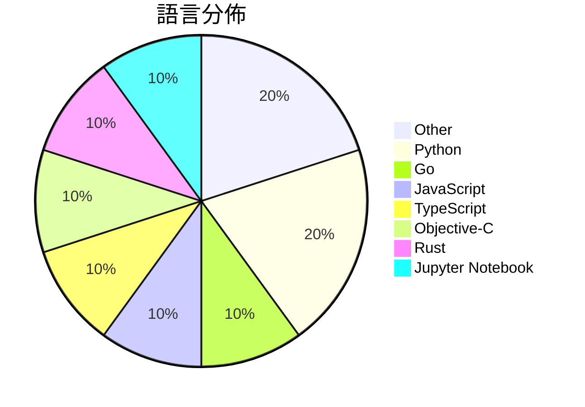

# GitHub Trending - 2026-03-30

> [!summary] 本日摘要
> 收錄 **10** 個新專案，合計 **21.1k** stars
> 語言分佈：Other (2) · Python (2) · Go (1) · JavaScript (1) · TypeScript (1) · Objective-C (1) · Rust (1) · Jupyter Notebook (1)

> [!tip] 本週焦點
> **[[slavingia--skills|slavingia/skills]]** — 6 天內累積 5.4k stars（902 stars/天）
> 提供基於《極簡主義企業家》的 Claude Code 技能，幫助創業者從想法到實踐。



---

## 收錄列表

| # | 專案 | 分類 | Stars | 速度 | 安裝 | 語言 | 用途 |
| :--: | --- | --- | ---: | ---: | --- | --- | --- |
| 1 | [[slavingia--skills\|slavingia/skills]] | 開發工具 | 5.4k | 902/天 | `easy` | N/A | 提供基於《極簡主義企業家》的 Claude Code 技能，幫助創業者從想法到實 |
| 2 | [[larksuite--cli\|larksuite/cli]] | CLI 工具 | 3.1k | 764/天 | `easy` | Go | 提供 Lark/Feishu 平台的命令行工具，讓開發者和 AI Agent 更 |
| 3 | [[HKUDS--OpenSpace\|HKUDS/OpenSpace]] | AI/ML | 2.5k | 494/天 | `medium` | Python | 讓你的 AI 代理變得更聰明、低成本且自我進化。 |
| 4 | [[magnum6actual--flipoff\|magnum6actual/flipoff]] | 其他 | 2.4k | 808/天 | `easy` | JavaScript | 將任何電視變成復古的翻頁顯示器，無需昂貴的硬體。 |
| 5 | [[elder-plinius--G0DM0D3\|elder-plinius/G0DM0D3]] | AI/ML | 2.0k | 501/天 | `easy` | TypeScript | 提供一個開放源碼的多模型聊天介面，專為駭客和哲學家設計，重視隱私與自由。 |
| 6 | [[alvinunreal--awesome-opensource-ai\|alvinunreal/awesome-opensource-ai]] | 開發工具 | 1.9k | 386/天 | `easy` | N/A | 整理出最佳的真正開源 AI 專案、模型、工具和基礎設施。 |
| 7 | [[opa334--darksword-kexploit\|opa334/darksword-kexploit]] | 安全 | 1.0k | 173/天 | `medium` | Objective-C | 針對 iOS <=26.0.1 的 DarkSword Kernel Explo |
| 8 | [[nashsu--opencli-rs\|nashsu/opencli-rs]] | CLI 工具 | 982 | 196/天 | `easy` | Rust | 一個快速且安全的命令行工具，讓你透過單一指令從各大網站獲取資訊。 |
| 9 | [[facebookresearch--tribev2\|facebookresearch/tribev2]] | AI/ML | 900 | 180/天 | `medium` | Jupyter Notebook | 預測大腦反應的多模態模型，結合視覺、聽覺和語言數據。 |
| 10 | [[jxnxts--mcp-brasil\|jxnxts/mcp-brasil]] | 開發工具 | 875 | 219/天 | `easy` | Python | 提供連接41個巴西公共API的MCP伺服器，方便AI代理使用政府數據。 |

---

## 重點摘要

### 1. [[slavingia--skills|slavingia/skills]] `開發工具`

> 提供基於《極簡主義企業家》的 Claude Code 技能，幫助創業者從想法到實踐。

**5.4k** stars · **902** stars/天 · N/A · `easy`

_建立 6 天就累積 5410 stars（902/天），forks 388（7.2%），這顯示出強烈的使用者興趣。作者 Sahil Lavingia 是一位知名創業者，他的書籍和理念吸引了大量創業者的關注。這個專案解決了創業者在早期階段缺乏實用指導的痛點，之前的工具多數過於理論化，無法提供具體操作。近期的社群討論和推廣活動進一步提升了其曝光率。技術上，Claude Code 的生態系統也為這個工具的實現提供了良好的基礎，讓使用者能夠輕鬆安裝和使用。forks/stars 比率為 7.2%，顯示出有相當比例的使用者在實際修改和使用這個專案。_

---

### 2. [[larksuite--cli|larksuite/cli]] `CLI 工具`

> 提供 Lark/Feishu 平台的命令行工具，讓開發者和 AI Agent 更方便地操作各種業務功能。

**3.1k** stars · **764** stars/天 · Go · `easy`

_建立 4 天內累積 3056 stars（764/天），forks 145（4.7%），顯示出強勁的增長潛力。主要貢獻者來自 Lark 團隊，這些開發者在開放平台的生態系統中有豐富的經驗。這個工具解決了開發者在使用 Lark API 時的繁瑣流程，之前的解決方案往往需要手動調用 API，效率低下。最近的推廣活動和社群討論也可能促進了這個工具的曝光度。高達 4.7% 的 forks/stars 比率顯示出社群對這個工具的實際修改和使用意圖。_

---

### 3. [[HKUDS--OpenSpace|HKUDS/OpenSpace]] `AI/ML`

> 讓你的 AI 代理變得更聰明、低成本且自我進化。

**2.5k** stars · **494** stars/天 · Python · `medium`

_建立 5 天內累積 2469 stars（494/天），forks 272（11.0%），這顯示出強勁的增長潛力。主要貢獻者包括 xlrrrr 和 chaohuang-ai，他們在開源社群中有著良好的聲譽。OpenSpace 解決了 AI 代理在自我進化和成本效益方面的痛點，之前的工具如 ClawWork 雖然功能強大，但缺乏自我演化的能力。最近的推文和社群討論也引發了對這個專案的關注。技術上，OpenSpace 利用現有的 LLM 和技能演化機制，讓其在市場上具備競爭力。forks/stars 比率為 11.0%，顯示出許多開發者對這個專案的實際修改和使用。_

---

### 4. [[magnum6actual--flipoff|magnum6actual/flipoff]] `其他`

> 將任何電視變成復古的翻頁顯示器，無需昂貴的硬體。

**2.4k** stars · **808** stars/天 · JavaScript · `easy`

_建立 3 天內累積 2423 stars（808/天），forks 291（12.0%），顯示出強勁的增長潛力。作者的背景不詳，但這個專案解決了將傳統翻頁顯示器的高昂成本問題，讓使用者能以零成本享受類似的效果。此專案的推出可能受到社群對懷舊風格顯示器的興趣驅動。高 forks/stars 比率顯示出許多人在實際修改和使用這個工具，反映出其實用性和受歡迎程度。_

---

### 5. [[elder-plinius--G0DM0D3|elder-plinius/G0DM0D3]] `AI/ML`

> 提供一個開放源碼的多模型聊天介面，專為駭客和哲學家設計，重視隱私與自由。

**2.0k** stars · **501** stars/天 · TypeScript · `easy`

_建立 4 天就累積 2002 stars（501/天），forks 388（19.4%），這顯示出相當高的社群參與度。作者 elder-plinius 以開源為核心理念，過去的專案也都強調自由與隱私。G0DM0D3 解決了傳統 AI 聊天工具在隱私和自由度上的不足，特別適合對於數據隱私有高要求的使用者。社群的活躍度和開放的貢獻方式也促進了其快速增長。這個工具的出現正好契合了對於開放性和隱私保護的需求，尤其是在當前的 AI 生態中。_

---

### 6. [[alvinunreal--awesome-opensource-ai|alvinunreal/awesome-opensource-ai]] `開發工具`

> 整理出最佳的真正開源 AI 專案、模型、工具和基礎設施。

**1.9k** stars · **386** stars/天 · N/A · `easy`

_建立 5 天就累積 1931 stars（386/天），forks 149（7.7%），顯示出強勁的增長潛力。作者 alvinunreal 及其團隊專注於開源 AI 資源的整理，解決了開發者在尋找合適工具時的困難，這在目前的開源生態中是相對缺乏的。這個專案的推出引起了社群的廣泛關注，特別是在 AI 工具需求日益增加的背景下。高比例的 forks/stars 也顯示出許多人對這個專案的實際修改和使用意圖，顯示出其在開源社群中的重要性。_

---

### 7. [[opa334--darksword-kexploit|opa334/darksword-kexploit]] `安全`

> 針對 iOS <=26.0.1 的 DarkSword Kernel Exploit 重新實作，使用 Objective-C。

**1.0k** stars · **173** stars/天 · Objective-C · `medium`

_建立 6 天內累積 1038 stars（173/天），forks 383（36.9%），顯示出強烈的社群興趣。作者 opa334 是知名的 iOS 安全研究者，過去有多個相關專案，這次的實作解決了在舊版 iOS 上獲取內核訪問的需求，這在現有工具中並不常見。近期的推廣和社群討論也促進了這個專案的曝光度。這個工具的出現恰好填補了市場上對於舊版 iOS 漏洞利用的需求，特別是在開發者和安全研究者中。forks/stars 比率高達 36.9%，顯示出許多人在實際修改和使用這個專案。_

---

### 8. [[nashsu--opencli-rs|nashsu/opencli-rs]] `CLI 工具`

> 一個快速且安全的命令行工具，讓你透過單一指令從各大網站獲取資訊。

**982** stars · **196** stars/天 · Rust · `easy`

_建立 5 天就累積 982 stars（196/天），forks 72（7.3%），這顯示出穩定的增長。作者 nashsu 之前在開源社群活躍，這個專案解決了從多個網站獲取資訊的繁瑣過程，特別是對於需要快速獲取數據的開發者來說，這是一個高效的工具。社群對於其效能和易用性表現出興趣，特別是在 AI 代理的應用場景中。最近的推文和討論也引起了更多開發者的注意，進一步推動了其流行。_

---

### 9. [[facebookresearch--tribev2|facebookresearch/tribev2]] `AI/ML`

> 預測大腦反應的多模態模型，結合視覺、聽覺和語言數據。

**900** stars · **180** stars/天 · Jupyter Notebook · `medium`

_建立 5 天內累積 900 stars（180/天），forks 175（19.4%），顯示出強烈的社群興趣。作者 sdascoli 來自 Facebook Research，過去有多項關於神經科學的研究，這個專案解決了多模態數據整合的需求，之前的工具往往無法有效處理這些數據。近期的推文和學術發表也引起了廣泛討論，進一步推動了其流行。技術上，隨著深度學習和多模態學習的進步，這個工具的可行性大幅提升。高達 19.4% 的 forks/stars 比率顯示出許多人正在實際修改和使用這個工具，而不僅僅是觀望。_

---

### 10. [[jxnxts--mcp-brasil|jxnxts/mcp-brasil]] `開發工具`

> 提供連接41個巴西公共API的MCP伺服器，方便AI代理使用政府數據。

**875** stars · **219** stars/天 · Python · `easy`

_建立4天內累積875 stars（219/天），forks 112（12.8%），顯示出強勁的增長潛力。這個專案的作者jxnxts和kfcaio在開源社群中有一定的影響力，之前也參與過類似的公共數據整合項目。mcp-brasil解決了巴西公共數據接入的痛點，讓開發者能夠輕鬆訪問各種政府數據，這在當前數據驅動的環境中非常重要。社群的討論和需求也促進了這個專案的快速發展，特別是在AI和數據科學領域的應用需求上。forks/stars比率為12.8%，顯示出許多開發者對此專案的實際修改和使用。_

---

## 今日到期複習

> [!tip] 根據間隔複習排程，今天該回顧的專案

```dataview
TABLE
  stars_per_day AS "Stars/天",
  category AS "分類",
  engagement AS "參與度"
FROM "Repos"
WHERE next_review AND date(next_review) <= date("2026-03-30") AND status != "archived"
SORT priority DESC
```

## 待處理

```dataviewjs
const pending = dv.pages('"Repos"').where(p => p.status === "to-review").length;
const unrated = dv.pages('"Repos"').where(p => p.status !== "archived" && p.status !== "to-review" && (p.my_rating || 0) === 0).length;
const noVerdict = dv.pages('"Repos"').where(p => p.status !== "archived" && (p.my_rating || 0) > 0 && (!p.verdict || p.verdict === "")).length;
const items = [];
if (pending > 0) items.push(`**${pending}** 個待分流`);
if (unrated > 0) items.push(`**${unrated}** 個已讀但未評分`);
if (noVerdict > 0) items.push(`**${noVerdict}** 個已評分但無結論`);
if (items.length > 0) dv.paragraph(items.join(" / "));
else dv.paragraph("所有專案都已處理完畢！");
```
