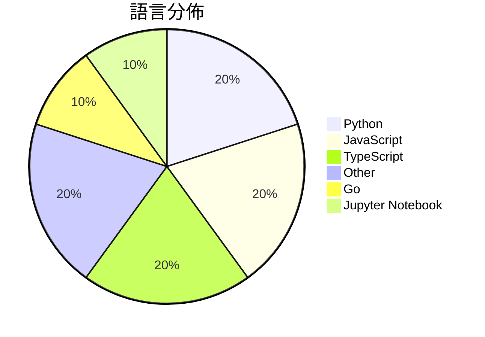

# GitHub Trending - 2026-03-31

> [!summary] 本日摘要
> 收錄 **10** 個新專案，合計 **21.1k** stars
> 語言分佈：Python (2) · JavaScript (2) · TypeScript (2) · Other (2) · Go (1) · Jupyter Notebook (1)

> [!tip] 本週焦點
> **[[larksuite--cli|larksuite/cli]]** — 5 天內累積 4.7k stars（937 stars/天）
> 提供 Lark/Feishu 開放平台的命令列工具，讓人類和 AI 代理能輕鬆管理多種業務功能。



---

## 收錄列表

| # | 專案 | 分類 | Stars | 速度 | 安裝 | 語言 | 用途 |
| :--: | --- | --- | ---: | ---: | --- | --- | --- |
| 1 | [[larksuite--cli\|larksuite/cli]] | CLI 工具 | 4.7k | 937/天 | `easy` | Go | 提供 Lark/Feishu 開放平台的命令列工具，讓人類和 AI 代理能輕鬆管 |
| 2 | [[HKUDS--OpenSpace\|HKUDS/OpenSpace]] | AI/ML | 2.9k | 480/天 | `medium` | Python | 讓 AI 代理自我進化，提升智能與成本效益。 |
| 3 | [[magnum6actual--flipoff\|magnum6actual/flipoff]] | 其他 | 2.5k | 629/天 | `easy` | JavaScript | 將任何電視轉變為復古的分頁翻轉顯示器，無需昂貴的硬體。 |
| 4 | [[elder-plinius--G0DM0D3\|elder-plinius/G0DM0D3]] | AI/ML | 2.3k | 451/天 | `easy` | TypeScript | 提供一個開源的多模型 AI 聊天介面，專為駭客和系統研究者設計。 |
| 5 | [[alvinunreal--awesome-opensource-ai\|alvinunreal/awesome-opensource-ai]] | 其他 | 2.1k | 344/天 | `easy` | N/A | 彙整最佳的真正開源 AI 專案、模型、工具和基礎設施。 |
| 6 | [[TheTom--turboquant_plus\|TheTom/turboquant_plus]] | AI/ML | 1.9k | 315/天 | `medium` | Python | 透過 KV 快取壓縮技術提升本地 LLM 推論效率。 |
| 7 | [[openai--codex-plugin-cc\|openai/codex-plugin-cc]] | 開發工具 | 1.4k | 1.4k/天 | `easy` | JavaScript | 讓 Claude Code 用 Codex 進行代碼審查或委派任務。 |
| 8 | [[qiuzhi2046--Qclaw\|qiuzhi2046/Qclaw]] | 開發工具 | 1.3k | 645/天 | `easy` | TypeScript | 讓小白也能輕鬆使用 OpenClaw 的桌面應用程式。 |
| 9 | [[facebookresearch--tribev2\|facebookresearch/tribev2]] | AI/ML | 1.0k | 175/天 | `medium` | Jupyter Notebook | 預測大腦反應的多模態模型，結合視覺、聽覺和語言。 |
| 10 | [[yetone--voice-input-src\|yetone/voice-input-src]] | 開發工具 | 1.0k | 1.0k/天 | `medium` | N/A | 實現一個 macOS 菜單欄語音輸入應用，支持多語言及即時轉錄。 |

---

## 重點摘要

### 1. [[larksuite--cli|larksuite/cli]] `CLI 工具`

> 提供 Lark/Feishu 開放平台的命令列工具，讓人類和 AI 代理能輕鬆管理多種業務功能。

**4.7k** stars · **937** stars/天 · Go · `easy`

_建立 5 天就累積 4683 stars（937/天），forks 217（4.6%），這顯示出強烈的社群興趣。這個專案由 Lark 團隊維護，解決了用戶在使用 Lark API 時的繁瑣操作，之前的解決方案多依賴於手動調用 API，效率低下。最近在社群中引發的討論和需求，促使了這個工具的快速成長。技術上，隨著 Node.js 和 Go 的普及，這個工具的可行性大大提升，並且其開源性質降低了使用門檻。_

---

### 2. [[HKUDS--OpenSpace|HKUDS/OpenSpace]] `AI/ML`

> 讓 AI 代理自我進化，提升智能與成本效益。

**2.9k** stars · **480** stars/天 · Python · `medium`

_建立 6 天內累積 2881 stars（480/天），forks 311（10.8%），顯示出強烈的社群興趣。這個專案由 HKUDS 團隊開發，成員過去在 AI 和代理系統方面有豐富經驗。它解決了傳統 AI 代理在技能更新和演化上的痛點，讓代理能夠隨著任務的執行而不斷進化，這在以往的工具中是難以實現的。近期的社群討論和問題反饋也顯示出對於自我進化和技能共享的需求，這進一步推動了專案的關注度。技術上，隨著 LLM 的進步，這種自我演化的能力變得更加可行，讓 OpenSpace 在市場上脫穎而出。forks/stars 比率相對較高，顯示出許多使用者在實際修改和使用這個工具。_

---

### 3. [[magnum6actual--flipoff|magnum6actual/flipoff]] `其他`

> 將任何電視轉變為復古的分頁翻轉顯示器，無需昂貴的硬體。

**2.5k** stars · **629** stars/天 · JavaScript · `easy`

_建立 4 天就累積 2517 stars（629/天），forks 304（12.1%），這顯示出強烈的社群興趣。作者是開發者 Magnum6actual，這個專案解決了高價硬體無法負擔的問題，讓用戶能夠以低成本享受復古顯示效果。這個工具的推出可能受到社交媒體的推廣，因為其獨特的功能吸引了大量使用者的注意。技術上，無需額外的依賴和複雜的安裝過程，使其成為一個易於使用的選擇。forks/stars 比率為 12.1%，這表明許多人在實際修改和使用這個專案。_

---

### 4. [[elder-plinius--G0DM0D3|elder-plinius/G0DM0D3]] `AI/ML`

> 提供一個開源的多模型 AI 聊天介面，專為駭客和系統研究者設計。

**2.3k** stars · **451** stars/天 · TypeScript · `easy`

_建立 5 天內累積 2254 stars（451/天），forks 431（19.1%），顯示出強烈的社群興趣。作者 elder-plinius 以開源和隱私為核心理念，針對 AI 互動中的控制問題提供了一個全新的解決方案。這個專案的出現填補了市場上對於開放性和隱私保護的需求，特別是在 AI 互動日益普及的背景下。社群的反饋和問題也顯示出使用者對於功能的期待和改進的需求，這可能促進了其快速增長。_

---

### 5. [[alvinunreal--awesome-opensource-ai|alvinunreal/awesome-opensource-ai]] `其他`

> 彙整最佳的真正開源 AI 專案、模型、工具和基礎設施。

**2.1k** stars · **344** stars/天 · N/A · `easy`

_建立 6 天就累積 2063 stars（344/天），forks 158（7.7%），這顯示出強勁的增長潛力。作者 alvinunreal 及其團隊專注於開源 AI 資源的整合，填補了市場上對於集中式開源 AI 資源的需求。這個列表的出現正好解決了開發者在尋找開源 AI 工具時的困難，因為過去的資源往往分散且不易尋找。此外，社群的參與度和活躍的討論也促進了這個專案的快速成長，特別是在 GitHub 上的各種討論和提交中。這個工具的可行性也受到當前開源 AI 生態系統的支持，因為越來越多的開源專案和模型被開發和共享。forks/stars 比率為 7.7%，顯示出許多開發者對這個專案的實際修改和使用，這是其受歡迎程度的另一個指標。_

---

### 6. [[TheTom--turboquant_plus|TheTom/turboquant_plus]] `AI/ML`

> 透過 KV 快取壓縮技術提升本地 LLM 推論效率。

**1.9k** stars · **315** stars/天 · Python · `medium`

_建立 6 天內累積 1887 stars（315/天），forks 168（8.9%），顯示出強勁的增長勢頭。作者 TheTom 和 seanrasch 在 AI 壓縮技術領域有豐富的背景，這個專案解決了本地 LLM 推論效率低下的問題，特別是 KV 快取的使用效率。之前的解決方案如 q8_0 雖然有效，但在壓縮比和速度上無法滿足所有需求。該專案的推出恰逢社群對於高效能 LLM 推論需求的上升，並且有多個社群成員積極參與測試和反饋，這進一步促進了其流行。forks/stars 比率為 8.9%，顯示出不少人對此專案進行實際修改和使用。_

---

### 7. [[openai--codex-plugin-cc|openai/codex-plugin-cc]] `開發工具`

> 讓 Claude Code 用 Codex 進行代碼審查或委派任務。

**1.4k** stars · **1.4k** stars/天 · JavaScript · `easy`

_建立 1 天就累積 1400 stars（1400/天），forks 60（4.3%），顯示出相對較高的使用興趣。這個專案的主要貢獻者 dkundel-openai 和 rgbkrk 具有相關的開發背景，可能促進了這個工具的快速發展。Codex 的使用需求不斷增加，這個插件解決了開發者在使用 Claude Code 時無法直接調用 Codex 的痛點。社群的反饋也促進了這個專案的迭代，特別是針對已知問題的解決方案。這個工具的出現正好滿足了開發者對於代碼審查和任務委派的需求，並且在技術生態中提供了新的整合方式。_

---

### 8. [[qiuzhi2046--Qclaw|qiuzhi2046/Qclaw]] `開發工具`

> 讓小白也能輕鬆使用 OpenClaw 的桌面應用程式。

**1.3k** stars · **645** stars/天 · TypeScript · `easy`

_建立 2 天就累積 1289 stars（645/天），forks 148（11.5%），這顯示出相當高的使用者興趣。作者 qiuzhi2046 和 jingshan95 在開源社群中有一定的影響力，這個專案解決了以往 OpenClaw 使用上的高門檻問題，讓更多人能夠輕鬆接入 AI 工具。最近的推廣活動和社群互動也可能促進了這個專案的快速增長。_

---

### 9. [[facebookresearch--tribev2|facebookresearch/tribev2]] `AI/ML`

> 預測大腦反應的多模態模型，結合視覺、聽覺和語言。

**1.0k** stars · **175** stars/天 · Jupyter Notebook · `medium`

_建立 6 天內累積 1048 stars（175/天），forks 210（20%），顯示出強勁的社群參與度。這個專案由 Facebook Research 團隊開發，專注於多模態神經科學模型，填補了以往在大腦反應預測領域的空白。使用者之前可能依賴較為簡單的模型進行預測，但這些模型無法有效整合多種模態的數據。最近的推廣活動和研究論文的發表，進一步提升了其曝光率。高達 20% 的 forks/stars 比率表明許多人正在積極修改或使用這個專案。_

---

### 10. [[yetone--voice-input-src|yetone/voice-input-src]] `開發工具`

> 實現一個 macOS 菜單欄語音輸入應用，支持多語言及即時轉錄。

**1.0k** stars · **1.0k** stars/天 · N/A · `medium`

_建立 1 天就累積 1044 stars（1044/天），forks 101（9.7%），這顯示出相對較高的實際使用和修改意圖。作者 yetone 似乎專注於語音識別和自然語言處理領域，這個專案解決了現有語音輸入工具在多語言支持和即時反饋上的不足。特別是針對 CJK 輸入法的處理，這在其他工具中往往被忽略。社群對於語音輸入的需求持續增長，這使得該工具在短時間內獲得了廣泛的關注。_

---

## 今日到期複習

> [!tip] 根據間隔複習排程，今天該回顧的專案

```dataview
TABLE
  stars_per_day AS "Stars/天",
  category AS "分類",
  engagement AS "參與度"
FROM "Repos"
WHERE next_review AND date(next_review) <= date("2026-03-31") AND status != "archived"
SORT priority DESC
```

## 待處理

```dataviewjs
const pending = dv.pages('"Repos"').where(p => p.status === "to-review").length;
const unrated = dv.pages('"Repos"').where(p => p.status !== "archived" && p.status !== "to-review" && (p.my_rating || 0) === 0).length;
const noVerdict = dv.pages('"Repos"').where(p => p.status !== "archived" && (p.my_rating || 0) > 0 && (!p.verdict || p.verdict === "")).length;
const items = [];
if (pending > 0) items.push(`**${pending}** 個待分流`);
if (unrated > 0) items.push(`**${unrated}** 個已讀但未評分`);
if (noVerdict > 0) items.push(`**${noVerdict}** 個已評分但無結論`);
if (items.length > 0) dv.paragraph(items.join(" / "));
else dv.paragraph("所有專案都已處理完畢！");
```
