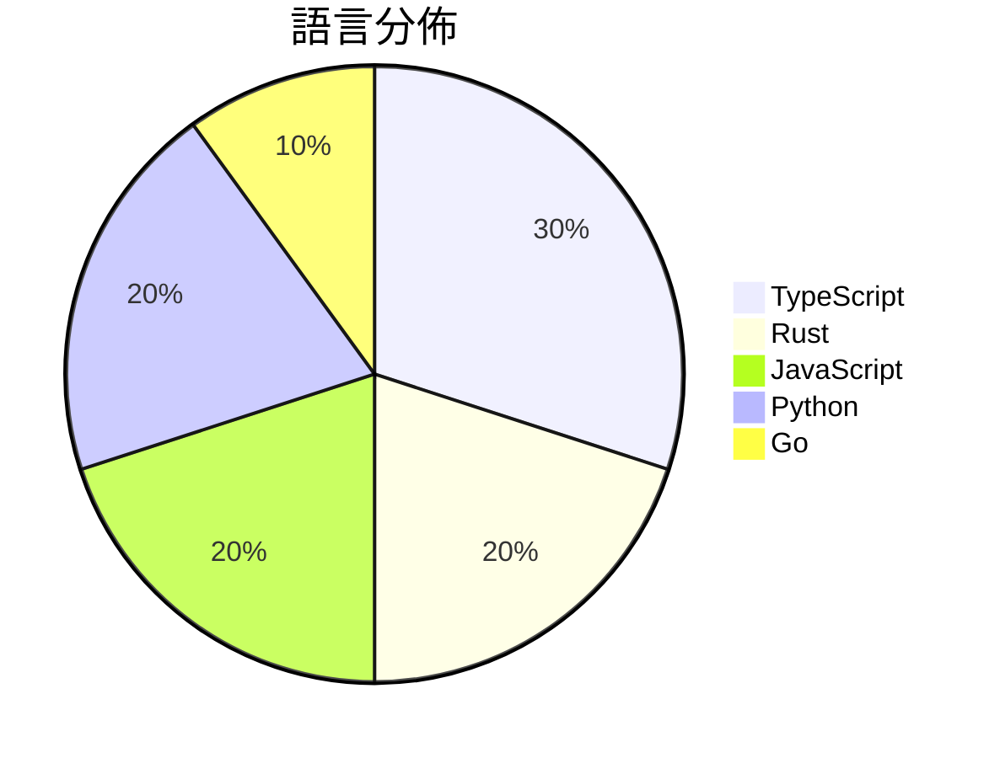

# GitHub Trending - 2026-04-01

> [!summary] 本日摘要
> 收錄 **10** 個新專案，合計 **100.4k** stars
> 語言分佈：TypeScript (3) · Rust (2) · JavaScript (2) · Python (2) · Go (1)

> [!tip] 本週焦點
> **[[instructkr--claw-code|instructkr/claw-code]]** — 1 天內累積 63.6k stars（63.6k stars/天）
> 提供一個快速且安全的工具，重寫 Claude Code 的功能，並支援多種工具整合。



---

## 收錄列表

| # | 專案 | 分類 | Stars | 速度 | 安裝 | 語言 | 用途 |
| :--: | --- | --- | ---: | ---: | --- | --- | --- |
| 1 | [[instructkr--claw-code\|instructkr/claw-code]] | 開發工具 | 63.6k | 63.6k/天 | `medium` | Rust | 提供一個快速且安全的工具，重寫 Claude Code 的功能，並支援多種工具整 |
| 2 | [[openai--codex-plugin-cc\|openai/codex-plugin-cc]] | 開發工具 | 5.8k | 5.8k/天 | `easy` | JavaScript | 讓 Claude Code 用 Codex 自動進行代碼審查或委派任務。 |
| 3 | [[larksuite--cli\|larksuite/cli]] | CLI 工具 | 5.5k | 910/天 | `easy` | Go | 提供 Lark/Feishu 的 CLI 工具，讓使用者和 AI 代理可以輕鬆操 |
| 4 | [[ChinaSiro--claude-code-sourcemap\|ChinaSiro/claude-code-sourcemap]] | 開發工具 | 4.9k | 4.9k/天 | `easy` | TypeScript | 還原 Claude 的 TypeScript 源碼，供研究使用。 |
| 5 | [[sanbuphy--claude-code-source-code\|sanbuphy/claude-code-source-code]] | 開發工具 | 4.9k | 4.9k/天 | `medium` | TypeScript | 提供 Claude Code v2.1.88 的反編譯源碼，供技術研究和學術交流 |
| 6 | [[TheTom--turboquant_plus\|TheTom/turboquant_plus]] | AI/ML | 3.9k | 556/天 | `medium` | Python | 提供高效的 KV 緩存壓縮技術，提升 LLM 推論性能。 |
| 7 | [[Kuberwastaken--claude-code\|Kuberwastaken/claude-code]] | 開發工具 | 3.5k | 3.5k/天 | `medium` | Rust | 提供 Claude Code 的 Rust 重構版本，並詳細分析其運作方式。 |
| 8 | [[titanwings--colleague-skill\|titanwings/colleague-skill]] | 開發工具 | 3.4k | 3.4k/天 | `medium` | Python | 將離職同事的知識和風格轉化為可用的 AI 技能。 |
| 9 | [[magnum6actual--flipoff\|magnum6actual/flipoff]] | 其他 | 2.6k | 512/天 | `easy` | JavaScript | 將任何電視變成復古的翻轉顯示器，無需昂貴的硬體。 |
| 10 | [[elder-plinius--G0DM0D3\|elder-plinius/G0DM0D3]] | AI/ML | 2.4k | 407/天 | `easy` | TypeScript | 提供一個開放源碼的多模型聊天介面，專為駭客和哲學家設計，強調隱私和自由互動。 |

---

## 重點摘要

### 1. [[instructkr--claw-code|instructkr/claw-code]] `開發工具`

> 提供一個快速且安全的工具，重寫 Claude Code 的功能，並支援多種工具整合。

**63.6k** stars · **63.6k** stars/天 · Rust · `medium`

_建立 1 天就累積 63551 stars（63551/天），forks 65130（102.5%），這是極端爆發式增長。作者 Yeachan-Heo 之前在 harness engineering 領域有豐富經驗，這次專案解決了開發者對於安全且高效工具的需求。社群對於 Claude Code 的興趣和需求驅動了這個專案的快速成長。技術上，Rust 的引入使得這個工具在性能上有了顯著的提升潛力。forks/stars 比率超過 100% 表示許多開發者對此專案進行了實際修改和擴展，顯示出強烈的參與意願。_

---

### 2. [[openai--codex-plugin-cc|openai/codex-plugin-cc]] `開發工具`

> 讓 Claude Code 用 Codex 自動進行代碼審查或委派任務。

**5.8k** stars · **5.8k** stars/天 · JavaScript · `easy`

_建立 1 天就累積 5783 stars（5783/天），forks 280（4.8%），這顯示出極高的使用興趣。這個專案的主要貢獻者來自 OpenAI，過去在 AI 和開發工具領域有豐富的經驗。它解決了開發者在代碼審查過程中缺乏有效工具的痛點，特別是在需要快速回饋和多樣化審查方式的情境下。這個工具的出現正好符合了開發者對於自動化和智能化工具的需求，並且在社群中引發了討論。這樣的需求和技術背景使得這個專案迅速受到關注。_

---

### 3. [[larksuite--cli|larksuite/cli]] `CLI 工具`

> 提供 Lark/Feishu 的 CLI 工具，讓使用者和 AI 代理可以輕鬆操作各種商業功能。

**5.5k** stars · **910** stars/天 · Go · `easy`

_建立 6 天就累積 5462 stars（910/天），forks 264（4.8%），這顯示出強勁的增長潛力。這個專案由 larksuite 團隊維護，專注於解決企業內部溝通與協作的痛點，特別是在 AI 代理的使用上，這是其他工具所缺乏的。近期的推廣活動和社群討論也促進了其曝光率，讓更多開發者注意到這個工具的潛力。lark-cli 的設計使得它能夠快速上手，並且提供了豐富的功能，這在當前市場中是非常有吸引力的。_

---

### 4. [[ChinaSiro--claude-code-sourcemap|ChinaSiro/claude-code-sourcemap]] `開發工具`

> 還原 Claude 的 TypeScript 源碼，供研究使用。

**4.9k** stars · **4.9k** stars/天 · TypeScript · `easy`

_建立 1 天就累積 4889 stars（4889/天），forks 8813（180.3%），這顯示出極高的興趣和參與度。作者 ChinaSiro 可能是開源社群中的活躍成員，這個專案解決了開發者對於 Claude 內部運作的好奇心，之前的方案無法提供這樣的源碼還原。這個專案的出現可能受到社群對於開源 AI 工具的需求增加的影響，特別是在研究和學習的領域。高達 180.3% 的 forks/stars 比率顯示出許多開發者正在積極修改和使用這個專案，這意味著它不僅僅是個觀望的工具，而是實際被應用和改進的對象。_

---

### 5. [[sanbuphy--claude-code-source-code|sanbuphy/claude-code-source-code]] `開發工具`

> 提供 Claude Code v2.1.88 的反編譯源碼，供技術研究和學術交流使用。

**4.9k** stars · **4.9k** stars/天 · TypeScript · `medium`

_建立 1 天就累積 4868 stars（4868/天），forks 9690（199.1%），這顯示出極高的興趣和活躍度。這個專案由 sanbuphy 發起，專注於提供 Claude Code 的源碼，解決了開發者對於反編譯和研究的需求。之前，開發者只能依賴封閉的商業產品，無法深入了解其內部運作。這個專案的推出吸引了大量的關注，尤其是在開源社群中。作者的背景和過去的貢獻也為這個專案的受歡迎程度加分。最近的社交媒體討論和技術論壇的熱烈反應也促進了這一趨勢。forks/stars 比率高達 199.1%，顯示出許多開發者正在積極修改和使用這個專案。_

---

### 6. [[TheTom--turboquant_plus|TheTom/turboquant_plus]] `AI/ML`

> 提供高效的 KV 緩存壓縮技術，提升 LLM 推論性能。

**3.9k** stars · **556** stars/天 · Python · `medium`

_建立 7 天內累積 3895 stars（556/天），forks 468（12.0%），顯示出強勁的增長潛力。作者 TheTom 及 seanrasch 在 AI 壓縮技術領域有豐富經驗，這個專案解決了 LLM 推論中 KV 緩存的壓縮效率問題，之前的解決方案往往無法兼顧性能和質量。這個專案的推出引起了社群的廣泛關注，並且在多個平台上有討論和分享。技術上，隨著硬體性能的提升，對於高效能推論的需求也在增加，這使得 TurboQuant 的應用場景愈加廣泛。forks/stars 比率為 12.0%，顯示出許多開發者對其進行實際修改和使用。_

---

### 7. [[Kuberwastaken--claude-code|Kuberwastaken/claude-code]] `開發工具`

> 提供 Claude Code 的 Rust 重構版本，並詳細分析其運作方式。

**3.5k** stars · **3.5k** stars/天 · Rust · `medium`

_建立 1 天就累積 3470 stars（3470/天），forks 4774（137.6%），這顯示出極高的社群興趣。這位作者 Kuberwastaken 以其對 AI 工具的深入理解而聞名，這個專案解決了許多開發者在使用原始 Claude Code 時面臨的法律風險。這次的源碼洩漏事件引發了廣泛的討論，讓人們對於如何合法地重現 AI 行為有了新的思考。技術生態的變化，如 Rust 語言的興起和對開源的支持，使得這個專案的實現變得可行。高達 137.6% 的 forks/stars 比率顯示出許多人在積極修改和使用這個專案。_

---

### 8. [[titanwings--colleague-skill|titanwings/colleague-skill]] `開發工具`

> 將離職同事的知識和風格轉化為可用的 AI 技能。

**3.4k** stars · **3.4k** stars/天 · Python · `medium`

_建立 1 天就累積 3437 stars（3437/天），forks 166（4.8%），這是極端爆發式增長。作者 titanwings 似乎是針對企業知識管理的痛點進行了深度思考，解決了許多團隊在同事離職後的知識流失問題。之前，團隊往往依賴於文檔和口頭交接，但這些方式常常無法完整保留關鍵知識。這個工具的出現，正好填補了這一空白，並且在社群中引起了廣泛的討論和反響。技術生態的演變，特別是對於 AI 技能的需求增加，也讓這個工具的可行性大幅提升。forks/stars 比率為 4.8%，顯示出有一定數量的使用者在實際修改和使用這個工具。_

---

### 9. [[magnum6actual--flipoff|magnum6actual/flipoff]] `其他`

> 將任何電視變成復古的翻轉顯示器，無需昂貴的硬體。

**2.6k** stars · **512** stars/天 · JavaScript · `easy`

_建立 5 天就累積 2559 stars（512/天），forks 309（12.1%），顯示出強烈的使用者興趣。作者在開源社群中有一定的影響力，這個專案填補了市場上對於高成本翻轉顯示器的需求空白，讓使用者可以以零成本享受類似的視覺效果。社群的反應熱烈，尤其是對於是否將其轉換為使用 Tailwind CSS 的討論，顯示出使用者對於功能擴展的期待。這個工具的設計理念與現代網頁技術的發展相契合，無需任何框架或複雜的構建工具，讓它在技術上也具備了可行性。_

---

### 10. [[elder-plinius--G0DM0D3|elder-plinius/G0DM0D3]] `AI/ML`

> 提供一個開放源碼的多模型聊天介面，專為駭客和哲學家設計，強調隱私和自由互動。

**2.4k** stars · **407** stars/天 · TypeScript · `easy`

_建立 6 天內累積 2444 stars（407/天），forks 479（19.6%），顯示出強烈的社群參與。作者 elder-plinius 以開源和隱私為核心理念，針對駭客和研究者的需求提供了一個靈活的聊天介面。這個工具解決了傳統 AI 聊天工具在隱私和多模型支持上的不足，特別適合需要進行紅隊測試的用戶。社群的活躍度和開放性使得這個專案迅速受到關注，並且有潛力成為未來 AI 互動的標準工具。_

---

## 今日到期複習

> [!tip] 根據間隔複習排程，今天該回顧的專案

```dataview
TABLE
  stars_per_day AS "Stars/天",
  category AS "分類",
  engagement AS "參與度"
FROM "Repos"
WHERE next_review AND date(next_review) <= date("2026-04-01") AND status != "archived"
SORT priority DESC
```

## 待處理

```dataviewjs
const pending = dv.pages('"Repos"').where(p => p.status === "to-review").length;
const unrated = dv.pages('"Repos"').where(p => p.status !== "archived" && p.status !== "to-review" && (p.my_rating || 0) === 0).length;
const noVerdict = dv.pages('"Repos"').where(p => p.status !== "archived" && (p.my_rating || 0) > 0 && (!p.verdict || p.verdict === "")).length;
const items = [];
if (pending > 0) items.push(`**${pending}** 個待分流`);
if (unrated > 0) items.push(`**${unrated}** 個已讀但未評分`);
if (noVerdict > 0) items.push(`**${noVerdict}** 個已評分但無結論`);
if (items.length > 0) dv.paragraph(items.join(" / "));
else dv.paragraph("所有專案都已處理完畢！");
```
