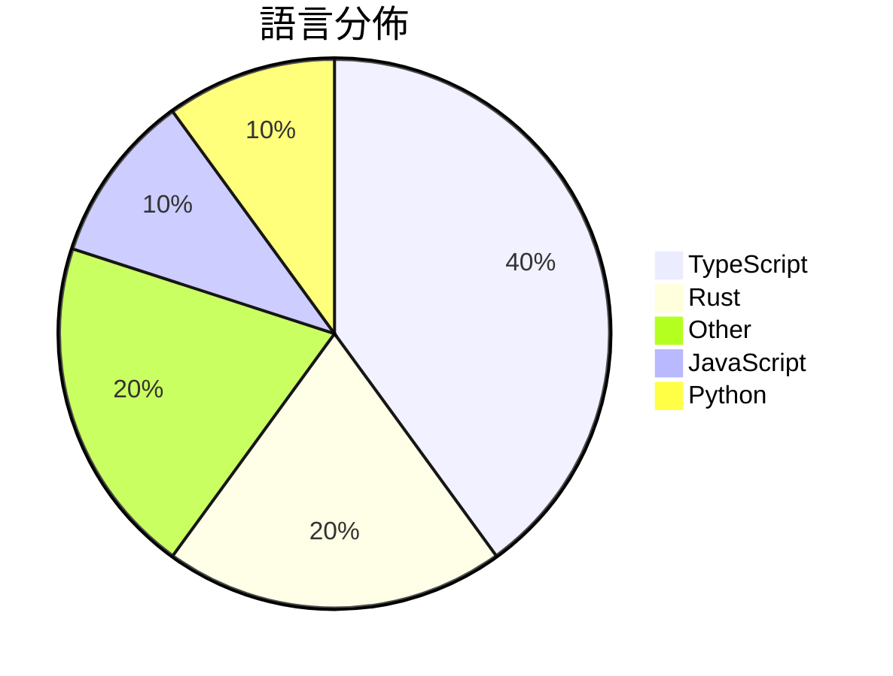

# GitHub Trending - 2026-04-02

> [!summary] 本日摘要
> 收錄 **10** 個新專案，合計 **177.1k** stars
> 語言分佈：TypeScript (4) · Rust (2) · Other (2) · JavaScript (1) · Python (1)

> [!tip] 本週焦點
> **[[ultraworkers--claw-code|ultraworkers/claw-code]]** — 1 天內累積 121.8k stars（121.8k stars/天）
> 提供一個快速且安全的工具集來重寫和擴展 Claw Code 的功能。



---

## 收錄列表

| # | 專案 | 分類 | Stars | 速度 | 安裝 | 語言 | 用途 |
| :--: | --- | --- | ---: | ---: | --- | --- | --- |
| 1 | [[ultraworkers--claw-code\|ultraworkers/claw-code]] | 開發工具 | 121.8k | 121.8k/天 | `medium` | Rust | 提供一個快速且安全的工具集來重寫和擴展 Claw Code 的功能。 |
| 2 | [[sanbuphy--learn-coding-agent\|sanbuphy/learn-coding-agent]] | 開發工具 | 10.6k | 10.6k/天 | `medium` | N/A | 研究 CLI Agent 架構，幫助開發者理解和利用 Agent 技術。 |
| 3 | [[openai--codex-plugin-cc\|openai/codex-plugin-cc]] | 開發工具 | 8.6k | 4.3k/天 | `easy` | JavaScript | 讓使用者在 Claude Code 中輕鬆使用 Codex 進行代碼審查或委派任 |
| 4 | [[claude-code-best--claude-code\|claude-code-best/claude-code]] | 開發工具 | 7.8k | 7.8k/天 | `easy` | TypeScript | 提供一個反向工程的 Claude Code CLI 工具，讓開發者能在終端中使用 |
| 5 | [[ChinaSiro--claude-code-sourcemap\|ChinaSiro/claude-code-sourcemap]] | 開發工具 | 7.4k | 7.4k/天 | `medium` | TypeScript | 還原 Claude 的 TypeScript 源碼，供研究用途。 |
| 6 | [[Kuberwastaken--claurst\|Kuberwastaken/claurst]] | 開發工具 | 6.6k | 6.6k/天 | `medium` | Rust | 提供一個用 Rust 實作的 CLI 編碼代理，並分析 Claude Code  |
| 7 | [[titanwings--colleague-skill\|titanwings/colleague-skill]] | 開發工具 | 4.6k | 2.3k/天 | `medium` | Python | 將冰冷的離別化為溫暖的技能，幫助生成同事的 AI 技能。 |
| 8 | [[Gitlawb--openclaude\|Gitlawb/openclaude]] | 開發工具 | 3.6k | 3.6k/天 | `medium` | TypeScript | 讓任何 LLM（如 OpenAI、Gemini、DeepSeek 等）都能使用  |
| 9 | [[tvytlx--ai-agent-deep-dive\|tvytlx/ai-agent-deep-dive]] | 其他 | 3.1k | 3.1k/天 | `easy` | N/A | 提供 AI Agent 源碼的深度分析報告，幫助開發者理解其運作機制。 |
| 10 | [[NanmiCoder--claude-code-haha\|NanmiCoder/claude-code-haha]] | AI/ML | 3.0k | 3.0k/天 | `medium` | TypeScript | 提供本地可運行的 Claude Code 版本，解決原始碼無法直接運行的問題。 |

---

## 重點摘要

### 1. [[ultraworkers--claw-code|ultraworkers/claw-code]] `開發工具`

> 提供一個快速且安全的工具集來重寫和擴展 Claw Code 的功能。

**121.8k** stars · **121.8k** stars/天 · Rust · `medium`

_建立 1 天就累積 121830 stars（121830/天），forks 102127（83.8%），這是極端爆發式增長。作者 @instructkr 以其在 harness engineering 領域的專業知識和過去的開源貢獻而聞名，這次重寫的動機來自於原始 Claw Code 的曝光事件，解決了開發者在使用此類工具時的法律和道德問題。社群對於這個專案的熱情和需求促成了它的快速成長。技術生態的變化，如 Rust 的普及和 AI 工具的需求增加，也為此專案的成功提供了土壤。高達 83.8% 的 forks/stars 比率顯示出許多開發者對此專案的實際修改和使用，反映了其在開發者社群中的活躍度。_

---

### 2. [[sanbuphy--learn-coding-agent|sanbuphy/learn-coding-agent]] `開發工具`

> 研究 CLI Agent 架構，幫助開發者理解和利用 Agent 技術。

**10.6k** stars · **10.6k** stars/天 · N/A · `medium`

_建立 1 天就累積 10559 stars（10559/天），forks 19186（181.7%），這是極端爆發式增長。專案的作者 sanbuphy 以其在開源社群中的活躍而聞名，這次的專案解決了開發者在使用 CLI Agent 時缺乏清晰架構和實用工具的痛點。之前的解決方案往往功能單一或缺乏良好的文檔，這使得開發者在使用時遇到困難。專案的推出引起了社群的廣泛關注，並在多個平台上被討論。技術生態的變化，如對高效能 CLI 工具的需求增加，也促進了這個專案的流行。forks/stars 比率高達 181.7%，顯示出許多人對其進行實際修改和使用。_

---

### 3. [[openai--codex-plugin-cc|openai/codex-plugin-cc]] `開發工具`

> 讓使用者在 Claude Code 中輕鬆使用 Codex 進行代碼審查或委派任務。

**8.6k** stars · **4.3k** stars/天 · JavaScript · `easy`

_建立 2 天就累積 8574 stars（4287/天），forks 443（5.2%），這顯示出強烈的使用需求。這個專案的主要貢獻者來自 OpenAI，過去在 AI 和開發工具領域有豐富的經驗。它解決了開發者在代碼審查過程中需要快速且智能的工具的痛點，之前的解決方案往往需要手動處理或缺乏智能化的支持。近期的推廣活動和社群討論也促進了這個專案的曝光。隨著 Codex 的技術成熟，這個插件的需求自然上升，特別是在大型團隊和專案中。forks/stars 比率約 5.2%，顯示出相對穩定的使用者基礎。_

---

### 4. [[claude-code-best--claude-code|claude-code-best/claude-code]] `開發工具`

> 提供一個反向工程的 Claude Code CLI 工具，讓開發者能在終端中使用 AI 編程助手。

**7.8k** stars · **7.8k** stars/天 · TypeScript · `easy`

_建立 1 天就累積 7790 stars（7790/天），forks 9476（121.6%），這顯示出極高的使用者參與度。這個專案由 claude-code-best 開發，專注於提供一個開源的 Claude Code 替代品，解決了原版工具的可用性和擴展性問題。開源後短時間內的快速成長，顯示出社群對於可自定義 AI 編程助手的需求。這個工具的出現正好填補了市場上對於開放式 AI 編程工具的空白，並且得到了廣泛的關注和支持。_

---

### 5. [[ChinaSiro--claude-code-sourcemap|ChinaSiro/claude-code-sourcemap]] `開發工具`

> 還原 Claude 的 TypeScript 源碼，供研究用途。

**7.4k** stars · **7.4k** stars/天 · TypeScript · `medium`

_建立 1 天就累積 7368 stars（7368/天），forks 12711（172.5%），這是極端爆發式增長。作者 ChinaSiro 可能是因為對 Claude 的興趣和技術背景，選擇了還原這個源碼。這個專案解決了對 Claude 內部架構缺乏透明度的痛點，之前的解決方案往往無法提供完整的源碼結構。最近的推文和討論可能促進了這個專案的曝光度。隨著開源文化的推進，這種源碼還原的方式變得越來越可行，尤其是在 AI 領域。高達 172.5% 的 forks/stars 比率顯示出許多使用者對這個專案的實際修改和使用意圖。_

---

### 6. [[Kuberwastaken--claurst|Kuberwastaken/claurst]] `開發工具`

> 提供一個用 Rust 實作的 CLI 編碼代理，並分析 Claude Code 的代碼洩漏與發現。

**6.6k** stars · **6.6k** stars/天 · Rust · `medium`

_建立 1 天就累積 6592 stars（6592/天），forks 6838（103.7%），這顯示出極高的使用者興趣。作者 Kuberwastaken 之前有開發過多個相關專案，這次的專案解決了原本 Claude Code 洩漏後的法律和技術問題，提供了一個合法的替代方案。最近的社交媒體討論和技術論壇的關注也推動了這個專案的曝光度。技術生態的變化，如 Rust 的流行和對於開源的需求，讓這個工具變得更加可行。高達 103.7% 的 forks/stars 比率顯示出許多人在實際修改和使用這個專案。_

---

### 7. [[titanwings--colleague-skill|titanwings/colleague-skill]] `開發工具`

> 將冰冷的離別化為溫暖的技能，幫助生成同事的 AI 技能。

**4.6k** stars · **2.3k** stars/天 · Python · `medium`

_建立 2 天就累積 4648 stars（2324/天），forks 252（5.4%），這顯示出高關注度。作者 titanwings 之前的項目如前任.skill 也獲得了良好的反響，這表明他在這個領域的專業性。這個工具解決了團隊在同事離職後知識流失的痛點，之前的解決方案往往依賴於繁瑣的文檔和交接，效率低下。這個工具的出現正好填補了這一空白，並且在社群中引起了廣泛的討論和反饋。最近的社交媒體討論和用戶反饋也促進了其快速增長。forks/stars 比率為 5.4%，顯示出有相當數量的用戶在積極修改和使用這個工具。_

---

### 8. [[Gitlawb--openclaude|Gitlawb/openclaude]] `開發工具`

> 讓任何 LLM（如 OpenAI、Gemini、DeepSeek 等）都能使用 Claude Code 的功能。

**3.6k** stars · **3.6k** stars/天 · TypeScript · `medium`

_建立 1 天就累積 3599 stars（3599/天），forks 1398（38.8%），顯示出強烈的社群參與。作者 kevincodex1 和團隊在開源社群中有一定的影響力，之前的專案也獲得了良好的反響。這個專案解決了在多種 LLM 之間切換的複雜性，讓開發者能夠更輕鬆地使用不同的模型進行開發，這在當前多樣化的 AI 生態中是個迫切需求。社群的活躍度和問題反饋也顯示出使用者對這個工具的期待和需求。forks/stars 比率高達 38.8%，顯示出許多人在實際修改和使用這個工具，而不僅僅是觀望。_

---

### 9. [[tvytlx--ai-agent-deep-dive|tvytlx/ai-agent-deep-dive]] `其他`

> 提供 AI Agent 源碼的深度分析報告，幫助開發者理解其運作機制。

**3.1k** stars · **3.1k** stars/天 · N/A · `easy`

_建立 1 天就累積 3130 stars（3130/天），forks 1107（35.4%），這顯示出強烈的社群興趣。作者 tvytlx 可能是 AI 領域的專家，這份報告解決了對於 AI Agent 源碼理解的需求，之前的資源可能較為分散且缺乏系統性。此專案的推出可能受到社群對於 AI 技術深入理解的需求驅動，並且在技術論壇或社交媒體上引起了關注。這種高比例的 forks 表示許多人對於這份報告的內容感興趣，並希望進一步探索或修改。整體來看，這是一個自然擴散的現象，反映了當前對於 AI 技術的熱情。_

---

### 10. [[NanmiCoder--claude-code-haha|NanmiCoder/claude-code-haha]] `AI/ML`

> 提供本地可運行的 Claude Code 版本，解決原始碼無法直接運行的問題。

**3.0k** stars · **3.0k** stars/天 · TypeScript · `medium`

_建立 1 天就累積 3002 stars（3002/天），forks 3655（121.8%），這是極端爆發式增長。作者 NanmiCoder 及其團隊專注於開源 AI 工具的開發，這個專案解決了原始 Claude Code 無法直接運行的痛點，讓開發者能夠在本地環境中使用。社群的反饋和活躍的問題討論也促進了這個專案的快速成長。技術上，Bun 的使用讓這個工具在性能上有了優勢，特別是在快速啟動和運行方面。forks/stars 比率高達 121.8%，顯示出許多開發者對這個專案的實際修改和使用。_

---

## 今日到期複習

> [!tip] 根據間隔複習排程，今天該回顧的專案

```dataview
TABLE
  stars_per_day AS "Stars/天",
  category AS "分類",
  engagement AS "參與度"
FROM "Repos"
WHERE next_review AND date(next_review) <= date("2026-04-02") AND status != "archived"
SORT priority DESC
```

## 待處理

```dataviewjs
const pending = dv.pages('"Repos"').where(p => p.status === "to-review").length;
const unrated = dv.pages('"Repos"').where(p => p.status !== "archived" && p.status !== "to-review" && (p.my_rating || 0) === 0).length;
const noVerdict = dv.pages('"Repos"').where(p => p.status !== "archived" && (p.my_rating || 0) > 0 && (!p.verdict || p.verdict === "")).length;
const items = [];
if (pending > 0) items.push(`**${pending}** 個待分流`);
if (unrated > 0) items.push(`**${unrated}** 個已讀但未評分`);
if (noVerdict > 0) items.push(`**${noVerdict}** 個已評分但無結論`);
if (items.length > 0) dv.paragraph(items.join(" / "));
else dv.paragraph("所有專案都已處理完畢！");
```
