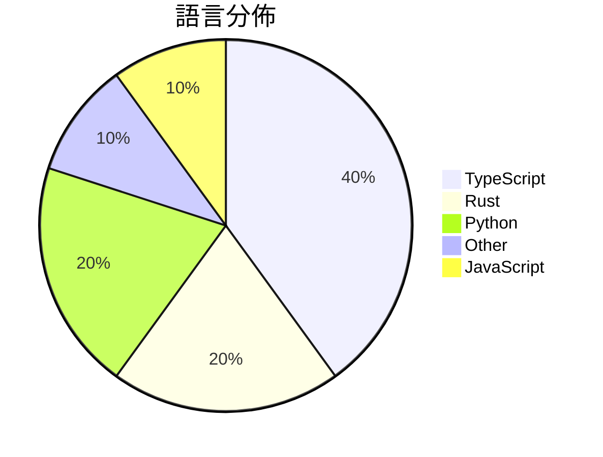

# GitHub Trending - 2026-04-03

> [!summary] 本日摘要
> 收錄 **10** 個新專案，合計 **220.6k** stars
> 語言分佈：TypeScript (4) · Rust (2) · Python (2) · Other (1) · JavaScript (1)

> [!tip] 本週焦點
> **[[ultraworkers--claw-code|ultraworkers/claw-code]]** — 2 天內累積 150.9k stars（75.4k stars/天）
> 提供一個快速且安全的工具集來處理 Claw Code 的代理系統。



---

## 收錄列表

| # | 專案 | 分類 | Stars | 速度 | 安裝 | 語言 | 用途 |
| :--: | --- | --- | ---: | ---: | --- | --- | --- |
| 1 | [[ultraworkers--claw-code\|ultraworkers/claw-code]] | 開發工具 | 150.9k | 75.4k/天 | `medium` | Rust | 提供一個快速且安全的工具集來處理 Claw Code 的代理系統。 |
| 2 | [[sanbuphy--learn-coding-agent\|sanbuphy/learn-coding-agent]] | 開發工具 | 11.0k | 5.5k/天 | `medium` | N/A | 研究 CLI Agent 架構，幫助開發者理解和利用 Agent 技術。 |
| 3 | [[claude-code-best--claude-code\|claude-code-best/claude-code]] | 開發工具 | 10.7k | 5.4k/天 | `easy` | TypeScript | 提供一個可運行、可構建、可調試的 Claude Code CLI 工具，並修復  |
| 4 | [[openai--codex-plugin-cc\|openai/codex-plugin-cc]] | 開發工具 | 10.7k | 3.6k/天 | `easy` | JavaScript | 讓使用者在 Claude Code 中輕鬆使用 Codex 進行代碼審查或委派任 |
| 5 | [[ChinaSiro--claude-code-sourcemap\|ChinaSiro/claude-code-sourcemap]] | 開發工具 | 8.0k | 4.0k/天 | `medium` | TypeScript | 提供 Claude 的 TypeScript 源碼還原，供研究用途。 |
| 6 | [[Gitlawb--openclaude\|Gitlawb/openclaude]] | 開發工具 | 7.6k | 7.6k/天 | `easy` | TypeScript | 讓任何 LLM 都能使用 Claude Code，無論是 OpenAI、Gemi |
| 7 | [[Kuberwastaken--claurst\|Kuberwastaken/claurst]] | 開發工具 | 7.4k | 3.7k/天 | `easy` | Rust | 提供一個用 Rust 重寫的 Claude Code 行為模擬器，並分析 Cla |
| 8 | [[titanwings--colleague-skill\|titanwings/colleague-skill]] | 開發工具 | 5.5k | 1.8k/天 | `medium` | Python | 將同事的離職轉化為可用的 AI 技能，幫助團隊維持工作連續性。 |
| 9 | [[tvytlx--ai-agent-deep-dive\|tvytlx/ai-agent-deep-dive]] | AI/ML | 4.5k | 2.2k/天 | `easy` | Python | 提供一個最小化的 AI Agent 教學示範，幫助理解核心結構與運作。 |
| 10 | [[emdash-cms--emdash\|emdash-cms/emdash]] | 開發工具 | 4.3k | 4.3k/天 | `medium` | TypeScript | 提供一個現代化的全棧 TypeScript CMS，重塑 WordPress 的 |

---

## 重點摘要

### 1. [[ultraworkers--claw-code|ultraworkers/claw-code]] `開發工具`

> 提供一個快速且安全的工具集來處理 Claw Code 的代理系統。

**150.9k** stars · **75.4k** stars/天 · Rust · `medium`

_建立 2 天就累積 150874 stars（75437/天），forks 101336（67.2%），這顯示出極高的使用者參與度。專案的創建者在開源社群中有一定的影響力，且其作品受到廣泛關注。Claw Code 解決了開發者在處理 Claw Code 代理系統時的安全性和性能問題，這在以往的工具中並不常見。近期的社群討論和媒體報導也進一步推動了這個專案的曝光率。高比例的 forks 表示許多開發者正在積極修改和使用這個專案，顯示出其實用性和需求。_

---

### 2. [[sanbuphy--learn-coding-agent|sanbuphy/learn-coding-agent]] `開發工具`

> 研究 CLI Agent 架構，幫助開發者理解和利用 Agent 技術。

**11.0k** stars · **5.5k** stars/天 · N/A · `medium`

_建立 2 天就累積 11009 stars（5505/天），forks 19531（177.4%），這顯示出極高的社群參與度。這個專案由 sanbuphy 發起，專注於 CLI Agent 的架構研究，填補了市場上對於高效能 CLI 工具的需求。過去開發者在構建 CLI 工具時，往往需要整合多個不同的庫和工具，這個專案提供了一個統一的解決方案。社群的反饋和活躍的討論也促進了這個專案的快速成長，尤其是在開源社群中對於 CLI 工具的需求不斷上升的背景下。forks/stars 比率高達 177.4%，顯示出許多開發者對於這個專案的實際修改和使用，這是一個強烈的參與信號。_

---

### 3. [[claude-code-best--claude-code|claude-code-best/claude-code]] `開發工具`

> 提供一個可運行、可構建、可調試的 Claude Code CLI 工具，並修復 TypeScript 類型問題。

**10.7k** stars · **5.4k** stars/天 · TypeScript · `easy`

_建立 2 天內累積 10736 stars（5368/天），forks 12099（112.7%），這顯示出極高的社群關注度。開發者主要來自於對 Claude Code 的需求，之前的 CLI 工具在功能上無法滿足用戶的需求，特別是在互動性和即時反饋方面。這個專案的快速增長可能與其活躍的開發和社群支持有關，並且其開源性質吸引了大量開發者參與。作者的背景和過去的貢獻也為這個專案的成功奠定了基礎。_

---

### 4. [[openai--codex-plugin-cc|openai/codex-plugin-cc]] `開發工具`

> 讓使用者在 Claude Code 中輕鬆使用 Codex 進行代碼審查或委派任務。

**10.7k** stars · **3.6k** stars/天 · JavaScript · `easy`

_建立 3 天就累積 10653 stars（3551/天），forks 541（5.1%），顯示出強烈的社群興趣。開發者 dkundel-openai 和團隊過去在開源社群中有著良好的聲譽，這個插件解決了在 Claude Code 環境中使用 Codex 的痛點，讓開發者能夠更方便地進行代碼審查。近期的推廣活動和社群討論也促進了其知名度的提升。高 fork/stars 比率顯示出許多人在實際修改和使用這個插件，而不是僅僅觀望。_

---

### 5. [[ChinaSiro--claude-code-sourcemap|ChinaSiro/claude-code-sourcemap]] `開發工具`

> 提供 Claude 的 TypeScript 源碼還原，供研究用途。

**8.0k** stars · **4.0k** stars/天 · TypeScript · `medium`

_建立 2 天內累積 8012 stars（4006/天），forks 13583（169.5%），顯示出極高的關注度。這個專案由 ChinaSiro 開發，專注於還原 Claude 的源碼，解決了開發者對於 Claude 內部結構的探索需求。之前的工具多數無法提供這樣的源碼結構，限制了研究的深度。該專案的爆發式增長可能受到社群對於開源 AI 研究的興趣驅動，特別是在 Claude 的技術背景下。forks/stars 比率高達 169.5%，顯示出許多開發者在實際修改和使用這個專案。_

---

### 6. [[Gitlawb--openclaude|Gitlawb/openclaude]] `開發工具`

> 讓任何 LLM 都能使用 Claude Code，無論是 OpenAI、Gemini 還是其他 200 多個模型。

**7.6k** stars · **7.6k** stars/天 · TypeScript · `easy`

_建立 1 天就累積 7609 stars（7609/天），forks 2916（38.3%），顯示出極高的使用興趣。這個專案由 kevincodex1 等人發起，解決了開發者在使用不同 LLM 時的兼容性問題，之前的解決方案往往需要針對每個模型進行專門的調整。這個工具的出現讓開發者能夠更方便地在不同的 LLM 之間切換，並且能夠利用各自的優勢來提升工作效率。社群的活躍度和開發者的回應速度也顯示出這個專案的潛力。_

---

### 7. [[Kuberwastaken--claurst|Kuberwastaken/claurst]] `開發工具`

> 提供一個用 Rust 重寫的 Claude Code 行為模擬器，並分析 Claude Code 的代碼洩漏事件。

**7.4k** stars · **3.7k** stars/天 · Rust · `easy`

_建立 2 天就累積 7380 stars（3690/天），forks 7214（97.8%），這顯示出極高的興趣和參與度。作者 Kuberwastaken 是一位活躍的開發者，專注於 AI 和 Rust 領域。這個專案解決了原有 Claude Code 代碼洩漏後的法律和技術挑戰，提供了一個合法的替代方案。社群對於這個專案的熱情可能也受到最近的代碼洩漏事件的影響，讓更多人關注其合法性和技術實現。_

---

### 8. [[titanwings--colleague-skill|titanwings/colleague-skill]] `開發工具`

> 將同事的離職轉化為可用的 AI 技能，幫助團隊維持工作連續性。

**5.5k** stars · **1.8k** stars/天 · Python · `medium`

_建立 3 天就累積 5453 stars（1818/天），forks 311（5.7%），這顯示出強烈的使用者興趣。作者 titanwings 之前有開發過類似的項目，這次針對同事技能的延續提供了一個創新的解決方案，填補了企業在知識管理上的空白。近期的社交媒體討論和相關話題的熱度也推動了這個專案的曝光率。技術上，隨著 AI 和自動化工具的普及，這個專案的需求和可行性變得更加明顯。forks/stars 比率在中等範圍，顯示出部分使用者已經在實際修改和使用這個工具。_

---

### 9. [[tvytlx--ai-agent-deep-dive|tvytlx/ai-agent-deep-dive]] `AI/ML`

> 提供一個最小化的 AI Agent 教學示範，幫助理解核心結構與運作。

**4.5k** stars · **2.2k** stars/天 · Python · `easy`

_建立 2 天就累積 4491 stars（2246/天），forks 1400（31.2%），顯示出極高的關注度。作者 tvytlx 之前在 AI 領域有過多個專案，這次專案解決了學習 AI Agent 結構的需求，特別是針對初學者的教學資源。近期的推廣或討論可能吸引了大量開發者的注意，促使這個專案迅速增長。高達 31.2% 的 forks/stars 比率顯示出許多人對這個專案進行了實際的修改或使用，而不是僅僅觀望。_

---

### 10. [[emdash-cms--emdash|emdash-cms/emdash]] `開發工具`

> 提供一個現代化的全棧 TypeScript CMS，重塑 WordPress 的可擴展性和安全性。

**4.3k** stars · **4.3k** stars/天 · TypeScript · `medium`

_建立 1 天就累積 4343 stars（4343/天），forks 274（6.3%），這顯示出強烈的興趣。作者 Matt Kane 曾經參與過多個開源專案，這次的 EmDash 針對 WordPress 的安全性和擴展性問題提供了創新的解決方案，特別是針對插件的安全性。這個專案的推出正好符合當前對於更安全、更靈活的 CMS 解決方案的需求。社群的反應也相當熱烈，尤其是對於插件的沙盒化運行和內容結構化的設計。這些特性使得 EmDash 在同類工具中脫穎而出。_

---

## 今日到期複習

> [!tip] 根據間隔複習排程，今天該回顧的專案

```dataview
TABLE
  stars_per_day AS "Stars/天",
  category AS "分類",
  engagement AS "參與度"
FROM "Repos"
WHERE next_review AND date(next_review) <= date("2026-04-03") AND status != "archived"
SORT priority DESC
```

## 待處理

```dataviewjs
const pending = dv.pages('"Repos"').where(p => p.status === "to-review").length;
const unrated = dv.pages('"Repos"').where(p => p.status !== "archived" && p.status !== "to-review" && (p.my_rating || 0) === 0).length;
const noVerdict = dv.pages('"Repos"').where(p => p.status !== "archived" && (p.my_rating || 0) > 0 && (!p.verdict || p.verdict === "")).length;
const items = [];
if (pending > 0) items.push(`**${pending}** 個待分流`);
if (unrated > 0) items.push(`**${unrated}** 個已讀但未評分`);
if (noVerdict > 0) items.push(`**${noVerdict}** 個已評分但無結論`);
if (items.length > 0) dv.paragraph(items.join(" / "));
else dv.paragraph("所有專案都已處理完畢！");
```
