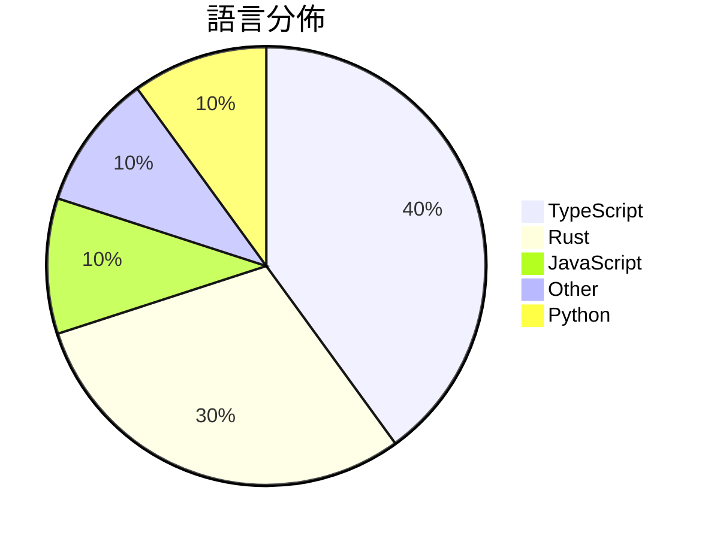

# GitHub Trending - 2026-04-04

> [!summary] 本日摘要
> 收錄 **10** 個新專案，合計 **243.6k** stars
> 語言分佈：TypeScript (4) · Rust (3) · JavaScript (1) · Other (1) · Python (1)

> [!tip] 本週焦點
> **[[ultraworkers--claw-code|ultraworkers/claw-code]]** — 3 天內累積 162.4k stars（54.1k stars/天）
> 提供一個快速且安全的代理系統，支援多種工具和插件的整合。



---

## 收錄列表

| # | 專案 | 分類 | Stars | 速度 | 安裝 | 語言 | 用途 |
| :--: | --- | --- | ---: | ---: | --- | --- | --- |
| 1 | [[ultraworkers--claw-code\|ultraworkers/claw-code]] | 開發工具 | 162.4k | 54.1k/天 | `medium` | Rust | 提供一個快速且安全的代理系統，支援多種工具和插件的整合。 |
| 2 | [[claude-code-best--claude-code\|claude-code-best/claude-code]] | 開發工具 | 13.0k | 4.3k/天 | `easy` | TypeScript | 提供原汁原味的 Claude Code CLI 工具，支持企业级功能和安全性。 |
| 3 | [[Gitlawb--openclaude\|Gitlawb/openclaude]] | 開發工具 | 11.8k | 5.9k/天 | `easy` | TypeScript | 統一 CLI 工具，支援多種 AI 模型，讓開發者能輕鬆進行編碼任務。 |
| 4 | [[openai--codex-plugin-cc\|openai/codex-plugin-cc]] | 開發工具 | 11.3k | 2.8k/天 | `easy` | JavaScript | 讓使用者在 Claude Code 中輕鬆使用 Codex 進行代碼審查或委派任 |
| 5 | [[sanbuphy--learn-coding-agent\|sanbuphy/learn-coding-agent]] | 開發工具 | 11.2k | 3.7k/天 | `medium` | N/A | 這是一個專注於 CLI Agent 架構的學習與研究資源，旨在幫助開發者理解和利 |
| 6 | [[ChinaSiro--claude-code-sourcemap\|ChinaSiro/claude-code-sourcemap]] | 開發工具 | 8.3k | 2.8k/天 | `medium` | TypeScript | 還原 Claude 的 TypeScript 源碼，供研究使用。 |
| 7 | [[Kuberwastaken--claurst\|Kuberwastaken/claurst]] | 開發工具 | 7.8k | 2.6k/天 | `medium` | Rust | 提供一個用 Rust 實作的終端編碼代理，並分析 Claude 代碼洩漏事件。 |
| 8 | [[titanwings--colleague-skill\|titanwings/colleague-skill]] | 開發工具 | 6.5k | 1.6k/天 | `medium` | Python | 將冰冷的離別化為溫暖的技能，幫助生成同事的 AI 技能。 |
| 9 | [[emdash-cms--emdash\|emdash-cms/emdash]] | 開發工具 | 6.1k | 3.1k/天 | `easy` | TypeScript | 重塑 WordPress 的全棧 TypeScript CMS，基於 Astro |
| 10 | [[ultraworkers--claw-code-parity\|ultraworkers/claw-code-parity]] | 開發工具 | 5.2k | 5.2k/天 | `easy` | Rust | 提供 Claude Code 的 Rust 和 Python 版本重寫，解決原始 |

---

## 重點摘要

### 1. [[ultraworkers--claw-code|ultraworkers/claw-code]] `開發工具`

> 提供一個快速且安全的代理系統，支援多種工具和插件的整合。

**162.4k** stars · **54.1k** stars/天 · Rust · `medium`

_建立 3 天內累積 162433 stars（54144/天），forks 100995（62.2%），這顯示出極高的使用者興趣。作者 @instructkr 之前在開源社群中活躍，專注於代理系統的開發，這次的 Claw Code 專案正好填補了市場上對於高效代理系統的需求。該專案的快速增長也可能受到社群的推廣和討論的影響，尤其是在 Discord 和 Twitter 上的活躍交流。由於其獨特的設計和功能，吸引了大量開發者的注意，並促使他們參與到這個專案中來。forks/stars 比率高達 62.2%，顯示出許多人在積極修改和使用這個專案。_

---

### 2. [[claude-code-best--claude-code|claude-code-best/claude-code]] `開發工具`

> 提供原汁原味的 Claude Code CLI 工具，支持企业级功能和安全性。

**13.0k** stars · **4.3k** stars/天 · TypeScript · `easy`

_建立 3 天就累積 13023 stars（4341/天），forks 13483（103.5%），這顯示出極高的用戶參與度。這個專案的主要貢獻者來自於活躍的開源社群，並且在短時間內解決了多個關鍵問題。它的出現填補了市場上對於靈活且安全的 AI 編碼助手的需求，特別是在企業環境中。社群的活躍度和快速的迭代速度也促進了其受歡迎程度。_

---

### 3. [[Gitlawb--openclaude|Gitlawb/openclaude]] `開發工具`

> 統一 CLI 工具，支援多種 AI 模型，讓開發者能輕鬆進行編碼任務。

**11.8k** stars · **5.9k** stars/天 · TypeScript · `easy`

_建立 2 天內累積 11768 stars（5884/天），forks 4165（35.4%），這顯示出強烈的社群關注。開發者 kevincodex1 和團隊過去在 AI 工具開發上有豐富經驗，這個專案解決了開發者在使用多種 AI 模型時的整合問題，之前的解決方案往往需要多個不同的工具和配置。這個專案的推出引起了社群的廣泛討論，特別是在 HN 和 Twitter 上的曝光。隨著 AI 模型的多樣化，這個工具的需求自然上升，尤其是在開發者尋求更高效的工作流程時。高達 35.4% 的 forks/stars 比率也顯示出許多人在實際使用和修改這個工具。_

---

### 4. [[openai--codex-plugin-cc|openai/codex-plugin-cc]] `開發工具`

> 讓使用者在 Claude Code 中輕鬆使用 Codex 進行代碼審查或委派任務。

**11.3k** stars · **2.8k** stars/天 · JavaScript · `easy`

_建立 4 天就累積 11297 stars（2824/天），forks 583（5.2%），顯示出強勁的增長潛力。這個專案的主要貢獻者來自 OpenAI，過去在 AI 和開發工具領域有豐富的經驗。它解決了開發者在使用 Claude Code 時，無法輕鬆接入 Codex 進行代碼審查和任務委派的痛點。這個工具的出現，正好滿足了對於更高效代碼審查的需求，尤其是在多文件變更的情境下。社群的活躍度也反映在熱門 Issues 中，顯示出用戶對於功能的需求和改進的期待。_

---

### 5. [[sanbuphy--learn-coding-agent|sanbuphy/learn-coding-agent]] `開發工具`

> 這是一個專注於 CLI Agent 架構的學習與研究資源，旨在幫助開發者理解和利用代理技術。

**11.2k** stars · **3.7k** stars/天 · N/A · `medium`

_建立 3 天內累積 11181 stars（3727/天），forks 19605（175.3%），這顯示出極高的使用者興趣。這位作者 sanbuphy 之前在開源社群活躍，專注於開發與研究代理技術。這個專案解決了開發者在使用 CLI Agent 時缺乏系統性學習資源的問題，提供了結構化的學習材料。近期的推廣活動和社群討論也促進了其快速增長。這個工具的出現正好契合了開發者對於代理技術日益增長的需求，尤其是在自動化和工具整合方面。高達 175.3% 的 forks/stars 比率顯示出許多人正在積極修改和使用這個專案。_

---

### 6. [[ChinaSiro--claude-code-sourcemap|ChinaSiro/claude-code-sourcemap]] `開發工具`

> 還原 Claude 的 TypeScript 源碼，供研究使用。

**8.3k** stars · **2.8k** stars/天 · TypeScript · `medium`

_建立 3 天就累積 8275 stars（2758/天），forks 13933（168.4%），這顯示出極高的興趣和需求。這個專案的作者 ChinaSiro 透過對 Claude 的源碼進行逆向工程，解決了許多開發者對於理解 Claude 內部運作的需求。之前，開發者只能依賴官方文檔，但這些文檔往往不夠詳細，無法滿足深入研究的需求。該專案的出現填補了這一空白，並且因為其非官方性質，吸引了許多對開源和 AI 研究感興趣的開發者。這一切都表明，對於希望深入了解 AI 模型的開發者來說，這是一個非常有價值的資源。_

---

### 7. [[Kuberwastaken--claurst|Kuberwastaken/claurst]] `開發工具`

> 提供一個用 Rust 實作的終端編碼代理，並分析 Claude 代碼洩漏事件。

**7.8k** stars · **2.6k** stars/天 · Rust · `medium`

_建立 3 天就累積 7802 stars（2601/天），forks 7378（94.6%），這顯示出極高的使用者參與度。這個專案的作者 Kuberwastaken 之前在開源社群中有一定的知名度，並且這次的專案解決了 Claude Code 洩漏後的法律風險問題，提供了一個合法的替代方案。這樣的背景讓使用者對於這個專案的興趣大增。此外，社群對於如何快速將功能轉移到 Rust 的討論也引發了更多的關注。_

---

### 8. [[titanwings--colleague-skill|titanwings/colleague-skill]] `開發工具`

> 將冰冷的離別化為溫暖的技能，幫助生成同事的 AI 技能。

**6.5k** stars · **1.6k** stars/天 · Python · `medium`

_建立 4 天就累積 6496 stars（1624/天），forks 417（6.4%），這是相對高的增長速度。作者 titanwings 之前在開源社群活躍，這個專案解決了企業在面對人員流動時，知識流失的痛點，提供了一個創新的解決方案。近期的社群討論中，對於如何更好地生成同事技能的需求也引發了熱烈反響，顯示出市場對這類工具的需求。這個工具的可行性也得益於 AI 技術的進步，讓自動化生成技能變得更加實用。forks/stars 比率顯示出有相當一部分使用者在實際修改和使用這個工具，顯示出其實用性。_

---

### 9. [[emdash-cms--emdash|emdash-cms/emdash]] `開發工具`

> 重塑 WordPress 的全棧 TypeScript CMS，基於 Astro，專為現代需求設計。

**6.1k** stars · **3.1k** stars/天 · TypeScript · `easy`

_建立 2 天就累積 6144 stars（3072/天），forks 418（6.8%），這顯示出強烈的興趣和活躍的社群。開發者 Matt Kane 及其團隊致力於解決 WordPress 的安全性和性能問題，這在當前的網路環境中是非常重要的。EmDash 提供的沙盒插件架構是相較於 WordPress 的一大優勢，特別是在安全性方面。這個專案的推出正好符合了對更安全 CMS 的需求，並且在社群中引發了廣泛的討論。其技術架構的現代化設計也吸引了許多開發者的注意，尤其是在 serverless 和 TypeScript 的流行背景下。_

---

### 10. [[ultraworkers--claw-code-parity|ultraworkers/claw-code-parity]] `開發工具`

> 提供 Claude Code 的 Rust 和 Python 版本重寫，解決原始碼暴露的法律問題。

**5.2k** stars · **5.2k** stars/天 · Rust · `easy`

_建立 1 天就累積 5160 stars（5160/天），forks 4603（89.2%），這顯示出極高的社群參與度。專案的創建者 Yeachan Heo 之前在 harness engineering 領域有豐富的經驗，這次的重寫工作解決了原始碼暴露後的法律風險。此專案的快速增長可能與社群對於開源 AI 工具的需求有關，特別是在法律合規的背景下。高達 89.2% 的 forks/stars 比率顯示出許多人在積極修改和使用這個專案，這是相對於其他專案的高參與度。_

---

## 今日到期複習

> [!tip] 根據間隔複習排程，今天該回顧的專案

```dataview
TABLE
  stars_per_day AS "Stars/天",
  category AS "分類",
  engagement AS "參與度"
FROM "Repos"
WHERE next_review AND date(next_review) <= date("2026-04-04") AND status != "archived"
SORT priority DESC
```

## 待處理

```dataviewjs
const pending = dv.pages('"Repos"').where(p => p.status === "to-review").length;
const unrated = dv.pages('"Repos"').where(p => p.status !== "archived" && p.status !== "to-review" && (p.my_rating || 0) === 0).length;
const noVerdict = dv.pages('"Repos"').where(p => p.status !== "archived" && (p.my_rating || 0) > 0 && (!p.verdict || p.verdict === "")).length;
const items = [];
if (pending > 0) items.push(`**${pending}** 個待分流`);
if (unrated > 0) items.push(`**${unrated}** 個已讀但未評分`);
if (noVerdict > 0) items.push(`**${noVerdict}** 個已評分但無結論`);
if (items.length > 0) dv.paragraph(items.join(" / "));
else dv.paragraph("所有專案都已處理完畢！");
```
