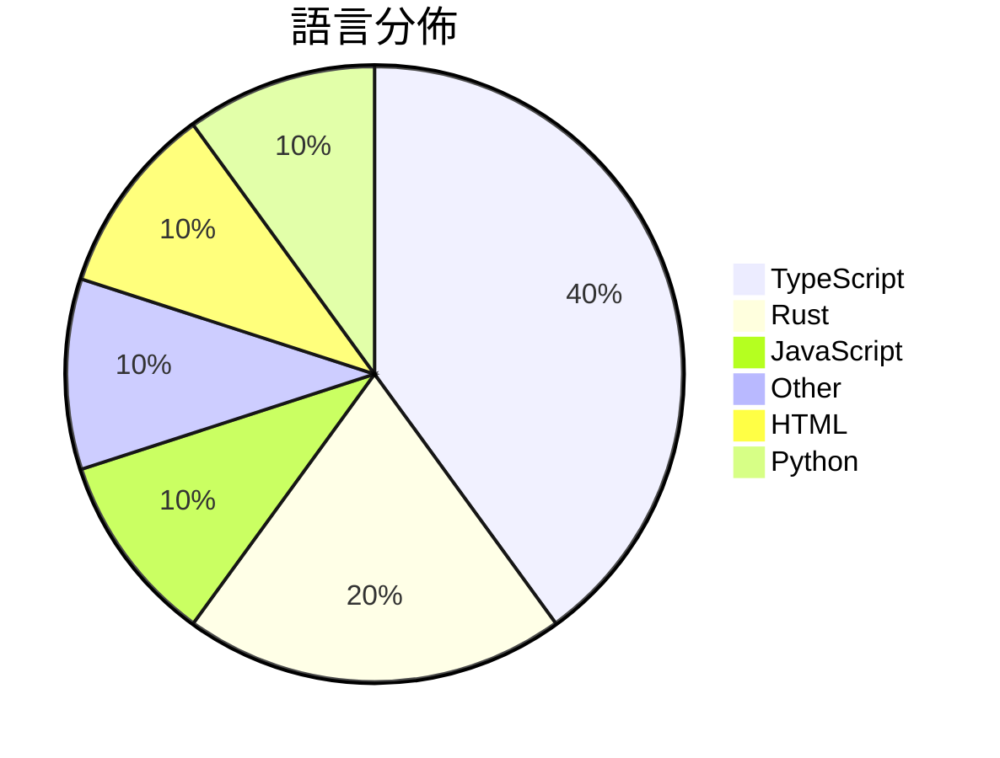

# GitHub Trending - 2026-04-05

> [!summary] 本日摘要
> 收錄 **10** 個新專案，合計 **257.6k** stars
> 語言分佈：TypeScript (4) · Rust (2) · JavaScript (1) · Other (1) · HTML (1) · Python (1)

> [!tip] 本週焦點
> **[[ultraworkers--claw-code|ultraworkers/claw-code]]** — 4 天內累積 167.3k stars（41.8k stars/天）
> 自動化維護的開源代碼重寫專案，旨在展示高效能的自動化開發流程。



---

## 收錄列表

| # | 專案 | 分類 | Stars | 速度 | 安裝 | 語言 | 用途 |
| :--: | --- | --- | ---: | ---: | --- | --- | --- |
| 1 | [[ultraworkers--claw-code\|ultraworkers/claw-code]] | 開發工具 | 167.3k | 41.8k/天 | `medium` | Rust | 自動化維護的開源代碼重寫專案，旨在展示高效能的自動化開發流程。 |
| 2 | [[Gitlawb--openclaude\|Gitlawb/openclaude]] | 開發工具 | 14.7k | 4.9k/天 | `easy` | TypeScript | 提供一個統一的 CLI 介面來使用多種 AI 模型，簡化開發流程。 |
| 3 | [[claude-code-best--claude-code\|claude-code-best/claude-code]] | 開發工具 | 13.6k | 3.4k/天 | `easy` | TypeScript | 提供一個可運行、可構建、可調試的 Claude Code CLI 工具，讓開發者 |
| 4 | [[openai--codex-plugin-cc\|openai/codex-plugin-cc]] | 開發工具 | 11.6k | 2.3k/天 | `easy` | JavaScript | 讓 Claude Code 用 Codex 自動進行程式碼審查或委派任務。 |
| 5 | [[sanbuphy--learn-coding-agent\|sanbuphy/learn-coding-agent]] | 開發工具 | 11.3k | 2.8k/天 | `medium` | N/A | 研究 CLI Agent 架構，幫助開發者理解和利用 Agent 技術。 |
| 6 | [[VoltAgent--awesome-design-md\|VoltAgent/awesome-design-md]] | 開發工具 | 8.5k | 2.1k/天 | `easy` | HTML | 提供各大網站的 DESIGN.md 文件，讓 AI 代理自動生成匹配的 UI。 |
| 7 | [[ChinaSiro--claude-code-sourcemap\|ChinaSiro/claude-code-sourcemap]] | 開發工具 | 8.4k | 2.1k/天 | `easy` | TypeScript | 還原 Claude 的 TypeScript 源碼，供研究使用。 |
| 8 | [[Kuberwastaken--claurst\|Kuberwastaken/claurst]] | 開發工具 | 8.1k | 2.0k/天 | `medium` | Rust | 提供一個用 Rust 實作的終端編碼代理，並分析 Claude 代碼洩漏的發現。 |
| 9 | [[titanwings--colleague-skill\|titanwings/colleague-skill]] | 開發工具 | 7.2k | 1.4k/天 | `medium` | Python | 將離職同事的知識轉化為可用的 AI 技能，解決知識流失問題。 |
| 10 | [[emdash-cms--emdash\|emdash-cms/emdash]] | 開發工具 | 7.0k | 2.3k/天 | `easy` | TypeScript | 提供一個基於 Astro 的全棧 TypeScript CMS，旨在取代 Wor |

---

## 重點摘要

### 1. [[ultraworkers--claw-code|ultraworkers/claw-code]] `開發工具`

> 自動化維護的開源代碼重寫專案，旨在展示高效能的自動化開發流程。

**167.3k** stars · **41.8k** stars/天 · Rust · `medium`

_建立 4 天內累積 167254 stars（41814/天），forks 101748（60.8%），顯示出極高的社群參與度。這個專案的作者 Yeachan Heo 及其團隊過去在開源社群中有著良好的聲譽，並且這個專案解決了傳統開發流程中的效率問題，通過自動化代碼維護來提升開發速度。近期的社群討論和推文也引發了廣泛的關注，進一步推動了其流行。技術生態的變化，例如 Rust 和 Python 的普及，使得這種自動化開發變得可行。高達 60.8% 的 forks/stars 比率顯示出許多人正在積極修改和使用這個專案。_

---

### 2. [[Gitlawb--openclaude|Gitlawb/openclaude]] `開發工具`

> 提供一個統一的 CLI 介面來使用多種 AI 模型，簡化開發流程。

**14.7k** stars · **4.9k** stars/天 · TypeScript · `easy`

_建立 3 天內累積 14725 stars（4908/天），forks 5146（34.9%），顯示出極高的社群參與度。作者 kevincodex1 和其他貢獻者在 AI 和開源領域有著豐富的經驗，這使得專案在技術上具有可信度。OpenClaude 解決了開發者在使用多個 AI 模型時的繁瑣流程，之前的方案往往需要在不同的工具之間切換，效率低下。這個工具的出現正好滿足了市場對於簡化 AI 開發流程的需求。社群的活躍度和問題解決率也顯示出使用者對這個工具的期待和需求。_

---

### 3. [[claude-code-best--claude-code|claude-code-best/claude-code]] `開發工具`

> 提供一個可運行、可構建、可調試的 Claude Code CLI 工具，讓開發者在終端中使用 AI 編程助手。

**13.6k** stars · **3.4k** stars/天 · TypeScript · `easy`

_建立 4 天內累積 13577 stars（3394/天），forks 13864（102.1%），這顯示出極高的使用興趣。這個專案由一群活躍的開發者維護，並且解決了許多開發者在使用 AI 編程助手時的兼容性和可靠性問題。之前的工具往往無法提供足夠的自定義選項，而 CCB 則通過開放源碼的方式讓使用者能夠自由調整功能。社群的活躍討論和問題解決也促進了專案的快速成長。_

---

### 4. [[openai--codex-plugin-cc|openai/codex-plugin-cc]] `開發工具`

> 讓 Claude Code 用 Codex 自動進行程式碼審查或委派任務。

**11.6k** stars · **2.3k** stars/天 · JavaScript · `easy`

_建立 5 天內累積 11646 stars（2329/天），forks 608（5.2%），顯示出穩定的增長趨勢。這個專案的主要貢獻者包括多位活躍的開發者，並且解決了在 Claude Code 環境中使用 Codex 的痛點，讓開發者能夠更方便地進行程式碼審查。之前的方案往往需要在不同的環境中切換，造成效率低下。此插件的出現讓這一過程變得無縫且高效，特別是在團隊協作中。社群的活躍度和開發者的反饋也促進了這個專案的快速發展。_

---

### 5. [[sanbuphy--learn-coding-agent|sanbuphy/learn-coding-agent]] `開發工具`

> 研究 CLI Agent 架構，幫助開發者理解和利用 Agent 技術。

**11.3k** stars · **2.8k** stars/天 · N/A · `medium`

_建立 4 天就累積 11263 stars（2816/天），forks 19632（174.3%），這是極端爆發式增長。作者 sanbuphy 之前在開源社群中有過多個相關專案，這次專案解決了開發者對於 CLI Agent 架構理解不足的痛點，提供了一個全面的學習資源。這個專案的推出可能受到社群對於 Agent 技術興趣上升的影響，並且在技術討論平台上引發了不少關注。高 forks/stars 比率顯示許多人在實際修改使用，表明這個專案的實用性和潛在的社群支持。_

---

### 6. [[VoltAgent--awesome-design-md|VoltAgent/awesome-design-md]] `開發工具`

> 提供各大網站的 DESIGN.md 文件，讓 AI 代理自動生成匹配的 UI。

**8.5k** stars · **2.1k** stars/天 · HTML · `easy`

_建立 4 天就累積 8473 stars（2118/天），forks 1074（12.7%），這顯示出強勁的增長潛力。這個專案由多位貢獻者共同維護，解決了設計與開發之間的溝通問題，讓開發者能夠快速獲得設計指導。之前，開發者通常需要依賴繁瑣的設計工具或手動調整 UI，這個專案簡化了這一過程。社群的活躍度和需求也促進了這個專案的快速成長，特別是在設計系統日益受到重視的背景下。forks/stars 比率達到 12.7%，顯示出許多人在實際修改和使用這個工具。_

---

### 7. [[ChinaSiro--claude-code-sourcemap|ChinaSiro/claude-code-sourcemap]] `開發工具`

> 還原 Claude 的 TypeScript 源碼，供研究使用。

**8.4k** stars · **2.1k** stars/天 · TypeScript · `easy`

_建立 4 天就累積 8378 stars（2095/天），forks 14024（167.4%），這是極端爆發式增長。作者 ChinaSiro 可能是因為對 Claude 的運作有深入理解，並且提供了一個非官方的源碼還原，填補了市場上對於 Claude 內部運作的研究空白。這個專案的出現解決了開發者對於 Claude 源碼的需求，之前的方案往往缺乏完整性或可讀性。最近的推文和討論也引發了社群的關注，進一步推動了專案的流行。技術上，源碼的還原依賴於 npm 的 source map，這使得這個工具在技術上可行且易於使用。forks/stars 比率高達 167.4%，顯示出許多人正在積極修改和使用這個專案。_

---

### 8. [[Kuberwastaken--claurst|Kuberwastaken/claurst]] `開發工具`

> 提供一個用 Rust 實作的終端編碼代理，並分析 Claude 代碼洩漏的發現。

**8.1k** stars · **2.0k** stars/天 · Rust · `medium`

_建立 4 天內累積 8063 stars（2016/天），forks 7503（93.1%），顯示出極高的社群參與度。Kuberwastaken 是一位活躍的開發者，專注於 AI 和編碼工具的開發，這個專案解決了現有 AI 編碼工具在記憶體效率和無追蹤使用上的不足。近期的社群討論和推文引起了廣泛的關注，尤其是對於 Claude 代碼洩漏的分析和後續的技術探討。這個專案的成功也反映了 Rust 語言在高效能應用中的潛力，並吸引了對於開源和 AI 技術有興趣的開發者。_

---

### 9. [[titanwings--colleague-skill|titanwings/colleague-skill]] `開發工具`

> 將離職同事的知識轉化為可用的 AI 技能，解決知識流失問題。

**7.2k** stars · **1.4k** stars/天 · Python · `medium`

_建立 5 天就累積 7160 stars（1432/天），forks 495（6.9%），顯示出強勁的增長潛力。作者 titanwings 之前在 AI 和自動化領域有豐富經驗，這個專案解決了企業在面對人員流動時知識流失的痛點，之前的解決方案往往無法有效保留關鍵知識。近期的社交媒體討論和用戶反饋也推動了這個專案的曝光度。技術上，隨著自動化和 AI 技術的成熟，這個工具的可行性大幅提升。高達 6.9% 的 forks/stars 比率顯示出用戶對這個工具的實際修改和使用意願。_

---

### 10. [[emdash-cms--emdash|emdash-cms/emdash]] `開發工具`

> 提供一個基於 Astro 的全棧 TypeScript CMS，旨在取代 WordPress 的架構與安全性問題。

**7.0k** stars · **2.3k** stars/天 · TypeScript · `easy`

_建立 3 天就累積 7047 stars（2349/天），forks 491（7.0%），這顯示出強烈的社群興趣。這個專案的主要貢獻者 Matt Kane 之前在開源社群有豐富的經驗，這為專案的推廣提供了良好的基礎。EmDash 解決了 WordPress 在安全性上的痛點，特別是插件的安全性問題，這在當前的開發環境中是個重要議題。社群對於這個專案的反應熱烈，尤其是在 GitHub 上的熱門 Issues 反映了使用者對於安全性和部署的關注。這種需求的增加，加上現有技術的進步，使得這個工具的出現正好符合市場需求。_

---

## 今日到期複習

> [!tip] 根據間隔複習排程，今天該回顧的專案

```dataview
TABLE
  stars_per_day AS "Stars/天",
  category AS "分類",
  engagement AS "參與度"
FROM "Repos"
WHERE next_review AND date(next_review) <= date("2026-04-05") AND status != "archived"
SORT priority DESC
```

## 待處理

```dataviewjs
const pending = dv.pages('"Repos"').where(p => p.status === "to-review").length;
const unrated = dv.pages('"Repos"').where(p => p.status !== "archived" && p.status !== "to-review" && (p.my_rating || 0) === 0).length;
const noVerdict = dv.pages('"Repos"').where(p => p.status !== "archived" && (p.my_rating || 0) > 0 && (!p.verdict || p.verdict === "")).length;
const items = [];
if (pending > 0) items.push(`**${pending}** 個待分流`);
if (unrated > 0) items.push(`**${unrated}** 個已讀但未評分`);
if (noVerdict > 0) items.push(`**${noVerdict}** 個已評分但無結論`);
if (items.length > 0) dv.paragraph(items.join(" / "));
else dv.paragraph("所有專案都已處理完畢！");
```
