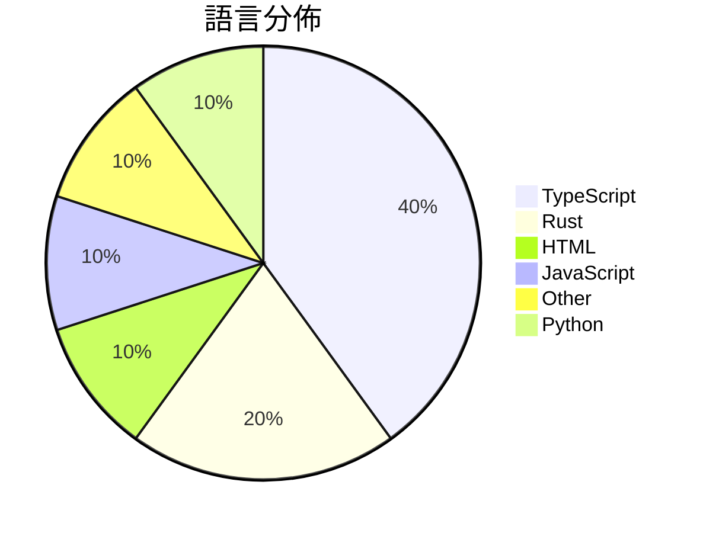

# GitHub Trending - 2026-04-06

> [!summary] 本日摘要
> 收錄 **10** 個新專案，合計 **271.9k** stars
> 語言分佈：TypeScript (4) · Rust (2) · HTML (1) · JavaScript (1) · Other (1) · Python (1)

> [!tip] 本週焦點
> **[[ultraworkers--claw-code|ultraworkers/claw-code]]** — 5 天內累積 171.0k stars（34.2k stars/天）
> 提供一個快速的 Rust 實作 CLI 工具，專為與 Claude API 互動而設計。



---

## 收錄列表

| # | 專案 | 分類 | Stars | 速度 | 安裝 | 語言 | 用途 |
| :--: | --- | --- | ---: | ---: | --- | --- | --- |
| 1 | [[ultraworkers--claw-code\|ultraworkers/claw-code]] | 開發工具 | 171.0k | 34.2k/天 | `medium` | Rust | 提供一個快速的 Rust 實作 CLI 工具，專為與 Claude API 互動 |
| 2 | [[Gitlawb--openclaude\|Gitlawb/openclaude]] | 開發工具 | 16.5k | 4.1k/天 | `easy` | TypeScript | 提供統一的 CLI 介面，整合多種 AI 編碼模型，讓開發者能夠更高效地使用各種 |
| 3 | [[VoltAgent--awesome-design-md\|VoltAgent/awesome-design-md]] | 開發工具 | 15.2k | 3.0k/天 | `easy` | HTML | 提供設計系統的 DESIGN.md 文件，讓 AI 自動生成符合設計的 UI。 |
| 4 | [[claude-code-best--claude-code\|claude-code-best/claude-code]] | 開發工具 | 13.9k | 2.8k/天 | `easy` | TypeScript | 提供一個原汁原味的 Claude Code CLI 工具，讓開發者可以在終端中互 |
| 5 | [[openai--codex-plugin-cc\|openai/codex-plugin-cc]] | 開發工具 | 11.9k | 2.0k/天 | `easy` | JavaScript | 讓 Claude Code 使用 Codex 進行代碼審查或委派任務。 |
| 6 | [[sanbuphy--learn-coding-agent\|sanbuphy/learn-coding-agent]] | 開發工具 | 11.3k | 2.3k/天 | `medium` | N/A | 研究 CLI Agent 架構，幫助開發者理解和利用 Agent 技術。 |
| 7 | [[ChinaSiro--claude-code-sourcemap\|ChinaSiro/claude-code-sourcemap]] | 開發工具 | 8.5k | 1.7k/天 | `easy` | TypeScript | 還原 Claude 的 TypeScript 源碼，供研究使用。 |
| 8 | [[Kuberwastaken--claurst\|Kuberwastaken/claurst]] | 開發工具 | 8.3k | 1.7k/天 | `medium` | Rust | 提供一個 Rust 實作的終端編碼代理，並深入分析 Claude 代碼洩漏事件。 |
| 9 | [[titanwings--colleague-skill\|titanwings/colleague-skill]] | 開發工具 | 7.9k | 1.3k/天 | `medium` | Python | 將同事的知識轉化為可用的 AI 技能，解決知識流失問題。 |
| 10 | [[emdash-cms--emdash\|emdash-cms/emdash]] | 開發工具 | 7.4k | 1.9k/天 | `medium` | TypeScript | 提供一個以 TypeScript 為基礎的全功能 CMS，重塑 WordPres |

---

## 重點摘要

### 1. [[ultraworkers--claw-code|ultraworkers/claw-code]] `開發工具`

> 提供一個快速的 Rust 實作 CLI 工具，專為與 Claude API 互動而設計。

**171.0k** stars · **34.2k** stars/天 · Rust · `medium`

_建立 5 天內累積 170957 stars（34191/天），forks 103670（60.6%），顯示出極高的使用者興趣。這個專案的作者 Yeachan-Heo 和 code-yeongyu 在開源社群中有一定的影響力，並且這個工具解決了與 Claude API 互動的效率問題，之前的解決方案往往依賴於較慢的語言如 Python。社群的活躍度和快速的迭代更新也吸引了大量使用者的關注。_

---

### 2. [[Gitlawb--openclaude|Gitlawb/openclaude]] `開發工具`

> 提供統一的 CLI 介面，整合多種 AI 編碼模型，讓開發者能夠更高效地使用各種模型進行編碼工作。

**16.5k** stars · **4.1k** stars/天 · TypeScript · `easy`

_建立 4 天就累積 16481 stars（4120/天），forks 5767（35.0%），這顯示出強烈的社群關注。這個專案的主要貢獻者來自於多個背景，並且在開源社群中有一定的知名度。OpenClaude 解決了開發者在使用多種 AI 編碼模型時的整合問題，以往開發者需要在不同的 CLI 工具之間切換，這樣的繁瑣過程降低了開發效率。這個工具的出現正好填補了這一空白，提供了一個統一的解決方案。社群討論中也提到了一些功能需求和 bug，顯示出使用者對於這個工具的期待和實際使用中的痛點。這些因素共同促進了 OpenClaude 的快速成長。_

---

### 3. [[VoltAgent--awesome-design-md|VoltAgent/awesome-design-md]] `開發工具`

> 提供設計系統的 DESIGN.md 文件，讓 AI 自動生成符合設計的 UI。

**15.2k** stars · **3.0k** stars/天 · HTML · `easy`

_建立 5 天就累積 15235 stars（3047/天），forks 1878（12.3%），這顯示出極高的使用興趣。作者是 necatiozmen 等人，他們在設計系統和開發工具方面有豐富的經驗。這個專案解決了設計與開發之間的溝通問題，讓開發者能夠更快地實現設計意圖，之前的解決方案往往需要繁瑣的設計文件轉換。社群的反饋和請求功能也促進了專案的快速迭代，吸引了更多開發者參與。技術上，這個工具的出現得益於 Markdown 格式的普遍性和 AI 技術的進步，使得設計系統的自動化生成成為可能。forks/stars 比率為 12.3%，顯示出有相當比例的用戶在實際修改和使用這個專案。_

---

### 4. [[claude-code-best--claude-code|claude-code-best/claude-code]] `開發工具`

> 提供一個原汁原味的 Claude Code CLI 工具，讓開發者可以在終端中互動式編程。

**13.9k** stars · **2.8k** stars/天 · TypeScript · `easy`

_建立 5 天內累積 13897 stars（2779/天），forks 14068（101.2%），這顯示出極高的使用興趣。主要貢獻者包括多位活躍的開發者，並且專案的功能填補了市場上對於安全且可靠的 AI 編程助手的需求。這個工具的出現正好解決了許多開發者在使用官方工具時遇到的兼容性和安全性問題，特別是對於無法直接使用官方 API 的場景。社群的活躍度和問題解決率也顯示出其良好的支持體系。_

---

### 5. [[openai--codex-plugin-cc|openai/codex-plugin-cc]] `開發工具`

> 讓 Claude Code 使用 Codex 進行代碼審查或委派任務。

**11.9k** stars · **2.0k** stars/天 · JavaScript · `easy`

_建立 6 天就累積 11921 stars（1987/天），forks 622（5.2%），顯示出穩定的增長趨勢。這個專案的主要貢獻者來自 OpenAI，過去在 AI 和開發工具領域有豐富的經驗。它解決了開發者在代碼審查過程中缺乏深度分析的痛點，傳統的代碼審查工具往往無法提供足夠的上下文和挑戰性分析。最近的推廣和討論可能促進了這個專案的曝光，特別是在開發者社群中。這個工具的設計使得 Codex 的使用變得更加便捷，並且能夠無縫整合到現有的開發流程中。forks/stars 比率為 5.2%，顯示出有相當一部分用戶在積極修改和使用這個工具。_

---

### 6. [[sanbuphy--learn-coding-agent|sanbuphy/learn-coding-agent]] `開發工具`

> 研究 CLI Agent 架構，幫助開發者理解和利用 Agent 技術。

**11.3k** stars · **2.3k** stars/天 · N/A · `medium`

_建立 5 天內累積 11334 stars（2267/天），forks 19655（173.4%），顯示出極高的興趣和參與度。這位作者 sanbuphy 在開源社群中活躍，專注於 Agent 技術的研究，解決了開發者在理解和使用 CLI Agent 時的痛點。這個專案的出現正好填補了市場上對於高效能 CLI Agent 的需求，並且社群的反應非常熱烈，可能是因為其技術的前瞻性和實用性。_

---

### 7. [[ChinaSiro--claude-code-sourcemap|ChinaSiro/claude-code-sourcemap]] `開發工具`

> 還原 Claude 的 TypeScript 源碼，供研究使用。

**8.5k** stars · **1.7k** stars/天 · TypeScript · `easy`

_建立 5 天就累積 8453 stars（1691/天），forks 14113（167.0%），顯示出極高的興趣。作者 ChinaSiro 透過這個專案解決了對 Claude 源碼的需求，之前的工具無法提供這樣的還原功能。這個專案的爆發可能受到社群對於 AI 開發透明度的需求驅動。forks/stars 比率高達 167.0%，顯示許多人在實際修改和使用這個工具。_

---

### 8. [[Kuberwastaken--claurst|Kuberwastaken/claurst]] `開發工具`

> 提供一個 Rust 實作的終端編碼代理，並深入分析 Claude 代碼洩漏事件。

**8.3k** stars · **1.7k** stars/天 · Rust · `medium`

_建立 5 天內累積 8294 stars（1659/天），forks 7561（91.2%），顯示出極高的社群參與度。這個專案由 Kuberwastaken 和 Sporkley 共同開發，前者在開源社群中有著良好的聲譽。CLAURST 解決了許多開發者在使用 Claude 時遇到的性能和隱私問題，特別是在記憶體管理和無追蹤使用方面。近期的代碼洩漏事件引發了廣泛的討論，進一步推動了對這個專案的關注。高比例的 forks 表示許多開發者正在積極修改和使用這個專案，顯示出其實用性和潛在的擴展性。_

---

### 9. [[titanwings--colleague-skill|titanwings/colleague-skill]] `開發工具`

> 將同事的知識轉化為可用的 AI 技能，解決知識流失問題。

**7.9k** stars · **1.3k** stars/天 · Python · `medium`

_建立 6 天就累積 7852 stars（1309/天），forks 599（7.6%），這顯示出相當高的關注度。作者 titanwings 來自上海 AI Lab，專注於 AI 技術的應用與發展。這個專案解決了團隊知識流失的痛點，特別是在高流動率的行業中，傳統的知識管理工具無法有效地捕捉和重用個人知識。近期的社群討論和熱門 Issues 顯示出用戶對於如何更好地利用這些技能的強烈興趣，這也促進了專案的快速增長。技術上，這個工具的設計符合當前 AI 技術的發展趨勢，特別是在知識管理和自動化方面的需求增長。_

---

### 10. [[emdash-cms--emdash|emdash-cms/emdash]] `開發工具`

> 提供一個以 TypeScript 為基礎的全功能 CMS，重塑 WordPress 的擴展性與安全性。

**7.4k** stars · **1.9k** stars/天 · TypeScript · `medium`

_建立 4 天就累積 7441 stars（1860/天），forks 532（7.1%），顯示出強勁的增長潛力。這個專案的作者 Matt Kane 之前在開源社區活躍，致力於提升 CMS 的安全性和可擴展性。EmDash 解決了 WordPress 插件安全性差的問題，提供了一個更現代化的替代方案。近期的推廣活動和社群反饋也讓這個專案獲得了更多的關注，特別是在開發者對於安全性和性能的需求日益增加的背景下。forks/stars 比率在 7.1%，這表明許多開發者對這個專案感興趣並進行了實際的修改或使用。_

---

## 今日到期複習

> [!tip] 根據間隔複習排程，今天該回顧的專案

```dataview
TABLE
  stars_per_day AS "Stars/天",
  category AS "分類",
  engagement AS "參與度"
FROM "Repos"
WHERE next_review AND date(next_review) <= date("2026-04-06") AND status != "archived"
SORT priority DESC
```

## 待處理

```dataviewjs
const pending = dv.pages('"Repos"').where(p => p.status === "to-review").length;
const unrated = dv.pages('"Repos"').where(p => p.status !== "archived" && p.status !== "to-review" && (p.my_rating || 0) === 0).length;
const noVerdict = dv.pages('"Repos"').where(p => p.status !== "archived" && (p.my_rating || 0) > 0 && (!p.verdict || p.verdict === "")).length;
const items = [];
if (pending > 0) items.push(`**${pending}** 個待分流`);
if (unrated > 0) items.push(`**${unrated}** 個已讀但未評分`);
if (noVerdict > 0) items.push(`**${noVerdict}** 個已評分但無結論`);
if (items.length > 0) dv.paragraph(items.join(" / "));
else dv.paragraph("所有專案都已處理完畢！");
```
