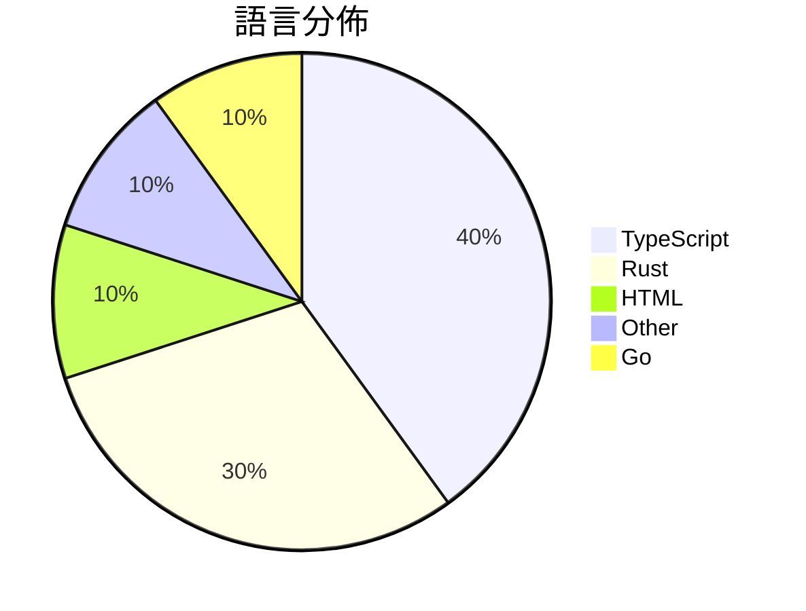

# GitHub Trending - 2026-04-07

> [!summary] 本日摘要
> 收錄 **10** 個新專案，合計 **283.4k** stars
> 語言分佈：TypeScript (4) · Rust (3) · HTML (1) · Other (1) · Go (1)

> [!tip] 本週焦點
> **[[ultraworkers--claw-code|ultraworkers/claw-code]]** — 6 天內累積 174.0k stars（29.0k stars/天）
> 提供一個用 Rust 實作的 CLI 工具，讓開發者能夠輕鬆地與 Claude API 互動。



---

## 收錄列表

| # | 專案 | 分類 | Stars | 速度 | 安裝 | 語言 | 用途 |
| :--: | --- | --- | ---: | ---: | --- | --- | --- |
| 1 | [[ultraworkers--claw-code\|ultraworkers/claw-code]] | 開發工具 | 174.0k | 29.0k/天 | `medium` | Rust | 提供一個用 Rust 實作的 CLI 工具，讓開發者能夠輕鬆地與 Claude  |
| 2 | [[VoltAgent--awesome-design-md\|VoltAgent/awesome-design-md]] | 開發工具 | 23.0k | 3.8k/天 | `easy` | HTML | 提供設計系統的 DESIGN.md 文件，讓 AI 自動生成符合設計的 UI。 |
| 3 | [[Gitlawb--openclaude\|Gitlawb/openclaude]] | 開發工具 | 18.1k | 3.6k/天 | `easy` | TypeScript | 提供一個統一的 CLI 介面，讓開發者可以使用多種 AI 模型進行編碼和開發工作 |
| 4 | [[claude-code-best--claude-code\|claude-code-best/claude-code]] | 開發工具 | 14.2k | 2.4k/天 | `easy` | TypeScript | 提供一個可運行、可構建、可調試的 Claude Code CLI 工具，並修復  |
| 5 | [[sanbuphy--learn-coding-agent\|sanbuphy/learn-coding-agent]] | 開發工具 | 11.4k | 1.9k/天 | `medium` | N/A | 研究 CLI Agent 架構，幫助開發者理解和利用 Agent 技術。 |
| 6 | [[santifer--career-ops\|santifer/career-ops]] | 開發工具 | 11.3k | 5.7k/天 | `medium` | Go | 一個 AI 驅動的求職系統，幫助用戶生成個性化履歷、評估工作機會並追蹤申請進度。 |
| 7 | [[Kuberwastaken--claurst\|Kuberwastaken/claurst]] | 開發工具 | 8.5k | 1.4k/天 | `medium` | Rust | 提供一個 Rust 實作的終端編碼代理，並深入分析 Claude 代碼洩漏的發現 |
| 8 | [[ChinaSiro--claude-code-sourcemap\|ChinaSiro/claude-code-sourcemap]] | 開發工具 | 8.5k | 1.4k/天 | `medium` | TypeScript | 還原 Claude 的 TypeScript 源碼，供研究用途。 |
| 9 | [[emdash-cms--emdash\|emdash-cms/emdash]] | 開發工具 | 7.8k | 1.6k/天 | `medium` | TypeScript | 重建 WordPress 的全棧 TypeScript CMS，基於 Astro |
| 10 | [[ultraworkers--claw-code-parity\|ultraworkers/claw-code-parity]] | 開發工具 | 6.5k | 1.6k/天 | `medium` | Rust | 提供一個 Rust 端口的臨時工作，旨在實現 claw-code 的代碼平行性。 |

---

## 重點摘要

### 1. [[ultraworkers--claw-code|ultraworkers/claw-code]] `開發工具`

> 提供一個用 Rust 實作的 CLI 工具，讓開發者能夠輕鬆地與 Claude API 互動。

**174.0k** stars · **29.0k** stars/天 · Rust · `medium`

_建立 6 天內累積 173951 stars（28992/天），forks 105179（60.5%），這顯示出極高的使用興趣。作者 Yeachan-Heo 和 code-yeongyu 之前在開源社群中有良好的聲譽，這使得 Claw Code 迅速獲得關注。這個專案解決了開發者在使用 Claude API 時的繁瑣認證問題，並提供了一個高效的 CLI 工具，讓開發者能夠快速上手。社群的活躍度和快速的迭代更新也促進了其受歡迎程度。技術上，Rust 的性能優勢和安全性使得這個工具在高負載環境下表現出色，這是許多開發者所需要的。forks/stars 比率高達 60.5%，顯示出許多人正在實際修改和使用這個工具。_

---

### 2. [[VoltAgent--awesome-design-md|VoltAgent/awesome-design-md]] `開發工具`

> 提供設計系統的 DESIGN.md 文件，讓 AI 自動生成符合設計的 UI。

**23.0k** stars · **3.8k** stars/天 · HTML · `easy`

_建立 6 天內累積 23033 stars（3839/天），forks 2844（12.3%），顯示出強勁的增長勢頭。專案的主要貢獻者有過去的設計和開發經驗，這使他們能夠針對開發者的需求設計出有效的解決方案。這個工具解決了設計與開發之間的溝通問題，讓開發者能夠更快地生成符合設計的 UI。社群的活躍度和請求功能的開放性也促進了使用者的參與，進一步推動了專案的發展。_

---

### 3. [[Gitlawb--openclaude|Gitlawb/openclaude]] `開發工具`

> 提供一個統一的 CLI 介面，讓開發者可以使用多種 AI 模型進行編碼和開發工作。

**18.1k** stars · **3.6k** stars/天 · TypeScript · `easy`

_建立 5 天內累積 18057 stars（3611/天），forks 6359（35.2%），顯示出強勁的社群興趣。作者 kevincodex1 和其他貢獻者在開源領域有一定的影響力，之前也參與過多個相關專案。OpenClaude 解決了開發者在使用多個 AI 模型時的複雜性，提供了一個統一的介面，讓用戶能夠更方便地切換和使用不同的模型。這種需求在當前 AI 模型多樣化的背景下變得愈發重要。社群的活躍討論和需求反饋也促進了專案的快速發展。_

---

### 4. [[claude-code-best--claude-code|claude-code-best/claude-code]] `開發工具`

> 提供一個可運行、可構建、可調試的 Claude Code CLI 工具，並修復 TypeScript 類型。

**14.2k** stars · **2.4k** stars/天 · TypeScript · `easy`

_建立 6 天就累積 14198 stars（2366/天），forks 14245（100.3%），這顯示出極高的用戶參與度。這個專案的作者是 claude-code-best，過去在開源社群中活躍，專注於 AI 工具的開發。CCB 解決了開發者在使用 Claude Code 時的可用性問題，提供了一個更易於使用和擴展的 CLI 工具。近期的推廣活動和社群互動（如 Discord 群組）也促進了其快速增長。隨著 Bun 的流行，這個工具的可行性和性能得到了進一步提升，吸引了大量開發者的關注。forks/stars 比率超過 100% 表示許多人在積極修改和使用這個專案，顯示出其在實際應用中的潛力。_

---

### 5. [[sanbuphy--learn-coding-agent|sanbuphy/learn-coding-agent]] `開發工具`

> 研究 CLI Agent 架構，幫助開發者理解和利用 Agent 技術。

**11.4k** stars · **1.9k** stars/天 · N/A · `medium`

_建立 6 天就累積 11399 stars（1900/天），forks 19674（172.6%），這顯示出極高的使用者參與度。作者 sanbuphy 之前在 CLI Agent 領域有過相關的研究，這個專案解決了開發者對於 Agent 架構理解不足的痛點，提供了一個清晰的學習資源。近期的推廣活動和社群討論也促進了其快速增長，尤其是在開源社群中對於 CLI 工具的需求日益增加。forks/stars 比率達到 172.6%，顯示出許多人在實際修改和使用這個專案。_

---

### 6. [[santifer--career-ops|santifer/career-ops]] `開發工具`

> 一個 AI 驅動的求職系統，幫助用戶生成個性化履歷、評估工作機會並追蹤申請進度。

**11.3k** stars · **5.7k** stars/天 · Go · `medium`

_建立 2 天就累積 11317 stars（5659/天），forks 2059（18.2%），這顯示出極高的用戶興趣。作者 Santiago 是一位 AI 領域的專家，曾經創立並出售過公司，這使他對求職過程有深刻的理解。這個專案解決了求職者在繁瑣的申請過程中缺乏自動化工具的痛點，之前求職者通常需要手動追蹤申請進度和生成履歷，效率低下。近期的推廣活動和社交媒體的討論也可能促進了這個專案的曝光。高達 18.2% 的 forks/stars 比率顯示出許多用戶正在進行實際的修改和使用，這意味著這個工具不僅僅是觀望，而是有實際的應用需求。_

---

### 7. [[Kuberwastaken--claurst|Kuberwastaken/claurst]] `開發工具`

> 提供一個 Rust 實作的終端編碼代理，並深入分析 Claude 代碼洩漏的發現。

**8.5k** stars · **1.4k** stars/天 · Rust · `medium`

_建立 6 天就累積 8517 stars（1420/天），forks 7630（89.6%），這顯示出極高的使用興趣。Kuberwastaken 和 Sporkley 是這個專案的主要貢獻者，過去在開源社群中活躍，這使得他們的專案受到關注。CLAURST 解決了終端編碼代理在記憶體效率和功能靈活性上的痛點，特別是在多提供者支援方面，這是之前工具無法有效實現的。最近的社群討論和推文也引發了對這個專案的廣泛關注，進一步推動了其流行。這個工具的設計和實作方式也反映了 Rust 語言在性能和安全性上的優勢，這使得它在當前技術生態中更具吸引力。_

---

### 8. [[ChinaSiro--claude-code-sourcemap|ChinaSiro/claude-code-sourcemap]] `開發工具`

> 還原 Claude 的 TypeScript 源碼，供研究用途。

**8.5k** stars · **1.4k** stars/天 · TypeScript · `medium`

_建立 6 天就累積 8517 stars（1420/天），forks 14174（166.4%），這是極端爆發式增長。作者 ChinaSiro 透過這個專案解決了對 Claude 源碼的需求，之前開發者只能依賴官方文檔或有限的資源。這個專案的出現引發了社群的廣泛關注，特別是在技術研究和開發者社群中。技術上，這個專案的成功也反映了對開源和透明度的需求，尤其是在 AI 領域。高達 166.4% 的 forks/stars 比率顯示出許多開發者在積極修改和使用這個專案，這意味著它不僅僅是觀望，而是實際參與。_

---

### 9. [[emdash-cms--emdash|emdash-cms/emdash]] `開發工具`

> 重建 WordPress 的全棧 TypeScript CMS，基於 Astro，提供安全的插件架構。

**7.8k** stars · **1.6k** stars/天 · TypeScript · `medium`

_建立 5 天內累積 7825 stars（1565/天），forks 576（7.4%），顯示出強烈的社群興趣。開發者 Matt Kane 之前參與過多個開源專案，這次的 EmDash 針對 WordPress 的安全性問題提供了創新的解決方案，特別是插件的沙盒化運行。社群中的熱門問題如移除密碼要求和 Docker 部署文檔的需求，顯示出用戶對於簡化使用流程的強烈期望。這個工具的設計理念符合當前對安全和易用性的需求，特別是在 serverless 架構日益普及的背景下，讓它成為一個具潛力的選擇。_

---

### 10. [[ultraworkers--claw-code-parity|ultraworkers/claw-code-parity]] `開發工具`

> 提供一個 Rust 端口的臨時工作，旨在實現 claw-code 的代碼平行性。

**6.5k** stars · **1.6k** stars/天 · Rust · `medium`

_建立 4 天內累積 6545 stars（1636/天），forks 5396（82.4%），這顯示出極高的社群參與度。專案的主要貢獻者 Yeachan Heo 之前在開源社群中活躍，並且這個專案解決了代碼平行性和自動化開發的痛點，之前的解決方案往往依賴於手動維護，效率低下。這個專案的出現正好填補了這一空白，並且在社群中引起了廣泛討論。技術上，Rust 和 Python 的結合使得這個專案在性能和可擴展性上都有不錯的表現。forks/stars 比率高達 82.4%，顯示出許多開發者對此專案的實際修改和使用。_

---

## 今日到期複習

> [!tip] 根據間隔複習排程，今天該回顧的專案

```dataview
TABLE
  stars_per_day AS "Stars/天",
  category AS "分類",
  engagement AS "參與度"
FROM "Repos"
WHERE next_review AND date(next_review) <= date("2026-04-07") AND status != "archived"
SORT priority DESC
```

## 待處理

```dataviewjs
const pending = dv.pages('"Repos"').where(p => p.status === "to-review").length;
const unrated = dv.pages('"Repos"').where(p => p.status !== "archived" && p.status !== "to-review" && (p.my_rating || 0) === 0).length;
const noVerdict = dv.pages('"Repos"').where(p => p.status !== "archived" && (p.my_rating || 0) > 0 && (!p.verdict || p.verdict === "")).length;
const items = [];
if (pending > 0) items.push(`**${pending}** 個待分流`);
if (unrated > 0) items.push(`**${unrated}** 個已讀但未評分`);
if (noVerdict > 0) items.push(`**${noVerdict}** 個已評分但無結論`);
if (items.length > 0) dv.paragraph(items.join(" / "));
else dv.paragraph("所有專案都已處理完畢！");
```
