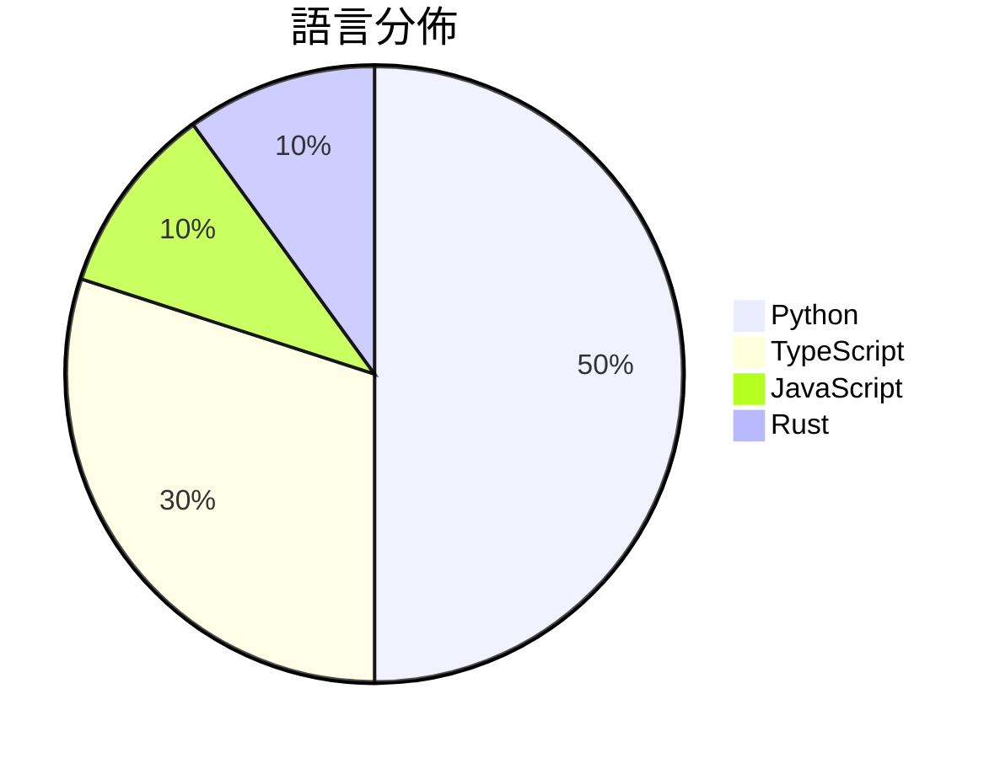

# GitHub Trending - 2026-04-08

> [!summary] 本日摘要
> 收錄 **10** 個新專案，合計 **97.1k** stars
> 語言分佈：Python (5) · TypeScript (3) · JavaScript (1) · Rust (1)

> [!tip] 本週焦點
> **[[Gitlawb--openclaude|Gitlawb/openclaude]]** — 6 天內累積 19.1k stars（3.2k stars/天）
> 提供一個統一的 CLI 工具，讓開發者能夠使用多種 AI 模型進行編碼任務。



---

## 收錄列表

| # | 專案 | 分類 | Stars | 速度 | 安裝 | 語言 | 用途 |
| :--: | --- | --- | ---: | ---: | --- | --- | --- |
| 1 | [[Gitlawb--openclaude\|Gitlawb/openclaude]] | 開發工具 | 19.1k | 3.2k/天 | `easy` | TypeScript | 提供一個統一的 CLI 工具，讓開發者能夠使用多種 AI 模型進行編碼任務。 |
| 2 | [[santifer--career-ops\|santifer/career-ops]] | AI/ML | 18.5k | 6.2k/天 | `medium` | JavaScript | 一個 AI 驅動的求職系統，幫助用戶評估工作機會、生成個性化履歷並追蹤申請進度。 |
| 3 | [[milla-jovovich--mempalace\|milla-jovovich/mempalace]] | AI/ML | 17.3k | 5.8k/天 | `easy` | Python | 提供 AI 記憶系統，讓你能夠將專案和對話整理成可搜尋的記憶宮殿。 |
| 4 | [[emdash-cms--emdash\|emdash-cms/emdash]] | 開發工具 | 8.2k | 1.4k/天 | `medium` | TypeScript | 提供一個基於 Astro 的全棧 TypeScript CMS，旨在取代 Wor |
| 5 | [[HKUDS--OpenHarness\|HKUDS/OpenHarness]] | 開發工具 | 7.1k | 1.2k/天 | `easy` | Python | 提供輕量級的代理基礎設施，支持多種工具和多代理協調。 |
| 6 | [[safishamsi--graphify\|safishamsi/graphify]] | 開發工具 | 7.1k | 1.8k/天 | `medium` | Python | 將任何代碼、文檔、論文或圖像資料夾轉換為可查詢的知識圖譜。 |
| 7 | [[ultraworkers--claw-code-parity\|ultraworkers/claw-code-parity]] | 開發工具 | 6.6k | 1.3k/天 | `medium` | Rust | 提供一個自動化的 Rust 端口重寫過程，旨在實現與原始系統的功能對等。 |
| 8 | [[JuliusBrussee--caveman\|JuliusBrussee/caveman]] | AI/ML | 6.0k | 2.0k/天 | `easy` | Python | 透過模仿原始人說話方式，減少約 65% 的 LLM 輸出 token 數量。 |
| 9 | [[kevinrgu--autoagent\|kevinrgu/autoagent]] | 開發工具 | 3.8k | 761/天 | `medium` | Python | 讓 AI 自動構建和迭代代理系統，無需手動編輯代碼。 |
| 10 | [[0xGF--boneyard\|0xGF/boneyard]] | 開發工具 | 3.5k | 588/天 | `easy` | TypeScript | 自動生成的骨架加載框架，無需手動測量，完美呈現 UI 加載效果。 |

---

## 重點摘要

### 1. [[Gitlawb--openclaude|Gitlawb/openclaude]] `開發工具`

> 提供一個統一的 CLI 工具，讓開發者能夠使用多種 AI 模型進行編碼任務。

**19.1k** stars · **3.2k** stars/天 · TypeScript · `easy`

_建立 6 天內累積 19109 stars（3185/天），forks 6719（35.2%），這顯示出強烈的社群參與和需求。作者 KevinCodex1 和其他貢獻者在開源社群中有一定的影響力，之前的專案也獲得了良好的反響。OpenClaude 解決了開發者在使用多種 AI 模型時的繁瑣流程，提供了一個統一的 CLI 工具，這在當前多元化的 AI 生態中是非常需要的。社群的活躍度和開發者的快速反饋也促進了這個專案的成長。_

---

### 2. [[santifer--career-ops|santifer/career-ops]] `AI/ML`

> 一個 AI 驅動的求職系統，幫助用戶評估工作機會、生成個性化履歷並追蹤申請進度。

**18.5k** stars · **6.2k** stars/天 · JavaScript · `medium`

_建立 3 天內累積 18471 stars（6157/天），forks 3535（19.1%），這顯示出極高的使用者興趣。作者 Santiago Fernández 之前創建的項目已經成功，這次的 Career-Ops 針對求職過程中的痛點提供了自動化解決方案，特別是對於需要批量處理申請的用戶。這個工具的推出引起了社群的廣泛關注，並且在社交媒體上有一定的討論。隨著 AI 技術的進步，這種自動化求職工具的需求也在上升，特別是在競爭激烈的求職市場中。forks/stars 比率為 19.1%，顯示出許多開發者對於這個工具的實際修改和使用。_

---

### 3. [[milla-jovovich--mempalace|milla-jovovich/mempalace]] `AI/ML`

> 提供 AI 記憶系統，讓你能夠將專案和對話整理成可搜尋的記憶宮殿。

**17.3k** stars · **5.8k** stars/天 · Python · `easy`

_建立 3 天內累積 17279 stars（5760/天），forks 1966（11.4%），顯示出強烈的社群興趣。作者 Milla Jovovich 和 Ben Sigman 具備開源背景，並且針對記憶系統的痛點提供了創新的解決方案，特別是對於需要本地存儲和高效檢索的用戶。近期的社群反饋也促使他們迅速修正 README 中的錯誤，顯示出開發團隊對於用戶反饋的重視。這樣的開放態度和持續改進的承諾，進一步吸引了使用者的注意。_

---

### 4. [[emdash-cms--emdash|emdash-cms/emdash]] `開發工具`

> 提供一個基於 Astro 的全棧 TypeScript CMS，旨在取代 WordPress 的架構與安全性問題。

**8.2k** stars · **1.4k** stars/天 · TypeScript · `medium`

_建立 6 天內累積 8180 stars（1363/天），forks 604（7.4%），顯示出強烈的社群興趣。這個專案的主要貢獻者 Matt Kane 之前的經驗和對 CMS 的深入理解，使得 EmDash 能夠有效解決 WordPress 的安全性問題，尤其是插件的安全性。這個專案的推出恰逢許多開發者尋求更安全的替代方案，特別是在 serverless 架構日益流行的背景下。高達 7.4% 的 forks/stars 比率顯示出許多開發者不僅在觀望，而是積極參與修改和使用這個工具。_

---

### 5. [[HKUDS--OpenHarness|HKUDS/OpenHarness]] `開發工具`

> 提供輕量級的代理基礎設施，支持多種工具和多代理協調。

**7.1k** stars · **1.2k** stars/天 · Python · `easy`

_建立 6 天就累積 7142 stars（1190/天），forks 1238（17.3%），顯示出強勁的增長勢頭。作者團隊由多位開源貢獻者組成，過去在 AI 和開源社群中有良好的聲譽。這個專案解決了多代理協調和工具整合的痛點，之前的工具往往缺乏靈活性和擴展性。近期的推廣活動和社群討論也促進了其曝光率，技術生態的變化使得這種開放式架構更具可行性。高達 17.3% 的 forks/stars 比率顯示出許多開發者對此專案的實際修改和使用需求。_

---

### 6. [[safishamsi--graphify|safishamsi/graphify]] `開發工具`

> 將任何代碼、文檔、論文或圖像資料夾轉換為可查詢的知識圖譜。

**7.1k** stars · **1.8k** stars/天 · Python · `medium`

_建立 4 天就累積 7061 stars（1765/天），forks 723（10.2%），這顯示出其快速增長的潛力。作者 safishamsi 之前有開發相關的 AI 工具，這個專案解決了將不同類型資料整合為可查詢知識圖譜的需求，這在現有工具中並不常見。社群對於該專案的熱情反映在熱門 Issues 上，例如對於 demo 的需求和對於新版本功能的期待，這些都顯示出使用者對於其實用性的重視。技術上，這個工具的出現得益於 AI 和知識圖譜技術的進步，使得這種多模態資料處理成為可能。forks/stars 比率為 10.2%，顯示出許多開發者正在實際修改和使用這個專案。_

---

### 7. [[ultraworkers--claw-code-parity|ultraworkers/claw-code-parity]] `開發工具`

> 提供一個自動化的 Rust 端口重寫過程，旨在實現與原始系統的功能對等。

**6.6k** stars · **1.3k** stars/天 · Rust · `medium`

_建立 5 天內累積 6599 stars（1320/天），forks 5412（82.0%），顯示出極高的社群參與度。這個專案的主要貢獻者 Yeachan Heo 過去在開源社群中有著良好的聲譽，並且此專案解決了傳統開發流程中的效率問題，特別是在自動化和快速迭代方面。近期的推特討論和社群互動也促進了這個專案的曝光率。技術上，Rust 和 Python 的結合使得這個專案在性能和可讀性上都有所提升，這在開源社群中引起了廣泛的關注。_

---

### 8. [[JuliusBrussee--caveman|JuliusBrussee/caveman]] `AI/ML`

> 透過模仿原始人說話方式，減少約 65% 的 LLM 輸出 token 數量。

**6.0k** stars · **2.0k** stars/天 · Python · `easy`

_建立 3 天就累積 5957 stars（1986/天），forks 214（3.6%），這顯示出強烈的興趣和實際應用潛力。作者 JuliusBrussee 之前有開發其他相關工具，這使得他在這個領域具備一定的專業性。Caveman 解決了 LLM 輸出 token 數量過多的問題，這在許多開發者的日常工作中都是一個痛點。最近的推文和社群討論也讓這個工具獲得了更多的曝光。技術上，隨著 LLM 模型的普及，對於 token 使用的優化需求越來越高，這使得 Caveman 的出現恰逢其時。forks/stars 比率為 3.6%，顯示出使用者對於這個工具的實際修改和應用需求。_

---

### 9. [[kevinrgu--autoagent|kevinrgu/autoagent]] `開發工具`

> 讓 AI 自動構建和迭代代理系統，無需手動編輯代碼。

**3.8k** stars · **761** stars/天 · Python · `medium`

_建立 5 天內累積 3805 stars（761/天），forks 432（11.4%），顯示出強烈的社群興趣。作者 Kevin R. Gu 之前在 AI 和自動化領域有豐富經驗，這個工具解決了傳統代理開發中需要手動編輯代碼的痛點，讓開發者能夠專注於高層次的設計而非底層實作。最近的推文和社群討論也引起了更多開發者的注意，特別是在自動化和 AI 代理的應用上。這個工具的設計符合當前對於自動化和高效能開發的需求，並且其得分驅動的實驗方法使得評估過程更加客觀和數據化。_

---

### 10. [[0xGF--boneyard|0xGF/boneyard]] `開發工具`

> 自動生成的骨架加載框架，無需手動測量，完美呈現 UI 加載效果。

**3.5k** stars · **588** stars/天 · TypeScript · `easy`

_建立 6 天內累積 3525 stars（588/天），forks 121（3.4%），顯示出強勁的增長潛力。作者 0xGF 及其團隊在開源社群中有一定的影響力，之前也有過成功的專案。這個工具解決了開發者在創建骨架加載畫面時的繁瑣手動測量問題，提供了一個自動化的解決方案。近期的推廣和社群討論也可能促進了它的曝光率。技術上，隨著前端框架如 React 和 Svelte 的普及，對於高效加載效果的需求日益增加，這使得 boneyard 的市場需求上升。forks/stars 比率為 3.4%，顯示出使用者對於這個工具的實際修改和使用意圖。_

---

## 今日到期複習

> [!tip] 根據間隔複習排程，今天該回顧的專案

```dataview
TABLE
  stars_per_day AS "Stars/天",
  category AS "分類",
  engagement AS "參與度"
FROM "Repos"
WHERE next_review AND date(next_review) <= date("2026-04-08") AND status != "archived"
SORT priority DESC
```

## 待處理

```dataviewjs
const pending = dv.pages('"Repos"').where(p => p.status === "to-review").length;
const unrated = dv.pages('"Repos"').where(p => p.status !== "archived" && p.status !== "to-review" && (p.my_rating || 0) === 0).length;
const noVerdict = dv.pages('"Repos"').where(p => p.status !== "archived" && (p.my_rating || 0) > 0 && (!p.verdict || p.verdict === "")).length;
const items = [];
if (pending > 0) items.push(`**${pending}** 個待分流`);
if (unrated > 0) items.push(`**${unrated}** 個已讀但未評分`);
if (noVerdict > 0) items.push(`**${noVerdict}** 個已評分但無結論`);
if (items.length > 0) dv.paragraph(items.join(" / "));
else dv.paragraph("所有專案都已處理完畢！");
```
