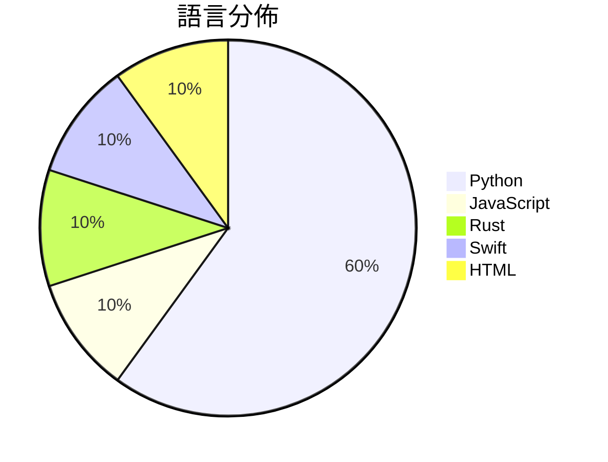

# GitHub Trending - 2026-04-09

> [!summary] 本日摘要
> 收錄 **10** 個新專案，合計 **92.6k** stars
> 語言分佈：Python (6) · JavaScript (1) · Rust (1) · Swift (1) · HTML (1)

> [!tip] 本週焦點
> **[[milla-jovovich--mempalace|milla-jovovich/mempalace]]** — 4 天內累積 27.5k stars（6.9k stars/天）
> 提供 AI 記憶功能，讓你的對話和決策可搜尋且持久化。



---

## 收錄列表

| # | 專案 | 分類 | Stars | 速度 | 安裝 | 語言 | 用途 |
| :--: | --- | --- | ---: | ---: | --- | --- | --- |
| 1 | [[milla-jovovich--mempalace\|milla-jovovich/mempalace]] | AI/ML | 27.5k | 6.9k/天 | `easy` | Python | 提供 AI 記憶功能，讓你的對話和決策可搜尋且持久化。 |
| 2 | [[santifer--career-ops\|santifer/career-ops]] | AI/ML | 24.6k | 6.2k/天 | `medium` | JavaScript | 一個 AI 驅動的求職系統，幫助用戶自動化求職流程並生成個性化履歷。 |
| 3 | [[safishamsi--graphify\|safishamsi/graphify]] | 開發工具 | 12.9k | 2.6k/天 | `easy` | Python | 將任何代碼、文檔、論文或圖像資料夾轉換為可查詢的知識圖譜，幫助快速理解代碼庫。 |
| 4 | [[JuliusBrussee--caveman\|JuliusBrussee/caveman]] | AI/ML | 7.5k | 1.9k/天 | `easy` | Python | 透過簡化語言，顯著減少 LLM 的 token 使用量，提升溝通效率。 |
| 5 | [[ultraworkers--claw-code-parity\|ultraworkers/claw-code-parity]] | 開發工具 | 6.6k | 1.1k/天 | `medium` | Rust | 將 claw-code 轉譯為 Rust 和 Python 的過程，並實現代碼的 |
| 6 | [[kevinrgu--autoagent\|kevinrgu/autoagent]] | 開發工具 | 3.9k | 650/天 | `medium` | Python | 讓 AI 自動構建和優化代理系統，無需手動編輯程式碼。 |
| 7 | [[alchaincyf--nuwa-skill\|alchaincyf/nuwa-skill]] | 其他 | 3.9k | 1.3k/天 | `easy` | Python | 蒸馏任何人的思维方式，提取认知框架与决策启发式。 |
| 8 | [[farzaa--clicky\|farzaa/clicky]] | 其他 | 2.2k | 2.2k/天 | `medium` | Swift | 提供一個 AI 助手，能夠在你的螢幕旁邊進行互動和教學。 |
| 9 | [[sooryathejas--METATRON\|sooryathejas/METATRON]] | 安全 | 1.9k | 317/天 | `medium` | Python | 提供一個本地運行的 AI 滲透測試助手，無需雲端或 API 金鑰。 |
| 10 | [[GitFrog1111--badclaude\|GitFrog1111/badclaude]] | 開發工具 | 1.5k | 375/天 | `easy` | HTML | 讓 Claude 變得更聰明，透過「鞭策」來提升其性能。 |

---

## 重點摘要

### 1. [[milla-jovovich--mempalace|milla-jovovich/mempalace]] `AI/ML`

> 提供 AI 記憶功能，讓你的對話和決策可搜尋且持久化。

**27.5k** stars · **6.9k** stars/天 · Python · `easy`

_建立 4 天就累積 27495 stars（6874/天），forks 3444（12.5%），這是極端爆發式增長。作者 Milla Jovovich 和 Ben Sigman 之前在 AI 領域有過多次合作，這次推出的 MemPalace 解決了記憶系統在 AI 對話中的痛點，特別是對話後的記憶消失問題。這個工具的發布引起了社群的廣泛討論，特別是在 Reddit 和 Hacker News 上。隨著對話 AI 的普及，對於能夠持久化記憶的需求越來越高，這使得 MemPalace 的出現恰逢其時。forks/stars 比率 12.5% 表示有相當比例的用戶在積極修改和使用這個工具。_

---

### 2. [[santifer--career-ops|santifer/career-ops]] `AI/ML`

> 一個 AI 驅動的求職系統，幫助用戶自動化求職流程並生成個性化履歷。

**24.6k** stars · **6.2k** stars/天 · JavaScript · `medium`

_建立 4 天就累積 24614 stars（6154/天），forks 4575（18.6%），這顯示出強大的市場需求和用戶興趣。作者 Santiago Fernández 是一位 AI 領域的專家，之前創建的工具已經成功幫助他找到工作。這個專案解決了求職者在面對大量職位時的篩選和申請困難，提供了一個自動化的解決方案。最近的社交媒體推廣和社群貢獻也促進了其快速增長。技術上，隨著 AI 和自動化工具的普及，這個系統的需求愈加明顯，特別是在求職市場競爭激烈的情況下。高達 18.6% 的 forks/stars 比率顯示出許多開發者對這個工具的實際修改和使用，顯示出其潛在的擴展性和可用性。_

---

### 3. [[safishamsi--graphify|safishamsi/graphify]] `開發工具`

> 將任何代碼、文檔、論文或圖像資料夾轉換為可查詢的知識圖譜，幫助快速理解代碼庫。

**12.9k** stars · **2.6k** stars/天 · Python · `easy`

_建立 5 天就累積 12891 stars（2578/天），forks 1315（10.2%），顯示出強勁的增長潛力。這個專案的創作者 safishamsi 之前在 AI 和開源社群中有過多個成功的專案，這使得這個工具在解決開發者面對複雜代碼庫時的痛點上顯得尤為重要。特別是對於需要快速理解大型代碼庫的開發者來說，Graphify 提供了一個高效的解決方案。社群的活躍度也反映在其開放的問題和功能請求上，這些都是使用者實際需求的體現。_

---

### 4. [[JuliusBrussee--caveman|JuliusBrussee/caveman]] `AI/ML`

> 透過簡化語言，顯著減少 LLM 的 token 使用量，提升溝通效率。

**7.5k** stars · **1.9k** stars/天 · Python · `easy`

_建立 4 天內累積 7529 stars（1882/天），forks 306（4.1%），顯示出強勁的增長潛力。作者 Julius Brussee 之前的作品已經在社群中獲得認可，這個專案解決了 LLM 使用中的 token 成本問題，尤其是在日益增長的 AI 應用需求下。這一工具的推出引起了廣泛的討論，並且在社群中引發了對於 token 使用效率的關注。技術上，這個工具利用了 Claude Code 的能力，讓簡化語言成為可能，並且在實際使用中展現出顯著的效能提升。forks/stars 比率為 4.1%，顯示出使用者對於這個專案的實際修改和應用的興趣。_

---

### 5. [[ultraworkers--claw-code-parity|ultraworkers/claw-code-parity]] `開發工具`

> 將 claw-code 轉譯為 Rust 和 Python 的過程，並實現代碼的平行性。

**6.6k** stars · **1.1k** stars/天 · Rust · `medium`

_建立 6 天就累積 6630 stars（1105/天），forks 5427（81.9%），這顯示出極高的社群參與度。主要貢獻者 Yeachan Heo 及其團隊過去在開源社群中有良好的聲譽，這使得專案受到廣泛關注。這個專案解決了在代碼轉譯過程中，如何保持功能平行性和開發效率的痛點，之前的解決方案往往需要大量手動調整，效率低下。最近的推特討論也引發了對這個專案的興趣，進一步推動了其流行。技術上，Rust 和 Python 的結合使得這個專案在性能和可讀性上都有優勢，這在過去的代碼轉譯專案中並不常見。高達 81.9% 的 forks/stars 比率顯示出許多人在積極修改和使用這個專案，這是對其實用性的一種肯定。_

---

### 6. [[kevinrgu--autoagent|kevinrgu/autoagent]] `開發工具`

> 讓 AI 自動構建和優化代理系統，無需手動編輯程式碼。

**3.9k** stars · **650** stars/天 · Python · `medium`

_建立 6 天內累積 3900 stars（650/天），forks 443（11.4%），顯示出強勁的增長潛力。作者 Kevin R. Gu 是一位活躍的開發者，專注於自動化和代理技術，這個專案解決了傳統代理開發中的繁瑣和低效率問題。之前，開發者需要手動編輯代碼，這不僅耗時，還容易出錯。這個專案的推出吸引了許多對自動化有需求的開發者，並且在社群中引發了討論。技術上，隨著 Docker 和 AI 技術的成熟，這種自動化的代理開發方法變得可行。forks/stars 比率為 11.4%，顯示出許多使用者對此專案進行了實際的修改和使用，這是一個良好的社群參與指標。_

---

### 7. [[alchaincyf--nuwa-skill|alchaincyf/nuwa-skill]] `其他`

> 蒸馏任何人的思维方式，提取认知框架与决策启发式。

**3.9k** stars · **1.3k** stars/天 · Python · `easy`

_建立 3 天就累積 3895 stars（1298/天），forks 522（13.4%），這顯示出強烈的初期興趣。作者 alchaincyf 是一位獨立開發者，過去有成功的開源項目，這次的工具解決了如何快速獲取名人思維的痛點，之前的做法往往需要大量時間和精力進行資料整理和分析。這個工具的推出正好填補了這一需求，並且在社交媒體上引發了熱烈討論，進一步推動了其流行。高比例的 forks 表示使用者對這個工具有實際的修改和使用需求，顯示出其在社群中的活躍度。_

---

### 8. [[farzaa--clicky|farzaa/clicky]] `其他`

> 提供一個 AI 助手，能夠在你的螢幕旁邊進行互動和教學。

**2.2k** stars · **2.2k** stars/天 · Swift · `medium`

_建立 1 天就累積 2241 stars（2241/天），forks 411（18.3%），這顯示出強烈的興趣和參與度。作者 Farzaa 是一位活躍的開發者，過去在社群中有相當的影響力。Clicky 解決了即時互動教學的需求，之前的方案大多是靜態的教學工具，無法提供即時反饋。這個專案的推廣可能受到社交媒體的影響，特別是原始推文的廣泛分享。技術上，使用 Cloudflare Worker 來保護 API 金鑰的設計，讓這個工具在安全性上有了顯著的提升。Forks/stars 比率為 18.3%，顯示出許多人對於這個專案的實際修改和使用。_

---

### 9. [[sooryathejas--METATRON|sooryathejas/METATRON]] `安全`

> 提供一個本地運行的 AI 滲透測試助手，無需雲端或 API 金鑰。

**1.9k** stars · **317** stars/天 · Python · `medium`

_建立 6 天內累積 1900 stars（317/天），forks 379（19.9%），這顯示出強勁的用戶興趣。作者 Soorya Thejas 之前在滲透測試和 AI 領域有一定的經驗，這個專案解決了傳統滲透測試工具需要依賴雲端和 API 金鑰的痛點，讓用戶能在本地環境中進行完整的滲透測試。近期的推廣活動和社群討論也可能促進了其快速增長。隨著對數據隱私和安全的重視，這種本地化的解決方案越來越受到青睞。forks/stars 比率接近 20%，顯示出許多人對此工具的實際修改和使用。_

---

### 10. [[GitFrog1111--badclaude|GitFrog1111/badclaude]] `開發工具`

> 讓 Claude 變得更聰明，透過「鞭策」來提升其性能。

**1.5k** stars · **375** stars/天 · HTML · `easy`

_建立 4 天就累積 1501 stars（375/天），forks 157（10.5%），這顯示出強烈的社群興趣。作者 GitFrog1111 可能是一位活躍的開發者，這個專案的幽默性和獨特性吸引了許多開發者的注意。這個工具解決了開發者在使用 Claude 時的性能問題，透過有趣的方式來提升開發體驗。社群中對於功能請求的反饋也相當熱烈，顯示出使用者對於這個工具的期待。這種快速增長的趨勢可能是因為其獨特的功能和幽默的設計理念。_

---

## 今日到期複習

> [!tip] 根據間隔複習排程，今天該回顧的專案

```dataview
TABLE
  stars_per_day AS "Stars/天",
  category AS "分類",
  engagement AS "參與度"
FROM "Repos"
WHERE next_review AND date(next_review) <= date("2026-04-09") AND status != "archived"
SORT priority DESC
```

## 待處理

```dataviewjs
const pending = dv.pages('"Repos"').where(p => p.status === "to-review").length;
const unrated = dv.pages('"Repos"').where(p => p.status !== "archived" && p.status !== "to-review" && (p.my_rating || 0) === 0).length;
const noVerdict = dv.pages('"Repos"').where(p => p.status !== "archived" && (p.my_rating || 0) > 0 && (!p.verdict || p.verdict === "")).length;
const items = [];
if (pending > 0) items.push(`**${pending}** 個待分流`);
if (unrated > 0) items.push(`**${unrated}** 個已讀但未評分`);
if (noVerdict > 0) items.push(`**${noVerdict}** 個已評分但無結論`);
if (items.length > 0) dv.paragraph(items.join(" / "));
else dv.paragraph("所有專案都已處理完畢！");
```
