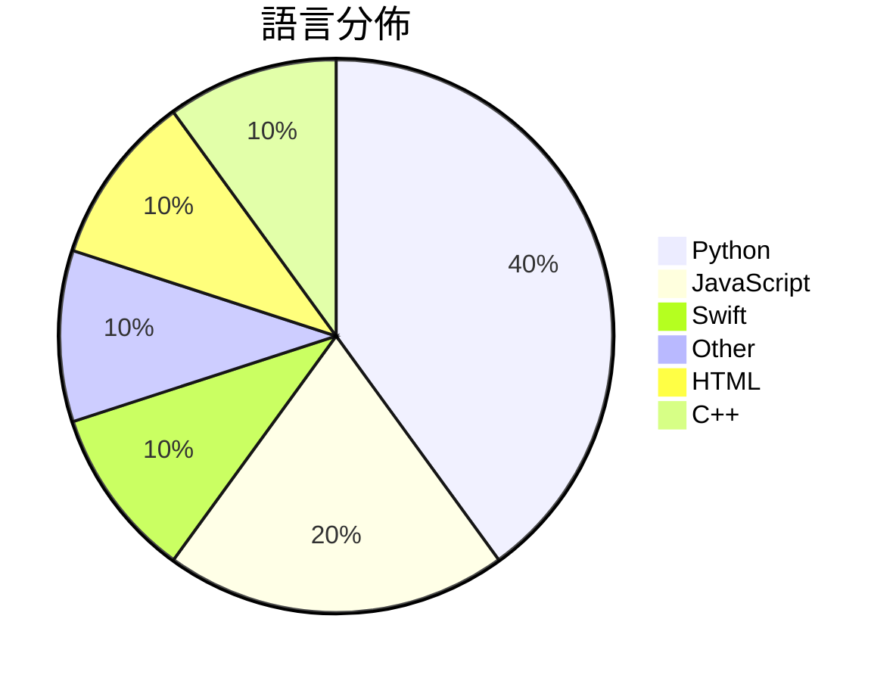

# GitHub Trending - 2026-04-10

> [!summary] 本日摘要
> 收錄 **10** 個新專案，合計 **106.1k** stars
> 語言分佈：Python (4) · JavaScript (2) · Swift (1) · Other (1) · HTML (1) · C++ (1)

> [!tip] 本週焦點
> **[[milla-jovovich--mempalace|milla-jovovich/mempalace]]** — 5 天內累積 35.8k stars（7.2k stars/天）
> 提供一個高效的 AI 記憶系統，讓使用者能夠將對話和決策轉化為可搜索的資料庫。



---

## 收錄列表

| # | 專案 | 分類 | Stars | 速度 | 安裝 | 語言 | 用途 |
| :--: | --- | --- | ---: | ---: | --- | --- | --- |
| 1 | [[milla-jovovich--mempalace\|milla-jovovich/mempalace]] | AI/ML | 35.8k | 7.2k/天 | `easy` | Python | 提供一個高效的 AI 記憶系統，讓使用者能夠將對話和決策轉化為可搜索的資料庫。 |
| 2 | [[santifer--career-ops\|santifer/career-ops]] | AI/ML | 27.7k | 5.5k/天 | `medium` | JavaScript | 提供 AI 驅動的求職管道，幫助求職者自動化求職過程。 |
| 3 | [[safishamsi--graphify\|safishamsi/graphify]] | 開發工具 | 17.7k | 3.0k/天 | `easy` | Python | 將任何代碼、文檔、論文或圖像資料夾轉換為可查詢的知識圖譜。 |
| 4 | [[JuliusBrussee--caveman\|JuliusBrussee/caveman]] | AI/ML | 8.9k | 1.8k/天 | `easy` | Python | 透過簡化語言，減少 65% 的 token 使用，讓 Claude 更有效率地回 |
| 5 | [[alchaincyf--nuwa-skill\|alchaincyf/nuwa-skill]] | 其他 | 5.5k | 1.4k/天 | `easy` | Python | 幫助你蒸馏任何人的思維方式，從名人中提取心智模型和決策啟發式。 |
| 6 | [[farzaa--clicky\|farzaa/clicky]] | AI/ML | 3.2k | 1.6k/天 | `medium` | Swift | 提供一個 AI 教師助手，能在螢幕旁邊與使用者互動，協助學習。 |
| 7 | [[alchaincyf--zhangxuefeng-skill\|alchaincyf/zhangxuefeng-skill]] | 其他 | 2.0k | 504/天 | `easy` | N/A | 提供张雪峰的认知操作系统，帮助用户在高考志愿、考研和职业规划中做出更明智的决策。 |
| 8 | [[xixu-me--awesome-persona-distill-skills\|xixu-me/awesome-persona-distill-skills]] | 開發工具 | 1.8k | 599/天 | `easy` | JavaScript | 將人物、關係及個人背景轉化為可重用的 AI 助手技能。 |
| 9 | [[GitFrog1111--badclaude\|GitFrog1111/badclaude]] | 開發工具 | 1.8k | 353/天 | `easy` | HTML | 幫助 Claude 提升效率的有趣工具。 |
| 10 | [[LaurieWired--tailslayer\|LaurieWired/tailslayer]] | 開發工具 | 1.7k | 417/天 | `medium` | C++ | 減少 RAM 讀取中的尾延遲，提升效能。 |

---

## 重點摘要

### 1. [[milla-jovovich--mempalace|milla-jovovich/mempalace]] `AI/ML`

> 提供一個高效的 AI 記憶系統，讓使用者能夠將對話和決策轉化為可搜索的資料庫。

**35.8k** stars · **7.2k** stars/天 · Python · `easy`

_建立 5 天就累積 35831 stars（7166/天），forks 4499（12.6%），這顯示出其快速增長的潛力。這個專案的主要貢獻者包括 Milla Jovovich 和 Ben Sigman，他們在 AI 記憶系統方面有著豐富的經驗。MemPalace 解決了傳統記憶系統無法有效存儲和檢索對話的痛點，特別是在開發者需要快速回顧過去決策的情境下。最近的社群反饋也促使他們迅速修正 README 中的錯誤，顯示出對用戶需求的重視。這樣的開放式開發模式和透明度吸引了更多的使用者參與和關注。_

---

### 2. [[santifer--career-ops|santifer/career-ops]] `AI/ML`

> 提供 AI 驅動的求職管道，幫助求職者自動化求職過程。

**27.7k** stars · **5.5k** stars/天 · JavaScript · `medium`

_建立 5 天內累積 27741 stars（5548/天），forks 5178（18.7%），顯示出強烈的社群興趣。作者 Santiago Fernández 是一位 AI 領域的專家，之前創建過成功的業務，這次他開源的 Career-Ops 解決了求職者在繁瑣的求職過程中的痛點，提供了一個自動化的解決方案。這個專案的推出引發了社群的廣泛討論，並且有多個 PR 被合併，顯示出活躍的開發和社群參與。技術上，AI 和自動化的進步使得這個工具的實現成為可能，並且其高 forks/stars 比率表明許多人在實際使用和修改這個工具。_

---

### 3. [[safishamsi--graphify|safishamsi/graphify]] `開發工具`

> 將任何代碼、文檔、論文或圖像資料夾轉換為可查詢的知識圖譜。

**17.7k** stars · **3.0k** stars/天 · Python · `easy`

_建立 6 天內累積 17742 stars（2957/天），forks 1805（10.2%），顯示出其快速增長的潛力。作者 safishamsi 之前在 AI 和編碼助手領域有豐富的經驗，這使得他能夠針對開發者的需求設計出這個工具。graphify 解決了在大型代碼庫中快速查詢和理解的痛點，傳統方法往往需要耗費大量時間來手動查找和理解代碼結構。最近的推廣活動和社群討論也可能促進了這個工具的曝光率。由於其高 forks/stars 比率（10.2%），顯示出許多開發者對此工具的實際修改和使用，這是其受歡迎的指標之一。_

---

### 4. [[JuliusBrussee--caveman|JuliusBrussee/caveman]] `AI/ML`

> 透過簡化語言，減少 65% 的 token 使用，讓 Claude 更有效率地回應問題。

**8.9k** stars · **1.8k** stars/天 · Python · `easy`

_建立 5 天內累積 8851 stars（1770/天），forks 391（4.4%），顯示出強勁的增長潛力。作者 Julius Brussee 之前的作品已經在開源社群中獲得了一定的認可，這次的 Caveman 則解決了在使用大型語言模型時 token 使用過多的問題，這在開發者中是一個普遍的痛點。近期的社交媒體討論和技術論壇也對這個工具表示了興趣，進一步推動了它的流行。技術上，隨著 Claude Code 的普及，這種簡化語言的需求變得越來越明顯，Caveman 則正好滿足了這一需求。forks/stars 比率為 4.4%，顯示出使用者對這個工具的實際修改和使用意圖。_

---

### 5. [[alchaincyf--nuwa-skill|alchaincyf/nuwa-skill]] `其他`

> 幫助你蒸馏任何人的思維方式，從名人中提取心智模型和決策啟發式。

**5.5k** stars · **1.4k** stars/天 · Python · `easy`

_建立4天內累積5526 stars（1382/天），forks 761（13.8%），顯示出強勁的增長潛力。作者alchaincyf是獨立開發者，過去的作品在AI領域已有一定影響力。這個專案解決了如何快速獲取名人思維的痛點，之前的工具多數只能提供表面知識，無法深入分析。近期的社交媒體討論和GitHub的熱度推動了這個專案的曝光。技術生態的變化使得這種基於公開信息的深度蒸馏成為可能，尤其是在AI和自動化工具日益普及的背景下。forks/stars比率高達13.8%，顯示出許多開發者對此工具的實際修改和使用。_

---

### 6. [[farzaa--clicky|farzaa/clicky]] `AI/ML`

> 提供一個 AI 教師助手，能在螢幕旁邊與使用者互動，協助學習。

**3.2k** stars · **1.6k** stars/天 · Swift · `medium`

_建立 2 天就累積 3156 stars（1578/天），forks 561（17.8%），這顯示出強烈的使用者興趣。作者 Farzaa 之前在社交媒體上展示了 Clicky 的功能，這引起了廣泛的關注。這個工具解決了傳統學習方式中缺乏即時互動的痛點，讓學習變得更有效率。技術上，Clicky 利用 Cloudflare Worker 來保護 API 金鑰，這在安全性上是一個重要的進步。最近的推文和討論也促進了這個專案的曝光，並吸引了開發者的參與。forks/stars 比率為 17.8%，顯示出有相當多的使用者在實際修改和使用這個專案。_

---

### 7. [[alchaincyf--zhangxuefeng-skill|alchaincyf/zhangxuefeng-skill]] `其他`

> 提供张雪峰的认知操作系统，帮助用户在高考志愿、考研和职业规划中做出更明智的决策。

**2.0k** stars · **504** stars/天 · N/A · `easy`

_建立 4 天就累積 2017 stars（504/天），forks 683（33.9%），這顯示出強烈的社群興趣。作者 alchaincyf 是一位獨立開發者，過去的作品包括 AI 相關的工具，這次的專案解決了傳統職業諮詢缺乏針對性和實證支持的痛點。社交媒體上的討論和分享也促進了該專案的曝光，特別是在教育和職業規劃領域。這個工具的可行性得益於對張雪峰的深度研究和數據分析，使得其建議更具說服力。forks/stars 比率高達 33.9%，顯示出許多用戶對於修改和擴展的需求，這是社群活躍度的良好指標。_

---

### 8. [[xixu-me--awesome-persona-distill-skills|xixu-me/awesome-persona-distill-skills]] `開發工具`

> 將人物、關係及個人背景轉化為可重用的 AI 助手技能。

**1.8k** stars · **599** stars/天 · JavaScript · `easy`

_建立 3 天就累積 1798 stars（599/天），forks 198（11.0%），這顯示出非常高的關注度。專案的作者 xixu-me 之前在開源社群中有一定的影響力，這次專案解決了將個人背景轉化為 AI 助手的需求，這在當前的 AI 生態中是個新穎的想法。社群的積極參與和高解決率的問題也反映出使用者對這個工具的需求和信任。最近的推文和討論也可能促進了這個專案的曝光度，讓更多人開始關注和使用它。_

---

### 9. [[GitFrog1111--badclaude|GitFrog1111/badclaude]] `開發工具`

> 幫助 Claude 提升效率的有趣工具。

**1.8k** stars · **353** stars/天 · HTML · `easy`

_建立 5 天內累積 1767 stars（353/天），forks 180（10.2%），這顯示出用戶對這個幽默工具的高度興趣。作者 GitFrog1111 似乎專注於創造有趣的工具，這個專案解決了用戶在使用 Claude 時的低效能問題，提供了一種輕鬆的解決方案。近期的推廣活動或社群討論可能也促進了這個工具的曝光率。這個工具的高 forks/stars 比率（10.2%）顯示出許多用戶對其進行了實際的修改和使用，表明其在社群中的活躍度。_

---

### 10. [[LaurieWired--tailslayer|LaurieWired/tailslayer]] `開發工具`

> 減少 RAM 讀取中的尾延遲，提升效能。

**1.7k** stars · **417** stars/天 · C++ · `medium`

_建立 4 天內累積 1667 stars（417/天），forks 90（5.4%），這顯示出其在開發者社群中的快速增長。LaurieWired 是這個專案的主要貢獻者，過去在相關領域有一定的經驗。這個專案解決了 DRAM 刷新導致的延遲問題，這在高性能計算中是一個普遍的痛點。之前的解決方案往往無法有效處理多通道的複雜性，而 Tailslayer 則利用了未公開的通道打亂偏移來實現更高效的數據讀取。社群的反應熱烈，尤其是針對其在 Linux 核心中的應用討論。這個專案的成功也反映了對於低延遲計算需求的增長，尤其是在多核處理器的普及下。_

---

## 今日到期複習

> [!tip] 根據間隔複習排程，今天該回顧的專案

```dataview
TABLE
  stars_per_day AS "Stars/天",
  category AS "分類",
  engagement AS "參與度"
FROM "Repos"
WHERE next_review AND date(next_review) <= date("2026-04-10") AND status != "archived"
SORT priority DESC
```

## 待處理

```dataviewjs
const pending = dv.pages('"Repos"').where(p => p.status === "to-review").length;
const unrated = dv.pages('"Repos"').where(p => p.status !== "archived" && p.status !== "to-review" && (p.my_rating || 0) === 0).length;
const noVerdict = dv.pages('"Repos"').where(p => p.status !== "archived" && (p.my_rating || 0) > 0 && (!p.verdict || p.verdict === "")).length;
const items = [];
if (pending > 0) items.push(`**${pending}** 個待分流`);
if (unrated > 0) items.push(`**${unrated}** 個已讀但未評分`);
if (noVerdict > 0) items.push(`**${noVerdict}** 個已評分但無結論`);
if (items.length > 0) dv.paragraph(items.join(" / "));
else dv.paragraph("所有專案都已處理完畢！");
```
