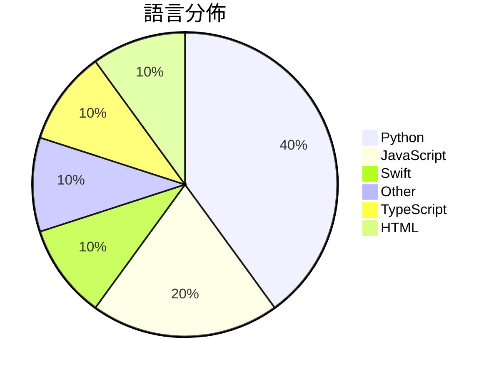

# GitHub Trending - 2026-04-11

> [!summary] 本日摘要
> 收錄 **10** 個新專案，合計 **105.7k** stars
> 語言分佈：Python (4) · JavaScript (2) · Swift (1) · Other (1) · TypeScript (1) · HTML (1)

> [!tip] 本週焦點
> **[[milla-jovovich--mempalace|milla-jovovich/mempalace]]** — 6 天內累積 40.1k stars（6.7k stars/天）
> 提供 AI 記憶系統，讓你能夠將對話和決策整理成可搜尋的資料庫。



---

## 收錄列表

| # | 專案 | 分類 | Stars | 速度 | 安裝 | 語言 | 用途 |
| :--: | --- | --- | ---: | ---: | --- | --- | --- |
| 1 | [[milla-jovovich--mempalace\|milla-jovovich/mempalace]] | AI/ML | 40.1k | 6.7k/天 | `easy` | Python | 提供 AI 記憶系統，讓你能夠將對話和決策整理成可搜尋的資料庫。 |
| 2 | [[santifer--career-ops\|santifer/career-ops]] | 其他 | 29.4k | 4.9k/天 | `medium` | JavaScript | 一個基於 AI 的求職系統，幫助用戶自動化求職流程，從評估到生成 CV。 |
| 3 | [[JuliusBrussee--caveman\|JuliusBrussee/caveman]] | AI/ML | 13.5k | 2.2k/天 | `easy` | Python | 讓 Claude 語言模型以更簡潔的方式回應，節省多達 75% 的 token。 |
| 4 | [[alchaincyf--nuwa-skill\|alchaincyf/nuwa-skill]] | 其他 | 6.6k | 1.3k/天 | `easy` | Python | 蒸馏任何人的思维方式，提取认知框架与决策启发式。 |
| 5 | [[farzaa--clicky\|farzaa/clicky]] | AI/ML | 3.6k | 1.2k/天 | `medium` | Swift | 提供一個 AI 助手，能在螢幕旁邊即時互動，幫助用戶學習和操作。 |
| 6 | [[alchaincyf--zhangxuefeng-skill\|alchaincyf/zhangxuefeng-skill]] | 其他 | 3.1k | 621/天 | `easy` | N/A | 提供张雪峰的认知操作系统，帮助用户进行高考志愿、考研和职业规划的决策。 |
| 7 | [[xixu-me--awesome-persona-distill-skills\|xixu-me/awesome-persona-distill-skills]] | AI/ML | 2.9k | 714/天 | `medium` | JavaScript | 提供一系列圍繞人物、關係和紀念場景的 AI 助手技能，幫助用戶從個人經歷中提煉可 |
| 8 | [[garrytan--gbrain\|garrytan/gbrain]] | 其他 | 2.5k | 506/天 | `medium` | TypeScript | 提供一個基於 Postgres 的個人知識管理系統，結合關鍵字和向量搜索，幫助用 |
| 9 | [[Keychron--Keychron-Keyboards-Hardware-Design\|Keychron/Keychron-Keyboards-Hardware-Design]] | 其他 | 2.1k | 358/天 | `medium` | Python | 提供 Keychron 鍵盤和滑鼠的工業設計檔案，包含 100 多個模型的 CA |
| 10 | [[GitFrog1111--badclaude\|GitFrog1111/badclaude]] | 開發工具 | 1.9k | 322/天 | `easy` | HTML | 讓 Claude 的運行速度變快，透過有趣的方式激勵它。 |

---

## 重點摘要

### 1. [[milla-jovovich--mempalace|milla-jovovich/mempalace]] `AI/ML`

> 提供 AI 記憶系統，讓你能夠將對話和決策整理成可搜尋的資料庫。

**40.1k** stars · **6.7k** stars/天 · Python · `easy`

_建立 6 天就累積 40094 stars（6682/天），forks 5042（12.6%），這顯示出強烈的社群興趣。作者 Milla Jovovich 和 Ben Sigman 過去在 AI 領域有豐富的經驗，這個專案解決了記憶系統在使用過程中容易遺忘重要資訊的痛點。隨著 AI 交互的普及，對於能夠有效管理和檢索對話的需求越來越高，這使得 MemPalace 的出現正好符合市場需求。社群的反饋也促使專案快速修正 README 中的問題，顯示出活躍的開發和維護狀況。_

---

### 2. [[santifer--career-ops|santifer/career-ops]] `其他`

> 一個基於 AI 的求職系統，幫助用戶自動化求職流程，從評估到生成 CV。

**29.4k** stars · **4.9k** stars/天 · JavaScript · `medium`

_建立 6 天內累積 29421 stars（4904/天），forks 5604（19%），這顯示出強烈的社群參與。作者 Santiago 是一位 AI 領域的專家，過去曾創建並出售過成功的企業，這使得他對求職流程有深刻的理解。Career-Ops 解決了求職者在繁瑣申請過程中的痛點，提供了一個集成的解決方案，讓用戶能夠更輕鬆地管理申請。近期的推廣活動和社群討論也為此專案的曝光度提升助力。這個工具的設計理念符合當前市場對於自動化和智能化的需求，特別是在求職這一領域。_

---

### 3. [[JuliusBrussee--caveman|JuliusBrussee/caveman]] `AI/ML`

> 讓 Claude 語言模型以更簡潔的方式回應，節省多達 75% 的 token。

**13.5k** stars · **2.2k** stars/天 · Python · `easy`

_建立 6 天內累積 13466 stars（2244/天），forks 593（4.4%），顯示出強勁的增長潛力。作者 JuliusBrussee 之前有多個成功的開源專案，這次專案解決了 LLM 使用中的 token 成本問題，提供了一種簡化的溝通方式。這個專案的受歡迎程度可能受到社群對於節省資源和提高效率的需求驅動，並且在社交媒體上引起了討論。這種工具的可行性也得益於 Claude Code 的普及，使得開發者能夠輕鬆集成這種新技能。forks/stars 比率為 4.4%，顯示出有相當一部分使用者在積極修改和使用此專案。_

---

### 4. [[alchaincyf--nuwa-skill|alchaincyf/nuwa-skill]] `其他`

> 蒸馏任何人的思维方式，提取认知框架与决策启发式。

**6.6k** stars · **1.3k** stars/天 · Python · `easy`

_建立 5 天內累積 6623 stars（1325/天），forks 1008（15.2%），這顯示出強烈的使用者興趣。作者 alchaincyf 之前開發的 [同事.skill](https://github.com/titanwings/colleague-skill) 已經證明了蒸餾一個人是可行的，這次的 Nuwa 則進一步擴展了這一概念，允許用戶蒸餾各領域的頂尖人物。這一創新解決了以往只能蒸餾同事的限制，並且提供了更豐富的思維模型。社群中對於如何持續蒸餾的討論也顯示出使用者的積極參與和需求。_

---

### 5. [[farzaa--clicky|farzaa/clicky]] `AI/ML`

> 提供一個 AI 助手，能在螢幕旁邊即時互動，幫助用戶學習和操作。

**3.6k** stars · **1.2k** stars/天 · Swift · `medium`

_建立 3 天就累積 3566 stars（1189/天），forks 626（17.6%），這顯示出強烈的社群興趣。作者 farzaa 是一位活躍的開發者，專注於 AI 和互動技術，這個專案解決了用戶在學習過程中缺乏即時互動的問題。之前的解決方案多數是靜態的教學工具，無法提供即時的反饋。最近的推文和社群討論也引發了對這個專案的關注。技術上，這個工具的出現得益於 Cloudflare Worker 的普及，讓開發者能夠輕鬆管理 API 金鑰。forks/stars 比率為 17.6%，顯示出許多人對這個工具進行實際修改和使用。_

---

### 6. [[alchaincyf--zhangxuefeng-skill|alchaincyf/zhangxuefeng-skill]] `其他`

> 提供张雪峰的认知操作系统，帮助用户进行高考志愿、考研和职业规划的决策。

**3.1k** stars · **621** stars/天 · N/A · `easy`

_建立 5 天內累積 3106 stars（621/天），forks 1303（42.0%），顯示出極高的使用興趣。作者 alchaincyf 是一位獨立開發者，過去的作品包括多個 AI 相關工具，這次的專案解決了傳統職業規劃工具缺乏個性化和深度分析的痛點。社群的反響熱烈，尤其是針對張雪峰的思維框架的討論，這使得該專案在短時間內獲得了大量關注。技術上，這個工具的可行性得益於自然語言處理技術的進步，讓 AI 能夠更好地理解和生成符合人類思維的建議。高達 42.0% 的 forks/stars 比率顯示出許多用戶在實際修改和使用，這是對專案實用性的強烈肯定。_

---

### 7. [[xixu-me--awesome-persona-distill-skills|xixu-me/awesome-persona-distill-skills]] `AI/ML`

> 提供一系列圍繞人物、關係和紀念場景的 AI 助手技能，幫助用戶從個人經歷中提煉可重用的技能。

**2.9k** stars · **714** stars/天 · JavaScript · `medium`

_建立 4 天就累積 2855 stars（714/天），forks 317（11.1%），這顯示出強烈的市場需求。作者 xixu-me 是一位活躍的開源貢獻者，過去在 AI 和開源領域有多個成功專案。這個專案解決了人們在個性化 AI 助手方面的需求，之前的方案往往無法滿足個別用戶的需求。近期的社群討論和推廣活動也為這個專案帶來了更多的曝光。技術上，這個專案的出現正好契合了人們對於個性化和智能助手的需求，尤其是在數字化生活日益增長的背景下。forks/stars 比率為 11.1%，顯示出相對較高的實際使用和修改意願。_

---

### 8. [[garrytan--gbrain|garrytan/gbrain]] `其他`

> 提供一個基於 Postgres 的個人知識管理系統，結合關鍵字和向量搜索，幫助用戶更有效地管理和檢索信息。

**2.5k** stars · **506** stars/天 · TypeScript · `medium`

_建立 5 天內累積 2528 stars（506/天），forks 274（10.8%），顯示出強烈的社群關注。作者 Garry Tan 以其在 OpenClaw 領域的專業背景，針對知識管理的痛點提出了這個解決方案。GBrain 的出現填補了傳統工具在面對大量數據時的不足，提供了更高效的檢索方式。社群的反饋和需求促進了這個專案的快速成長，並且在技術生態中，Postgres 的使用使得這個工具的可行性大幅提升。forks/stars 比率為 10.8%，顯示出許多用戶對於這個工具的實際修改和使用需求。_

---

### 9. [[Keychron--Keychron-Keyboards-Hardware-Design|Keychron/Keychron-Keyboards-Hardware-Design]] `其他`

> 提供 Keychron 鍵盤和滑鼠的工業設計檔案，包含 100 多個模型的 CAD 資產。

**2.1k** stars · **358** stars/天 · Python · `medium`

_建立 6 天就累積 2145 stars（358/天），forks 155（7.2%），這顯示出強烈的社群興趣。這個專案由 Keychron 團隊開發，他們在鍵盤市場上已有良好的聲譽，並且提供了之前沒有的開放設計檔案，讓使用者能夠自定義和改裝硬體。這樣的開放性設計在硬體領域中相對少見，吸引了許多愛好者和設計師的關注。社群的活躍度和持續的更新也促進了使用者的參與和貢獻。_

---

### 10. [[GitFrog1111--badclaude|GitFrog1111/badclaude]] `開發工具`

> 讓 Claude 的運行速度變快，透過有趣的方式激勵它。

**1.9k** stars · **322** stars/天 · HTML · `easy`

_建立 6 天內累積 1934 stars（322/天），forks 201（10.4%），顯示出相當高的使用者興趣。作者 GitFrog1111 似乎在開源社群中有一定的影響力，這個專案解決了開發者在使用 Claude 時的性能問題，並以幽默的方式吸引了許多人的注意。熱門的功能請求如 Tom Scream 音效和 MCP 整合，顯示出社群對於這個工具的期待與參與度。這樣的互動性和趣味性在開發工具中並不常見，讓它在技術生態中脫穎而出。_

---

## 今日到期複習

> [!tip] 根據間隔複習排程，今天該回顧的專案

```dataview
TABLE
  stars_per_day AS "Stars/天",
  category AS "分類",
  engagement AS "參與度"
FROM "Repos"
WHERE next_review AND date(next_review) <= date("2026-04-11") AND status != "archived"
SORT priority DESC
```

## 待處理

```dataviewjs
const pending = dv.pages('"Repos"').where(p => p.status === "to-review").length;
const unrated = dv.pages('"Repos"').where(p => p.status !== "archived" && p.status !== "to-review" && (p.my_rating || 0) === 0).length;
const noVerdict = dv.pages('"Repos"').where(p => p.status !== "archived" && (p.my_rating || 0) > 0 && (!p.verdict || p.verdict === "")).length;
const items = [];
if (pending > 0) items.push(`**${pending}** 個待分流`);
if (unrated > 0) items.push(`**${unrated}** 個已讀但未評分`);
if (noVerdict > 0) items.push(`**${noVerdict}** 個已評分但無結論`);
if (items.length > 0) dv.paragraph(items.join(" / "));
else dv.paragraph("所有專案都已處理完畢！");
```
