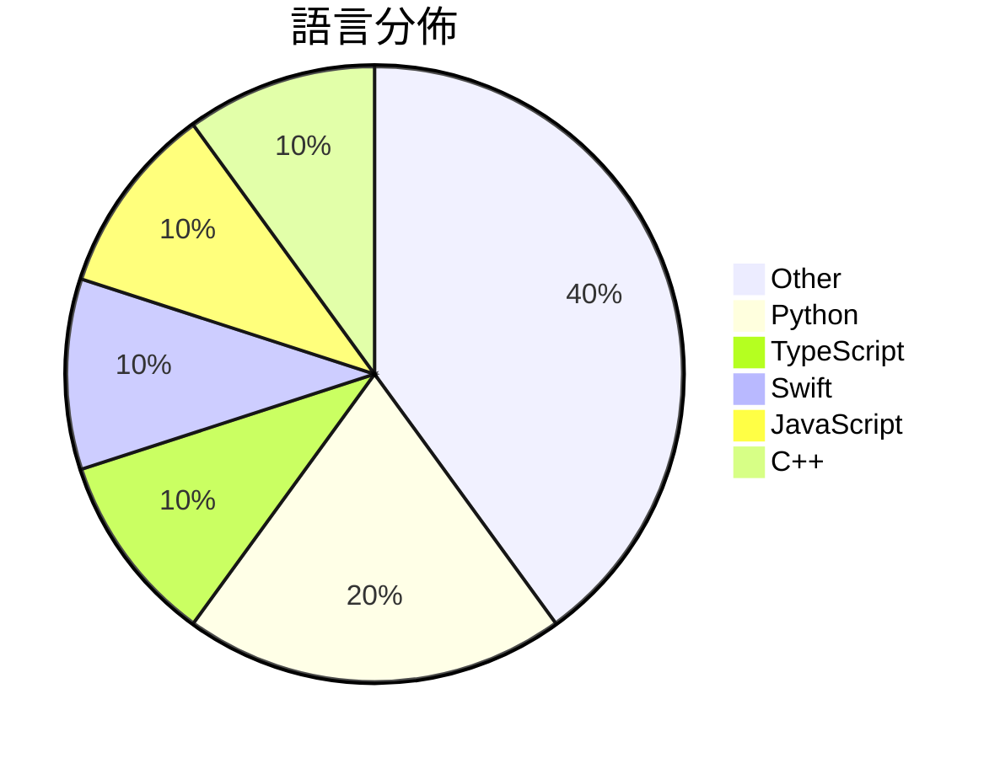

# GitHub Trending - 2026-04-12

> [!summary] 本日摘要
> 收錄 **10** 個新專案，合計 **72.4k** stars
> 語言分佈：Other (4) · Python (2) · TypeScript (1) · Swift (1) · JavaScript (1) · C++ (1)

> [!tip] 本週焦點
> **[[MemPalace--mempalace|MemPalace/mempalace]]** — 7 天內累積 41.8k stars（6.0k stars/天）
> 提供 AI 記憶系統，讓每次對話都能被記錄並可搜尋。



---

## 收錄列表

| # | 專案 | 分類 | Stars | 速度 | 安裝 | 語言 | 用途 |
| :--: | --- | --- | ---: | ---: | --- | --- | --- |
| 1 | [[MemPalace--mempalace\|MemPalace/mempalace]] | AI/ML | 41.8k | 6.0k/天 | `easy` | Python | 提供 AI 記憶系統，讓每次對話都能被記錄並可搜尋。 |
| 2 | [[alchaincyf--nuwa-skill\|alchaincyf/nuwa-skill]] | 開發工具 | 7.4k | 1.2k/天 | `easy` | Python | 蒸馏任何人的思维方式，提取认知框架与决策启发式。 |
| 3 | [[garrytan--gbrain\|garrytan/gbrain]] | AI/ML | 4.8k | 808/天 | `easy` | TypeScript | 提供個人化的知識庫，讓 AI 智能助手能夠更好地理解和回應用戶的需求。 |
| 4 | [[alchaincyf--zhangxuefeng-skill\|alchaincyf/zhangxuefeng-skill]] | 其他 | 4.3k | 718/天 | `easy` | N/A | 提供高考志愿、考研和职业规划的实战思维框架。 |
| 5 | [[farzaa--clicky\|farzaa/clicky]] | 其他 | 3.8k | 945/天 | `medium` | Swift | 提供一個 AI 助手，能在螢幕旁邊即時協助使用者。 |
| 6 | [[xixu-me--awesome-persona-distill-skills\|xixu-me/awesome-persona-distill-skills]] | AI/ML | 3.2k | 636/天 | `medium` | JavaScript | 提供圍繞人物、關係和紀念場景的 AI 助手技能清單。 |
| 7 | [[LaurieWired--tailslayer\|LaurieWired/tailslayer]] | 基礎設施 | 2.0k | 338/天 | `medium` | C++ | 減少 RAM 讀取中的尾延遲，提升效能。 |
| 8 | [[alchaincyf--hermes-agent-orange-book\|alchaincyf/hermes-agent-orange-book]] | AI/ML | 1.9k | 625/天 | `easy` | N/A | 提供從入門到精通的 Hermes Agent 開源 AI Agent 框架實戰指 |
| 9 | [[KKKKhazix--khazix-skills\|KKKKhazix/khazix-skills]] | 開發工具 | 1.6k | 317/天 | `easy` | N/A | 提供可组合、可移植的 AI Skills，扩展 AI Agent 的能力。 |
| 10 | [[hotcoffeeshake--tong-jincheng-skill\|hotcoffeeshake/tong-jincheng-skill]] | 其他 | 1.6k | 260/天 | `easy` | N/A | 用深情祖师爷的思维框架分析人际关系，提供情感与人际洞察。 |

---

## 重點摘要

### 1. [[MemPalace--mempalace|MemPalace/mempalace]] `AI/ML`

> 提供 AI 記憶系統，讓每次對話都能被記錄並可搜尋。

**41.8k** stars · **6.0k** stars/天 · Python · `easy`

_建立 7 天內累積 41802 stars（5972/天），forks 5343（12.8%），顯示出強烈的社群興趣。這個專案由 Milla Jovovich 和 Ben Sigman 等人主導，他們在 AI 和開源領域有豐富的經驗。MemPalace 解決了以往記憶系統無法有效存儲和檢索對話的痛點，特別是對於需要長期記錄和檢索的開發者來說，這是一個重要的進步。社群的反饋和問題也促使開發者迅速修正 README 中的錯誤，顯示出活躍的開發和維護。這種快速迭代的能力使得 MemPalace 在短時間內獲得了廣泛的關注。_

---

### 2. [[alchaincyf--nuwa-skill|alchaincyf/nuwa-skill]] `開發工具`

> 蒸馏任何人的思维方式，提取认知框架与决策启发式。

**7.4k** stars · **1.2k** stars/天 · Python · `easy`

_建立 6 天就累積 7442 stars（1240/天），forks 1186（15.9%），這顯示出強烈的社群關注。作者 alchaincyf 是一位獨立開發者，過去的作品包括同事.skill，證明了蒸馏個人思維的可行性。這個專案解決了如何從名人身上提取思維框架的痛點，之前的方案往往無法做到這一點。最近的社群討論和推廣活動也助長了其知名度，讓更多人認識到這個工具的潛力。_

---

### 3. [[garrytan--gbrain|garrytan/gbrain]] `AI/ML`

> 提供個人化的知識庫，讓 AI 智能助手能夠更好地理解和回應用戶的需求。

**4.8k** stars · **808** stars/天 · TypeScript · `easy`

_建立 6 天就累積 4848 stars（808/天），forks 541（11.2%），顯示出強烈的社群興趣。Garry Tan 是該專案的主要貢獻者，過去曾參與多個開源專案，這次專案解決了 AI 助手缺乏個人化知識的痛點，讓用戶能夠更有效地利用 AI。這個專案的推出引起了社群的廣泛討論，尤其是在 AI 和自動化領域的論壇上。隨著對個人化 AI 助手需求的增加，GBrain 的出現正好填補了這一市場空白。forks/stars 比率為 11.2%，顯示出許多開發者對這個專案的實際修改和使用。_

---

### 4. [[alchaincyf--zhangxuefeng-skill|alchaincyf/zhangxuefeng-skill]] `其他`

> 提供高考志愿、考研和职业规划的实战思维框架。

**4.3k** stars · **718** stars/天 · N/A · `easy`

_建立 6 天就累積 4310 stars（718/天），forks 1585（36.8%），這是極端爆發式增長。作者 alchaincyf 是獨立開發者，過去的作品包括多個知名 AI 工具，這個專案解決了傳統職業規劃工具缺乏個性化和實用性的痛點。社群對於張雪峰的思維模型有高度共鳴，並且在社交媒體上引發了廣泛討論，進一步推動了專案的曝光度。技術生態的變化使得基於 AI 的個性化建議成為可能，這使得該工具的實用性大幅提升。forks/stars 比率高達 36.8%，顯示出許多人對此專案的實際修改和使用。_

---

### 5. [[farzaa--clicky|farzaa/clicky]] `其他`

> 提供一個 AI 助手，能在螢幕旁邊即時協助使用者。

**3.8k** stars · **945** stars/天 · Swift · `medium`

_建立 4 天就累積 3780 stars（945/天），forks 668（17.7%），這顯示出強烈的社群興趣。作者 Farzaa 之前在 Twitter 上展示了 Clicky 的功能，吸引了大量關注。這個工具解決了使用者在多螢幕環境中無法有效互動的痛點，並且提供了一個開源版本讓開發者可以進一步擴展功能。社群的反應也顯示出對於安全性問題的關注，尤其是關於 API 金鑰的管理。_

---

### 6. [[xixu-me--awesome-persona-distill-skills|xixu-me/awesome-persona-distill-skills]] `AI/ML`

> 提供圍繞人物、關係和紀念場景的 AI 助手技能清單。

**3.2k** stars · **636** stars/天 · JavaScript · `medium`

_建立 5 天內累積 3181 stars（636/天），forks 359（11.3%），顯示出強烈的社群關注。作者 xixu-me 在開源社群中活躍，過去有多個相關專案，這使得他在該領域具備一定的信譽。這個專案填補了人際關係和情感記憶在 AI 助手技能中的空白，之前的工具往往缺乏對個人化和情感的深度挖掘。近期的社群討論和提交也顯示出對於此類技能的需求增長，特別是在 AI 應用的多樣性上。forks/stars 比率為 11.3%，顯示出不少使用者在實際修改和使用這個專案。_

---

### 7. [[LaurieWired--tailslayer|LaurieWired/tailslayer]] `基礎設施`

> 減少 RAM 讀取中的尾延遲，提升效能。

**2.0k** stars · **338** stars/天 · C++ · `medium`

_建立 6 天就累積 2028 stars（338/天），forks 108（5.3%），這顯示出一定的關注度。LaurieWired 是這個專案的主要貢獻者，過去在高效能計算領域有一定的經驗。Tailslayer 解決了 DRAM 刷新導致的延遲問題，這在高效能計算中是一個常見的痛點。這個專案的出現正好填補了這個空白，並且在社群中引發了討論。技術上，這種基於多通道的讀取優化在過去並不常見，因此吸引了不少開發者的注意。forks/stars 比率為 5.3%，顯示出有一定比例的使用者在進行實際修改，這是健康的社群信號。_

---

### 8. [[alchaincyf--hermes-agent-orange-book|alchaincyf/hermes-agent-orange-book]] `AI/ML`

> 提供從入門到精通的 Hermes Agent 開源 AI Agent 框架實戰指南。

**1.9k** stars · **625** stars/天 · N/A · `easy`

_建立 3 天就累積 1876 stars（625/天），forks 206（11.0%），顯示出強烈的社群興趣。這個專案由 Nous Research 開發，解決了開發者在構建 AI Agent 時面臨的複雜性問題，提供了一個簡單易用的框架。作者 HuaShu 是一位知名的 AI 內容創作者，擁有超過 30 萬的追隨者，這也為專案的曝光度提供了支持。近期的社群討論和需求反饋也促進了這個專案的快速成長。整體來看，這個專案的快速增長反映了對開源 AI 解決方案的需求。_

---

### 9. [[KKKKhazix--khazix-skills|KKKKhazix/khazix-skills]] `開發工具`

> 提供可组合、可移植的 AI Skills，扩展 AI Agent 的能力。

**1.6k** stars · **317** stars/天 · N/A · `easy`

_建立 5 天就累積 1585 stars（317/天），forks 337（21.3%），顯示出高活躍度。作者 KKKKhazix 透過長期打磨的 Skills，解決了 AI Agent 能力擴展的痛點，讓用戶能夠快速集成和使用。這些 Skills 的開源讓更多開發者能夠參與和貢獻，進一步推動了專案的發展。社群的反饋和使用情況也促進了專案的改進。_

---

### 10. [[hotcoffeeshake--tong-jincheng-skill|hotcoffeeshake/tong-jincheng-skill]] `其他`

> 用深情祖师爷的思维框架分析人际关系，提供情感与人际洞察。

**1.6k** stars · **260** stars/天 · N/A · `easy`

_建立 6 天就累積 1559 stars（260/天），forks 223（14.3%），顯示出相對高的使用興趣。作者 hotcoffeeshake 是一位情感領域的創作者，這個專案解決了許多情感分析工具無法提供個性化建議的痛點。之前的工具多數依賴於一般化的情感分析，而這個專案則透過童锦程的獨特視角來提供具體的建議。社群的反應也顯示出對這種新型態工具的需求，尤其是在情感交流日益重要的當下。_

---

## 今日到期複習

> [!tip] 根據間隔複習排程，今天該回顧的專案

```dataview
TABLE
  stars_per_day AS "Stars/天",
  category AS "分類",
  engagement AS "參與度"
FROM "Repos"
WHERE next_review AND date(next_review) <= date("2026-04-12") AND status != "archived"
SORT priority DESC
```

## 待處理

```dataviewjs
const pending = dv.pages('"Repos"').where(p => p.status === "to-review").length;
const unrated = dv.pages('"Repos"').where(p => p.status !== "archived" && p.status !== "to-review" && (p.my_rating || 0) === 0).length;
const noVerdict = dv.pages('"Repos"').where(p => p.status !== "archived" && (p.my_rating || 0) > 0 && (!p.verdict || p.verdict === "")).length;
const items = [];
if (pending > 0) items.push(`**${pending}** 個待分流`);
if (unrated > 0) items.push(`**${unrated}** 個已讀但未評分`);
if (noVerdict > 0) items.push(`**${noVerdict}** 個已評分但無結論`);
if (items.length > 0) dv.paragraph(items.join(" / "));
else dv.paragraph("所有專案都已處理完畢！");
```
