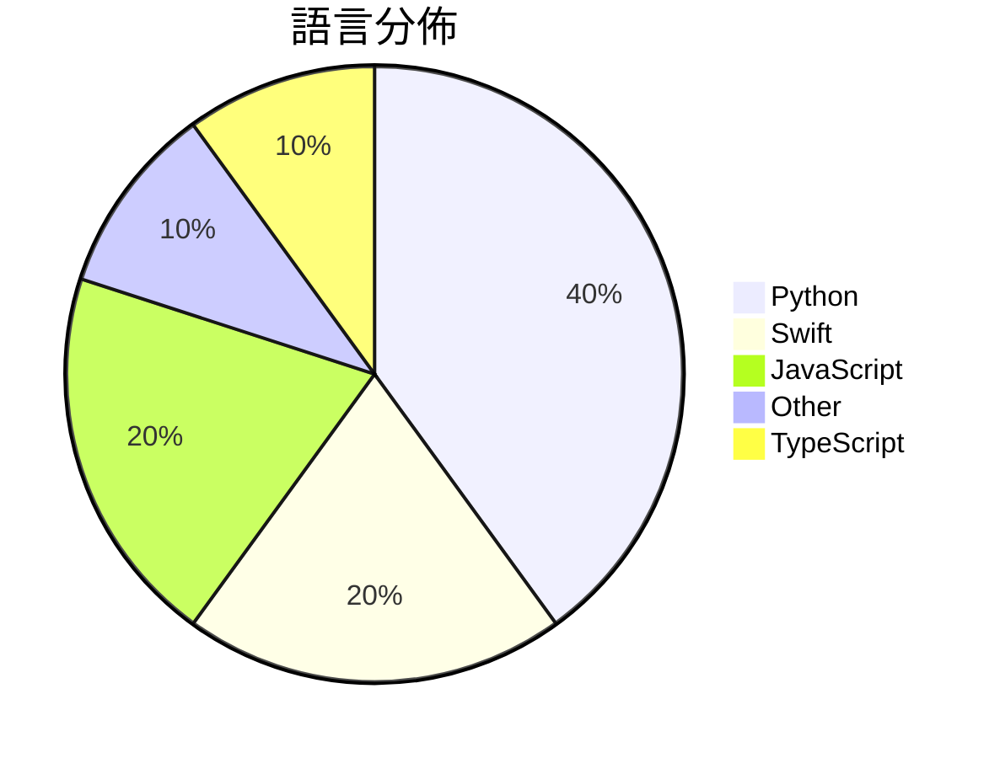

# GitHub Trending - 2026-04-13

> [!summary] 本日摘要
> 收錄 **10** 個新專案，合計 **17.6k** stars
> 語言分佈：Python (4) · Swift (2) · JavaScript (2) · Other (1) · TypeScript (1)

> [!tip] 本週焦點
> **[[farzaa--clicky|farzaa/clicky]]** — 5 天內累積 3.9k stars（789 stars/天）
> 提供一個 AI 教師，能在你的螢幕旁邊互動，幫助學習和解決問題。



---

## 收錄列表

| # | 專案 | 分類 | Stars | 速度 | 安裝 | 語言 | 用途 |
| :--: | --- | --- | ---: | ---: | --- | --- | --- |
| 1 | [[farzaa--clicky\|farzaa/clicky]] | AI/ML | 3.9k | 789/天 | `medium` | Swift | 提供一個 AI 教師，能在你的螢幕旁邊互動，幫助學習和解決問題。 |
| 2 | [[xixu-me--awesome-persona-distill-skills\|xixu-me/awesome-persona-distill-skills]] | 開發工具 | 3.4k | 572/天 | `easy` | JavaScript | 提供以人物、關係及紀念場景為中心的 AI 助手技能清單，讓使用者能夠從個人背景中 |
| 3 | [[alchaincyf--hermes-agent-orange-book\|alchaincyf/hermes-agent-orange-book]] | 其他 | 2.1k | 530/天 | `easy` | N/A | 提供從入門到精通的 Hermes Agent 開源 AI Agent 框架實戰指 |
| 4 | [[KKKKhazix--khazix-skills\|KKKKhazix/khazix-skills]] | 開發工具 | 1.7k | 287/天 | `medium` | Python | 提供一系列可重用的 AI 技能和提示，幫助用戶進行深度研究和寫作。 |
| 5 | [[yizhiyanhua-ai--fireworks-tech-graph\|yizhiyanhua-ai/fireworks-tech-graph]] | 開發工具 | 1.6k | 790/天 | `easy` | Python | 自動生成高品質技術圖表的工具，支持多種圖表類型和視覺風格。 |
| 6 | [[mattmireles--gemma-tuner-multimodal\|mattmireles/gemma-tuner-multimodal]] | AI/ML | 1.2k | 246/天 | `medium` | Python | 在 Apple Silicon 上使用 PyTorch 和 Metal Perf |
| 7 | [[nashsu--llm_wiki\|nashsu/llm_wiki]] | 開發工具 | 923 | 231/天 | `medium` | TypeScript | 自動將文檔轉換為有組織的知識庫，並持續更新。 |
| 8 | [[QLHazyCoder--codex-oauth-automation-extension\|QLHazyCoder/codex-oauth-automation-extension]] | 開發工具 | 905 | 302/天 | `easy` | JavaScript | 自動化 OpenAI OAuth 註冊流程的 Chrome 擴展，支持多種郵件驗 |
| 9 | [[phuryn--claude-usage\|phuryn/claude-usage]] | 開發工具 | 878 | 176/天 | `easy` | Python | 提供本地儀表板來追蹤 Claude Code 的 token 使用情況、成本和會 |
| 10 | [[wxtsky--CodeIsland\|wxtsky/CodeIsland]] | 開發工具 | 872 | 145/天 | `easy` | Swift | 提供即時 AI 編碼代理狀態面板，讓使用者無需切換視窗即可查看代理狀態。 |

---

## 重點摘要

### 1. [[farzaa--clicky|farzaa/clicky]] `AI/ML`

> 提供一個 AI 教師，能在你的螢幕旁邊互動，幫助學習和解決問題。

**3.9k** stars · **789** stars/天 · Swift · `medium`

_建立 5 天內累積 3946 stars（789/天），forks 694（17.6%），這顯示出強烈的社群興趣。作者 farzaa 之前在 AI 領域有過多次開發經驗，這個專案解決了傳統學習工具缺乏即時互動的問題。這個專案的推廣主要是透過社交媒體的示範，吸引了大量使用者的注意。技術上，Clicky 利用 Cloudflare Worker 和多個 API 的整合，讓這個工具在安全性和功能性上都有所提升。高達 17.6% 的 forks/stars 比率顯示出許多開發者對於這個專案的實際修改和使用。_

---

### 2. [[xixu-me--awesome-persona-distill-skills|xixu-me/awesome-persona-distill-skills]] `開發工具`

> 提供以人物、關係及紀念場景為中心的 AI 助手技能清單，讓使用者能夠從個人背景中提煉可重用的技能。

**3.4k** stars · **572** stars/天 · JavaScript · `easy`

_建立 6 天就累積 3431 stars（572/天），forks 386（11.3%），顯示出強勁的增長勢頭。該專案由 xixu-me 主導，過去在開源社群中有良好的貢獻紀錄。它解決了個人化 AI 助手技能的需求，這在目前的市場上缺乏針對性解決方案。專案的快速增長可能受到社群對於個性化 AI 的興趣驅動，特別是在社交媒體和數位身份日益重要的背景下。forks/stars 比率為 11.3%，顯示出有相當比例的用戶在實際修改和使用這個專案。_

---

### 3. [[alchaincyf--hermes-agent-orange-book|alchaincyf/hermes-agent-orange-book]] `其他`

> 提供從入門到精通的 Hermes Agent 開源 AI Agent 框架實戰指南。

**2.1k** stars · **530** stars/天 · N/A · `easy`

_建立 4 天內累積 2118 stars（530/天），forks 232（11.0%），顯示出強烈的社群興趣。作者 alchaincyf 是一位活躍的開源開發者，過去在 AI 工具領域有多項貢獻。Hermes Agent 解決了現有 AI Agent 框架在自我學習和技能演化方面的不足，這在市場上是相對少見的。該專案的快速增長可能與其獨特的設計理念和實用性有關，吸引了大量開發者的注意。社群的活躍度和開放的討論也促進了這一趨勢。_

---

### 4. [[KKKKhazix--khazix-skills|KKKKhazix/khazix-skills]] `開發工具`

> 提供一系列可重用的 AI 技能和提示，幫助用戶進行深度研究和寫作。

**1.7k** stars · **287** stars/天 · Python · `medium`

_建立 6 天就累積 1719 stars（287/天），forks 359（20.9%），這顯示出強勁的增長潛力。作者 KKKKhazix 之前在 AI 相關領域有一定的經驗，這個專案解決了用戶在進行深度研究時缺乏有效工具的痛點。之前的工具往往功能單一，無法滿足多樣化的需求。近期的社群討論和推薦進一步推動了其曝光度。技術上，隨著 AI 技術的進步，這種結合了提示和技能的工具變得越來越可行，讓用戶能夠更高效地進行研究。高達 20.9% 的 forks/stars 比率表明許多人在實際修改和使用這個工具，顯示出良好的社群參與度。_

---

### 5. [[yizhiyanhua-ai--fireworks-tech-graph|yizhiyanhua-ai/fireworks-tech-graph]] `開發工具`

> 自動生成高品質技術圖表的工具，支持多種圖表類型和視覺風格。

**1.6k** stars · **790** stars/天 · Python · `easy`

_建立 2 天就累積 1580 stars（790/天），forks 119（7.5%），顯示出強勁的增長潛力。該專案的主要貢獻者擁有豐富的開源經驗，且解決了以往工具無法快速生成高品質技術圖表的痛點。之前的解決方案如 Mermaid 和 draw.io 雖然功能強大，但在使用上需要手動調整，這使得用戶在時間上受到限制。這個工具的出現正好填補了這一空白，並且其自然語言處理的能力使得使用門檻大幅降低。社群的活躍度和開發者的回應速度也顯示出這個專案的潛力。_

---

### 6. [[mattmireles--gemma-tuner-multimodal|mattmireles/gemma-tuner-multimodal]] `AI/ML`

> 在 Apple Silicon 上使用 PyTorch 和 Metal Performance Shaders 對 Gemma 4 和 3n 進行音頻、圖像和文本的微調。

**1.2k** stars · **246** stars/天 · Python · `medium`

_在建立 5 天內累積 1231 stars（246/天），forks 78（6.3%），顯示出穩定的增長趨勢。作者 mattmireles 之前參與過多個開源項目，這次專案解決了在 Apple Silicon 上進行多模態微調的需求，之前的方案多依賴於 NVIDIA 硬體，限制了使用者的選擇。近期的推廣和社群討論也可能促進了這個專案的曝光。高 forks/stars 比率顯示出使用者對此工具的實際修改和使用意圖。_

---

### 7. [[nashsu--llm_wiki|nashsu/llm_wiki]] `開發工具`

> 自動將文檔轉換為有組織的知識庫，並持續更新。

**923** stars · **231** stars/天 · TypeScript · `medium`

_建立 4 天就累積 923 stars（231/天），forks 107（11.6%），這顯示出相對活躍的社群參與。作者 nashsu 之前有開發相關的開源專案，這次專案解決了傳統 RAG 模型的痛點，提供了一個持續更新的知識庫，這在文檔管理上是個顯著的進步。近期的推特討論和社群反饋也促進了這個專案的曝光度。技術上，隨著 LLM 和知識管理需求的增長，這個工具的出現正好滿足了市場需求。forks/stars 比率為 11.6%，這意味著許多用戶對其進行了修改和實驗，顯示出實際的使用需求。_

---

### 8. [[QLHazyCoder--codex-oauth-automation-extension|QLHazyCoder/codex-oauth-automation-extension]] `開發工具`

> 自動化 OpenAI OAuth 註冊流程的 Chrome 擴展，支持多種郵件驗證方式。

**905** stars · **302** stars/天 · JavaScript · `easy`

_建立 3 天內累積 905 stars（302/天），forks 192（21.2%），顯示出相對活躍的社群參與。作者 QLHazyCoder 和其他貢獻者在開源領域有一定的經驗，這個工具解決了批量註冊 OpenAI 帳號的痛點，之前的手動流程繁瑣且容易出錯。近期的更新和修正也吸引了更多用戶的注意，特別是在社交媒體上的討論。這個工具的成功也反映了對於自動化工具需求的增長，尤其是在開發和測試領域。_

---

### 9. [[phuryn--claude-usage|phuryn/claude-usage]] `開發工具`

> 提供本地儀表板來追蹤 Claude Code 的 token 使用情況、成本和會話歷史。

**878** stars · **176** stars/天 · Python · `easy`

_建立 5 天內累積 878 stars（176/天），forks 128（14.6%），顯示出穩定的增長趨勢。這個專案由 The Product Compass 團隊開發，旨在解決用戶對於 Claude Code 使用情況缺乏透明度的問題。之前用戶只能依賴官方 UI，無法獲得詳細的使用數據和成本估算。這個工具的出現使得用戶能夠更好地管理和優化他們的 token 使用，特別是在 API 使用量大的情況下。社群的反饋也顯示出對於這類工具的需求，尤其是在開發者之間的討論中。forks/stars 比率為 14.6%，顯示出有相當一部分用戶在實際修改和使用這個工具。_

---

### 10. [[wxtsky--CodeIsland|wxtsky/CodeIsland]] `開發工具`

> 提供即時 AI 編碼代理狀態面板，讓使用者無需切換視窗即可查看代理狀態。

**872** stars · **145** stars/天 · Swift · `easy`

_建立 6 天內累積 872 stars（145/天），forks 106（12.2%），顯示出不錯的增長潛力。作者 wxtsky 之前有開發其他相關工具，這次的 CodeIsland 解決了開發者在多個 AI 工具間切換的痛點，讓狀態監控變得更為直觀。社群的反饋和需求促進了這個專案的快速發展，特別是在 AI 工具日益普及的背景下。forks/stars 比率為 12.2%，顯示出有相當一部分用戶在積極修改和使用這個工具。_

---

## 今日到期複習

> [!tip] 根據間隔複習排程，今天該回顧的專案

```dataview
TABLE
  stars_per_day AS "Stars/天",
  category AS "分類",
  engagement AS "參與度"
FROM "Repos"
WHERE next_review AND date(next_review) <= date("2026-04-13") AND status != "archived"
SORT priority DESC
```

## 待處理

```dataviewjs
const pending = dv.pages('"Repos"').where(p => p.status === "to-review").length;
const unrated = dv.pages('"Repos"').where(p => p.status !== "archived" && p.status !== "to-review" && (p.my_rating || 0) === 0).length;
const noVerdict = dv.pages('"Repos"').where(p => p.status !== "archived" && (p.my_rating || 0) > 0 && (!p.verdict || p.verdict === "")).length;
const items = [];
if (pending > 0) items.push(`**${pending}** 個待分流`);
if (unrated > 0) items.push(`**${unrated}** 個已讀但未評分`);
if (noVerdict > 0) items.push(`**${noVerdict}** 個已評分但無結論`);
if (items.length > 0) dv.paragraph(items.join(" / "));
else dv.paragraph("所有專案都已處理完畢！");
```
