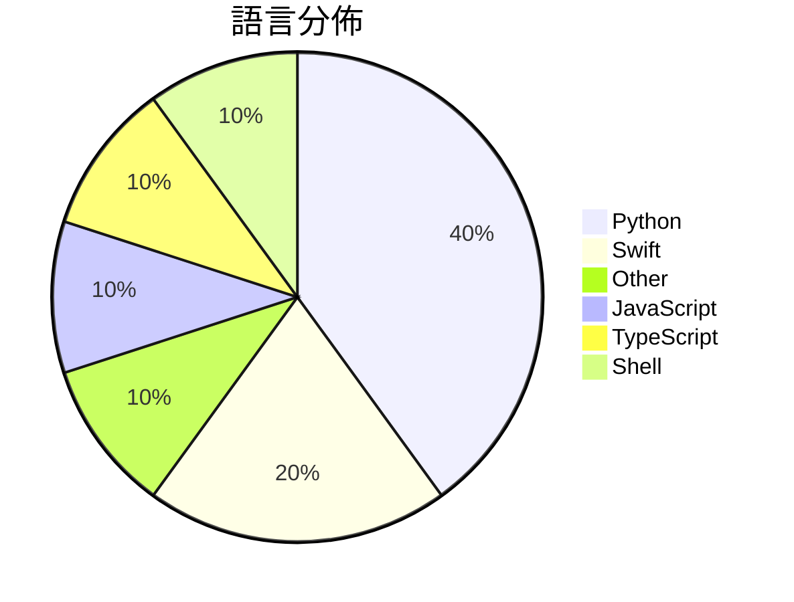

# GitHub Trending - 2026-04-14

> [!summary] 本日摘要
> 收錄 **10** 個新專案，合計 **15.6k** stars
> 語言分佈：Python (4) · Swift (2) · Other (1) · JavaScript (1) · TypeScript (1) · Shell (1)

> [!tip] 本週焦點
> **[[farzaa--clicky|farzaa/clicky]]** — 6 天內累積 4.1k stars（680 stars/天）
> 提供一個 AI 助手，像老師一樣在你的螢幕旁邊協助你學習。



---

## 收錄列表

| # | 專案 | 分類 | Stars | 速度 | 安裝 | 語言 | 用途 |
| :--: | --- | --- | ---: | ---: | --- | --- | --- |
| 1 | [[farzaa--clicky\|farzaa/clicky]] | AI/ML | 4.1k | 680/天 | `medium` | Swift | 提供一個 AI 助手，像老師一樣在你的螢幕旁邊協助你學習。 |
| 2 | [[alchaincyf--hermes-agent-orange-book\|alchaincyf/hermes-agent-orange-book]] | AI/ML | 2.3k | 458/天 | `medium` | N/A | 提供從入門到精通的開源 AI Agent 框架實戰指南。 |
| 3 | [[yizhiyanhua-ai--fireworks-tech-graph\|yizhiyanhua-ai/fireworks-tech-graph]] | 開發工具 | 2.0k | 680/天 | `easy` | Python | 透過自然語言生成高品質的技術圖表，支持多種樣式和類型。 |
| 4 | [[mattmireles--gemma-tuner-multimodal\|mattmireles/gemma-tuner-multimodal]] | AI/ML | 1.3k | 209/天 | `medium` | Python | 在 Apple Silicon 上使用 PyTorch 和 Metal Perf |
| 5 | [[QLHazyCoder--codex-oauth-automation-extension\|QLHazyCoder/codex-oauth-automation-extension]] | 開發工具 | 1.2k | 298/天 | `easy` | JavaScript | 自動化 OpenAI OAuth 註冊流程的 Chrome 擴展，簡化了註冊和驗 |
| 6 | [[nashsu--llm_wiki\|nashsu/llm_wiki]] | 開發工具 | 1.1k | 227/天 | `medium` | TypeScript | 自動將文件轉換為有組織的知識庫，並持續更新。 |
| 7 | [[AgriciDaniel--claude-obsidian\|AgriciDaniel/claude-obsidian]] | 開發工具 | 988 | 165/天 | `easy` | Shell | 將 Claude 與 Obsidian 結合，打造持久的知識庫，讓你的筆記自動組 |
| 8 | [[phuryn--claude-usage\|phuryn/claude-usage]] | 開發工具 | 907 | 151/天 | `easy` | Python | 提供 Claude Code 使用情況的本地儀表板，讓用戶追蹤 token 使用 |
| 9 | [[momenbasel--PureMac\|momenbasel/PureMac]] | 開發工具 | 907 | 181/天 | `easy` | Swift | 提供免費、開源的 macOS 清理工具，無數據收集，為 CleanMyMac 的 |
| 10 | [[joeynyc--hermes-hudui\|joeynyc/hermes-hudui]] | 開發工具 | 833 | 167/天 | `medium` | Python | 為 Hermes AI 代理提供的 Web UI 意識監控工具。 |

---

## 重點摘要

### 1. [[farzaa--clicky|farzaa/clicky]] `AI/ML`

> 提供一個 AI 助手，像老師一樣在你的螢幕旁邊協助你學習。

**4.1k** stars · **680** stars/天 · Swift · `medium`

_建立 6 天內累積 4080 stars（680/天），forks 721（17.7%），顯示出強勁的增長潛力。作者 farzaa 之前在社群中有過成功的推廣，這個專案解決了學習過程中缺乏即時互動的問題，讓用戶能夠在使用電腦時隨時獲得幫助。最近的推文引起了廣泛關注，進一步推動了專案的流行。技術上，這個工具的出現正好搭上了語音識別和 AI 助手的熱潮，讓這種即時互動變得可行。高達 17.7% 的 forks/stars 比率表明許多人在實際修改和使用這個專案。_

---

### 2. [[alchaincyf--hermes-agent-orange-book|alchaincyf/hermes-agent-orange-book]] `AI/ML`

> 提供從入門到精通的開源 AI Agent 框架實戰指南。

**2.3k** stars · **458** stars/天 · N/A · `medium`

_建立 5 天就累積 2288 stars（458/天），forks 248（10.8%），顯示出強勁的增長潛力。作者 alchaincyf 是一位有影響力的 AI 內容創作者，過去在 AI 工具開發上有豐富經驗。Hermes Agent 解決了以往 AI Agent 框架缺乏自我優化能力的痛點，提供了一個更為智能的解決方案。這個專案的快速增長可能與其開源性和實用性有關，吸引了許多開發者的關注。_

---

### 3. [[yizhiyanhua-ai--fireworks-tech-graph|yizhiyanhua-ai/fireworks-tech-graph]] `開發工具`

> 透過自然語言生成高品質的技術圖表，支持多種樣式和類型。

**2.0k** stars · **680** stars/天 · Python · `easy`

_建立 3 天就累積 2040 stars（680/天），forks 158（7.7%），顯示出強烈的使用需求。主要貢獻者包括 ccc7574 和 Luo-hongyi，他們在開源社群中有一定的影響力。這個專案解決了傳統圖表生成工具的繁瑣操作，讓用戶能夠用自然語言快速生成圖表，這在許多開發者中引起共鳴。技術上，這種自動化生成的方式在 AI/Agent 領域尤其受歡迎，因為它能夠快速呈現複雜的系統架構。最近的推廣活動和社群討論也促進了這個專案的曝光度，讓更多人了解其便利性。_

---

### 4. [[mattmireles--gemma-tuner-multimodal|mattmireles/gemma-tuner-multimodal]] `AI/ML`

> 在 Apple Silicon 上使用 PyTorch 和 Metal Performance Shaders 對 Gemma 4 和 3n 進行音頻、圖像和文本的微調。

**1.3k** stars · **209** stars/天 · Python · `medium`

_建立 6 天就累積 1255 stars（209/天），forks 83（6.6%），這顯示出該專案在社群中的受歡迎程度。作者 mattmireles 之前在開源社群中活躍，這次專案解決了 Apple Silicon 用戶在深度學習訓練中的痛點，特別是對於不想依賴 NVIDIA 硬體的開發者。這個工具的推出正好符合了多模態 AI 應用的需求，並且提供了流式數據處理的能力，這在其他同類工具中並不常見。社群的反饋和活躍的問題解決率（75%）也顯示出其穩定性和實用性。_

---

### 5. [[QLHazyCoder--codex-oauth-automation-extension|QLHazyCoder/codex-oauth-automation-extension]] `開發工具`

> 自動化 OpenAI OAuth 註冊流程的 Chrome 擴展，簡化了註冊和驗證過程。

**1.2k** stars · **298** stars/天 · JavaScript · `easy`

_建立 4 天就累積 1193 stars（298/天），forks 258（21.6%），這顯示出強烈的需求和使用者興趣。作者 QLHazyCoder 及其團隊在開源社群中活躍，解決了以往手動註冊 OpenAI 帳號繁瑣的痛點，特別是對於需要大量帳號的開發者。這個工具的出現正好填補了市場上對於自動化註冊流程的需求，並且在社群中引起了廣泛討論。由於 OAuth 流程的複雜性，這個擴展的自動化功能讓許多開發者感到解脫，尤其是在需要快速創建多個帳號的情況下。_

---

### 6. [[nashsu--llm_wiki|nashsu/llm_wiki]] `開發工具`

> 自動將文件轉換為有組織的知識庫，並持續更新。

**1.1k** stars · **227** stars/天 · TypeScript · `medium`

_建立 5 天內已累積 1135 stars（227/天），forks 123（10.8%），顯示出不錯的增長潛力。這個專案的作者 nashsu 以開源社群為基礎，提供了增量式維基構建的解決方案，解決了傳統 RAG 方法的效率問題。這種方法能夠在知識更新時保持一致性，並且不需要每次都重新檢索資料，這在知識管理上是一個顯著的進步。社群的反饋也顯示出對容器化部署的需求，這可能會進一步推動專案的發展。_

---

### 7. [[AgriciDaniel--claude-obsidian|AgriciDaniel/claude-obsidian]] `開發工具`

> 將 Claude 與 Obsidian 結合，打造持久的知識庫，讓你的筆記自動組織與演化。

**988** stars · **165** stars/天 · Shell · `easy`

_建立 6 天內累積 988 stars（165/天），forks 93（9.4%），顯示出穩定的增長潛力。這個專案的作者 AgriciDaniel 之前有開發多個與 Claude 相關的工具，這使得他在這個領域具備相當的經驗。claude-obsidian 解決了現有 Obsidian 插件多數僅提供查詢功能的痛點，提供了一個能夠自動組織和維護筆記的解決方案。近期的社群討論和需求也促使了這個專案的快速發展，特別是在知識管理和 AI 整合方面的需求日益增加。這個工具的 forks/stars 比率為 9.4%，顯示出許多使用者對其功能的實際修改和應用。_

---

### 8. [[phuryn--claude-usage|phuryn/claude-usage]] `開發工具`

> 提供 Claude Code 使用情況的本地儀表板，讓用戶追蹤 token 使用量、成本和會話歷史。

**907** stars · **151** stars/天 · Python · `easy`

_建立 6 天就累積 907 stars（151/天），forks 133（14.7%），這顯示出一定的市場需求。作者 phuryn 及其團隊在開發這個工具之前，可能已經注意到 Claude Code 的使用數據無法被有效追蹤，這讓許多用戶無法掌握自己的使用情況。這個工具的出現正好填補了這一空白，提供了本地化的數據跟踪解決方案。雖然沒有明顯的觸發事件，但這個專案的設計和功能確實解決了用戶的痛點。由於其使用了 Python 標準庫，這使得它在各種環境中都能輕鬆運行，降低了使用門檻。forks/stars 比率為 14.7%，這表明有相當一部分用戶在實際修改和使用這個工具。_

---

### 9. [[momenbasel--PureMac|momenbasel/PureMac]] `開發工具`

> 提供免費、開源的 macOS 清理工具，無數據收集，為 CleanMyMac 的替代方案。

**907** stars · **181** stars/天 · Swift · `easy`

_建立 5 天內累積 907 stars（181/天），forks 41（4.5%），顯示出穩定的增長趨勢。作者 momenbasel 和 jeffdeen 具備開源項目的經驗，解決了許多 Mac 清理工具的隱私問題，提供了一個無數據收集的選擇。這個專案的推出正值用戶對隱私和開源工具需求上升的時期，特別是在 macOS 環境中。forks/stars 比率適中，顯示出有一定的使用者在實際修改和使用此工具。_

---

### 10. [[joeynyc--hermes-hudui|joeynyc/hermes-hudui]] `開發工具`

> 為 Hermes AI 代理提供的 Web UI 意識監控工具。

**833** stars · **167** stars/天 · Python · `medium`

_建立 5 天內累積 833 stars（166.6/天），forks 86（10.3%），顯示出穩定的增長趨勢。作者 Joey Rodriguez 過去在 AI 領域有豐富的經驗，這個工具解決了 AI 監控界面缺乏即時性和互動性的問題，之前的解決方案往往只能提供靜態數據。近期的推廣和社群討論也可能促進了這個專案的曝光。技術上，WebSocket 的使用使得這個工具能夠在即時性上超越傳統的 HTTP 請求，這是其受歡迎的原因之一。forks/stars 比率為 10.3%，顯示出有相當比例的使用者在進行實際修改和使用。_

---

## 今日到期複習

> [!tip] 根據間隔複習排程，今天該回顧的專案

```dataview
TABLE
  stars_per_day AS "Stars/天",
  category AS "分類",
  engagement AS "參與度"
FROM "Repos"
WHERE next_review AND date(next_review) <= date("2026-04-14") AND status != "archived"
SORT priority DESC
```

## 待處理

```dataviewjs
const pending = dv.pages('"Repos"').where(p => p.status === "to-review").length;
const unrated = dv.pages('"Repos"').where(p => p.status !== "archived" && p.status !== "to-review" && (p.my_rating || 0) === 0).length;
const noVerdict = dv.pages('"Repos"').where(p => p.status !== "archived" && (p.my_rating || 0) > 0 && (!p.verdict || p.verdict === "")).length;
const items = [];
if (pending > 0) items.push(`**${pending}** 個待分流`);
if (unrated > 0) items.push(`**${unrated}** 個已讀但未評分`);
if (noVerdict > 0) items.push(`**${noVerdict}** 個已評分但無結論`);
if (items.length > 0) dv.paragraph(items.join(" / "));
else dv.paragraph("所有專案都已處理完畢！");
```
