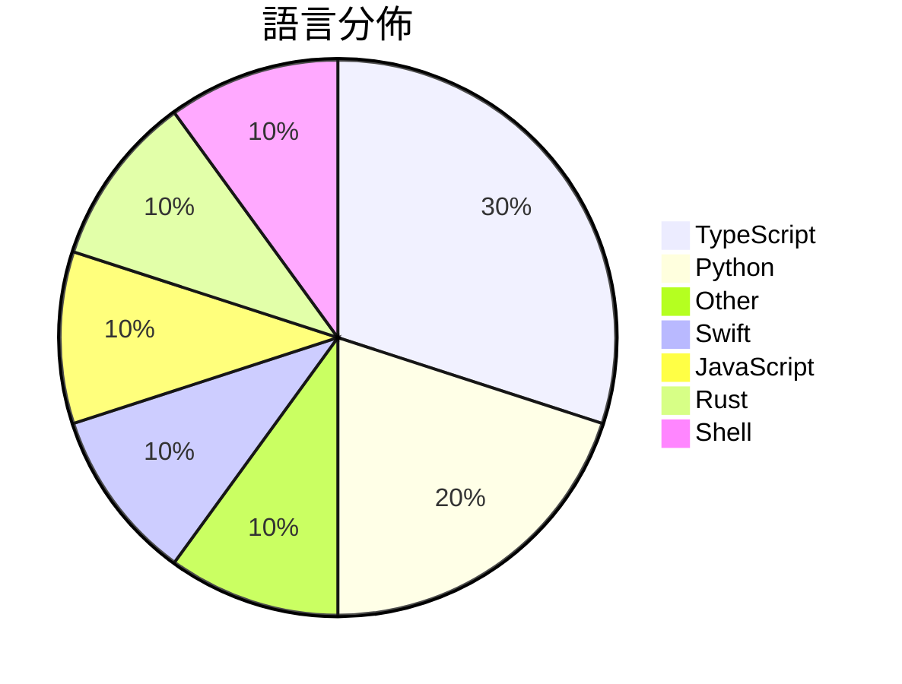

# GitHub Trending - 2026-04-15

> [!summary] 本日摘要
> 收錄 **10** 個新專案，合計 **13.3k** stars
> 語言分佈：TypeScript (3) · Python (2) · Other (1) · Swift (1) · JavaScript (1) · Rust (1) · Shell (1)

> [!tip] 本週焦點
> **[[yizhiyanhua-ai--fireworks-tech-graph|yizhiyanhua-ai/fireworks-tech-graph]]** — 4 天內累積 2.5k stars（614 stars/天）
> 將自然語言描述轉換為高品質的技術圖表，支持多種風格和圖表類型。



---

## 收錄列表

| # | 專案 | 分類 | Stars | 速度 | 安裝 | 語言 | 用途 |
| :--: | --- | --- | ---: | ---: | --- | --- | --- |
| 1 | [[yizhiyanhua-ai--fireworks-tech-graph\|yizhiyanhua-ai/fireworks-tech-graph]] | 開發工具 | 2.5k | 614/天 | `medium` | Python | 將自然語言描述轉換為高品質的技術圖表，支持多種風格和圖表類型。 |
| 2 | [[alchaincyf--hermes-agent-orange-book\|alchaincyf/hermes-agent-orange-book]] | 開發工具 | 2.5k | 409/天 | `easy` | N/A | 提供 Hermes Agent 開源 AI Agent 框架的實戰指南，幫助開發 |
| 3 | [[momenbasel--PureMac\|momenbasel/PureMac]] | 開發工具 | 1.5k | 253/天 | `easy` | Swift | 提供免費、開源的 macOS 清理工具，無數據收集，替代 CleanMyMac。 |
| 4 | [[QLHazyCoder--codex-oauth-automation-extension\|QLHazyCoder/codex-oauth-automation-extension]] | 開發工具 | 1.4k | 274/天 | `easy` | JavaScript | 自動化處理 OpenAI OAuth 註冊與驗證流程的 Chrome 擴展。 |
| 5 | [[nashsu--llm_wiki\|nashsu/llm_wiki]] | 其他 | 1.3k | 216/天 | `medium` | TypeScript | 自動將文件轉換為有組織的知識庫，並持續更新維護。 |
| 6 | [[AgentSeal--codeburn\|AgentSeal/codeburn]] | 開發工具 | 897 | 897/天 | `easy` | TypeScript | 追蹤 AI 編碼工具的 token 使用情況，提供互動式 TUI 儀表板。 |
| 7 | [[joeynyc--hermes-hudui\|joeynyc/hermes-hudui]] | 開發工具 | 881 | 147/天 | `medium` | TypeScript | 為 Hermes AI 代理提供的網頁 UI 意識監控工具。 |
| 8 | [[vyfor--rattles\|vyfor/rattles]] | CLI 工具 | 853 | 213/天 | `easy` | Rust | 提供簡潔的終端動畫旋轉器，讓 Rust 開發者能輕鬆增添動態效果。 |
| 9 | [[hexiecs--talk-normal\|hexiecs/talk-normal]] | 開發工具 | 832 | 139/天 | `easy` | Shell | 讓任何 LLM 像正常人一樣對話，去除冗長的 AI 語言。 |
| 10 | [[OpenMOSS--MOSS-TTS-Nano\|OpenMOSS/MOSS-TTS-Nano]] | AI/ML | 753 | 188/天 | `medium` | Python | 提供即時語音生成的輕量級多語言模型，無需 GPU 即可在 CPU 上運行。 |

---

## 重點摘要

### 1. [[yizhiyanhua-ai--fireworks-tech-graph|yizhiyanhua-ai/fireworks-tech-graph]] `開發工具`

> 將自然語言描述轉換為高品質的技術圖表，支持多種風格和圖表類型。

**2.5k** stars · **614** stars/天 · Python · `medium`

_建立4天內累積2457 stars（614/天），forks 197（8.0%），顯示出強勁的增長潛力。該專案的主要貢獻者來自不同背景，顯示出多樣的開發力量。它解決了傳統圖表工具需要手動操作的痛點，通過自然語言生成圖表的方式，讓用戶能夠更快速地獲得所需的技術圖表。近期的推廣活動和社群討論可能也促進了其知名度的提升。這個工具的出現正好符合了對於快速生成技術文檔的需求，尤其是在AI/Agent領域的應用場景中。forks/stars比率為8.0%，顯示出不少開發者對其進行了實際的修改和使用，這是一個良好的信號。_

---

### 2. [[alchaincyf--hermes-agent-orange-book|alchaincyf/hermes-agent-orange-book]] `開發工具`

> 提供 Hermes Agent 開源 AI Agent 框架的實戰指南，幫助開發者從入門到精通。

**2.5k** stars · **409** stars/天 · N/A · `easy`

_建立 6 天內累積 2452 stars（409/天），forks 259（10.6%），顯示出強勁的增長潛力。作者 alchaincyf 是一位經驗豐富的開發者，專注於 AI 工具的開發，這本書解決了開發者在使用 AI Agent 時缺乏實用指南的痛點。Hermes Agent 的獨特設計使其在市場上脫穎而出，特別是自我改進的學習循環和記憶系統。社群的反饋和需求促進了這本書的快速發展，並且在社交媒體上引起了廣泛討論。這些因素共同推動了其快速的增長。_

---

### 3. [[momenbasel--PureMac|momenbasel/PureMac]] `開發工具`

> 提供免費、開源的 macOS 清理工具，無數據收集，替代 CleanMyMac。

**1.5k** stars · **253** stars/天 · Swift · `easy`

_建立 6 天內累積 1517 stars（253/天），forks 91（6.0%），顯示出穩定的增長潛力。作者 momenbasel 及其團隊在開源社群中活躍，過去有多個成功的開源專案。PureMac 解決了許多用戶對於清理工具的隱私顧慮，因為它不收集任何用戶數據，這在市場上是個明顯的賣點。近期的推廣和社群討論也進一步提升了其曝光度。這個工具的出現正好滿足了對於無數據收集清理工具的需求，並且隨著 macOS 使用者對隱私的重視，這個工具的受歡迎程度有望持續上升。_

---

### 4. [[QLHazyCoder--codex-oauth-automation-extension|QLHazyCoder/codex-oauth-automation-extension]] `開發工具`

> 自動化處理 OpenAI OAuth 註冊與驗證流程的 Chrome 擴展。

**1.4k** stars · **274** stars/天 · JavaScript · `easy`

_建立 5 天內累積 1372 stars（274/天），forks 297（21.6%），顯示出強勁的增長潛力。作者 QLHazyCoder 及其團隊在開源社區中有一定的知名度，過去也有其他成功的專案。這個專案解決了批量註冊 OpenAI 帳號的痛點，特別是在需要處理多個郵件驗證的情況下，傳統方法效率低下且容易出錯。近期的社群討論和反饋也促進了該專案的快速迭代和改進。技術上，Chrome 擴展的普及使得這種自動化工具的實現變得可行，並且用戶對於自動化工具的需求也在增加。forks/stars 比率為 21.6%，顯示出許多用戶在實際修改和使用該工具。_

---

### 5. [[nashsu--llm_wiki|nashsu/llm_wiki]] `其他`

> 自動將文件轉換為有組織的知識庫，並持續更新維護。

**1.3k** stars · **216** stars/天 · TypeScript · `medium`

_建立 6 天就累積 1297 stars（216/天），forks 137（10.6%），顯示出強勁的增長勢頭。作者 nashsu 以開源社群為背景，致力於提供一個高效的知識管理工具，解決了傳統 RAG 方法的不足之處。此專案的出現正值知識管理需求上升的時期，尤其是在遠端工作和信息過載的背景下。高達 10.6% 的 forks/stars 比率顯示出用戶對此工具的實際修改和使用意願，這是社群活躍度的良好指標。_

---

### 6. [[AgentSeal--codeburn|AgentSeal/codeburn]] `開發工具`

> 追蹤 AI 編碼工具的 token 使用情況，提供互動式 TUI 儀表板。

**897** stars · **897** stars/天 · TypeScript · `easy`

_建立 1 天就累積 897 stars（897/天），forks 72（8.0%），顯示出強勁的增長潛力。作者 AgentSeal 之前在開源社群中活躍，這個工具解決了開發者在使用 AI 編碼工具時難以追蹤 token 使用的痛點，之前的解決方案多依賴於手動記錄或不夠直觀的界面。這個專案的推出正好填補了這一空白，並且在社群中引發了討論，進一步推動了其曝光率。隨著 AI 工具的普及，開發者對於成本控制和使用效率的需求日益增加，使得這個工具的市場需求上升。_

---

### 7. [[joeynyc--hermes-hudui|joeynyc/hermes-hudui]] `開發工具`

> 為 Hermes AI 代理提供的網頁 UI 意識監控工具。

**881** stars · **147** stars/天 · TypeScript · `medium`

_建立 6 天就累積 881 stars（147/天），forks 92（10.4%），顯示出不錯的增長潛力。作者 joeynyc 之前有開發過其他成功的工具，這個專案解決了 AI 代理管理的可視化需求，讓用戶能夠更方便地監控和互動。近期的推廣活動和社群討論也可能促進了這個專案的曝光度。這個工具的高 fork/stars 比率（10.4%）表明許多開發者對其功能感興趣，並可能在進行實際修改或擴展。_

---

### 8. [[vyfor--rattles|vyfor/rattles]] `CLI 工具`

> 提供簡潔的終端動畫旋轉器，讓 Rust 開發者能輕鬆增添動態效果。

**853** stars · **213** stars/天 · Rust · `easy`

_建立 4 天就累積 853 stars（213/天），forks 16（1.9%），顯示出快速增長的潛力。作者 vyfor 是 Rust 生態系統中的活躍貢獻者，過去有多個開源專案，這使得他在社群中有一定的影響力。Rattles 解決了終端動畫的複雜性問題，提供了一個簡單的解決方案，之前開發者可能需要依賴多個庫來實現類似功能。這個專案的推出正好符合了對輕量級、無依賴工具的需求，特別是在 Rust 生態系統中。forks/stars 比率顯示出有一定的實際使用需求，這意味著不少開發者對這個工具感興趣並可能進行修改。_

---

### 9. [[hexiecs--talk-normal|hexiecs/talk-normal]] `開發工具`

> 讓任何 LLM 像正常人一樣對話，去除冗長的 AI 語言。

**832** stars · **139** stars/天 · Shell · `easy`

_建立 6 天就累積 832 stars（139/天），forks 19（2.3%），這顯示出一定的市場需求。作者 hexiecs 在開源社群中活躍，這個專案解決了 LLM 輸出冗長的痛點，讓使用者能夠獲得更直接的回答。隨著 AI 應用的普及，對於簡化 LLM 輸出的需求日益增加，這使得該專案的價值凸顯。社群的反饋也表明，這個工具在實際使用中能夠有效提升工作效率。_

---

### 10. [[OpenMOSS--MOSS-TTS-Nano|OpenMOSS/MOSS-TTS-Nano]] `AI/ML`

> 提供即時語音生成的輕量級多語言模型，無需 GPU 即可在 CPU 上運行。

**753** stars · **188** stars/天 · Python · `medium`

_建立 4 天就累積 753 stars（188/天），forks 66（8.8%），這顯示出強烈的興趣。作者來自 MOSI.AI 和 OpenMOSS 團隊，專注於開源語音生成技術，解決了傳統 TTS 模型在資源需求和部署複雜度上的痛點。之前的解決方案如 Tacotron 需要較高的計算資源和複雜的環境配置，而 MOSS-TTS-Nano 的設計使得即使在 CPU 上也能高效運行。社群的反饋和問題顯示出使用者對於文檔和功能的需求，這可能會驅動未來的改進。_

---

## 今日到期複習

> [!tip] 根據間隔複習排程，今天該回顧的專案

```dataview
TABLE
  stars_per_day AS "Stars/天",
  category AS "分類",
  engagement AS "參與度"
FROM "Repos"
WHERE next_review AND date(next_review) <= date("2026-04-15") AND status != "archived"
SORT priority DESC
```

## 待處理

```dataviewjs
const pending = dv.pages('"Repos"').where(p => p.status === "to-review").length;
const unrated = dv.pages('"Repos"').where(p => p.status !== "archived" && p.status !== "to-review" && (p.my_rating || 0) === 0).length;
const noVerdict = dv.pages('"Repos"').where(p => p.status !== "archived" && (p.my_rating || 0) > 0 && (!p.verdict || p.verdict === "")).length;
const items = [];
if (pending > 0) items.push(`**${pending}** 個待分流`);
if (unrated > 0) items.push(`**${unrated}** 個已讀但未評分`);
if (noVerdict > 0) items.push(`**${noVerdict}** 個已評分但無結論`);
if (items.length > 0) dv.paragraph(items.join(" / "));
else dv.paragraph("所有專案都已處理完畢！");
```
