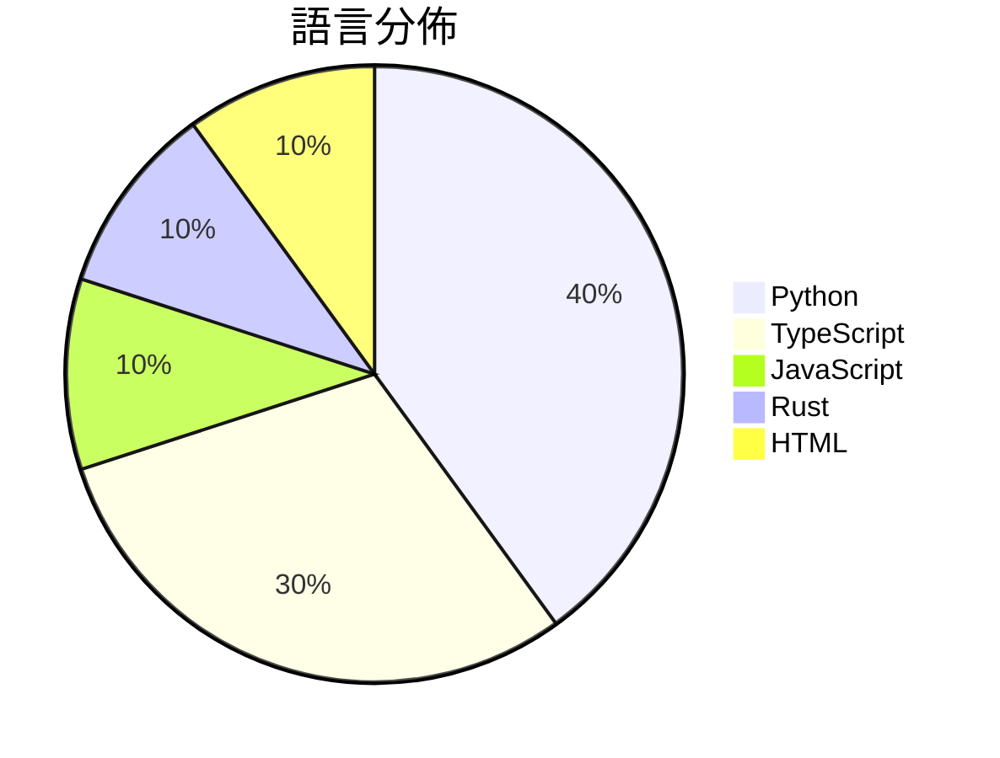

# GitHub Trending - 2026-04-16

> [!summary] 本日摘要
> 收錄 **10** 個新專案，合計 **12.2k** stars
> 語言分佈：Python (4) · TypeScript (3) · JavaScript (1) · Rust (1) · HTML (1)

> [!tip] 本週焦點
> **[[yizhiyanhua-ai--fireworks-tech-graph|yizhiyanhua-ai/fireworks-tech-graph]]** — 5 天內累積 3.0k stars（596 stars/天）
> 自動生成高品質的技術圖表，支持多種風格和類型。



---

## 收錄列表

| # | 專案 | 分類 | Stars | 速度 | 安裝 | 語言 | 用途 |
| :--: | --- | --- | ---: | ---: | --- | --- | --- |
| 1 | [[yizhiyanhua-ai--fireworks-tech-graph\|yizhiyanhua-ai/fireworks-tech-graph]] | 開發工具 | 3.0k | 596/天 | `easy` | Python | 自動生成高品質的技術圖表，支持多種風格和類型。 |
| 2 | [[AgentSeal--codeburn\|AgentSeal/codeburn]] | 開發工具 | 1.8k | 895/天 | `easy` | TypeScript | 讓你清楚了解 AI 編碼過程中的 token 使用情況，提供互動式 TUI 儀表 |
| 3 | [[QLHazyCoder--codex-oauth-automation-extension\|QLHazyCoder/codex-oauth-automation-extension]] | 開發工具 | 1.5k | 253/天 | `easy` | JavaScript | 自動化處理 OpenAI OAuth 註冊流程的 Chrome 擴展，簡化驗證碼 |
| 4 | [[OpenMOSS--MOSS-TTS-Nano\|OpenMOSS/MOSS-TTS-Nano]] | AI/ML | 1.0k | 206/天 | `medium` | Python | 提供即時語音生成的多語言小型模型，無需 GPU，適合輕量級產品整合。 |
| 5 | [[joeynyc--hermes-hudui\|joeynyc/hermes-hudui]] | 開發工具 | 914 | 131/天 | `medium` | TypeScript | 提供一個網頁介面來監控 Hermes AI 代理的意識狀態。 |
| 6 | [[vyfor--rattles\|vyfor/rattles]] | 開發工具 | 867 | 173/天 | `easy` | Rust | 提供簡約的終端旋轉器，讓 Rust 開發者輕鬆添加動畫效果。 |
| 7 | [[alchaincyf--darwin-skill\|alchaincyf/darwin-skill]] | 開發工具 | 816 | 408/天 | `easy` | HTML | 讓你的技能自動進化，通過評估、改進和測試來優化技能。 |
| 8 | [[Mouseww--anything-analyzer\|Mouseww/anything-analyzer]] | 開發工具 | 798 | 266/天 | `medium` | TypeScript | 傻瓜式生成注册机和协议分析文档，支持多种应用和浏览器的流量捕获与AI分析。 |
| 9 | [[sterlingcrispin--nothing-ever-happens\|sterlingcrispin/nothing-ever-happens]] | 其他 | 771 | 257/天 | `easy` | Python | 自動在 Polymarket 上購買所有非體育市場的「否」選項。 |
| 10 | [[whwangovo--pyre-code\|whwangovo/pyre-code]] | 開發工具 | 726 | 121/天 | `medium` | Python | 自我托管的機器學習編程練習平台，提供 68 道題目，從 ReLU 到流匹配等多種 |

---

## 重點摘要

### 1. [[yizhiyanhua-ai--fireworks-tech-graph|yizhiyanhua-ai/fireworks-tech-graph]] `開發工具`

> 自動生成高品質的技術圖表，支持多種風格和類型。

**3.0k** stars · **596** stars/天 · Python · `easy`

_建立 5 天就累積 2982 stars（596/天），forks 249（8.4%），顯示出強烈的市場需求。專案的主要貢獻者來自活躍的開發社群，過去有多個成功的開源專案經驗。這個工具解決了以往手動繪製技術圖表的繁瑣，並且提供了自動化的解決方案，讓用戶能夠專注於系統設計而非圖表製作。社群中對於 Windows 支援的需求和手動微調功能的討論，顯示出用戶對於功能擴展的期待。技術生態的進步，如 AI 和自動化工具的普及，使得這種工具的需求日益增加。forks/stars 比率的 8.4% 表示許多人在實際修改使用，顯示出對這個專案的高度參與。_

---

### 2. [[AgentSeal--codeburn|AgentSeal/codeburn]] `開發工具`

> 讓你清楚了解 AI 編碼過程中的 token 使用情況，提供互動式 TUI 儀表板。

**1.8k** stars · **895** stars/天 · TypeScript · `easy`

_建立 2 天內累積 1789 stars（895/天），forks 129（7.2%），這顯示出強勁的增長潛力。這個專案的創建者 AgentSeal 在開源社群中有一定的知名度，過去的專案也獲得了良好的反響。CodeBurn 解決了開發者在使用多種 AI 編碼工具時無法有效追蹤 token 使用的痛點，這在過去的工具中並未得到充分解決。最近的推廣活動和社群討論也促進了其曝光率，吸引了許多開發者的注意。技術上，隨著 Node.js 和 SQLite 的普及，這個工具的可行性大大提高，讓開發者能夠輕鬆整合到現有的開發環境中。forks/stars 比率為 7.2%，顯示出有相當比例的用戶在實際修改和使用此工具。_

---

### 3. [[QLHazyCoder--codex-oauth-automation-extension|QLHazyCoder/codex-oauth-automation-extension]] `開發工具`

> 自動化處理 OpenAI OAuth 註冊流程的 Chrome 擴展，簡化驗證碼獲取與回調驗證。

**1.5k** stars · **253** stars/天 · JavaScript · `easy`

_建立 6 天內累積 1520 stars（253/天），forks 331（21.8%），這顯示出強烈的社群需求。作者 QLHazyCoder 及其團隊過去有開發多個自動化工具的經驗，這個專案解決了以往手動註冊 OpenAI 帳號繁瑣的問題，之前使用者通常需要逐一填寫信息並手動獲取驗證碼，效率低下。社群中對於自動化工具的需求增長，尤其是在開發者圈子中，這使得該專案迅速受到關注。  

此外，該專案的設計考量了多種郵箱來源的整合，這在目前的工具中相對少見，進一步提升了其吸引力。_

---

### 4. [[OpenMOSS--MOSS-TTS-Nano|OpenMOSS/MOSS-TTS-Nano]] `AI/ML`

> 提供即時語音生成的多語言小型模型，無需 GPU，適合輕量級產品整合。

**1.0k** stars · **206** stars/天 · Python · `medium`

_建立 5 天內累積 1028 stars（206/天），forks 102（9.9%），顯示出強勁的增長潛力。這個專案由 MOSI.AI 和 OpenMOSS 團隊開發，解決了即時語音生成的需求，特別是在無 GPU 環境下的應用。之前的解決方案如 Google TTS 需要較高的硬體要求，無法輕易在本地環境中運行。近期的推廣活動和社群討論可能進一步促進了其曝光率。這個工具的設計使得它能夠在多種場景下靈活運用，並且在技術生態中填補了小型語音生成模型的空白。forks/stars 比率接近 10% 表示有相當多的用戶在進行實際修改和使用。_

---

### 5. [[joeynyc--hermes-hudui|joeynyc/hermes-hudui]] `開發工具`

> 提供一個網頁介面來監控 Hermes AI 代理的意識狀態。

**914** stars · **131** stars/天 · TypeScript · `medium`

_建立 7 天內累積 914 stars（131/天），forks 103（11.3%），顯示出穩定的增長。作者 joeynyc 之前參與過多個開源專案，這個工具解決了 AI 代理監控的需求，提供了一個直觀的界面來管理和監控代理的行為。最近的推廣活動和社群討論提升了其可見度，並吸引了開發者的注意。技術上，這個工具的 WebSocket 實時更新功能和多語言支持使其在同類產品中脫穎而出，特別是在需要即時反饋的場景中。forks/stars 比率為 11.3%，顯示出相對較高的實際使用和修改意願。_

---

### 6. [[vyfor--rattles|vyfor/rattles]] `開發工具`

> 提供簡約的終端旋轉器，讓 Rust 開發者輕鬆添加動畫效果。

**867** stars · **173** stars/天 · Rust · `easy`

_建立 5 天內累積 867 stars（173/天），forks 17（2.0%），顯示出穩定的增長趨勢。作者 vyfor 和 pandarubrum 在 Rust 生態系統中有一定的影響力，之前的作品也獲得了良好的反響。Rattles 解決了在 Rust 中添加終端動畫的需求，之前的解決方案往往依賴於較重的庫或不夠靈活。這個專案的推出正好填補了這個空白，並且在社群中引起了關注。使用者對於簡單易用的需求促進了這個專案的快速成長，且目前的 forks/stars 比率顯示出使用者對其進行實際修改的意願。_

---

### 7. [[alchaincyf--darwin-skill|alchaincyf/darwin-skill]] `開發工具`

> 讓你的技能自動進化，通過評估、改進和測試來優化技能。

**816** stars · **408** stars/天 · HTML · `easy`

_建立 2 天內累積 816 stars（408/天），forks 99（12.1%），顯示出強勁的增長潛力。作者 alchaincyf 之前的作品如 nuwa-skill 也受到關注，這次的專案解決了技能優化過程中缺乏自動化和評估標準的痛點。傳統的技能管理往往依賴手動維護，當技能數量增多時，這種方法變得不可行。這個專案的出現正好填補了這一空白，並且在社群中引發了討論。技術上，隨著 AI 技術的進步，對技能優化的需求也在增加，這使得達爾文.skill 成為一個有吸引力的解決方案。forks/stars 比率為 12.1%，顯示出不少人對這個專案進行了實際修改和使用。_

---

### 8. [[Mouseww--anything-analyzer|Mouseww/anything-analyzer]] `開發工具`

> 傻瓜式生成注册机和协议分析文档，支持多种应用和浏览器的流量捕获与AI分析。

**798** stars · **266** stars/天 · TypeScript · `medium`

_建立 3 天就累積 798 stars（266/天），forks 212（26.6%），顯示出強烈的社群興趣。作者 Mouseww 以往在開源社群活躍，這個專案解決了傳統抓包工具的局限性，提供全場景的流量捕獲與 AI 分析，讓開發者能更快速地進行協議逆向和安全分析。近期的推文和討論也引發了更多關注，顯示出其潛在的市場需求。_

---

### 9. [[sterlingcrispin--nothing-ever-happens|sterlingcrispin/nothing-ever-happens]] `其他`

> 自動在 Polymarket 上購買所有非體育市場的「否」選項。

**771** stars · **257** stars/天 · Python · `easy`

_建立 3 天內累積 771 stars（257/天），forks 75（9.7%），這顯示出相對穩定的關注度。作者 sterlingcrispin 似乎專注於創建與 Polymarket 相關的工具，這個專案解決了自動化交易的需求，特別是在非體育市場上，這在現有工具中並不常見。社群對於這類工具的需求正在增長，尤其是隨著市場的多樣化。這個專案的高 forks/stars 比率顯示出許多人正在積極修改和使用這個工具。_

---

### 10. [[whwangovo--pyre-code|whwangovo/pyre-code]] `開發工具`

> 自我托管的機器學習編程練習平台，提供 68 道題目，從 ReLU 到流匹配等多種主題，並提供即時反饋。

**726** stars · **121** stars/天 · Python · `medium`

_建立 6 天就累積 726 stars（121/天），forks 65（9.0%），顯示出強烈的使用者興趣。作者 whwangovo 及其團隊在機器學習和編程教育方面有豐富的經驗，這個專案填補了市場上針對 ML 編程練習的需求。近期的推廣活動和社群討論也可能促進了這個專案的曝光度。高達 9% 的 fork/stars 比率顯示出許多用戶正在積極修改和使用這個專案，而不是僅僅觀望。_

---

## 今日到期複習

> [!tip] 根據間隔複習排程，今天該回顧的專案

```dataview
TABLE
  stars_per_day AS "Stars/天",
  category AS "分類",
  engagement AS "參與度"
FROM "Repos"
WHERE next_review AND date(next_review) <= date("2026-04-16") AND status != "archived"
SORT priority DESC
```

## 待處理

```dataviewjs
const pending = dv.pages('"Repos"').where(p => p.status === "to-review").length;
const unrated = dv.pages('"Repos"').where(p => p.status !== "archived" && p.status !== "to-review" && (p.my_rating || 0) === 0).length;
const noVerdict = dv.pages('"Repos"').where(p => p.status !== "archived" && (p.my_rating || 0) > 0 && (!p.verdict || p.verdict === "")).length;
const items = [];
if (pending > 0) items.push(`**${pending}** 個待分流`);
if (unrated > 0) items.push(`**${unrated}** 個已讀但未評分`);
if (noVerdict > 0) items.push(`**${noVerdict}** 個已評分但無結論`);
if (items.length > 0) dv.paragraph(items.join(" / "));
else dv.paragraph("所有專案都已處理完畢！");
```
