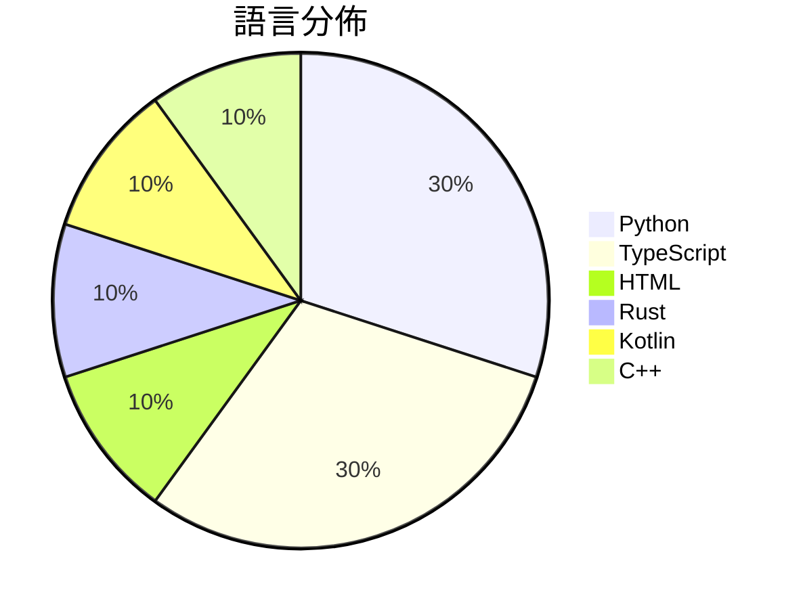

# GitHub Trending - 2026-04-17

> [!summary] 本日摘要
> 收錄 **10** 個新專案，合計 **13.2k** stars
> 語言分佈：Python (3) · TypeScript (3) · HTML (1) · Rust (1) · Kotlin (1) · C++ (1)

> [!tip] 本週焦點
> **[[yizhiyanhua-ai--fireworks-tech-graph|yizhiyanhua-ai/fireworks-tech-graph]]** — 6 天內累積 3.4k stars（562 stars/天）
> 將自然語言描述轉換為高質量的技術圖表，支持多種風格和類型。



---

## 收錄列表

| # | 專案 | 分類 | Stars | 速度 | 安裝 | 語言 | 用途 |
| :--: | --- | --- | ---: | ---: | --- | --- | --- |
| 1 | [[yizhiyanhua-ai--fireworks-tech-graph\|yizhiyanhua-ai/fireworks-tech-graph]] | 開發工具 | 3.4k | 562/天 | `medium` | Python | 將自然語言描述轉換為高質量的技術圖表，支持多種風格和類型。 |
| 2 | [[AgentSeal--codeburn\|AgentSeal/codeburn]] | 開發工具 | 2.3k | 761/天 | `easy` | TypeScript | 讓你追蹤 AI 編碼過程中 token 的使用情況，提供互動式 TUI 儀表板以 |
| 3 | [[OpenMOSS--MOSS-TTS-Nano\|OpenMOSS/MOSS-TTS-Nano]] | AI/ML | 1.2k | 207/天 | `medium` | Python | 提供即時語音生成的多語言小型語音生成模型，無需 GPU 即可在 CPU 上運行。 |
| 4 | [[vercel-labs--wterm\|vercel-labs/wterm]] | 開發工具 | 1.0k | 522/天 | `medium` | TypeScript | 提供一個基於網頁的終端模擬器，具備高效能和豐富功能。 |
| 5 | [[Mouseww--anything-analyzer\|Mouseww/anything-analyzer]] | 開發工具 | 1.0k | 261/天 | `medium` | TypeScript | 傻瓜式生成注册机与协议分析文档，支持多种流量来源的自动逆向分析。 |
| 6 | [[alchaincyf--darwin-skill\|alchaincyf/darwin-skill]] | 開發工具 | 966 | 322/天 | `easy` | HTML | 讓你的技能透過自動化評估和優化不斷進化。 |
| 7 | [[vyfor--rattles\|vyfor/rattles]] | 開發工具 | 879 | 147/天 | `easy` | Rust | 提供簡約的終端動畫指示器，讓 Rust 開發者輕鬆增添動態效果。 |
| 8 | [[sterlingcrispin--nothing-ever-happens\|sterlingcrispin/nothing-ever-happens]] | 開發工具 | 799 | 200/天 | `easy` | Python | 一個針對 Polymarket 的機器人，專門在非體育市場上購買「否」的選項。 |
| 9 | [[sogonov--anubis\|sogonov/anubis]] | 開發工具 | 784 | 261/天 | `medium` | Kotlin | 透過 VPN 狀態自動凍結/解凍應用程式，管理 Android 應用程式群組。 |
| 10 | [[Nightmare-Eclipse--RedSun\|Nightmare-Eclipse/RedSun]] | 安全 | 785 | 785/天 | `medium` | C++ | 利用 Windows Defender 的漏洞來獲取系統管理權限。 |

---

## 重點摘要

### 1. [[yizhiyanhua-ai--fireworks-tech-graph|yizhiyanhua-ai/fireworks-tech-graph]] `開發工具`

> 將自然語言描述轉換為高質量的技術圖表，支持多種風格和類型。

**3.4k** stars · **562** stars/天 · Python · `medium`

_建立 6 天就累積 3374 stars（562/天），forks 284（8.4%），顯示出強勁的增長潛力。這個專案由一群活躍的貢獻者維護，解決了傳統圖表生成工具無法快速生成高質量圖表的痛點。相較於手動調整的工具，這個專案提供了自動化的解決方案，並且支持多種圖表類型和視覺風格。社群對於其功能的需求和反饋也促進了其快速發展。_

---

### 2. [[AgentSeal--codeburn|AgentSeal/codeburn]] `開發工具`

> 讓你追蹤 AI 編碼過程中 token 的使用情況，提供互動式 TUI 儀表板以觀察成本。

**2.3k** stars · **761** stars/天 · TypeScript · `easy`

_建立 3 天就累積 2283 stars（761/天），forks 156（6.8%），這顯示出該專案在開發者社群中的快速增長。這個專案的作者 AgentSeal 之前有開發過多個與 AI 相關的工具，並且針對 AI 編碼過程中的成本問題提供了一個有效的解決方案。之前開發者在追蹤 AI 編碼成本時，往往需要手動記錄或使用不夠直觀的工具，這使得 CodeBurn 的出現填補了這一空白。社群的反饋和需求驅動了這個專案的快速成長，特別是在開發者對於成本控制越來越重視的背景下。_

---

### 3. [[OpenMOSS--MOSS-TTS-Nano|OpenMOSS/MOSS-TTS-Nano]] `AI/ML`

> 提供即時語音生成的多語言小型語音生成模型，無需 GPU 即可在 CPU 上運行。

**1.2k** stars · **207** stars/天 · Python · `medium`

_建立 6 天就累積 1239 stars（207/天），forks 139（11.2%），這顯示出強烈的社群興趣。作者來自 MOSI.AI 和 OpenMOSS 團隊，過去有多個成功的開源專案。這個專案解決了在資源有限的環境中進行即時語音生成的需求，之前的方案往往需要高效能的 GPU。近期的推廣活動和社群討論也促進了其曝光度。技術上，隨著 CPU 性能的提升，這種輕量級模型變得可行，forks/stars 比率顯示出使用者對於修改和實驗的興趣。_

---

### 4. [[vercel-labs--wterm|vercel-labs/wterm]] `開發工具`

> 提供一個基於網頁的終端模擬器，具備高效能和豐富功能。

**1.0k** stars · **522** stars/天 · TypeScript · `medium`

_建立 2 天就累積 1043 stars（522/天），forks 34（3.3%），顯示出強烈的初期興趣。作者 ctate 之前在 Vercel 有過其他開源貢獻，這次專案解決了傳統終端模擬器在網頁環境中的性能和功能限制。這個專案的推出正值 WebAssembly 技術逐漸成熟，能夠提供更高效的執行性能。forks/stars 比率相對較低，顯示出目前大多數用戶仍在觀望階段。_

---

### 5. [[Mouseww--anything-analyzer|Mouseww/anything-analyzer]] `開發工具`

> 傻瓜式生成注册机与协议分析文档，支持多种流量来源的自动逆向分析。

**1.0k** stars · **261** stars/天 · TypeScript · `medium`

_建立 4 天內累積 1042 stars（261/天），forks 258（24.8%），顯示出強烈的社群興趣。作者 Mouseww 以開源工具為主，過去的專案也集中在協助開發者進行網路協議分析。此工具解決了傳統抓包工具各自為政的問題，提供了一個統一的解決方案，讓開發者能夠輕鬆地從多種來源捕獲流量並進行分析。社群的反饋也顯示出對於這種全能型工具的需求，尤其是在 API 逆向和安全審計方面。_

---

### 6. [[alchaincyf--darwin-skill|alchaincyf/darwin-skill]] `開發工具`

> 讓你的技能透過自動化評估和優化不斷進化。

**966** stars · **322** stars/天 · HTML · `easy`

_建立 3 天就累積 966 stars（322/天），forks 111（11.5%），顯示出強烈的興趣。作者 alchaincyf 之前參與過多個開源項目，這次專注於技能優化，解決了在技能數量增加後的管理困難。這個工具的出現正好填補了市場上對於技能優化的需求，特別是在 Agent Skills 迅速增長的背景下。高 forks/stars 比率（11.5%）顯示出許多人在實際修改和使用這個工具，而不是單純觀望。_

---

### 7. [[vyfor--rattles|vyfor/rattles]] `開發工具`

> 提供簡約的終端動畫指示器，讓 Rust 開發者輕鬆增添動態效果。

**879** stars · **147** stars/天 · Rust · `easy`

_建立 6 天就累積 879 stars（146.5/天），forks 17（1.9%），顯示出穩定的增長潛力。作者 vyfor 是 Rust 生態系統中的活躍貢獻者，之前參與過多個 Rust 專案，這使得他對於 Rust 的特性和最佳實踐有深入的理解。Rattles 解決了在終端應用中添加動畫效果的需求，之前的解決方案往往依賴於較重的庫或不支持 `no_std`，而 Rattles 則提供了一個輕量且靈活的替代方案。這個專案的推出引起了 Rust 開發者的注意，特別是在 CLI 工具日益流行的背景下。forks/stars 比率偏低，顯示出使用者對於這個專案的興趣仍在觀望階段。_

---

### 8. [[sterlingcrispin--nothing-ever-happens|sterlingcrispin/nothing-ever-happens]] `開發工具`

> 一個針對 Polymarket 的機器人，專門在非體育市場上購買「否」的選項。

**799** stars · **200** stars/天 · Python · `easy`

_建立 4 天內累積 799 stars（每天下降至 200），forks 數量為 83（10.4%），顯示出一定的社群關注度。作者 sterlingcrispin 以開發 Polymarket 機器人聞名，這個專案解決了用戶在非體育市場中自動化交易的需求，之前的解決方案多數集中於體育市場，缺乏針對其他類型市場的支持。社群的興趣可能來自於對自動化交易的需求增加，尤其是在市場波動性大的情況下。這個工具的設計簡單且易於部署，吸引了不少新手用戶。_

---

### 9. [[sogonov--anubis|sogonov/anubis]] `開發工具`

> 透過 VPN 狀態自動凍結/解凍應用程式，管理 Android 應用程式群組。

**784** stars · **261** stars/天 · Kotlin · `medium`

_建立 3 天就累積 784 stars（261/天），forks 22（2.8%），顯示出一定的使用者興趣。作者 sogonov 是一位活躍的開發者，過去有多個開源專案。Anubis 解決了許多用戶在使用 VPN 時無法有效管理應用程式的痛點，尤其是對於需要高隱私的用戶來說，這是一個重要的功能。社群中對於應用程式的需求和反饋活躍，這表明了該專案的實用性和潛在的發展空間。_

---

### 10. [[Nightmare-Eclipse--RedSun|Nightmare-Eclipse/RedSun]] `安全`

> 利用 Windows Defender 的漏洞來獲取系統管理權限。

**785** stars · **785** stars/天 · C++ · `medium`

_建立 1 天就累積 785 stars（785/天），forks 150（19.1%），這顯示出極高的興趣。作者 Nightmare-Eclipse 之前並未有其他知名專案，但這個專案解決了防毒軟體行為的特定漏洞，這在安全研究中是一個有趣的切入點。這個專案的幽默性和實用性吸引了許多安全愛好者的注意，並且在社群中引發了討論。特定的事件，如社交媒體上的分享，可能也促進了這個專案的快速增長。forks/stars 比率為 19.1%，顯示出許多人對這個專案有實際修改和使用的意圖。_

---

## 今日到期複習

> [!tip] 根據間隔複習排程，今天該回顧的專案

```dataview
TABLE
  stars_per_day AS "Stars/天",
  category AS "分類",
  engagement AS "參與度"
FROM "Repos"
WHERE next_review AND date(next_review) <= date("2026-04-17") AND status != "archived"
SORT priority DESC
```

## 待處理

```dataviewjs
const pending = dv.pages('"Repos"').where(p => p.status === "to-review").length;
const unrated = dv.pages('"Repos"').where(p => p.status !== "archived" && p.status !== "to-review" && (p.my_rating || 0) === 0).length;
const noVerdict = dv.pages('"Repos"').where(p => p.status !== "archived" && (p.my_rating || 0) > 0 && (!p.verdict || p.verdict === "")).length;
const items = [];
if (pending > 0) items.push(`**${pending}** 個待分流`);
if (unrated > 0) items.push(`**${unrated}** 個已讀但未評分`);
if (noVerdict > 0) items.push(`**${noVerdict}** 個已評分但無結論`);
if (items.length > 0) dv.paragraph(items.join(" / "));
else dv.paragraph("所有專案都已處理完畢！");
```
